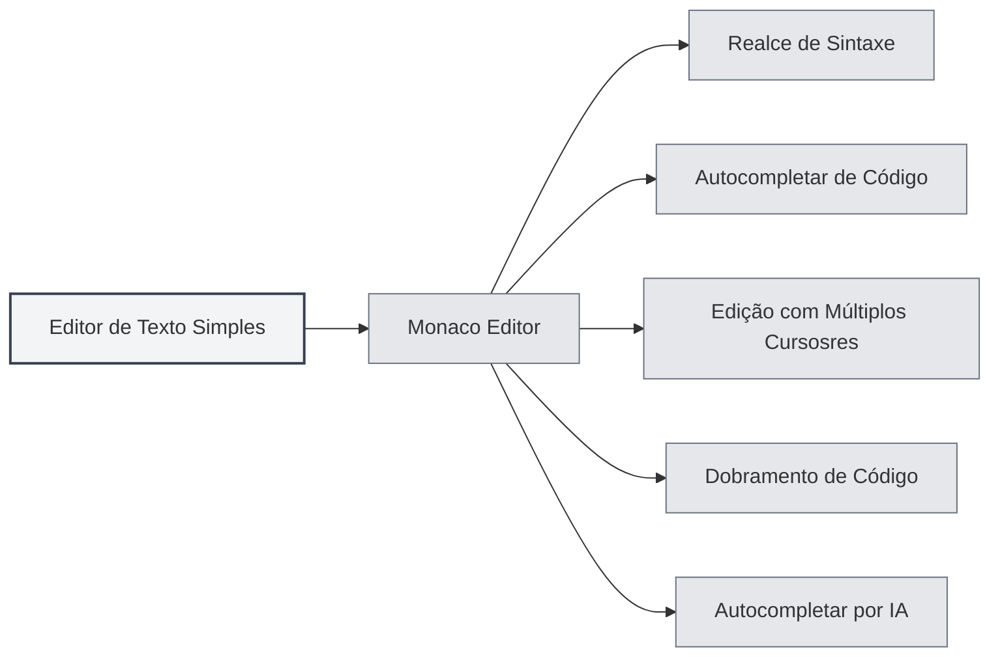
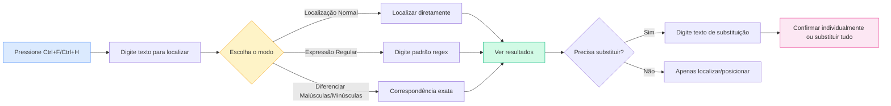

# Editor de Texto Simples

## Visão Geral

O editor de texto simples é usado para editar arquivos de texto simples e arquivos de código. O editor de texto simples do MetaDoc é baseado no Monaco Editor, oferecendo uma experiência profissional de edição de código, com suporte a realce de sintaxe, autocompletar de código, autocompletar por IA, entre outros recursos.

O editor de texto simples suporta vários formatos de arquivo, incluindo arquivos de código (`.js`, `.py`, `.java`, etc.) e arquivos de configuração (`.json`, `.yaml`, `.ini`, etc.), reconhecendo automaticamente a linguagem com base na extensão do arquivo e aplicando o realce de sintaxe correspondente.

## Funcionalidades do Editor Monaco

<LaTeXEditorDemo mode="demo" />

<SearchReplaceMenu mode="demo" :position='{"top": 100, "left": 200}' :adapter='null' />

<MenuItemsDemo mode="demo" :items='[{"id": "file"}]' />

<ViewMenuItemsDemo mode="demo" :items='["editor", "outline"]' />

### Introdução ao Editor

O editor de texto simples utiliza o Monaco Editor, que possui as seguintes características:

- **Edição de Código Profissional**: Oferece uma experiência de edição semelhante ao Visual Studio Code
- **Realce de Sintaxe**: Aplica automaticamente realce de sintaxe de acordo com o tipo de arquivo
- **Autocompletar de Código**: Suporta autocompletar de código inteligente
- **Edição com Múltiplos Cursosres**: Suporta edição simultânea com múltiplos cursores
- **Dobramento de Código**: Suporta o dobramento de blocos de código

### Formatos de Arquivo Suportados

O editor de texto simples suporta os seguintes formatos de arquivo:

**Arquivos de Código**:

- JavaScript/TypeScript: `.js`, `.jsx`, `.ts`, `.tsx`
- Python: `.py`
- Java: `.java`
- C/C++: `.c`, `.cpp`, `.h`, `.hpp`
- C#: `.cs`
- Go: `.go`
- Rust: `.rs`
- Swift: `.swift`
- Kotlin: `.kt`
- Outros: `.php`, `.rb`, `.scala`, `.dart`, `.lua`, etc.

**Arquivos de Configuração**:

- JSON: `.json`
- YAML: `.yaml`, `.yml`
- XML: `.xml`
- TOML: `.toml`
- INI: `.ini`, `.conf`
- SQL: `.sql`

**Arquivos de Script**:

- Shell: `.sh`, `.bash`, `.zsh`
- PowerShell: `.ps1`
- Outros: `.vim`, `.diff`, `.patch`, `.log`

### Reconhecimento Automático de Linguagem

O editor reconhece automaticamente a linguagem com base na extensão do arquivo:

- **Extensão do Arquivo**: Seleciona o modo de linguagem correspondente com base na extensão do arquivo
- **Realce de Sintaxe**: Aplica automaticamente as regras de realce de sintaxe apropriadas
- **Autocompletar de Código**: Ativa a funcionalidade de autocompletar de código para a linguagem correspondente

Se o arquivo não tiver extensão ou se a extensão não for reconhecida, o editor usará o modo de texto simples.

## Realce de Código

### Realce de Sintaxe

O editor aplica automaticamente realce de sintaxe de acordo com o tipo de arquivo:

- **Realce de Palavras-chave**: Palavras-chave da linguagem são exibidas em cores diferentes
- **Realce de Strings**: Strings são exibidas em uma cor específica
- **Realce de Comentários**: Comentários são exibidos em cinza
- **Realce de Funções**: Nomes de funções são exibidos em uma cor específica

O realce de sintaxe torna a estrutura do código mais clara, facilitando a leitura e a edição.

### Sincronização de Tema

O tema de realce de código segue o tema do editor:

- **Tema Claro**: Usa realce de sintaxe claro no tema claro
- **Tema Escuro**: Usa realce de sintaxe escuro no tema escuro
- **Sincronização Automática**: Sincroniza automaticamente com as configurações de tema do editor

## Exibição de Números de Linha

### Exibir Números de Linha

Os números de linha são exibidos no lado esquerdo do editor, ajudando você a:

- **Localizar Código**: Localizar rapidamente uma linha específica
- **Referenciar Código**: Facilitar a referência a linhas de código específicas em documentos
- **Depurar Código**: Localizar rapidamente a posição de erros

### Configurar Números de Linha

A exibição dos números de linha pode ser configurada nas configurações:

1. Abra a página de configurações
2. Na seção "Configurações do Editor", encontre "Exibição de Números de Linha"
3. Alterne o interruptor para ativar ou desativar os números de linha

A configuração dos números de linha afeta todos os editores Monaco (editor de texto simples, editor LaTeX, etc.).

<MenuItemsDemo mode="demo" :items='[{"id": "file", "items": ["new", "open", "save"]}]' />

<ViewMenuItemsDemo mode="demo" :items='["editor", "outline"]' />

<MainTabs mode="demo" />

<AISuggestionGhost mode="demo" />

<LaTeXEditorDemo mode="demo" />

## Visualização e Informações Estatísticas do Arquivo

### Estatísticas do Arquivo

O editor exibe informações estatísticas do arquivo:

- **Contagem de Caracteres**: Exibe o número total de caracteres no arquivo
- **Contagem de Linhas**: Exibe o número total de linhas no arquivo
- **Contagem de Palavras**: Exibe o número total de palavras no arquivo (se aplicável)

As informações estatísticas são exibidas na barra de status ou na parte inferior do editor.

### Visualização do Arquivo

Ao abrir um arquivo, o editor irá:

- **Carregar Conteúdo**: Carregar rapidamente o conteúdo do arquivo
- **Aplicar Realce**: Aplicar realce de sintaxe de acordo com o tipo de arquivo
- **Exibir Estatísticas**: Exibir as informações estatísticas do arquivo

### Detecção de Formato de Arquivo

O editor detecta automaticamente o formato do arquivo:

- **Detecção por Extensão**: Identifica o formato com base na extensão do arquivo
- **Detecção por Conteúdo**: Se a extensão não for clara, tenta identificar com base no conteúdo
- **Seleção Manual**: É possível selecionar manualmente o formato do arquivo

## Funcionalidade de Autocompletar por IA

### Autocompletar Automático por IA

O editor de texto simples suporta a funcionalidade de autocompletar automático por IA:

- **Ativação Automática**: É acionado automaticamente após parar de digitar
- **Ativação Manual**: Use `Shift+Tab` para acionar o autocompletar manualmente
- **Autocompletar Inteligente**: Gera sugestões de autocompletar com base no contexto

A funcionalidade de autocompletar por IA pode ajudá-lo a:

- **Gerar Código**: Gerar código com base em comentários ou contexto
- **Completar Funções**: Completar definições ou chamadas de funções
- **Gerar Comentários**: Gerar comentários para o código

### Configurações de Autocompletar

As configurações de autocompletar por IA são as mesmas do editor Markdown:

- **Ativar/Desativar**: Pode ser ativada ou desativada nas configurações
- **Tecla de Ativação**: A tecla de ativação pode ser configurada (Enter, Espaço, `;`, `,`)
- **Modo de Autocompletar**: Pode-se escolher entre geração completa ou parcial
- **Número Máximo de Tokens**: É possível definir o número máximo de tokens para o autocompletar

Consulte [[ai.completion|Autocompletar Automático por IA]] para mais detalhes.

## Funcionalidades do Editor

### Dobramento de Código

O editor suporta o dobramento de blocos de código:

- **Dobrar Bloco de Código**: Clique no ícone de dobramento à esquerda do número da linha
- **Expandir Bloco de Código**: Clique na marca de dobramento para expandir
- **Atalho de Teclado**: `Ctrl+Shift+[` para dobrar, `Ctrl+Shift+]` para expandir

O dobramento de código permite que você se concentre na parte que está editando no momento.

### Localizar e Substituir

O editor suporta uma poderosa funcionalidade de localizar e substituir, ajudando você a localizar e modificar conteúdo rapidamente no código:

**Operações Básicas**:

- **Localizar**: `Ctrl+F` abre a caixa de diálogo de localização, digite o texto a ser encontrado
- **Substituir**: `Ctrl+H` abre a caixa de diálogo de localizar e substituir, digite o texto a localizar e o texto de substituição
- **Substituir Individualmente**: Substitui após confirmação individual
- **Substituir Tudo**: Substitui todas as correspondências de uma vez

**Opções Avançadas**:

- **Expressões Regulares**: Use expressões regulares para correspondência de padrões complexos
- **Diferenciar Maiúsculas/Minúsculas**: Localização que diferencia maiúsculas de minúsculas
- **Correspondência de Palavra Inteira**: Corresponde apenas a palavras completas

**Cenários de Uso**:

- Modificar nomes de variáveis em lote
- Localizar chamadas de funções específicas
- Substituir strings no código
- Usar expressões regulares para substituições complexas

A interface do painel de localizar e substituir é a seguinte:

<SearchReplaceMenu mode="demo" :position='{"top": 100, "left": 200}' :adapter='null' />

### Edição com Múltiplos Cursosres

O editor suporta edição simultânea com múltiplos cursores:

- **Adicionar Cursor**: `Alt+Clique` adiciona um novo cursor na posição clicada
- **Adicionar Cursor Acima**: `Ctrl+Alt+↑` adiciona um cursor acima
- **Adicionar Cursor Abaixo**: `Ctrl+Alt+↓` adiciona um cursor abaixo
- **Selecionar Palavra Igual**: `Ctrl+D` seleciona a próxima ocorrência da mesma palavra

A edição com múltiplos cursores permite modificar várias posições simultaneamente, aumentando a eficiência da edição.

## Dicas de Uso

<LaTeXEditorDemo mode="demo" />

<ConsoleTerminal mode="demo" consoleKey="plaintext" :history='[]' />

### Edição Eficiente

1. **Use Atalhos de Teclado**: Domine os atalhos de teclado comuns para aumentar a eficiência de edição
2. **Use Dobramento de Código**: Dobre blocos de código que não precisam ser visualizados
3. **Use Múltiplos Cursosres**: Use múltiplos cursores para editar várias posições ao mesmo tempo

### Autocompletar de Código

1. **Ative o Autocompletar por IA**: Ative a funcionalidade de autocompletar por IA para obter sugestões inteligentes
2. **Use a Ativação Manual**: Use `Shift+Tab` para acionar o autocompletar manualmente quando necessário
3. **Ajuste as Configurações**: Ajuste as configurações de autocompletar de acordo com suas necessidades

### Gerenciamento de Arquivos

1. **Reconheça o Formato**: Certifique-se de que a extensão do arquivo está correta para o reconhecimento automático do formato
2. **Verifique Estatísticas**: Verifique as informações estatísticas do arquivo para saber seu tamanho
3. **Salve o Arquivo**: Salve o arquivo regularmente para evitar a perda de alterações

## Perguntas Frequentes

### P: O realce de sintaxe está incorreto?

R: Verifique se a extensão do arquivo está correta. Se a extensão estiver incorreta, o editor pode não conseguir identificar o tipo de arquivo. Você pode selecionar manualmente o formato do arquivo.

### P: O autocompletar de código não está aparecendo?

R: Certifique-se de que a funcionalidade de autocompletar por IA está ativada. Alguns tipos de arquivo podem não suportar autocompletar de código.

### P: Como mudar o formato do arquivo?

R: O formato do arquivo é reconhecido automaticamente com base na extensão. Se precisar alterar, você pode renomear o arquivo ou selecionar manualmente o formato.

### P: Os números de linha não estão aparecendo?

R: Verifique se a opção "Exibição de Números de Linha" está ativada nas configurações. A configuração dos números de linha afeta todos os editores Monaco.

### P: O arquivo é muito grande para editar?

R: Para arquivos muito grandes, o editor pode limitar algumas funcionalidades. Recomenda-se usar um editor de texto especializado para lidar com arquivos extremamente grandes.

## Documentação Relacionada

- [[core.editor-basics|Operações Básicas do Editor]]
- [[core.editor-settings|Configurações do Editor]]
- [[latex.editor|Guia de Uso do Editor LaTeX]]
- [[ai.completion|Autocompletar Automático por IA]]
