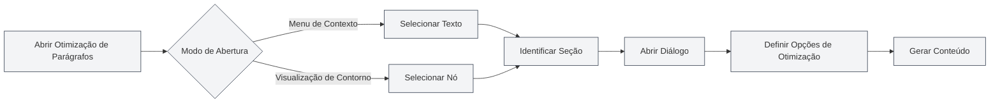

# Funcionalidade de Otimização de Parágrafos

## Visão Geral

A funcionalidade de Otimização de Parágrafos permite que você use IA para otimizar parágrafos ou seções específicas em um documento. Você pode abrir a otimização de parágrafos a partir do menu de contexto (botão direito) ou da visualização de contorno para gerar ou otimizar o conteúdo do parágrafo.

## Abrir a Otimização de Parágrafos

### Abrir a partir do Menu de Contexto

Você pode abrir a otimização de parágrafos clicando com o botão direito no editor:

1.  **Selecionar Texto**: Selecione o texto que deseja otimizar no editor.
2.  **Menu de Contexto**: Clique com o botão direito no texto selecionado.
3.  **Escolher Otimizar**: No menu de contexto, selecione "Otimização de Parágrafos" ou uma opção similar.
4.  **Abrir Diálogo**: O diálogo de Otimização de Parágrafos será aberto.

### Abrir a partir do Contorno

Você pode abrir a otimização de parágrafos na visualização de Contorno:

1.  **Selecionar Nó**: Selecione o nó que deseja otimizar na árvore de contorno.
2.  **Menu de Contexto**: Clique com o botão direito no nó.
3.  **Escolher Otimizar**: No menu de contexto, selecione "Otimização de Parágrafos" ou uma opção similar.
4.  **Abrir Diálogo**: O diálogo de Otimização de Parágrafos será aberto.

Você pode acessar a visualização de Contorno através da barra lateral:

<ViewMenuItemsDemo mode="demo" :items='["outline"]' />

<ViewMenuItemsDemo mode="demo" :items='["chat"]' />

<AIChat mode="demo" />

A interface do Otimizador de Seções é a seguinte:

<SectionOptimizer mode="demo" title="Exemplo de Seção" path="1" :tree='{"text": "Exemplo de Seção", "children": []}' language="markdown" :adapter='null' />

### Identificação Automática de Seções

A Otimização de Parágrafos identifica automaticamente a seção atual:

-   **Posição do Cursor**: Identifica a seção atual com base na posição do cursor.
-   **Texto Selecionado**: Se um texto estiver selecionado, usa o texto selecionado.
-   **Nó do Contorno**: Se aberto a partir do contorno, usa o nó correspondente do contorno.

## Opções de Otimização

### Modo de Otimização

Você pode escolher diferentes modos de otimização:

-   **Gerar Conteúdo**: Gera um novo conteúdo para o parágrafo.
-   **Otimizar Conteúdo**: Otimiza o conteúdo existente do parágrafo.
-   **Acrescentar Conteúdo**: Adiciona novo conteúdo após o conteúdo existente.
-   **Substituir Conteúdo**: Substitui o conteúdo existente do parágrafo.

### Modo de Contexto

Você pode escolher o modo de contexto:

-   **Contexto Completo do Documento**: Usa todo o documento como contexto.
-   **Contexto da Seção**: Usa apenas a seção atual como contexto.
-   **Sem Contexto**: Não usa informações de contexto.

### Prompt Personalizado

Você pode inserir um prompt personalizado:

-   **Objetivo da Otimização**: Descreva o objetivo da otimização.
-   **Requisitos de Conteúdo**: Especifique os requisitos de conteúdo.
-   **Requisitos de Estilo**: Indique o estilo de escrita desejado.

### Prompts Pré-definidos

Você pode usar prompts pré-definidos:

-   **Expandir Conteúdo**: Expande o conteúdo do parágrafo.
-   **Simplificar Conteúdo**: Simplifica o conteúdo do parágrafo.
-   **Reescrever Conteúdo**: Reescreve o conteúdo do parágrafo.
-   **Complementar Conteúdo**: Complementa o conteúdo do parágrafo.

## Gerar Conteúdo

### Processo de Geração

O processo de geração de conteúdo:

1.  **Analisar a Seção**: Analisa a estrutura e o conteúdo da seção atual.
2.  **Construir o Prompt**: Constrói o prompt de otimização com base nas opções escolhidas.
3.  **Chamar a IA**: Chama a IA para gerar o conteúdo otimizado.
4.  **Exibir Resultado**: Exibe o conteúdo gerado no diálogo.

### Resultado da Geração

O conteúdo gerado é exibido no diálogo:

-   **Pré-visualizar Conteúdo**: Você pode pré-visualizar o conteúdo gerado.
-   **Editar Conteúdo**: Você pode editar o conteúdo gerado.
-   **Aplicar Conteúdo**: Você pode aplicar o conteúdo ao documento.

### Opções de Geração

Você pode definir opções ao gerar:

-   **Saída em Fluxo Contínuo**: Exibe o processo de geração em tempo real.
-   **Geração Única**: Aguarda a conclusão da geração para exibir o resultado.
-   **Cancelar Geração**: Você pode cancelar o processo de geração a qualquer momento.

## Aplicar Conteúdo

### Modo de Aplicação

Você pode aplicar o conteúdo gerado ao documento:

-   **Substituir**: Substitui o conteúdo original do parágrafo.
-   **Inserir**: Insere o conteúdo em uma posição especificada.
-   **Acrescentar**: Adiciona o conteúdo ao final do parágrafo.

### Local de Aplicação

Você pode especificar o local de aplicação:

-   **Posição Atual**: Aplica na posição atual do cursor.
-   **Início da Seção**: Aplica no início da seção.
-   **Final da Seção**: Aplica no final da seção.

## Funcionalidade de Diálogo

### Continuar o Diálogo

Após gerar o conteúdo, você pode continuar o diálogo:

1.  **Abrir Diálogo**: Clique no botão "Continuar Diálogo".
2.  **Entrar no Diálogo**: Entre na interface de diálogo com a IA.
3.  **Continuar Otimizando**: Você pode continuar otimizando ou modificando o conteúdo.

### Contexto do Diálogo

O diálogo incluirá o seguinte contexto:

-   **Conteúdo Original**: O conteúdo original do parágrafo.
-   **Conteúdo Gerado**: O conteúdo gerado.
-   **Histórico de Otimização**: O histórico de otimizações.

## Melhores Práticas

1.  **Definir Objetivo Claramente**: Tenha um objetivo de otimização claro e use prompts claros.
2.  **Escolher o Contexto**: Selecione o modo de contexto apropriado para a situação.
3.  **Pré-visualizar Conteúdo**: Após a geração, pré-visualize o conteúdo para garantir que atenda aos requisitos.
4.  **Editar e Ajustar**: Após a geração, você pode editar e ajustar ainda mais.
5.  **Otimizar Várias Vezes**: Você pode otimizar várias vezes para aperfeiçoar o conteúdo gradualmente.

## Observações Importantes

1.  **Identificação da Seção**: Certifique-se de que a seção seja identificada corretamente para evitar otimizar o conteúdo errado.
2.  **Uso do Contexto**: Use o contexto de forma racional para evitar conteúdo excessivamente longo.
3.  **Qualidade do Conteúdo**: O conteúdo gerado precisa ser revisado e ajustado manualmente.
4.  **Consumo de Tokens**: A funcionalidade de otimização consome tokens; fique atento ao uso.
5.  **Salvar Documento**: Lembre-se de salvar o documento após aplicar o conteúdo.

## Documentação Relacionada

-   [[outline.basics|Funcionalidade de Visualização de Contorno]]
-   [[ai.chat|Funcionalidade de Diálogo com IA]]
-   [[ai.completion|Funcionalidade de Auto-completar com IA]]

<Outline mode="demo" />

<CompletionSettingsPanel mode="demo" />

<MenuItemsDemo mode="demo" :items='[{"id": "ai"}]' />

<ViewMenuItemsDemo mode="demo" :items='["chat"]' />
