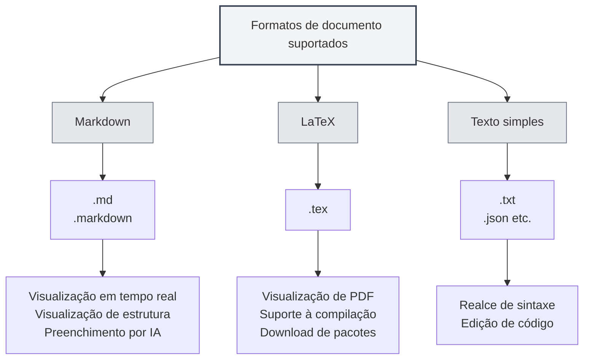

# Formatos de documento suportados

## Visão geral

O MetaDoc suporta vários formatos de documento, incluindo Markdown, LaTeX e texto simples. O sistema detecta automaticamente o formato do arquivo e também permite a seleção manual do formato.

<MenuItemsDemo mode="demo" :items='[{"id": "file"}]' />

<MenuItemsDemo mode="demo" :items='[{"id": "edit"}]' />

<MenuItemsDemo mode="demo" :items='[{"id": "view"}]' />

<ViewMenuItemsDemo mode="demo" :items='["home", "outline", "chat"]' />

<MainTabs mode="demo" />

## Formatos suportados

### Formato Markdown

**Extensões de arquivo**: `.md`, `.markdown`

**Características**:

- Suporta sintaxe Markdown padrão
- Suporta sintaxe estendida (tabelas, blocos de código, fórmulas matemáticas, etc.)
- Suporta visualização em tempo real
- Suporta visualização de estrutura
- Suporta preenchimento automático por IA

**Cenários de uso**:

- Redação de documentação técnica
- Criação de artigos para blog
- Tomada de notas
- Redação de documentação

### Formato LaTeX

**Extensão de arquivo**: `.tex`

**Características**:

- Formato profissional para redação de artigos acadêmicos
- Suporta fórmulas matemáticas, tabelas, gráficos
- Visualização de PDF em tempo real
- Suporta download automático de pacotes
- Suporta indicação de erros de compilação

**Cenários de uso**:

- Redação de artigos acadêmicos
- Redação de relatórios técnicos
- Diagramação de livros
- Diagramação de documentos complexos

### Formato de texto simples

**Extensões de arquivo**: `.txt`, `.json`, etc.

**Características**:

- Edição de texto simples
- Suporte a realce de sintaxe
- Funcionalidades de edição de código
- Não suporta visualização e estrutura

**Cenários de uso**:

- Edição de arquivos de código
- Edição de arquivos de configuração
- Edição de texto simples
- Edição de arquivos de dados

## Detecção de formato de arquivo

### Detecção automática

O MetaDoc detecta automaticamente o formato do arquivo:

1.  **Detecção por extensão**: Prioriza a detecção do formato com base na extensão do arquivo
    - `.md`, `.markdown` → Formato Markdown
    - `.tex` → Formato LaTeX
    - `.txt`, `.json`, etc. → Formato de texto simples
2.  **Detecção por conteúdo**: Se a extensão não puder determinar o formato, o conteúdo do arquivo será analisado
    - Conteúdo LaTeX é priorizado como formato LaTeX
    - Outros conteúdos são identificados por padrão como formato Markdown
3.  **Formato padrão**: Se a detecção for impossível, o formato Markdown é usado por padrão

### Prioridade de detecção

A detecção de formato segue a seguinte prioridade:

1.  **Extensão do arquivo**: Usa a detecção por extensão primeiro
2.  **Conteúdo do arquivo**: Se a extensão for indeterminada, analisa o conteúdo
3.  **Formato padrão**: Usa o formato padrão quando a detecção falha

### Regras de detecção

-   **Detecção Markdown**: Identificado como Markdown quando a extensão é `.md` ou `.markdown`
-   **Detecção LaTeX**: Identificado como LaTeX quando a extensão é `.tex` ou o conteúdo contém comandos LaTeX
-   **Detecção de texto simples**: Identificado como texto simples para outras extensões ou quando indeterminado

## Seleção manual de formato

### Selecionar ao abrir arquivo

É possível selecionar o formato manualmente ao abrir um arquivo:

1.  **Diálogo de abrir arquivo**: No diálogo de abrir arquivo
2.  **Seleção de formato**: Escolha o formato do arquivo (se a detecção automática estiver incorreta)
3.  **Confirmar abertura**: Após confirmar, o arquivo é aberto no formato selecionado

### Selecionar ao criar novo arquivo

É possível selecionar o formato ao criar um novo arquivo:

1.  **Novo documento**: Clique no botão "Novo documento"
2.  **Selecionar formato**: Escolha o formato no diálogo de seleção de formato
3.  **Criar documento**: Crie o documento no formato especificado

### Alternar formato

É possível alternar o formato de um documento já aberto:

1.  **Abrir documento**: Abra o documento cujo formato deseja alterar
2.  **Menu de formato**: Encontre a opção de alternar formato no menu
3.  **Selecionar formato**: Escolha o novo formato
4.  **Confirmar alternância**: Confirme a mudança de formato

**Atenção**:

-   Alternar o formato pode afetar o conteúdo do documento
-   Algumas características do formato podem não ser convertíveis
-   Recomenda-se fazer backup do documento antes de alternar

## Comparação de características dos formatos

### Suporte a funcionalidades

| Funcionalidade | Markdown | LaTeX    | Texto simples |
| -------------- | -------- | -------- | ------------- |
| Visualização em tempo real | ✅       | ✅ (PDF) | ❌            |
| Visualização de estrutura | ✅       | ✅       | ❌            |
| Preenchimento por IA | ✅       | ✅       | ✅            |
| Fórmulas matemáticas | ✅       | ✅       | ❌            |
| Suporte a tabelas | ✅       | ✅       | ❌            |
| Realce de código | ✅       | ✅       | ✅            |
| Suporte a metadados | ✅       | ✅       | ❌            |

### Características do editor

| Característica | Markdown | LaTeX | Texto simples |
| -------------- | -------- | ----- | ------------- |
| Realce de sintaxe | ✅       | ✅    | ✅            |
| Preenchimento automático | ✅       | ✅    | ✅            |
| Indicação de erros | ✅       | ✅    | ❌            |
| Recolhimento de código | ✅       | ✅    | ✅            |
| Edição com múltiplos cursores | ✅       | ✅    | ✅            |

## Conversão de formatos

### Formatos de exportação

É possível exportar documentos para outros formatos:

-   **Markdown → PDF**: Exportar como documento PDF
-   **Markdown → HTML**: Exportar como documento HTML
-   **Markdown → DOCX**: Exportar como documento Word
-   **LaTeX → PDF**: Compilar como documento PDF
-   **LaTeX → Markdown**: Converter para formato Markdown

### Considerações sobre conversão

Ao converter formatos, é importante observar:

-   **Compatibilidade de conteúdo**: Algumas características do formato podem não ser convertíveis
-   **Perda de estilo**: Parte da formatação pode ser perdida após a conversão
-   **Ajuste de conteúdo**: Pode ser necessário ajustar manualmente o conteúdo após a conversão

## Melhores práticas

1.  **Escolha o formato adequado**: Selecione o formato apropriado para o tipo de documento
2.  **Use extensões padrão**: Use extensões de arquivo padrão para facilitar a detecção automática
3.  **Consistência de formato**: Use um formato uniforme dentro do mesmo projeto
4.  **Faça backup dos documentos**: Faça backup do documento original antes de converter o formato
5.  **Teste a conversão**: Verifique se o conteúdo está correto após a conversão

## Atenção

1.  **Detecção de formato**: A detecção automática pode ser imprecisa; é possível selecionar manualmente
2.  **Alternância de formato**: Alterar o formato pode afetar o conteúdo do documento
3.  **Compatibilidade**: O suporte a funcionalidades varia entre os diferentes formatos
4.  **Extensão do arquivo**: Recomenda-se usar extensões padrão
5.  **Conversão de formato**: Parte do conteúdo ou formatação pode ser perdida durante a conversão

## Documentação relacionada

-   [[markdown.basics|Sintaxe Markdown]]
-   [[latex.basics|Sintaxe LaTeX]]
-   [[editor.plain-text|Editor de texto simples]]
-   [[core.file-operations|Operações com arquivos]]
