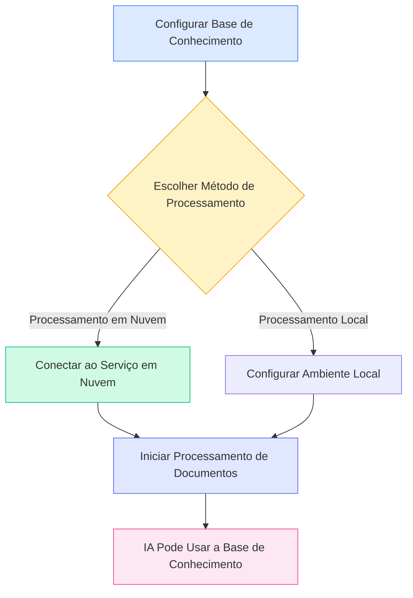
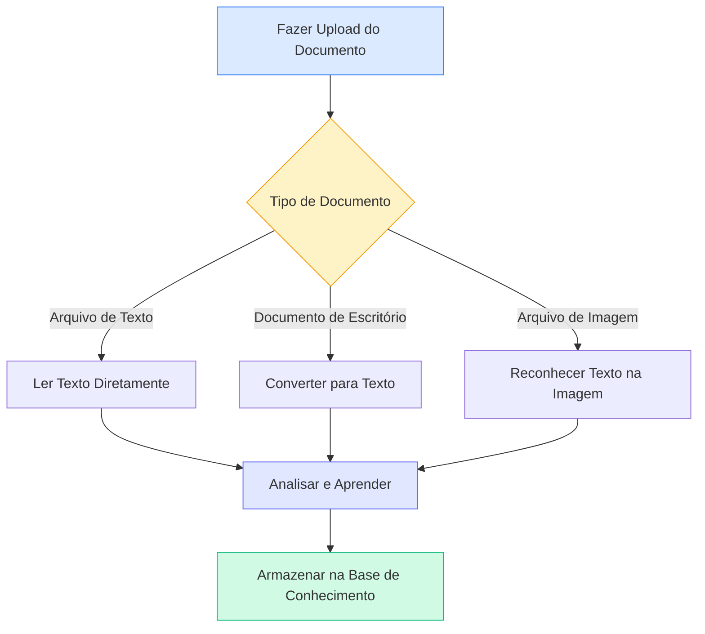
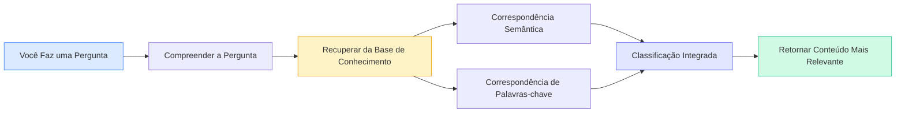

# Configuração da Base de Conhecimento

## Visão Geral

A Base de Conhecimento é o sistema de gerenciamento de documentos inteligente do MetaDoc. Ao "ensinar" seus documentos à Base de Conhecimento, a IA pode compreender e fazer referência a esse conteúdo, fornecendo respostas e sugestões mais precisas para você.

Este guia ajudará você a configurar a Base de Conhecimento para que ela funcione melhor para você.

## Habilitar a Funcionalidade da Base de Conhecimento

Na página de configurações da Base de Conhecimento, primeiro é necessário habilitar a funcionalidade:

1.  Encontre o interruptor "Habilitar Base de Conhecimento"
2.  Mude o interruptor para o estado "Habilitado"
3.  Configure os parâmetros relacionados à Base de Conhecimento

Você pode acessar o gerenciamento da Base de Conhecimento através da barra de menu superior:

<KnowledgeBase mode="demo" />

A imagem acima mostra as principais áreas funcionais da interface de gerenciamento da Base de Conhecimento:

-   **Painel Esquerdo**: Lista de bases de conhecimento e função de busca
-   **Área Central**: Lista de documentos adicionados
-   **Detalhes à Direita**: Informações detalhadas e status de processamento do documento selecionado
-   **Barra de Ferramentas Inferior**: Botões de ação como adicionar documento, iniciar processamento, excluir, etc.

## Escolher o Método de Processamento

### Introdução aos Dois Métodos

O MetaDoc oferece duas maneiras de processar documentos:

**Processamento em Nuvem (Recomendado)**

-   Envia o documento para o serviço em nuvem para análise
-   Processamento rápido, sem consumir recursos locais
-   Requer conexão com a internet

**Processamento Local (Em Desenvolvimento)**

-   Processa os documentos diretamente no seu computador
-   Dados totalmente locais, protegendo a privacidade
-   Requer configuração de computador mais robusta

A versão atual suporta apenas o processamento em nuvem. Você pode selecionar nas configurações:

<MenuItemsDemo mode="demo" :items='[{"id": "settings"}]' />

### Vantagens do Processamento em Nuvem

Para a maioria dos usuários, recomendamos o uso do processamento em nuvem:

-   **Configuração Rápida**: Não requer configuração de ambiente local complexa
-   **Economia de Tempo**: Mais rápido ao processar grandes volumes de documentos
-   **Economia de Recursos**: Não ocupa memória ou processador do computador
-   **Manutenção Simples**: Atualizações automáticas, sem necessidade de gerenciamento manual

### Quando o Processamento Local é Necessário

Se você tiver as seguintes necessidades, pode aguardar o lançamento da funcionalidade de processamento local:

-   Processar documentos confidenciais altamente sensíveis
-   Trabalhar frequentemente em ambientes sem conexão com a internet
-   Possuir configuração de computador de alto desempenho (com placa de vídeo dedicada)
-   Necessidade de processar uma quantidade massiva de documentos (acima de 10GB)

<SettingKnowledgeBaseSection mode="demo" />

## Entendendo Como a Base de Conhecimento Funciona

### Como os Documentos São "Ensinados"

<RAGToolDisplay mode="demo" />

Quando você adiciona um documento à Base de Conhecimento, o MetaDoc executa as seguintes etapas:

1.  **Ler o Conteúdo do Documento**

    -   Extrai texto de formatos como PDF, Word, imagens, etc.
    -   Preserva a estrutura e informações de formatação do documento

2.  **Compreender o Significado do Documento**

    -   Converte o texto em uma "representação semântica" que a IA pode entender
    -   É como adicionar etiquetas inteligentes ao documento

3.  **Criar Índices**

    -   Cria índices para busca rápida
    -   Permite que a IA encontre conteúdo relevante em instantes

4.  **Armazenar Conhecimento**
    -   Salva os resultados do processamento no banco de dados local
    -   Pode ser acessado a qualquer momento

<KnowledgeBase mode="demo" />

## Tipos de Documentos Suportados

### Formatos que Podem Ser Processados Diretamente

A Base de Conhecimento do MetaDoc suporta vários formatos de documento comuns:

**Baseados em Texto**

-   Documentos Markdown (.md) – Formato preferido para documentação técnica
-   Documentos LaTeX (.tex) – Formato comumente usado para artigos acadêmicos
-   Arquivos de Texto Simples (.txt) – Registros de texto simples

**Documentos de Escritório**

-   Arquivos PDF (.pdf) – O formato de documento mais universal
-   Documentos Word (.docx) – Formato Microsoft Office

**Baseados em Imagem**

-   Imagens PNG (.png) – Capturas de tela, gráficos
-   Imagens JPEG (.jpg, .jpeg) – Fotos, documentos digitalizados

### Como Diferentes Tipos de Documentos São Processados

O MetaDoc processa diferentes tipos de documentos de maneiras distintas:

**Documentos de Texto** (Markdown, LaTeX, TXT)

-   Lê o conteúdo de texto diretamente
-   Preserva a estrutura de títulos e formatação
-   Processamento mais rápido

**Documentos de Escritório** (PDF, Word)

-   Primeiro converte para texto simples
-   Extrai estrutura como títulos, parágrafos, etc.
-   Preserva a hierarquia lógica do documento

**Documentos de Imagem** (PNG, JPG)

-   Usa tecnologia OCR para reconhecer texto nas imagens
-   Adequado para processar documentos em papel digitalizados
-   Tempo de processamento relativamente mais longo

<RAGToolDisplay mode="demo" />

## Mecanismo de Recuperação Inteligente

### Como a Base de Conhecimento Encontra Conteúdo Relevante

Quando a IA precisa usar a Base de Conhecimento, o MetaDoc adota uma estratégia de recuperação inteligente:

**Correspondência Semântica**

-   Não apenas corresponde palavras-chave, mas compreende o significado da pergunta
-   Por exemplo: buscar "como instalar" também pode encontrar conteúdo relacionado como "etapas de instalação", "guia de implantação"

**Recuperação Híbrida**

-   Combina compreensão semântica e correspondência de palavras-chave
-   Garante precisão e melhora a taxa de recuperação
-   Ordenação automática, conteúdo mais relevante mostrado primeiro

**Resposta Rápida**

-   Usa algoritmos de indexação eficientes
-   Resposta em milissegundos, sem afetar a fluidez da conversa

<KnowledgeBase mode="demo" />

## Explicação sobre Divisão em Blocos

### Por que a Divisão em Blocos é Necessária

Para uma recuperação mais eficiente, o MetaDoc divide documentos longos em blocos menores:

**Benefícios da Divisão em Blocos**

-   **Localização Precisa**: Pode encontrar parágrafos específicos dentro do documento
-   **Aumento da Velocidade**: Blocos menores são processados mais rapidamente, a recuperação é mais ágil
-   **Manutenção do Contexto**: Blocos adjacentes têm sobreposição, não cortando a semântica

**Configuração Padrão**

-   Cada bloco tem aproximadamente 500 caracteres (cerca de 250 caracteres chineses)
-   Sobreposição de 50 caracteres entre blocos adjacentes
-   Essa configuração equilibra precisão e eficiência

### Exemplo de Divisão em Blocos

Suponha um artigo longo:

Texto Original: [Parágrafo inicial... Parágrafo do meio... Parágrafo final...]

Após a divisão:

-   Bloco 1: Parágrafo inicial + parte do conteúdo do meio
-   Bloco 2: Parte do conteúdo do meio (área de sobreposição) + mais conteúdo do meio
-   Bloco 3: Mais conteúdo do meio + parágrafo final

Dessa forma, mesmo que a pergunta envolva apenas "conteúdo do meio", a parte relevante pode ser encontrada com precisão.

<SettingKnowledgeBaseSection mode="demo" />

## Sugestões de Configuração

### Configurações Recomendadas para Primeiro Uso

Se você está usando a Base de Conhecimento pela primeira vez, recomendamos as seguintes configurações:

-   **Método de Processamento**: Processamento em Nuvem (padrão)
-   **Sensibilidade da Recuperação**: Média (valor padrão)
    -   Sensibilidade muito alta: Pode retornar muitos conteúdos não relacionados
    -   Sensibilidade muito baixa: Pode omitir alguns conteúdos relacionados
    -   Configuração média: Equilibra ambos

### Para Diferentes Tipos de Documentos

**Documentação Técnica/Manuais**

-   Adequado para criar uma base de conhecimento especializada
-   A IA pode responder perguntas técnicas com precisão
-   Suporta recuperação de trechos de código

**Artigos Acadêmicos**

-   Preserva informações completas de citação
-   Suporta associação de conhecimento entre documentos
-   Adequado para revisão de literatura e pesquisa

**Notas Diárias**

-   Cria uma base de conhecimento pessoal
-   Recuperação rápida de registros anteriores
-   Suporta referência durante escrita criativa

### Sugestões de Uso

**1. Manutenção Regular**

-   Exclua documentos desatualizados ou não mais necessários
-   Atualize novas versões de documentos existentes
-   Mantenha a Base de Conhecimento organizada e precisa

**2. Classificação Adequada**

-   Agrupe documentos de tópicos relacionados
-   Defina nomes claros para as bases de conhecimento
-   Facilita o gerenciamento e uso

**3. Considerações de Privacidade**

-   Faça upload de documentos confidenciais com cautela
-   Entenda como os dados são processados
-   Escolha o método de processamento adequado

<RAGToolDisplay mode="demo" />

## Considerações Importantes

### Informações Antes do Uso

1.  **Tempo de Processamento**

    -   Documentos pequenos (1-10 páginas): Alguns segundos
    -   Documentos médios (10-50 páginas): Dezenas de segundos
    -   Documentos grandes (acima de 50 páginas): Pode levar alguns minutos
    -   Aguarde pacientemente a conclusão do processamento

2.  **Espaço de Armazenamento**

    -   A Base de Conhecimento ocupa um certo espaço no disco rígido
    -   Aproximadamente 2-3 vezes o tamanho do documento original
    -   Limpar documentos não utilizados regularmente pode liberar espaço

3.  **Requisitos de Rede**

    -   É necessária conexão com a internet para adicionar documentos
    -   Não é necessária para recuperação (já armazenada localmente)
    -   Rede instável pode afetar a velocidade de processamento

4.  **Formato do Arquivo**
    -   Certifique-se de que o formato do arquivo enviado está correto
    -   Arquivos corrompidos podem não ser processados
    -   PDFs criptografados precisam ser descriptografados primeiro

### Perguntas Frequentes

**P: Os documentos na Base de Conhecimento são seguros?**
R: Os dados vetoriais dos documentos após o processamento são armazenados localmente. Se usar processamento em nuvem, o documento original é enviado ao serviço em nuvem para processamento e excluído após a conclusão. Recomenda-se não fazer upload de conteúdo altamente sensível.

**P: Qual o tamanho máximo de documento que pode ser processado?**
R: Recomenda-se que um único documento não exceda 100MB. Documentos muito grandes podem ser divididos em vários documentos menores para processamento.

**P: Os documentos processados ainda podem ser modificados?**
R: O conteúdo na Base de Conhecimento é um "instantâneo" do documento original. Se o documento for atualizado, é necessário adicioná-lo novamente à Base de Conhecimento.

**P: Por que alguns conteúdos não são encontrados na recuperação?**
R: Possíveis razões: 1) O documento ainda não foi processado completamente; 2) O conteúdo está em uma imagem e o reconhecimento OCR falhou; 3) Diferença significativa entre os termos de busca e a forma como o conteúdo do documento é expresso.

## Documentação Relacionada

-   [[knowledge-base.management|Gerenciamento da Base de Conhecimento]] - Aprenda como adicionar, excluir e gerenciar documentos na Base de Conhecimento
-   [[knowledge-base.usage|Uso da Base de Conhecimento]] - Entenda como usar a Base de Conhecimento nas conversas com a IA
-   [[ai.chat|Funcionalidade de Conversa com IA]] - Explore os recursos avançados da conversa com IA