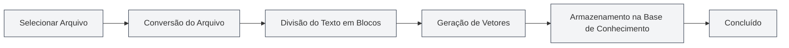

# Gerenciamento de Base de Conhecimento

## Visão Geral

<KnowledgeBase mode="demo" />

O gerenciamento da Base de Conhecimento é a funcionalidade central do sistema MetaDoc RAG (Recuperação Aumentada por Geração), permitindo que você adicione documentos à base de conhecimento para fornecer informações de contexto para diálogos de IA por meio de busca vetorial. A base de conhecimento ajuda a IA a compreender melhor o conteúdo dos seus documentos, fornecendo respostas mais precisas.

## Habilitar a Base de Conhecimento

### Ativar a funcionalidade de Base de Conhecimento

Na página de configurações da base de conhecimento, primeiro é necessário habilitar a funcionalidade:

1.  Encontre o interruptor "Habilitar Base de Conhecimento"
2.  Mude o interruptor para o estado "Habilitado"
3.  Configure os parâmetros relacionados à base de conhecimento

Você pode acessar o gerenciamento da base de conhecimento através da barra de menu superior:

<MenuItemsDemo mode="demo" :items='[{"id": "settings"}]' />

### Configurações da Base de Conhecimento

<SettingKnowledgeBaseSection mode="demo" />

Antes de habilitar a base de conhecimento, você pode configurar os parâmetros relacionados na página de configurações:

A imagem acima mostra as principais opções da interface de configuração da base de conhecimento:

-   **Habilitar Base de Conhecimento**: Ativa ou desativa a funcionalidade da base de conhecimento
-   **Modo de Embedding**: Escolha processamento em nuvem ou local (em desenvolvimento)
-   **Limiar de Confiança**: Controla a filtragem de relevância dos resultados da recuperação
-   **Número Máximo de Recuperações**: Limita o número máximo de resultados retornados por cada busca

### Interface de Gerenciamento da Base de Conhecimento

<KnowledgeBase mode="demo" />

Após habilitar a base de conhecimento, você pode adicionar e gerenciar documentos na interface de gerenciamento:

A interface de gerenciamento da base de conhecimento oferece as seguintes funcionalidades:

-   **Lista de Documentos**: Visualiza todos os documentos já adicionados à base de conhecimento
-   **Adicionar Documento**: Suporta vários formatos como PDF, Word, imagens, Markdown, etc.
-   **Status de Processamento**: Exibe em tempo real o progresso do processamento do documento
-   **Teste de Busca**: Testa a eficácia da recuperação da base de conhecimento

Após habilitar a base de conhecimento, as funcionalidades de IA (como Diálogo com IA, Completamento por IA) usarão automaticamente as informações da base de conhecimento para melhorar a qualidade das respostas.

**Atenção**:

-   Após habilitar a base de conhecimento, as funcionalidades de IA buscarão conteúdo nela, o que pode afetar a velocidade de resposta
-   A base de conhecimento precisa ter arquivos adicionados primeiro para funcionar
-   Recomenda-se habilitar a base de conhecimento após adicionar os arquivos

<RAGToolDisplay mode="demo" />

## Configuração do Limiar de Confiança

### Entendendo o Limiar de Confiança

O Limiar de Confiança (Score Threshold) controla o critério de filtragem para os resultados da recuperação da base de conhecimento:

-   **Limiar Baixo (0.1-0.3)**: Retorna mais resultados, mas pode incluir conteúdo não relacionado
-   **Limiar Médio (0.4-0.6)**: Equilibra relevância e quantidade, recomendado para uso geral
-   **Limiar Alto (0.7-0.9)**: Retorna apenas resultados altamente relevantes, mas pode omitir informações relacionadas

### Sugestões de Configuração

-   **Cenário Geral**: Recomenda-se 0.5, equilibrando precisão e cobertura
-   **Necessidade de Alta Precisão**: Recomenda-se 0.7-0.8, garantindo resultados altamente relevantes
-   **Busca Exploratória**: Recomenda-se 0.3-0.4, para obter mais informações relacionadas

A configuração do limiar afeta todas as funcionalidades de IA que usam a base de conhecimento, incluindo Diálogo com IA, Completamento por IA, etc.

<SettingKnowledgeBaseSection mode="demo" />

## Gerenciamento de Arquivos da Base de Conhecimento

### Adicionar Arquivos à Base de Conhecimento

1.  Na página de gerenciamento da base de conhecimento, clique no botão "Adicionar Arquivo"
2.  Selecione o arquivo a ser adicionado (suporta vários formatos)
3.  O sistema processará o arquivo automaticamente:
    -   Converte o arquivo em texto
    -   Divide o texto em blocos
    -   Gera embeddings vetoriais
    -   Armazena na base de conhecimento

**Formatos de arquivo suportados**:

-   Markdown (.md)
-   LaTeX (.tex)
-   PDF (.pdf)
-   Word (.docx)
-   Imagens (.png, .jpg, etc., reconhecidas por OCR)
-   Texto puro (.txt)

### Fluxo de Processamento de Arquivos

### Gerenciamento da Lista de Arquivos

<KnowledgeBase mode="demo" />

A página de gerenciamento da base de conhecimento exibe todos os arquivos já adicionados:

-   **Nome do Arquivo**: Exibe o nome do arquivo
-   **Status**: Exibe se o arquivo está habilitado ou não
-   **Número de Blocos**: Exibe quantos blocos o arquivo foi dividido
-   **Número de Vetores**: Exibe a quantidade de vetores gerados
-   **Ações**: Fornece operações de gerenciamento do arquivo

### Habilitar/Desabilitar Arquivos

Você pode desabilitar temporariamente um arquivo sem excluí-lo:

1.  Na lista de arquivos, encontre o arquivo a ser operado
2.  Clique no botão "Habilitar" ou "Desabilitar"
3.  Após desabilitar, o arquivo não será recuperado nas buscas, mas os dados permanecerão armazenados

**Cenários de uso**:

-   Excluir temporariamente certos arquivos
-   Testar o efeito de diferentes combinações de arquivos
-   Manter o arquivo armazenado, mas sem uso temporário

### Excluir Arquivos

1.  Na lista de arquivos, encontre o arquivo a ser excluído
2.  Clique no botão "Excluir"
3.  Confirme a operação de exclusão

Excluir um arquivo irá:

-   Excluir o registro do arquivo
-   Excluir todos os blocos de dados relacionados
-   Excluir todos os vetores relacionados
-   A operação é irreversível

**Atenção**:

-   A operação de exclusão é irreversível, proceda com cautela
-   Excluir arquivos grandes pode levar algum tempo
-   Após a exclusão, será necessário adicionar novamente para restaurar

### Renomear Arquivos

1.  Na lista de arquivos, encontre o arquivo a ser renomeado
2.  Clique no botão "Renomear"
3.  Digite o novo nome do arquivo
4.  Confirme a renomeação

Renomear altera apenas o nome de exibição, não afeta o conteúdo do arquivo nem os dados vetoriais.

### Visualizar Arquivos

Você pode visualizar o conteúdo dos arquivos na base de conhecimento:

1.  Na lista de arquivos, encontre o arquivo a ser visualizado
2.  Clique no botão "Visualizar"
3.  Veja o conteúdo textual do arquivo

A funcionalidade de visualização pode ajudá-lo a:

-   Confirmar se o conteúdo do arquivo está correto
-   Verificar se o arquivo foi processado corretamente
-   Compreender a estrutura textual do arquivo

### Baixar Arquivos

Você pode baixar os arquivos da base de conhecimento:

1.  Na lista de arquivos, encontre o arquivo a ser baixado
2.  Clique no botão "Baixar"
3.  Escolha o local de salvamento

O arquivo baixado é uma cópia do arquivo original, podendo ser usado para backup ou compartilhamento.

<RAGToolDisplay mode="demo" />

## Reconstrução Vetorial

### Reconstruir Vetores

Se os dados vetoriais de um arquivo apresentarem problemas, ou se o modelo de Embedding for atualizado, você pode reconstruir os vetores:

1.  Na lista de arquivos, encontre o arquivo a ser reconstruído
2.  Clique no botão "Reconstruir Vetores"
3.  Aguarde a conclusão da reconstrução

Reconstruir vetores irá:

-   Reprocessar o texto do arquivo
-   Regenerar os embeddings vetoriais
-   Atualizar o índice vetorial

**Cenários de uso**:

-   Mudança do modelo de Embedding
-   Dados vetoriais corrompidos
-   Necessidade de atualizar a representação vetorial

### Reconstruir Todos os Vetores

Se for necessário reconstruir os vetores de todos os arquivos:

1.  Clique no botão "Reconstruir Todos os Vetores"
2.  Confirme a operação
3.  Aguarde a conclusão da reconstrução de todos os arquivos

Reconstruir todos os vetores pode levar um tempo considerável, especialmente se houver muitos arquivos.

<KnowledgeBase mode="demo" />

## Teste de Busca na Base de Conhecimento

### Testar a Funcionalidade de Busca

Você pode testar a funcionalidade de busca na página de gerenciamento da base de conhecimento:

1.  Digite o texto da consulta na caixa de busca
2.  Clique no botão "Buscar"
3.  Veja os resultados da busca

Os resultados da busca mostrarão:

-   Trechos de texto correspondentes
-   Pontuação de similaridade
-   Arquivo de origem
-   Informações de contexto

### Parâmetros de Busca

Durante o teste de busca, você pode ajustar:

-   **Texto da Consulta**: Insira o conteúdo a ser buscado
-   **Número de Retornos**: Define a quantidade de resultados a retornar
-   **Limiar**: Define o limiar mínimo de similaridade

<RAGToolDisplay mode="demo" />

## Esvaziar a Base de Conhecimento

### Limpar Todos os Dados

Se for necessário esvaziar toda a base de conhecimento:

1.  Clique no botão "Esvaziar Base de Conhecimento"
2.  Confirme a operação
3.  Aguarde a conclusão da limpeza

Esvaziar a base de conhecimento irá:

-   Excluir todos os registros de arquivos
-   Excluir todos os blocos de dados
-   Excluir todos os vetores
-   A operação é irreversível

**Atenção**:

-   A operação de limpeza é irreversível, proceda com cautela
-   Recomenda-se fazer backup de arquivos importantes antes de esvaziar
-   Após esvaziar, será necessário adicionar os arquivos novamente

## Melhores Práticas

1.  **Organização de Arquivos**: Organize os arquivos por tema ou projeto para facilitar o gerenciamento
2.  **Atualização Regular**: Após atualizar o conteúdo de um arquivo, reconstrua os vetores prontamente
3.  **Ajuste do Limiar**: Ajuste o limiar de confiança com base no efeito prático de uso
4.  **Limpeza de Arquivos**: Exclua regularmente arquivos não mais necessários para manter a base de conhecimento organizada
5.  **Backup de Arquivos Importantes**: Para arquivos importantes, recomenda-se fazer backup antes de adicioná-los à base de conhecimento

## Atenção

1.  **Tamanho do Arquivo**: Arquivos grandes têm tempo de processamento mais longo, aguarde com paciência
2.  **Espaço de Armazenamento**: A base de conhecimento ocupa um certo espaço de armazenamento
3.  **Tempo de Processamento**: Adicionar arquivos e processar vetores leva tempo, não interrompa o processo
4.  **Formato do Arquivo**: Certifique-se de que o formato do arquivo está correto, caso contrário pode não ser processado
5.  **Conexão de Rede**: O uso do modo API para gerar vetores requer conexão com a internet

## Documentação Relacionada

-   [[knowledge-base.config|Configuração da Base de Conhecimento]]
-   [[knowledge-base.usage|Uso da Base de Conhecimento]]
-   [[settings.llm|Configuração do LLM]]
-   [[ai.chat|Funcionalidade de Diálogo com IA]]