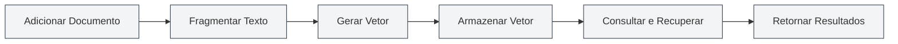
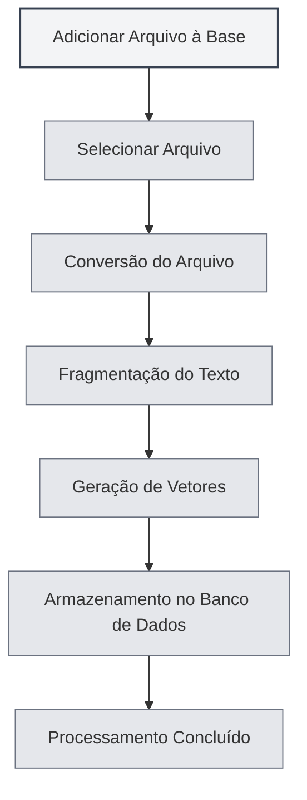

# Uso da Base de Conhecimento

## Visão Geral

A Base de Conhecimento é o sistema RAG (Recuperação Aumentada por Geração) do MetaDoc, que fornece informações de contexto para as funcionalidades de IA por meio de busca vetorial. O uso adequado da base de conhecimento pode melhorar significativamente a precisão e relevância das respostas da IA.

<KnowledgeBase mode="demo" />

## Introdução à Base de Conhecimento

### O que é a Base de Conhecimento

A Base de Conhecimento é um sistema de armazenamento e recuperação de documentos que permite:

- **Armazenar documentos**: Converter documentos em vetores e armazená-los
- **Busca semântica**: Buscar conteúdo relevante com base na similaridade semântica
- **Aprimorar a IA**: Fornecer informações de contexto para diálogos de IA

### Como Funciona

<RAGToolDisplay mode="demo" />

A Base de Conhecimento utiliza tecnologia de incorporação vetorial (embeddings):

1. **Processamento de Documentos**: Divide os documentos em blocos de texto
2. **Vetorização**: Gera uma incorporação vetorial para cada bloco de texto
3. **Armazenamento**: Armazena os vetores no banco de dados
4. **Recuperação**: Gera um vetor para a consulta e busca conteúdo similar

<KnowledgeBase mode="demo" />

## Adicionar Arquivos à Base de Conhecimento

### Adicionar Arquivos

1. Abra a página de gerenciamento da Base de Conhecimento
2. Clique no botão "Adicionar Arquivo"
3. Selecione o arquivo que deseja adicionar
4. Aguarde a conclusão do processamento do arquivo

### Formatos de Arquivo Suportados

A Base de Conhecimento suporta os seguintes formatos de arquivo:

- **Markdown** (.md): Documentos Markdown
- **LaTeX** (.tex): Documentos LaTeX
- **PDF** (.pdf): Documentos PDF
- **Word** (.docx): Documentos do Word
- **Imagens** (.png, .jpg, etc.): Reconhecimento de texto via OCR
- **Texto Puro** (.txt): Arquivos de texto puro

### Processamento de Arquivos

<RAGToolDisplay mode="demo" />

Após adicionar um arquivo, o sistema automaticamente:

1. **Converte o Texto**: Converte o arquivo em conteúdo textual
2. **Fragmenta o Texto**: Divide o texto em blocos de tamanho fixo
3. **Gera Vetores**: Gera incorporações vetoriais para cada bloco
4. **Armazena os Dados**: Armazena os vetores e o texto no banco de dados

O tempo de processamento depende do tamanho do arquivo; arquivos grandes podem levar mais tempo.

<KnowledgeBase mode="demo" />

## Gerenciamento de Arquivos da Base de Conhecimento

### Lista de Arquivos

A página de gerenciamento da Base de Conhecimento exibe todos os arquivos adicionados:

- **Nome do Arquivo**: O nome do arquivo
- **Tamanho/Nº de Blocos**: Tamanho do arquivo e quantidade de blocos de dados
- **Status**: Se o arquivo está habilitado ou não

### Operações com Arquivos

<RAGToolDisplay mode="demo" />

#### Habilitar/Desabilitar Arquivo

- **Habilitar**: O arquivo será recuperado e usado nas funcionalidades de IA
- **Desabilitar**: O arquivo não será recuperado, mas os dados são mantidos

#### Visualizar Arquivo

Clique em um arquivo para visualizar seu conteúdo:

- **Ver Conteúdo**: Visualize o texto do arquivo no painel de visualização
- **Abrir Editor**: Abra o arquivo no editor

#### Renomear Arquivo

1. Selecione o arquivo que deseja renomear
2. Clique no botão de edição ao lado do nome do arquivo
3. Digite o novo nome do arquivo
4. Confirme a renomeação

#### Excluir Arquivo

1. Selecione o arquivo que deseja excluir
2. Clique no botão "Excluir"
3. Confirme a operação de exclusão

A exclusão do arquivo remove todos os vetores e blocos de dados relacionados.

#### Baixar Arquivo

É possível baixar arquivos da Base de Conhecimento:

1. Selecione o arquivo que deseja baixar
2. Clique no botão "Baixar"
3. Escolha o local de salvamento

<KnowledgeBase mode="demo" />

## Busca Vetorial

### Princípio da Busca

A busca vetorial utiliza o algoritmo ANN (Vizinho Mais Próximo Aproximado):

- **Similaridade Vetorial**: Calcula a similaridade entre o vetor da consulta e os vetores dos documentos
- **Similaridade de Cosseno**: Usa a similaridade de cosseno para medir o grau de similaridade
- **Ordenação de Resultados**: Retorna os resultados ordenados por similaridade

### Métodos de Busca

<RAGToolDisplay mode="demo" />

A Base de Conhecimento suporta dois métodos de busca:

- **Busca Vetorial**: Baseada na similaridade semântica
- **Recuperação Híbrida**: Combina busca vetorial e correspondência por palavras-chave

### Teste de Busca

Na página de gerenciamento da Base de Conhecimento, você pode testar a funcionalidade de busca:

1. Digite o texto da consulta na caixa de busca
2. Ajuste o limite de confiança (threshold)
3. Clique no botão "Buscar"
4. Visualize os resultados da busca

### Limite de Confiança (Threshold)

O limite de confiança controla a filtragem dos resultados da busca:

- **Limite Baixo (0.1-0.3)**: Retorna mais resultados, mas pode incluir conteúdo não relacionado
- **Limite Médio (0.4-0.6)**: Equilibra relevância e quantidade (recomendado)
- **Limite Alto (0.7-0.9)**: Retorna apenas resultados altamente relevantes

<KnowledgeBase mode="demo" />

## Recuperação Híbrida

### Mecanismo de Recuperação

A recuperação híbrida combina dois métodos:

- **Busca Vetorial**: Baseada na similaridade semântica
- **Correspondência por Palavras-chave**: Baseada na correspondência de texto

### Mecanismo de Pontuação

A recuperação híbrida usa uma pontuação abrangente:

- **Similaridade Vetorial**: Pontuação de similaridade semântica
- **Correspondência por Palavras-chave**: Pontuação de correspondência de texto
- **Pontuação Abrangente**: Pontuação final que combina as duas pontuações

### Vantagens

As vantagens da recuperação híbrida:

- **Precisão**: A busca vetorial fornece compreensão semântica
- **Exatidão**: A correspondência por palavras-chave fornece correspondência exata
- **Equilíbrio**: Combina as vantagens de ambos os métodos

<RAGToolDisplay mode="demo" />

## Teste de Busca

### Testar a Busca

Na página de gerenciamento da Base de Conhecimento, você pode testar a busca:

1. **Inserir Consulta**: Digite o conteúdo que deseja consultar na caixa de busca
2. **Ajustar Limite**: Use o controle deslizante para ajustar o limite de confiança
3. **Executar Busca**: Clique no botão "Buscar" ou pressione Enter
4. **Ver Resultados**: Visualize os resultados da busca na área de resultados

### Resultados da Busca

Os resultados da busca mostrarão:

- **Texto Correspondente**: Trechos de texto relevantes para a consulta
- **Similaridade**: Pontuação de similaridade entre o texto e a consulta
- **Arquivo de Origem**: O arquivo de origem do texto

### Ordenação dos Resultados

Os resultados da busca são ordenados por similaridade:

- **Mais Relevante**: Resultados com maior similaridade aparecem primeiro
- **Relevância Decrescente**: Ordenados por similaridade decrescente

## Reconstrução de Vetores

### Reconstruir Vetores

Se os dados vetoriais de um arquivo apresentarem problemas, você pode reconstruí-los:

1. Selecione o arquivo cujos vetores deseja reconstruir
2. Clique no botão "Reconstruir Vetores"
3. Aguarde a conclusão da reconstrução

### Reconstruir Todos os Vetores

É possível reconstruir os vetores de todos os arquivos:

1. Clique no botão "Reconstruir Todos os Vetores"
2. Confirme a operação
3. Aguarde a conclusão da reconstrução de todos os arquivos

### Cenários para Reconstrução

Cenários em que a reconstrução de vetores é necessária:

- **Troca do Modelo de Embedding**: Necessário após trocar o modelo
- **Dados Vetoriais Corrompidos**: Quando os dados vetoriais apresentam problemas
- **Atualização da Representação Vetorial**: Quando é necessário atualizar a representação vetorial

## Esvaziar a Base de Conhecimento

### Operação de Esvaziamento

Se necessário esvaziar toda a Base de Conhecimento:

1. Clique no botão "Esvaziar Base de Conhecimento"
2. Confirme a operação
3. Aguarde a conclusão do esvaziamento

### Impacto do Esvaziamento

Esvaziar a Base de Conhecimento irá:

- Excluir todos os registros de arquivos
- Excluir todos os blocos de dados
- Excluir todos os vetores
- A operação é irreversível

**Atenção**:

- A operação de esvaziamento é irreversível; proceda com cautela
- Recomenda-se fazer backup de arquivos importantes antes de esvaziar
- Após o esvaziamento, será necessário adicionar os arquivos novamente

<KnowledgeBase mode="demo" />

## Uso nas Funcionalidades de IA

### Diálogo com IA

A Base de Conhecimento fornece contexto automaticamente para diálogos com IA:

- **Recuperação Automática**: Recupera automaticamente conhecimento relevante com base no conteúdo da conversa
- **Injeção de Contexto**: Injeta os resultados da recuperação no contexto do diálogo
- **Resposta Aprimorada**: Gera respostas mais precisas com base no conteúdo da base de conhecimento

### Completamento por IA

A Base de Conhecimento pode aprimorar a funcionalidade de completamento por IA:

- **Compreensão de Contexto**: Compreende o contexto com base no conteúdo da base de conhecimento
- **Geração de Conteúdo**: Gera conteúdo relacionado ao conteúdo da base de conhecimento
- **Aumento da Precisão**: Aumenta a precisão do conteúdo de completamento

### Ferramentas de Agente

A Base de Conhecimento pode ser usada como uma ferramenta de Agente:

- **Ferramenta RAG**: Usa a recuperação RAG em fluxos de trabalho de Agente
- **Fornecimento de Contexto**: Fornece informações de contexto relevantes para o Agente
- **Execução de Tarefas**: Ajuda o Agente a concluir tarefas que requerem conhecimento

## Melhores Práticas

1. **Organização de Arquivos**: Organize os arquivos por tópico ou projeto
2. **Atualização Regular**: Reconstrua os vetores sempre que o conteúdo dos arquivos for atualizado
3. **Ajuste do Limite**: Ajuste o limite de confiança com base nos resultados de uso
4. **Limpeza de Arquivos**: Exclua regularmente arquivos que não são mais necessários
5. **Teste de Busca**: Teste regularmente a funcionalidade de busca para garantir seu bom funcionamento

## Considerações Importantes

1. **Habilitar a Base de Conhecimento**: É necessário habilitar a funcionalidade antes de usá-la
2. **Processamento de Arquivos**: Arquivos grandes exigem tempo de processamento; aguarde com paciência
3. **Espaço de Armazenamento**: A Base de Conhecimento ocupa um certo espaço de armazenamento
4. **Conexão de Rede**: O modo API requer conexão com a internet
5. **Segurança de Dados**: Tome cuidado para proteger informações sensíveis na Base de Conhecimento

## Documentação Relacionada

- [[knowledge-base.management|Gerenciamento da Base de Conhecimento]]
- [[knowledge-base.config|Configuração da Base de Conhecimento]]
- [[settings.llm|Configuração de LLM]]
- [[ai.chat|Funcionalidade de Diálogo com IA]]

<KnowledgeBase mode="demo" />

<RAGToolDisplay mode="demo" />
