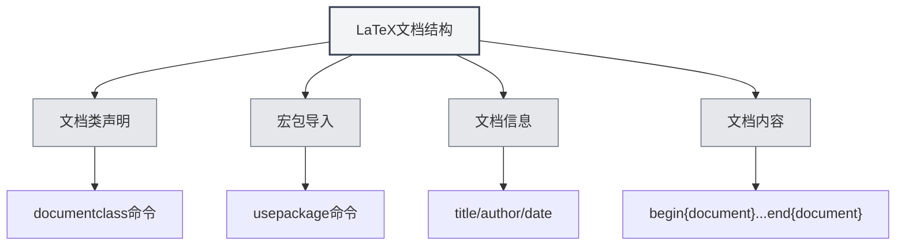

# Sintaxe LaTeX

## Visão Geral

LaTeX é um sistema de composição tipográfica baseado em TeX, amplamente utilizado para a redação de artigos acadêmicos e documentos técnicos. O MetaDoc oferece suporte completo para edição, compilação e visualização de LaTeX.

<LaTeXEditorDemo mode="demo" />

<PdfPreviewPanel mode="demo" />

<LaTeXCompilerPanel mode="demo" />

<LaTeXConsole mode="demo" />

## Sintaxe Básica

### Estrutura do Documento

A estrutura básica de um documento LaTeX:

```latex
\documentclass{article}
\usepackage[utf8]{inputenc}

\title{文档标题}
\author{作者}
\date{\today}

\begin{document}
\maketitle

\section{章节标题}
内容...

\end{document}
```



### Fórmulas Matemáticas

**Fórmula em linha**:

```latex
这是行内公式：$E = mc^2$
```

**Fórmula em bloco**:

```latex
\begin{equation}
\int_{-\infty}^{\infty} e^{-x^2} dx = \sqrt{\pi}
\end{equation}
```

**Fórmula multilinha**:

```latex
\begin{align}
x &= a + b \\
y &= c + d
\end{align}
```

### Tabelas

Use o ambiente `tabular`:

```latex
\begin{tabular}{|c|c|c|}
\hline
列1 & 列2 & 列3 \\
\hline
数据1 & 数据2 & 数据3 \\
\hline
\end{tabular}
```

### Inserção de Imagens

Use o ambiente `figure`:

```latex
\begin{figure}[h]
\centering
\includegraphics[width=0.8\textwidth]{image.png}
\caption{图片标题}
\label{fig:example}
\end{figure}
```

### Referências Bibliográficas

Use `BibTeX` ou `natbib`:

```latex
\bibliographystyle{plain}
\bibliography{references}
```

## Compilação e Visualização

Documentos LaTeX precisam ser compilados para gerar PDF. Consulte [[latex.compilation|Compilação e Visualização LaTeX]] para mais detalhes.

Após a compilação, você pode visualizar o resultado na [[latex.pdf-preview|Funcionalidade de Visualização PDF]].

## Documentação Relacionada

- [[latex.editor|Guia de Uso do Editor LaTeX]]
- [[latex.compilation|Compilação e Visualização LaTeX]]
- [[latex.pdf-preview|Funcionalidade de Visualização PDF]]
- [[latex.console|Saída do Console]]
