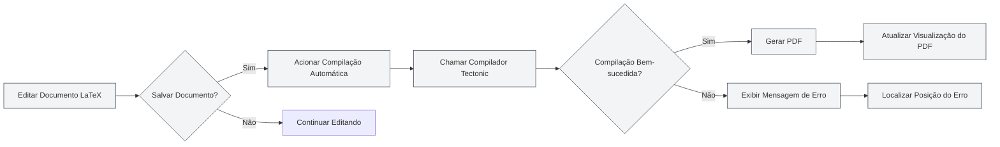
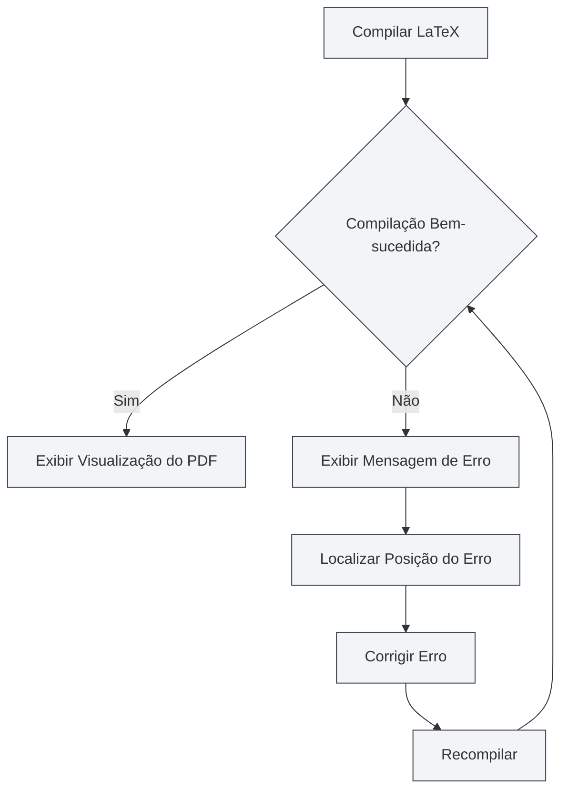

# Compilação e Visualização LaTeX

## Visão Geral

Documentos LaTeX precisam ser compilados para gerar PDF. O MetaDoc utiliza o compilador Tectonic, oferecendo suporte a compilação automática, visualização em tempo real, localização de erros e outras funcionalidades, permitindo que você escreva e depure documentos LaTeX com eficiência.

O processo de compilação baixa automaticamente os pacotes necessários, sem necessidade de configuração manual, simplificando bastante o fluxo de uso do LaTeX.

## Compilar Documentos LaTeX

<LaTeXCompilerPanel mode="demo" />

### Compilação Automática

O MetaDoc suporta compilação automática:

- **Compilar ao Salvar**: A compilação é acionada automaticamente ao salvar o documento LaTeX
- **Compilação Manual**: Clique no botão "Compilar" na barra de ferramentas para acionar a compilação manualmente
- **Status da Compilação**: O progresso e o status são exibidos durante o processo de compilação

### Processo de Compilação

<LaTeXConsole mode="demo" />

O processo de compilação inclui as seguintes etapas:

1.  **Preparar Ambiente de Compilação**: Verificar se o compilador Tectonic está disponível
2.  **Baixar Pacotes**: Baixar automaticamente os pacotes LaTeX usados no documento
3.  **Executar Compilação**: Executar o compilador Tectonic para gerar o PDF
4.  **Processar Saída**: Processar o log de compilação e as mensagens de erro
5.  **Atualizar Visualização**: Se a compilação for bem-sucedida, atualizar a visualização do PDF

### Opções de Compilação

<LaTeXEditorDemo mode="demo" />

A compilação suporta as seguintes opções:

- **Compilador**: Usar o compilador Tectonic (padrão)
- **Modo de Compilação**: Modo não interativo, para ao encontrar erros
- **Diretório de Saída**: O arquivo PDF é salvo no mesmo diretório do documento

### Tempo de Compilação

<ConsoleTerminal mode="demo" consoleKey="demo" :history='[{"content": "Tectonic编译器启动...", "type": "out"}, {"content": "解析文档结构", "type": "out"}]' />

O tempo de compilação depende de:

- **Tamanho do Documento**: Quanto maior o documento, maior o tempo de compilação
- **Quantidade de Pacotes**: Quanto mais pacotes forem usados, maior será o tempo da primeira compilação (necessidade de download)
- **Quantidade de Imagens**: Quanto mais imagens incluídas, maior o tempo de compilação

A primeira compilação pode levar mais tempo, pois é necessário baixar os pacotes. As compilações subsequentes serão mais rápidas.

## Visualização do PDF

<PdfPreviewPanel mode="demo" pdfUrl="" />

### Atualização Automática

A visualização do PDF é atualizada automaticamente após uma compilação bem-sucedida:

- **Visualização em Tempo Real**: Exibe a visualização do PDF imediatamente após a compilação bem-sucedida
- **Atualização Automática**: Atualiza automaticamente a visualização quando o conteúdo do PDF muda
- **Rolagem Sincronizada**: Suporte à localização sincronizada entre PDF e código

### Funcionalidades da Visualização

<LaTeXCompilerPanel mode="demo" />

O painel de visualização do PDF oferece as seguintes funcionalidades:

- **Navegação de Páginas**: Página anterior, próxima página, pular para uma página específica
- **Controle de Zoom**: Ampliar, reduzir, redefinir zoom
- **Atualizar Visualização**: Atualizar manualmente a visualização do PDF
- **Localizar no Código**: Ir do local no PDF para o código LaTeX correspondente

Consulte [[latex.pdf-preview|Funcionalidades de Visualização de PDF]].

A interface do painel de visualização do PDF é a seguinte:

<PdfPreviewPanel mode="demo" pdfUrl="" />

## Saída do Console

<LaTeXConsole mode="demo" />

### Log de Compilação

Os logs do processo de compilação são exibidos no painel de saída do console:

- **Saída Padrão**: Saída normal do processo de compilação
- **Mensagens de Erro**: Erros e avisos de compilação
- **Atualização em Tempo Real**: Os logs são atualizados em tempo real durante a compilação

A interface do painel de saída do console é a seguinte:

<ConsoleTerminal mode="demo" consoleKey="demo" :history='[{"content": "编译开始...", "type": "out"}, {"content": "正在下载宏包: amsmath", "type": "out"}, {"content": "警告: 未定义的引用", "type": "warn"}, {"content": "编译完成", "type": "out"}]' />

### Mensagens de Erro

<ConsoleTerminal mode="demo" consoleKey="demo" :history='[{"content": "错误: 未定义的命令", "type": "error"}, {"content": "警告: 超文本引用未找到", "type": "warn"}]' />

Os erros de compilação são exibidos em cores diferentes:

- **Erro**: Exibido em vermelho, indica falha na compilação
- **Aviso**: Exibido em amarelo, indica possíveis problemas
- **Informação**: Exibido em cinza, indica informações gerais

### Localização de Erros

Os erros de compilação exibem:

- **Local do Erro**: Mostra o número da linha e coluna onde o erro ocorreu
- **Tipo de Erro**: Mostra o tipo e a descrição do erro
- **Salto Rápido**: Clicar na mensagem de erro salta para a posição correspondente no código

Consulte [[latex.console|Saída do Console]].

## Localizar no PDF

<LaTeXEditorDemo mode="demo" />

### Do Código para o PDF

No editor LaTeX, você pode:

1.  **Selecionar Código**: Selecione o código LaTeX
2.  **Menu de Contexto**: Clique com o botão direito e escolha "Localizar no PDF"
3.  **Salto na Visualização**: A visualização do PDF salta automaticamente para a posição correspondente

### Do PDF para o Código

Na visualização do PDF, você pode:

1.  **Clicar no Local do PDF**: Clique em uma posição no PDF
2.  **Salto Automático**: O editor salta automaticamente para a posição correspondente no código LaTeX

Esta funcionalidade permite alternar rapidamente entre o PDF e o código, facilitando a depuração e edição.

## Tratamento de Erros de Compilação

<LaTeXConsole mode="demo" />

### Tipos Comuns de Erros

A compilação LaTeX pode encontrar os seguintes erros:

- **Erro de Sintaxe**: Sintaxe LaTeX incorreta
- **Pacote Ausente**: Uso de pacote não instalado (o Tectonic baixa automaticamente)
- **Arquivo Ausente**: Arquivo referenciado não existe
- **Erro de Codificação**: Codificação de arquivo incorreta

### Fluxo de Tratamento de Erros

### Técnicas de Depuração

1.  **Verificar Console**: Examine cuidadosamente as mensagens de erro na saída do console
2.  **Localizar Erro**: Use a funcionalidade de localização de erros para encontrar rapidamente o código problemático
3.  **Corrigir Progressivamente**: Comece pelo primeiro erro e corrija um por um
4.  **Verificar Sintaxe**: Certifique-se de que a sintaxe LaTeX está correta
5.  **Verificar Arquivos**: Certifique-se de que os arquivos referenciados existem e os caminhos estão corretos

## Compilador Tectonic

<LaTeXCompilerPanel mode="demo" />

### Introdução ao Compilador

O MetaDoc usa o compilador Tectonic, que possui as seguintes características:

- **Sem Instalação de Distribuição TeX**: O Tectonic é um binário independente
- **Download Automático de Pacotes**: Baixa automaticamente os pacotes necessários do CTAN durante a compilação
- **Compilação Rápida**: Mais rápido em comparação com distribuições TeX tradicionais
- **Suporte Multiplataforma**: Suporte completo para Windows, macOS e Linux

### Gerenciamento de Pacotes

O Tectonic gerencia automaticamente os pacotes LaTeX:

- **Download Automático**: Baixados automaticamente no primeiro uso
- **Gerenciamento de Cache**: Os pacotes baixados são armazenados em cache, tornando compilações subsequentes mais rápidas
- **Gerenciamento de Versões**: Gerencia automaticamente as versões dos pacotes

Você não precisa baixar ou configurar manualmente nenhum pacote, basta usar o comando `\usepackage{}` no documento.

## Dicas de Uso

<LaTeXEditorDemo mode="demo" />

### Aumentar a Velocidade de Compilação

1.  **Reduzir Imagens**: Diminuir a quantidade de imagens no documento
2.  **Otimizar Código**: Otimizar a estrutura do código LaTeX
3.  **Usar Cache**: Aproveitar o cache de pacotes do Tectonic

### Depurar Erros de Compilação

1.  **Verificar Log Completo**: Verificar o log completo de compilação no console
2.  **Verificar Sintaxe**: Verificar cuidadosamente a sintaxe LaTeX
3.  **Compilar Progressivamente**: Comentar partes do código para localizar o problema gradualmente
4.  **Consultar Documentação**: Consultar a documentação dos pacotes LaTeX

### Otimizar o Fluxo de Compilação

1.  **Compilar ao Salvar**: Habilitar a compilação automática ao salvar
2.  **Usar Visualização**: Usar a visualização do PDF para ver rapidamente o resultado
3.  **Usar Funcionalidade de Localização**: Usar a funcionalidade de localização para alternar rapidamente entre código e PDF

## Perguntas Frequentes

### P: O que fazer se a compilação falhar?

R: Verifique as mensagens de erro na saída do console e corrija o código conforme as dicas de erro. Problemas comuns incluem erros de sintaxe, arquivos ausentes, etc.

### P: O tempo de compilação está muito longo?

R: A primeira compilação precisa baixar pacotes, então um tempo mais longo é normal. As compilações subsequentes serão mais rápidas. Se continuar lento, verifique o tamanho do documento e a quantidade de imagens.

### P: O download do pacote falhou?

R: Verifique a conexão de rede para garantir acesso ao CTAN. O Tectonic tentará baixar novamente automaticamente.

### P: A visualização do PDF não está atualizando?

R: Clique no botão "Atualizar" para atualizar manualmente a visualização, ou verifique se a compilação foi bem-sucedida.

### P: Como visualizar o log de compilação?

R: O log de compilação é exibido no painel de saída do console, onde você pode ver a saída padrão, mensagens de erro e avisos.

## Documentação Relacionada

- [[latex.editor|Guia de Uso do Editor LaTeX]]
- [[latex.basics|Sintaxe LaTeX]]
- [[latex.pdf-preview|Funcionalidades de Visualização de PDF]]
- [[latex.console|Saída do Console]]

<LaTeXCompilerPanel mode="demo" />

<LaTeXEditorDemo mode="demo" />
