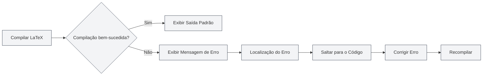

# Saída do Console

## Visão Geral

O painel de saída do console exibe informações de log do processo de compilação LaTeX, incluindo saída padrão, mensagens de erro, avisos, entre outros. Ao visualizar a saída do console, você pode entender o processo de compilação, localizar erros e depurar problemas.

A saída do console utiliza o editor Monaco para exibição, oferecendo suporte a realce de sintaxe, localização de erros, filtragem de logs e outras funcionalidades, permitindo que você visualize e analise os logs de compilação de forma eficiente.

## Saída da Compilação LaTeX

<LaTeXConsole mode="demo" />

### Saída Padrão

A saída padrão do processo de compilação é exibida no console:

- **Progresso da Compilação**: Exibe os diversos estágios da compilação.
- **Download de Pacotes**: Exibe informações sobre pacotes baixados.
- **Informações da Compilação**: Exibe detalhes do processo de compilação.

A saída padrão é exibida como texto comum, ajudando você a entender o processo de compilação.

A interface do painel de saída do console é a seguinte:

<ConsoleTerminal mode="demo" consoleKey="demo" :history='[{"content": "Compilação iniciada...", "type": "out"}, {"content": "Aviso: referência indefinida", "type": "warn"}, {"content": "Compilação concluída", "type": "out"}]' />

### Formato da Saída

<ConsoleTerminal mode="demo" consoleKey="demo" :history='[{"content": "Informação de saída padrão", "type": "out"}, {"content": "Mensagem de aviso", "type": "warn"}, {"content": "Mensagem de erro", "type": "error"}]' />

A saída do console utiliza cores diferentes para distinguir os tipos de informação:

- **Saída Padrão**: Texto cinza, exibe informações normais da compilação.
- **Mensagens de Erro**: Texto vermelho, exibe erros de compilação.
- **Mensagens de Aviso**: Texto amarelo, exibe avisos de compilação.
- **Informações de Depuração**: Texto cinza escuro, exibe informações de depuração.

## Exibição de Mensagens de Erro

<LaTeXConsole mode="demo" />

### Formato do Erro

Os erros de compilação são exibidos em um formato específico:

- **Local do Erro**: Exibe o nome do arquivo, número da linha e coluna onde o erro ocorreu.
- **Tipo do Erro**: Exibe o tipo de erro (ex: erro de sintaxe, arquivo ausente, etc.).
- **Descrição do Erro**: Exibe uma descrição detalhada do erro.

### Localização de Erros

A saída do console oferece suporte à funcionalidade de localização de erros:

- **Clicar no Erro**: Clicar na mensagem de erro salta para a posição correspondente no código.
- **Realce**: A linha de código correspondente ao erro é destacada.
- **Correção Rápida**: Localiza rapidamente a posição do erro, facilitando a correção.

### Tipos Comuns de Erro

A compilação LaTeX pode encontrar os seguintes erros:

- **Erro de Sintaxe**: Sintaxe LaTeX incorreta.
- **Comando Indefinido**: Uso de um comando LaTeX não definido.
- **Ambiente Não Fechado**: Ambiente não fechado corretamente.
- **Arquivo Ausente**: Arquivo referenciado não existe.
- **Erro de Pacote**: Falha ao carregar pacote ou conflito.

## Exibição de Mensagens de Aviso

<ConsoleTerminal mode="demo" consoleKey="demo" :history='[{"content": "Aviso: referência indefinida", "type": "warn"}]' />

### Formato do Aviso

Os avisos de compilação são exibidos em um formato específico:

- **Local do Aviso**: Exibe a localização onde o aviso ocorreu.
- **Tipo do Aviso**: Exibe o tipo de aviso.
- **Descrição do Aviso**: Exibe uma descrição detalhada do aviso.

### Tratamento de Avisos

As mensagens de aviso geralmente não impedem a compilação, mas podem afetar o resultado final:

- **Verificar Avisos**: Examine cuidadosamente as mensagens de aviso para entender possíveis problemas.
- **Corrigir Avisos**: Corrija o código com base nas informações do aviso.
- **Ignorar Avisos**: Se o aviso não afetar o resultado, pode ser ignorado temporariamente.

## Filtragem de Logs

<LaTeXConsole mode="demo" />

### Funcionalidade de Filtro

A saída do console oferece suporte à filtragem de logs:

- **Filtrar por Tipo**: Exibir apenas erros, avisos ou saída padrão.
- **Filtrar por Palavra-chave**: Filtrar logs que contenham palavras-chave específicas.
- **Filtrar por Tempo**: Filtrar logs de um período de tempo específico.

### Configuração do Filtro

A filtragem de logs pode ser configurada no painel do console:

1.  Abra o painel de saída do console.
2.  Use as opções de filtro para selecionar o conteúdo a ser exibido.
3.  Insira palavras-chave para realizar filtragem por busca.

### Limpar Logs

Limpar a saída do console:

- **Botão Limpar**: Clique no botão "Limpar" do console.
- **Atalho de Teclado**: `Ctrl+L` (se configurado).

Limpar os logs excluirá todas as informações de log exibidas.

## Operações com Logs

<ConsoleTerminal mode="demo" consoleKey="demo" :history='[{"content": "Conteúdo do log de compilação...", "type": "out"}]' />

### Copiar Logs

Copiar a saída do console para a área de transferência:

- **Botão Copiar**: Clique no botão "Copiar" do console.
- **Atalho de Teclado**: `Ctrl+C` (após selecionar o texto).

Copiar logs permite salvá-los em outro local ou compartilhá-los com outras pessoas.

### Salvar Logs

Salvar a saída do console em um arquivo:

- **Botão Salvar**: Clique no botão "Salvar Log" do console.
- **Seleção de Arquivo**: Escolha o local e o nome do arquivo para salvar.

O arquivo de log salvo pode ser usado para análise posterior ou relato de problemas.

### Análise por IA

A saída do console oferece suporte à funcionalidade de análise por IA:

- **Ativar Análise por IA**: Ative o interruptor de análise por IA no painel do console.
- **Análise Automática**: A IA analisará automaticamente as mensagens de erro e fornecerá sugestões de correção.
- **Ver Sugestões**: Veja as sugestões de correção de erros fornecidas pela IA.

A funcionalidade de análise por IA pode ajudá-lo a entender e corrigir erros de compilação rapidamente.

## Configurações do Console

<LaTeXConsole mode="demo" />

### Opções de Exibição

A saída do console oferece suporte às seguintes opções de exibição:

- **Exibir Números de Linha**: Exibe o número da linha dos logs.
- **Quebra Automática de Linha**: Quebra automaticamente linhas longas para exibição.
- **Tamanho da Fonte**: Ajusta o tamanho da fonte usada para exibir os logs.

### Configuração de Tema

A saída do console segue o tema do editor:

- **Tema Claro**: Usa um fundo claro quando o tema claro está ativo.
- **Tema Escuro**: Usa um fundo escuro quando o tema escuro está ativo.
- **Sincronização Automática**: Sincroniza automaticamente com as configurações de tema do editor.

## Dicas de Uso

<ConsoleTerminal mode="demo" consoleKey="demo" :history='[{"content": "Localizando a posição do erro...", "type": "out"}]' />

### Localização Rápida de Erros

1.  **Verifique a Mensagem de Erro**: Examine cuidadosamente o formato e o conteúdo da mensagem de erro.
2.  **Use a Funcionalidade de Localização**: Clique na mensagem de erro para saltar rapidamente para a posição no código.
3.  **Verifique o Contexto**: Analise o código ao redor da posição do erro.

### Entendendo os Logs de Compilação

1.  **Leia a Saída Padrão**: Entenda os diferentes estágios do processo de compilação.
2.  **Foque nas Mensagens de Erro**: Priorize a correção das mensagens de erro.
3.  **Verifique as Mensagens de Aviso**: Analise as mensagens de aviso para entender possíveis problemas.

### Técnicas de Depuração

1.  **Compilação Passo a Passo**: Comente partes do código para localizar o problema gradualmente.
2.  **Veja o Log Completo**: Analise o log de compilação completo para entender o processo.
3.  **Use a Análise por IA**: Ative a funcionalidade de análise por IA para obter sugestões de correção.

## Perguntas Frequentes

<LaTeXConsole mode="demo" />

### P: A saída do console não está aparecendo?

R: Certifique-se de que o painel de saída do console está aberto. Ele é aberto automaticamente ao compilar um documento LaTeX.

### P: Como encontrar erros rapidamente?

R: As mensagens de erro são exibidas em vermelho. Clicar em uma mensagem de erro salta rapidamente para a posição no código.

### P: E se houver muitos logs?

R: Use a funcionalidade de filtro para remover logs desnecessários, ou use a função de limpar para apagar logs antigos.

### P: Como salvar o log de compilação?

R: Clique no botão "Salvar Log" do console e escolha o local para salvar o arquivo de log.

### P: A análise por IA não está precisa?

R: A análise por IA é apenas para referência. Recomenda-se considerar também a mensagem de erro e o contexto do código. Você pode corrigir manualmente ou solicitar uma nova análise.

## Documentação Relacionada

- [[latex.compilation|Compilação e Visualização LaTeX]]
- [[latex.editor|Guia de Uso do Editor LaTeX]]
- [[latex.pdf-preview|Funcionalidade de Visualização PDF]]

<PdfPreviewPanel mode="demo" pdfUrl="" />

<LaTeXCompilerPanel mode="demo" />

<LaTeXEditorDemo mode="demo" />