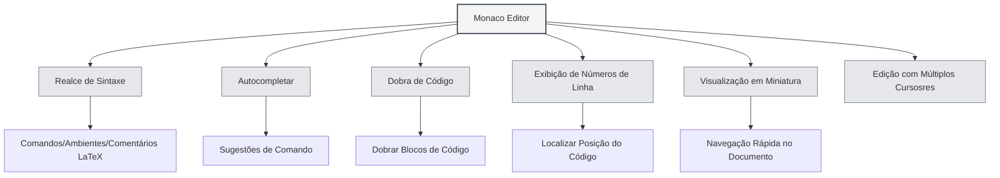

# Guia de Uso do Editor LaTeX

## Visão Geral

O editor LaTeX do MetaDoc é baseado no Monaco Editor, oferecendo uma experiência profissional de edição de código LaTeX. O editor suporta realce de sintaxe, autocompletar, dobra de código e outras funcionalidades para ajudá-lo a escrever documentos LaTeX com eficiência.

O Monaco Editor é o núcleo do editor utilizado pelo Visual Studio Code, possuindo capacidades robustas de edição de código e um rico conjunto de características.

<PdfPreviewPanel mode="demo" pdfUrl="" />

<ConsoleTerminal mode="demo" consoleKey="demo" :history='[{"content": "Compilação concluída", "type": "out"}]' />

<LaTeXEditor mode="demo" />

## Introdução ao Monaco Editor

O Monaco Editor fornece as seguintes características para a edição LaTeX:

- **Realce de Sintaxe**: Comandos LaTeX, ambientes, comentários e outros elementos de sintaxe são exibidos em cores diferentes
- **Autocompletar**: Sugestões de autocompletar são exibidas automaticamente ao digitar comandos LaTeX
- **Dobra de Código**: Suporte para dobrar blocos de código, facilitando a navegação em documentos longos
- **Exibição de Números de Linha**: Exibe números de linha para facilitar a localização do código
- **Visualização em Miniatura (Minimap)**: Exibe uma miniatura do código à direita para navegação rápida da estrutura do documento
- **Edição com Múltiplos Cursosres**: Suporte para edição simultânea com múltiplos cursores

<LaTeXEditorDemo mode="demo" />

## Realce de Código e Dicas de Sintaxe

### Realce de Sintaxe

O editor LaTeX identifica e realça automaticamente:

- **Comandos**: Comandos LaTeX como `\documentclass`, `\usepackage`
- **Ambientes**: Marcadores de ambiente como `\begin{document}`, `\end{document}`
- **Comentários**: Linhas de comentário que começam com `%`
- **Fórmulas Matemáticas**: Regiões de fórmulas matemáticas envolvidas por `$`, `$$`
- **Caracteres Especiais**: Caracteres especiais como `&`, `#`, `$`

O realce de sintaxe torna a estrutura do código mais clara, facilitando a leitura e edição.

### Dicas de Sintaxe

O editor exibirá dicas de sintaxe nas seguintes situações:

- **Ao Digitar um Comando**: Exibe automaticamente comandos LaTeX disponíveis após digitar `\`
- **Ao Digitar um Ambiente**: Exibe nomes de ambiente disponíveis após digitar `\begin{`
- **Ao Digitar um Nome de Pacote**: Exibe nomes de pacotes comuns após digitar `\usepackage{`

As dicas de sintaxe ajudam você a inserir comandos LaTeX corretos rapidamente, reduzindo erros de digitação.

<LaTeXEditor mode="demo" />

## Exibição de Números de Linha

### Exibir Números de Linha

Os números de linha são exibidos à esquerda do editor, ajudando você a:

- **Localizar Código**: Localizar rapidamente uma linha específica
- **Encontrar Erros**: Erros de compilação mostram o número da linha, facilitando a localização do problema
- **Referenciar Código**: Facilitar a referência a linhas de código específicas no documento

### Configurar Números de Linha

A exibição de números de linha pode ser configurada nas configurações:

1.  Abra a página de configurações
2.  Encontre a opção "Exibir números de linha"
3.  Alterne a chave para ativar ou desativar os números de linha

A configuração de números de linha afeta todos os editores Monaco (editor LaTeX, editor de texto puro, etc.).

<LaTeXEditorDemo mode="demo" />

## Visualização em Miniatura (Minimap)

### Funcionalidade do Minimap

O Minimap é a miniatura do código exibida à direita do editor:

- **Navegação Rápida**: Você pode ver a estrutura de todo o documento no minimap
- **Localização Rápida**: Clique no minimap para saltar rapidamente para a posição correspondente
- **Pré-visualização da Estrutura**: Compreenda as diferentes partes do documento através das diferenças de cor

### Exibir/Ocultar o Minimap

O minimap pode ser controlado das seguintes formas:

1.  Clique com o botão direito no editor
2.  Procure a opção "Minimap" ou "Minimap"
3.  Alterne o estado de exibição

O minimap é especialmente útil para editar documentos longos, ajudando você a compreender rapidamente a estrutura do documento.

## Dobra de Código

### Funcionalidade de Dobra

A dobra de código permite dobrar blocos de código, ocultando partes que não precisam ser visualizadas:

- **Dobrar Ambientes**: Dobrar blocos de ambiente `\begin{...}...\end{...}`
- **Dobrar Funções**: Dobrar definições de comandos personalizados
- **Dobrar Comentários**: Dobrar grandes seções de comentários

### Usar a Dobra

- **Dobrar**: Clique no ícone de dobra à esquerda do número da linha, ou use o atalho `Ctrl+Shift+[`
- **Expandir**: Clique no marcador de dobra, ou use o atalho `Ctrl+Shift+]`
- **Dobrar Tudo**: Use o atalho `Ctrl+K Ctrl+0` para dobrar todos os blocos de código
- **Expandir Tudo**: Use o atalho `Ctrl+K Ctrl+J` para expandir todos os blocos de código

A dobra de código permite que você se concentre na parte que está editando no momento, aumentando a eficiência da edição.

<LaTeXEditorDemo mode="demo" />

## Autocompletar

### Acionamento do Autocompletar

O editor exibirá automaticamente sugestões de autocompletar nas seguintes situações:

- **Ao Digitar um Comando**: Exibe uma lista de comandos LaTeX após digitar `\`
- **Ao Digitar um Ambiente**: Exibe nomes de ambiente após digitar `\begin{`
- **Ao Digitar um Nome de Pacote**: Exibe nomes de pacotes comuns após digitar `\usepackage{`
- **Outros Caracteres**: Também pode exibir sugestões relacionadas após digitar outros caracteres

### Aceitar Autocompletar

- **Tecla Enter**: Aceita a sugestão de autocompletar atualmente selecionada
- **Tecla Tab**: Aceita a sugestão de autocompletar atualmente selecionada
- **Teclas de Direção**: Move a seleção para cima/baixo na lista de autocompletar
- **Tecla Esc**: Cancela as sugestões de autocompletar

### Configuração do Autocompletar

A funcionalidade de autocompletar pode ser configurada nas configurações do editor:

- **Sugestões Rápidas**: Exibir automaticamente sugestões de autocompletar após outros caracteres
- **Caracteres de Acionamento**: Exibir automaticamente autocompletar após caracteres específicos (como `\`)
- **Caracteres de Aceitação**: Aceitar automaticamente o autocompletar ao digitar caracteres de confirmação

<LaTeXEditor mode="demo" />

## Funcionalidades de Edição

### Edição com Múltiplos Cursosres

O Monaco Editor suporta edição simultânea com múltiplos cursores:

- **Alt+Clique**: Adiciona um novo cursor na posição clicada
- **Ctrl+Alt+Seta para Cima/Baixo**: Adiciona um cursor acima/abaixo
- **Ctrl+D**: Seleciona a próxima palavra idêntica e adiciona um cursor
- **Ctrl+Shift+L**: Seleciona todas as palavras idênticas e adiciona cursores

A edição com múltiplos cursores permite modificar várias posições simultaneamente, aumentando a eficiência da edição.

### Seleção em Coluna

Suporta o modo de seleção em coluna:

- **Alt+Shift+Arrastar**: Seleciona uma região retangular
- **Alt+Shift+Teclas de Direção**: Expande a seleção em coluna

A seleção em coluna é adequada para editar tabelas ou código alinhado.

### Formatação de Código

O editor suporta formatação básica de código:

- **Recuo Automático**: Recua automaticamente com base na estrutura do código
- **Quebra de Linha Automática**: Quebra automaticamente linhas longas para exibição
- **Método de Recuo**: Suporta diferentes métodos de recuo (espaços, Tab)

<LaTeXEditorDemo mode="demo" />

## Localizar e Substituir

### Funcionalidade Localizar

- **Atalho**: `Ctrl+F` abre a caixa de diálogo Localizar
- **Realce**: Os resultados da busca são realçados no documento
- **Busca Cíclica**: Ao chegar ao final do documento, recomeça automaticamente do início

### Funcionalidade Substituir

- **Atalho**: `Ctrl+H` abre a caixa de diálogo Localizar e Substituir
- **Substituir Individualmente**: Substitui o texto correspondente um por um
- **Substituir Tudo**: Substitui todo o texto correspondente de uma vez

### Opções Avançadas

Localizar e Substituir suporta as seguintes opções:

- **Diferenciar Maiúsculas/Minúsculas**: Corresponde apenas ao texto com exatamente o mesmo caso
- **Correspondência de Palavra Inteira**: Corresponde apenas a palavras completas
- **Expressão Regular**: Usa expressões regulares para correspondência de padrões

<LaTeXEditorDemo mode="demo" />

## Referência de Atalhos

### Atalhos de Edição

| Operação | Windows/Linux | macOS   |
| -------- | ------------- | ------- |
| Desfazer | `Ctrl+Z`      | `Cmd+Z` |
| Refazer  | `Ctrl+Y`      | `Cmd+Y` |
| Copiar   | `Ctrl+C`      | `Cmd+C` |
| Colar    | `Ctrl+V`      | `Cmd+V` |
| Selecionar Tudo | `Ctrl+A` | `Cmd+A` |
| Localizar | `Ctrl+F`     | `Cmd+F` |
| Substituir | `Ctrl+H`    | `Cmd+H` |

### Atalhos de Dobra de Código

| Operação     | Windows/Linux   | macOS          |
| ------------ | --------------- | -------------- |
| Dobrar       | `Ctrl+Shift+[`  | `Cmd+Option+[` |
| Expandir     | `Ctrl+Shift+]`  | `Cmd+Option+]` |
| Dobrar Tudo  | `Ctrl+K Ctrl+0` | `Cmd+K Cmd+0`  |
| Expandir Tudo | `Ctrl+K Ctrl+J` | `Cmd+K Cmd+J`  |

### Atalhos de Múltiplos Cursosres

| Operação                 | Windows/Linux  | macOS          |
| ------------------------ | -------------- | -------------- |
| Adicionar Cursor         | `Alt+Clique`   | `Option+Clique`|
| Adicionar Cursor Acima   | `Ctrl+Alt+↑`   | `Cmd+Option+↑` |
| Adicionar Cursor Abaixo  | `Ctrl+Alt+↓`   | `Cmd+Option+↓` |
| Selecionar Próxima Palavra Idêntica | `Ctrl+D` | `Cmd+D` |
| Selecionar Todas as Palavras Idênticas | `Ctrl+Shift+L` | `Cmd+Shift+L` |

<LaTeXEditor mode="demo" />

## Dicas de Uso

### Digitação Rápida

1.  **Autocompletar Comando**: Digite `\`, use as teclas de direção para selecionar o comando, pressione Enter para aceitar
2.  **Autocompletar Ambiente**: Digite `\begin{`, selecione o nome do ambiente, o editor completará automaticamente `\end{...}`
3.  **Autocompletar Nome de Pacote**: Digite `\usepackage{`, selecione o nome do pacote para adicionar rapidamente um pacote

<LaTeXEditor mode="demo" />

### Organização de Código

1.  **Usar Dobra**: Dobre blocos de código que não precisam ser visualizados, mantendo a área de edição organizada
2.  **Usar Comentários**: Adicione comentários explicando a funcionalidade do código, facilitando a manutenção futura
3.  **Recuo Adequado**: Mantenha o recuo do código consistente para melhorar a legibilidade

<LaTeXEditorDemo mode="demo" />

### Localização de Erros

1.  **Verificar Número da Linha**: Erros de compilação mostram o número da linha, localize rapidamente no editor
2.  **Usar Localizar**: Use a funcionalidade Localizar para encontrar rapidamente um comando ou texto específico
3.  **Usar o Minimap**: Navegue rapidamente pela estrutura do documento no minimap

## Perguntas Frequentes

### P: O autocompletar não está aparecendo?

R: Verifique se a opção "Sugestões Rápidas" nas configurações do editor está ativada. Sugestões de autocompletar devem aparecer automaticamente após digitar `\`.

### P: Como dobrar código?

R: Clique no ícone de dobra à esquerda do número da linha, ou use o atalho `Ctrl+Shift+[`. Blocos de ambiente dobrados mostrarão um marcador de dobra à esquerda do número da linha.

### P: O minimap não está aparecendo?

R: Verifique se a opção "Minimap" nas configurações do editor está ativada. O minimap é exibido à direita do editor.

### P: Como saltar rapidamente para uma linha específica?

R: Use o atalho `Ctrl+G` (Windows/Linux) ou `Cmd+G` (macOS) para abrir a caixa de diálogo "Ir para linha", digite o número da linha para saltar.

### P: A formatação do código está incorreta?

R: O Monaco Editor recua automaticamente com base na sintaxe LaTeX. Se o recuo estiver incorreto, você pode ajustar manualmente ou usar a tecla Tab.

## Documentação Relacionada

- [[latex.basics|Sintaxe LaTeX]]
- [[latex.compilation|Compilação e Visualização LaTeX]]
- [[latex.pdf-preview|Funcionalidade de Visualização PDF]]
- [[latex.console|Saída do Console]]
- [[core.editor-basics|Operações Básicas do Editor]]
- [[core.editor-settings|Configurações do Editor]]
