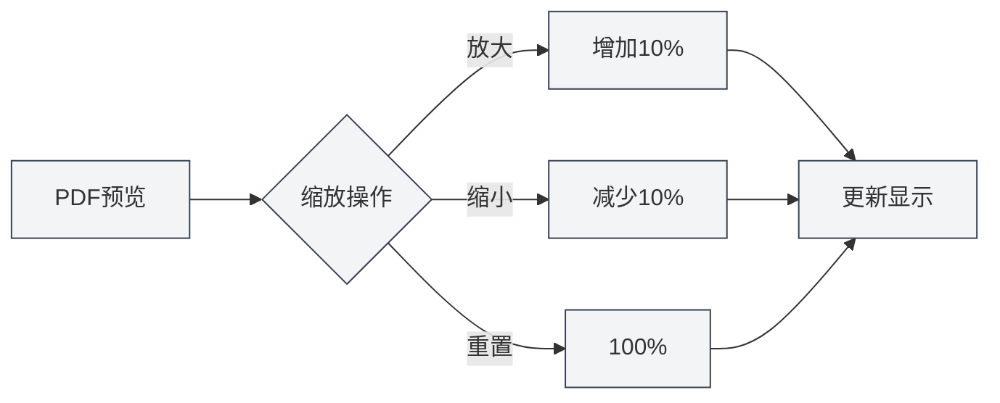

# Funcionalidade de Visualização de PDF

## Visão Geral

A funcionalidade de visualização de PDF permite que você visualize em tempo real o efeito do PDF compilado enquanto edita documentos LaTeX. O painel de visualização oferece ricas funcionalidades interativas, incluindo zoom, navegação de páginas, localização, entre outras, permitindo que você edite e depure documentos LaTeX com eficiência.

A visualização do PDF é exibida automaticamente após a compilação bem-sucedida do LaTeX e suporta localização bidirecional com o editor de código, facilitando a alternância rápida entre o PDF e o código.

<PdfPreviewPanel mode="demo" pdfUrl="" />

## Introdução à Visualização de PDF

### Painel de Visualização

O painel de visualização de PDF é exibido à direita ou abaixo do editor LaTeX e contém:

- **Área de Conteúdo do PDF**: Exibe o conteúdo das páginas do PDF
- **Barra de Ferramentas**: Fornece botões para operações como zoom, navegação de páginas, atualização, etc.
- **Informações da Página**: Exibe o número da página atual e o total de páginas

A interface do painel de visualização de PDF é a seguinte:

<PdfPreviewPanel mode="demo" pdfUrl="" />

<LaTeXCompilerPanel mode="demo" />

### Exibição Automática

A visualização do PDF é exibida automaticamente nas seguintes situações:

- **Compilação Bem-sucedida**: Exibe automaticamente a visualização do PDF após uma compilação LaTeX bem-sucedida
- **Abertura de Documento**: Exibe automaticamente a visualização ao abrir um documento LaTeX que já possui um PDF
- **Abertura Manual**: Clique no botão "Visualizar" na barra de ferramentas para abrir a visualização manualmente

<PdfPreviewPanel mode="demo" pdfUrl="" />

## Zoom do PDF

### Ampliar PDF

Para ampliar a visualização do PDF:

- **Botão da Barra de Ferramentas**: Clique no botão "Ampliar" (ícone +) na barra de ferramentas
- **Roda do Mouse**: Pressione a tecla `Ctrl` e role a roda do mouse para cima
- **Atalho de Teclado**: `Ctrl+=` (se configurado)

Cada ampliação aumenta a escala de zoom em 10%.

<LaTeXEditorDemo mode="demo" />

### Reduzir PDF

Para reduzir a visualização do PDF:

- **Botão da Barra de Ferramentas**: Clique no botão "Reduzir" (ícone -) na barra de ferramentas
- **Roda do Mouse**: Pressione a tecla `Ctrl` e role a roda do mouse para baixo
- **Atalho de Teclado**: `Ctrl+-` (se configurado)

Cada redução diminui a escala de zoom em 10%.

### Redefinir Zoom

Para redefinir o zoom do PDF para 100%:

- **Botão da Barra de Ferramentas**: Clique no botão "Redefinir Zoom" na barra de ferramentas
- **Atalho de Teclado**: `Ctrl+0` (se configurado)

### Faixa de Zoom

A faixa de zoom suportada para o PDF:

- **Valor Mínimo**: 20% (0.2x)
- **Valor Máximo**: 500% (5x)
- **Valor Padrão**: 100% (1x)

A escala de zoom é automaticamente limitada à faixa válida.

<PdfPreviewPanel mode="demo" pdfUrl="" />

## Atualização do PDF

### Atualização Manual

Para atualizar manualmente a visualização do PDF:

- **Botão da Barra de Ferramentas**: Clique no botão "Atualizar" na barra de ferramentas
- **Atalho de Teclado**: `F5` (se configurado)

A atualização recarrega o arquivo PDF, exibindo os resultados mais recentes da compilação.

### Atualização Automática

A visualização do PDF é atualizada automaticamente nas seguintes situações:

- **Compilação Bem-sucedida**: Atualiza automaticamente a visualização após uma compilação LaTeX bem-sucedida
- **Atualização do Arquivo PDF**: Atualiza automaticamente quando detecta uma alteração no arquivo PDF

### Momento de Atualização

Recomenda-se atualizar o PDF nas seguintes situações:

- **Após Modificar o Código**: Após modificar o código LaTeX e recompilar
- **Visualização Anômala**: Quando a visualização do PDF exibe anomalias ou conteúdo incorreto
- **Edição Prolongada**: Após uma longa edição, para visualizar o efeito mais recente

<LaTeXEditorDemo mode="demo" />

## Localização do PDF para o Código

### Do PDF para o Código

Ao clicar em uma posição na visualização do PDF, o editor salta automaticamente para a posição correspondente no código LaTeX:

1. **Clique na Posição do PDF**: Clique na posição que deseja visualizar na pré-visualização do PDF
2. **Salto Automático**: O editor salta automaticamente para o código LaTeX correspondente
3. **Destaque**: A linha de código correspondente é destacada

Esta funcionalidade permite que você localize rapidamente o código-fonte a partir do efeito no PDF, facilitando a depuração e modificação.

<PdfPreviewPanel mode="demo" pdfUrl="" />

### Do Código para o PDF

No editor LaTeX, você pode:

1. **Selecionar Código**: Selecione o código LaTeX que deseja visualizar
2. **Menu de Contexto**: Clique com o botão direito e selecione "Localizar no PDF"
3. **Salto na Visualização**: A visualização do PDF salta automaticamente para a posição correspondente

### Localização Bidirecional

Funcionalidade de localização bidirecional entre o PDF e o código:

- **PDF → Código**: Clique em uma posição no PDF para saltar para o código
- **Código → PDF**: Selecione o código para saltar para a posição no PDF
- **Rolagem Sincronizada**: Suporta rolagem sincronizada entre o PDF e o código

<ConsoleTerminal mode="demo" consoleKey="demo" :history='[{"content": "PDF页面导航...", "type": "out"}]' />

## Navegação de Páginas do PDF

### Operações de Navegação

A visualização do PDF suporta as seguintes operações de navegação de páginas:

- **Página Anterior**: Clique no botão "Página Anterior" na barra de ferramentas ou use as teclas de seta
- **Próxima Página**: Clique no botão "Próxima Página" na barra de ferramentas ou use as teclas de seta
- **Ir para Página**: Digite o número da página na caixa de entrada e pressione Enter

### Informações da Página

A visualização do PDF exibe as seguintes informações da página:

- **Página Atual**: Exibe o número da página atualmente visualizada
- **Total de Páginas**: Exibe o número total de páginas do PDF
- **Caixa de Entrada de Página**: Permite inserir diretamente um número de página para navegar

### Exibição de Múltiplas Páginas

A visualização do PDF suporta o modo de exibição de múltiplas páginas:

- **Modo de Página Única**: Exibe uma página por vez
- **Modo de Múltiplas Páginas**: Exibe várias páginas de uma vez (na visualização principal)

O modo de múltiplas páginas é adequado para navegar rapidamente por todo o documento.

<PdfPreviewPanel mode="demo" pdfUrl="" />

## Salvamento do PDF

### Salvar PDF

Para salvar o arquivo PDF atual:

- **Botão da Barra de Ferramentas**: Clique no botão "Salvar" na barra de ferramentas
- **Menu**: Clique em "Arquivo" → "Salvar PDF"
- **Atalho de Teclado**: `Ctrl+S` (se o PDF for o documento ativo atual)

Salvar o PDF armazenará o arquivo PDF no mesmo diretório do documento.

### Abrir Diretório do PDF

Para abrir o diretório onde o arquivo PDF está localizado:

- **Botão da Barra de Ferramentas**: Clique no botão "Abrir Diretório" na barra de ferramentas
- **Menu**: Clique em "Arquivo" → "Abrir Diretório do PDF"

Após abrir o diretório, você pode visualizar e gerenciar o arquivo PDF no gerenciador de arquivos.

<LaTeXEditorDemo mode="demo" />

## Modos de Interação com o PDF

### Modo Ponteiro

O modo ponteiro é o modo de interação padrão:

- **Selecionar Texto**: Permite selecionar texto no PDF
- **Copiar Texto**: Permite copiar o texto selecionado
- **Clique para Localizar**: Clicar em uma posição no PDF permite localizar o código

### Modo Mão

O modo mão é usado para arrastar o PDF:

- **Arrastar PDF**: Pressione e segure o botão esquerdo do mouse para arrastar o conteúdo do PDF
- **Mover Visualização**: Move a posição da visualização do PDF
- **Adequado para PDFs Grandes**: Adequado para visualizar PDFs de grande dimensão

Alternar modos:

- **Botão da Barra de Ferramentas**: Clique no botão de alternância de modo na barra de ferramentas
- **Atalho de Teclado**: Tecla `H` para alternar para o modo mão

## Dicas de Uso

### Visualização Eficiente

1. **Use o Zoom**: Ajuste a escala de zoom apropriada de acordo com o conteúdo
2. **Use a Localização**: Use a funcionalidade de localização para alternar rapidamente entre código e PDF
3. **Use a Atualização**: Atualize oportunamente após modificar o código para visualizar o efeito

### Técnicas de Depuração

1. **Localizar Erros**: Localize do PDF para o código para encontrar rapidamente a posição do problema
2. **Comparar Efeitos**: Compare o efeito no PDF com o código para verificar se o formato está correto
3. **Navegar em Múltiplas Páginas**: Use o modo de múltiplas páginas para navegar rapidamente por todo o documento

### Otimização de Desempenho

1. **Zoom Adequado**: Não use uma escala de zoom excessivamente grande
2. **Fechar Visualização**: Feche o painel de visualização quando não necessário para economizar recursos
3. **Estratégia de Atualização**: Escolha atualização automática ou manual conforme a necessidade

## Perguntas Frequentes

### Q: A visualização do PDF não está sendo exibida?

A: Certifique-se de que o documento LaTeX foi compilado com sucesso. Se a compilação falhar, a visualização do PDF não será exibida. Verifique as mensagens de erro na saída do console.

### Q: A visualização do PDF não está atualizando?

A: Clique no botão "Atualizar" para atualizar manualmente a visualização ou recompile o documento LaTeX. Certifique-se de que o arquivo PDF foi gerado com sucesso.

### Q: Como localizar do PDF para o código?

A: Clique na posição que deseja visualizar na pré-visualização do PDF, o editor saltará automaticamente para o código LaTeX correspondente.

### Q: Como localizar do código para o PDF?

A: Selecione o código LaTeX, clique com o botão direito e selecione "Localizar no PDF", a visualização do PDF saltará automaticamente para a posição correspondente.

### Q: O zoom do PDF não está funcionando?

A: Certifique-se de que o painel de visualização do PDF foi carregado completamente. Se o problema persistir, tente atualizar a visualização do PDF.

## Documentação Relacionada

- [[latex.compilation|Compilação e Visualização LaTeX]]
- [[latex.editor|Guia de Uso do Editor LaTeX]]
- [[latex.console|Saída do Console]]

<LaTeXCompilerPanel mode="demo" />

<LaTeXEditorDemo mode="demo" />

<ConsoleTerminal mode="demo" consoleKey="demo" :history='[{"content": "编译日志...", "type": "out"}]' />