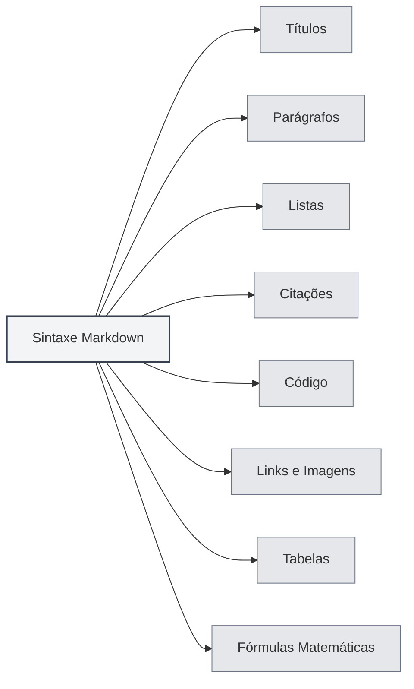

# Sintaxe Markdown

## Visão Geral

Markdown é uma linguagem de marcação leve que permite escrever documentos usando um formato de texto puro fácil de ler e escrever. O MetaDoc oferece suporte completo para edição e visualização de Markdown.

<ViewMenuItemsDemo mode="demo" :items='["outline", "preview"]' />

## Sintaxe Básica

### Títulos

Use o símbolo `#` para criar títulos. O número de `#` indica o nível do título:

```markdown
# Título de Nível 1

## Título de Nível 2

### Título de Nível 3
```



### Parágrafos

Separe parágrafos com linhas em branco.

### Listas

**Lista não ordenada** use `-`, `*` ou `+`:

```markdown
- Item 1
- Item 2
- Item 3
```

**Lista ordenada** use números:

```markdown
1. Primeiro item
2. Segundo item
3. Terceiro item
```

### Citações

Use `>` para criar uma citação:

```markdown
> Este é um texto de citação
```

### Código

**Código em linha** use crases:

```markdown
Use `console.log()` para imprimir conteúdo
```

**Bloco de código** use três crases:

````markdown
```javascript
function hello() {
  console.log('Hello, World!')
}
```
````

### Links e Imagens

**Link**:

```markdown
[Texto do link](https://example.com)
```

**Imagem**:

```markdown

```

### Tabelas

```markdown
| Coluna 1 | Coluna 2 | Coluna 3 |
| -------- | -------- | -------- |
| Dado 1   | Dado 2   | Dado 3   |
```

## Fórmulas Matemáticas

### Fórmula em Linha

Use `$` para envolver:

```markdown
Esta é uma fórmula em linha: $E = mc^2$
```

### Fórmula em Bloco

Use `$$` para envolver:

```markdown
$$
\int_{-\infty}^{\infty} e^{-x^2} dx = \sqrt{\pi}
$$
```

## Funcionalidades Avançadas

### Conversão de Fórmulas LaTeX

O MetaDoc suporta a conversão de fórmulas matemáticas em Markdown para o formato LaTeX. Consulte [[latex.basics|Sintaxe LaTeX]] para mais detalhes.

### Suporte a Gráficos

O MetaDoc suporta vários formatos de gráficos:

- [[charts.mermaid|Gráficos Mermaid]]
- [[charts.plantuml|Gráficos PlantUML]]
- [[charts.echarts|Gráficos ECharts]]

## Documentação Relacionada

- [[markdown.editor|Guia de Uso do Editor Markdown]]
- [[markdown.advanced|Funcionalidades Avançadas do Markdown]]
- [[markdown.features|Funcionalidades do Editor Markdown]]
- [[core.editor-basics|Operações Básicas do Editor]]

<LaTeXEditorDemo mode="demo" />

<Outline mode="demo" />

<ViewMenuItemsDemo mode="demo" :items='["outline"]' />

<MenuItemsDemo mode="demo" :items='[{"id": "file", "items": ["new", "open", "save"]}]' />

<TitleMenu mode="demo" title="Exemplo de Documento Markdown" path="1" :tree='{}' />

<ViewMenuItemsDemo mode="demo" :items='["editor", "preview"]' />