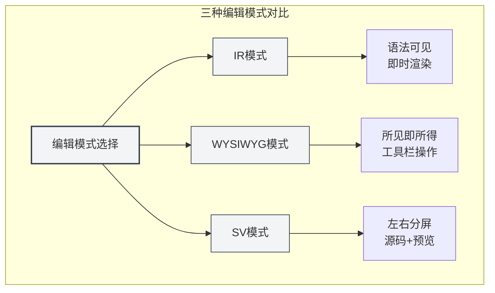
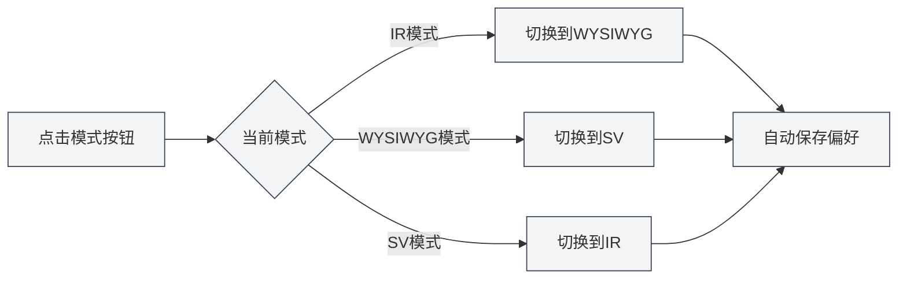
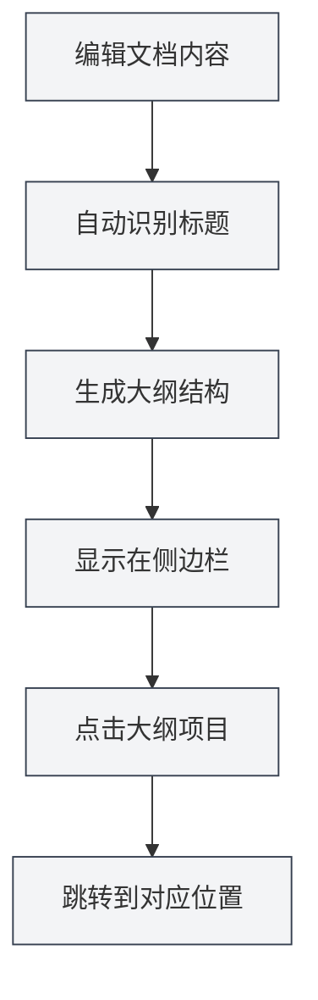
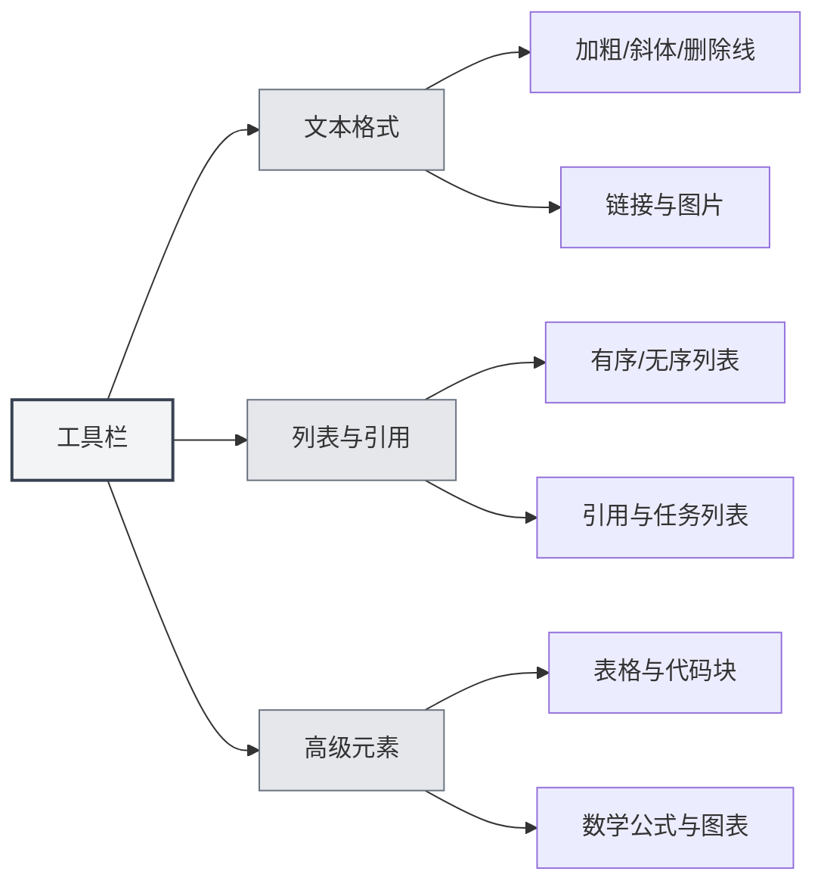

# Guia de Uso do Editor Markdown

## Visão Geral

O editor Markdown do MetaDoc oferece um ambiente de escrita profissional e elegante. Não é apenas uma caixa de texto, mas um espaço de criação profundamente otimizado — suporta três modos de edição flexíveis, visualização em tempo real do conteúdo e ferramentas ricas de formatação, permitindo que você se concentre no conteúdo em si, sem se preocupar com a formatação.

Seja escrevendo um blog técnico, organizando anotações de estudo ou redigindo documentação de projeto, este editor atende às suas necessidades. Especialmente sua capacidade de IA profundamente integrada pode fornecer preenchimento inteligente e sugestões enquanto você escreve, tornando a criação mais fluida.

<TitleMenu mode="demo" title="Markdown编辑器示例" path="1" :tree='{}' />

<SectionOptimizer mode="demo" title="段落优化示例" path="1" :tree='{}' language="markdown" :adapter='null' />

<QuickStartMarkdown mode="demo" />

## Três Modos de Edição

O MetaDoc entende que diferentes usuários têm diferentes hábitos de edição, portanto, oferece três modos de edição para você escolher:

### Modo IR (Renderização Instantânea)

Este é o modo de edição padrão e a escolha preferida da maioria dos usuários de Markdown. Neste modo:

- **Feedback instantâneo**: Conforme você digita a sintaxe Markdown, o conteúdo é imediatamente exibido no formato renderizado.
- **Sintaxe visível**: Os símbolos de marcação Markdown (como `#`, ` **`) permanecem visíveis, facilitando o controle preciso da formatação.
- **Edição fluida**: A velocidade de renderização é rápida, sem lentidão mesmo ao editar documentos longos.
- **Amigável para aprendizado**: Para usuários que estão aprendendo a sintaxe Markdown, é possível ver a correspondência entre a sintaxe e o efeito instantaneamente.

**Cenários de aplicação**:

- Usuários familiarizados com a sintaxe Markdown.
- Cenários que exigem controle preciso da formatação do documento.
- Edição de documentos técnicos longos ou artigos de blog.

### Modo WYSIWYG (O que você vê é o que você obtém)

Se você prefere uma experiência de edição semelhante ao Word, este modo será familiar:

- **Edição direta**: O que você vê é o resultado final, basta clicar para editar.
- **Sem necessidade de memorizar sintaxe**: Operações como negrito, títulos, listas são realizadas através de botões da barra de ferramentas.
- **Operação intuitiva**: Selecione o texto e clique no botão para aplicar a formatação.
- **Redução da barreira de entrada**: Usuários não familiarizados com a sintaxe Markdown podem começar rapidamente.

**Cenários de aplicação**:

- Usuários que estão tendo o primeiro contato com Markdown.
- Cenários que exigem formatação rápida, sem foco na sintaxe subjacente.
- Usuários que preferem edição visual.

### Modo SV (Visualização em Divisão de Tela)

Este modo divide a área de edição em duas partes:

- **Comparação lado a lado**: O lado esquerdo mostra o código-fonte Markdown, o lado direito mostra o efeito renderizado.
- **Sincronização em tempo real**: Ao editar no lado esquerdo, a visualização no lado direito é atualizada instantaneamente.
- **Ferramenta de aprendizado**: Permite ver a sintaxe e o efeito final simultaneamente, aprofundando a compreensão do Markdown.
- **Revisão precisa**: Facilita a verificação de formatos complexos (como tabelas, listas aninhadas) estão corretos.

**Cenários de aplicação**:

- Usuários aprendendo a sintaxe Markdown.
- Cenários que exigem visualização simultânea do código-fonte e do efeito para revisão.
- Edição de documentos contendo formatos complexos.



### Como Alternar o Modo

Alternar o modo de edição é muito simples:

1. **Botão da barra de ferramentas**: Na barra de ferramentas na parte superior do editor, encontre o botão de alternância de modo.
2. **Alternância cíclica**: Clicar no botão alterna entre os três modos ciclicamente.
3. **Memorização de preferência**: O sistema lembra o último modo usado e o restaura automaticamente na próxima vez que você abrir o documento.



## Visualização em Tempo Real

A função de visualização em tempo real do MetaDoc torna a escrita um prazer:

- **Renderização automática**: Conforme você digita o conteúdo à esquerda, o efeito renderizado é exibido imediatamente à direita (ou abaixo).
- **Suporte completo**: Desde títulos e listas básicas até fórmulas matemáticas e gráficos complexos, tudo é renderizado corretamente.
- **Destaque de sintaxe**: Blocos de código recebem destaque de sintaxe automaticamente de acordo com o tipo de linguagem, tornando o código mais legível.
- **Fórmulas matemáticas**: Suporta fórmulas matemáticas em sintaxe LaTeX, sejam fórmulas inline `$E=mc^2$` ou blocos de fórmula independentes, todos são exibidos perfeitamente.
- **Imagens responsivas**: As imagens inseridas se adaptam automaticamente à largura do editor e podem ser ampliadas com um clique.

## Sincronização de Sumário

Navegar em documentos longos nunca foi tão fácil:

- **Extração automática**: O editor identifica automaticamente os títulos no documento e gera um sumário com hierarquia clara.
- **Atualização em tempo real**: Quando você adiciona, modifica ou exclui um título, o sumário é atualizado em sincronia.
- **Salto com um clique**: Clicar em qualquer título no sumário faz o editor saltar imediatamente para a posição correspondente.
- **Pré-visualização da estrutura**: Através do sumário, é possível entender rapidamente a estrutura do documento inteiro.

Você pode acessar a visualização do sumário através da barra lateral:

<ViewMenuItemsDemo mode="demo" :items='["editor", "outline"]' />



Para uma introdução detalhada da função de sumário, consulte [[outline.basics|Função de Visualização de Sumário]].

## Funções da Barra de Ferramentas

A barra de ferramentas na parte superior do editor reúne as funções de formatação mais usadas:



### Formatação de Texto

- **Negrito** (`Ctrl+B`): Destaca conteúdos importantes.
- **Itálico** (`Ctrl+I`): Usado para ênfase ou significado especial.
- **Tachado**: Indica conteúdo obsoleto ou modificado.
- **Código inline**: Marca trechos de código ou termos técnicos.
- **Link** (`Ctrl+K`): Insere um hiperlink clicável.
- **Imagem**: Insere imagens locais ou da web.

### Listas e Citações

- **Lista não ordenada**: Enumera conteúdo com marcadores.
- **Lista ordenada**: Enumera conteúdo com numeração.
- **Bloco de citação**: Cita opiniões de terceiros ou avisos importantes.
- **Lista de tarefas**: Lista de afazeres com caixas de seleção.

### Elementos Avançados

- **Tabela**: Cria tabelas de dados estruturadas, suporta alinhamento e aninhamento.
- **Bloco de código**: Insere múltiplas linhas de código, suporta destaque de sintaxe para dezenas de linguagens de programação.
- **Fórmula matemática**: Insere fórmulas matemáticas usando sintaxe LaTeX.
- **Gráfico**: Insere gráficos Mermaid, PlantUML, ECharts, etc.

## Atalhos de Teclado

Usar atalhos de teclado com proficiência pode aumentar significativamente a eficiência da escrita:

### Atalhos de Formatação

| Operação     | Windows/Linux  | macOS         |
| ------------ | -------------- | ------------- |
| Negrito      | `Ctrl+B`       | `Cmd+B`       |
| Itálico      | `Ctrl+I`       | `Cmd+I`       |
| Inserir link | `Ctrl+K`       | `Cmd+K`       |
| Inserir código | `Ctrl+Shift+K` | `Cmd+Shift+K` |

### Atalhos de Edição

| Operação | Windows/Linux | macOS         |
| -------- | ------------- | ------------- |
| Desfazer | `Ctrl+Z`      | `Cmd+Z`       |
| Refazer  | `Ctrl+Y`      | `Cmd+Shift+Z` |
| Selecionar tudo | `Ctrl+A` | `Cmd+A`       |
| Localizar | `Ctrl+F`      | `Cmd+F`       |

## Dicas de Uso

### Entrada Rápida

1. **Criar título rapidamente**: Digite `#` e pressione espaço, converte automaticamente para formato de título.
2. **Criar lista rapidamente**: Digite `-` ou `*` e pressione espaço, converte automaticamente para item de lista.
3. **Inserir bloco de código rapidamente**: Digite três acentos graves ` ``` ` e pressione Enter.
4. **Inserir linha divisória rapidamente**: Digite três hífens `---` e pressione Enter.

### Dicas de Formatação

1. **Formatar após selecionar texto**: Primeiro selecione o texto, depois clique no botão da barra de ferramentas ou use o atalho.
2. **Substituição em lote**: Use a função localizar e substituir (`Ctrl+H`) para modificar formatos em lote.
3. **Destaque de sintaxe**: Especifique a linguagem na primeira linha do bloco de código, por exemplo ````python`.

### Dicas de Visualização

1. **Alternar modo para visualização**: No modo SV, é possível ver o código-fonte e o efeito simultaneamente.
2. **Visualizar fórmula matemática**: Digite `$` envolvendo a fórmula para ver o efeito renderizado em tempo real.
3. **Renderização em tempo real de gráficos**: Gráficos Mermaid são renderizados automaticamente após a edição.

## Perguntas Frequentes

### Q: Como inserir uma imagem?

A: Existem três maneiras:

1. Clique no botão de imagem na barra de ferramentas.
2. Use o atalho `Ctrl+Shift+I`.
3. Cole diretamente a imagem da área de transferência.

As imagens podem ser salvas no diretório local do documento ou enviadas para um serviço de hospedagem de imagens.

### Q: Como criar uma tabela?

A: Recomenda-se usar o botão de tabela na barra de ferramentas para criar tabelas visualmente. Também é possível digitar manualmente a sintaxe de tabela Markdown:

```markdown
| Coluna 1 | Coluna 2 | Coluna 3 |
| -------- | -------- | -------- |
| Conteúdo | Conteúdo | Conteúdo |
```

### Q: E se a fórmula matemática não aparecer?

A: Verifique se a sintaxe está correta:

- Fórmula inline: envolva com um único `$`, por exemplo `$E=mc^2$`.
- Fórmula independente: envolva com dois `$$`, ocupando uma linha exclusiva.

### Q: Como visualizar o sumário do documento?

A: Clique no ícone "Sumário" na barra lateral ou pressione o atalho para alternar para a visualização de sumário. Os títulos do documento são extraídos automaticamente para o sumário.

### Q: O conteúdo é perdido ao alternar o modo de edição?

A: Não. Os três modos compartilham o mesmo conteúdo do documento. Alternar o modo apenas altera a forma de exibição e edição, o conteúdo é totalmente preservado.

## Documentação Relacionada

- [[markdown.basics|Sintaxe Markdown]] - Aprenda a sintaxe básica do Markdown.
- [[markdown.features|Funções do Editor Markdown]] - Saiba mais sobre funções avançadas.
- [[core.editor-basics|Operações Básicas do Editor]] - Técnicas gerais de edição.
- [[core.editor-settings|Configurações do Editor]] - Configurações personalizadas.
- [[outline.basics|Função de Visualização de Sumário]] - Conheça em profundidade a função de sumário.

<LaTeXEditorDemo mode="demo" />

<Outline mode="demo" />

<MenuItemsDemo mode="demo" :items='[{"id": "file", "items": ["new", "open", "save"]}]' />

<TitleMenu mode="demo" title="Markdown编辑器示例" path="1" :tree='{}' />

<SectionOptimizer mode="demo" title="段落优化示例" path="1" :tree='{}' language="markdown" :adapter='null' />