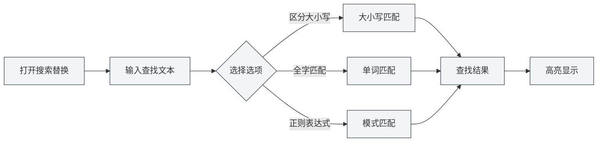
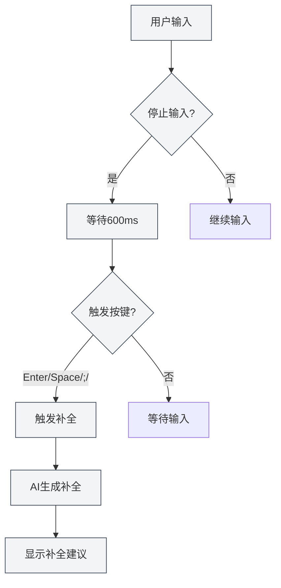

# Funcionalidades do Editor Markdown

## Visão Geral

O editor Markdown oferece uma rica gama de funcionalidades, incluindo busca e substituição, menu de contexto, preenchimento automático por IA, integração com base de conhecimento e mais. Essas funcionalidades podem melhorar significativamente sua eficiência de edição e a qualidade dos documentos.

Este documento apresenta as várias funcionalidades do editor Markdown e como utilizá-las.

## Busca e Substituição

### Abrir Busca e Substituição

Existem várias maneiras de abrir a funcionalidade de busca e substituição:

- **Atalho de teclado**: `Ctrl+F` para abrir a busca, `Ctrl+H` para abrir busca e substituição
- **Menu**: Clique em "Editar" → "Localizar" ou "Localizar e Substituir"
- **Barra de ferramentas**: Clique no ícone de busca na barra de ferramentas

Você pode acessar operações de arquivo através do menu Arquivo na barra de menus superior e funcionalidades de edição através do menu Editar:

<MenuItemsDemo mode="demo" :items='[{"id": "file", "items": ["new", "open", "save"]}]' />

### Funcionalidade de Busca

A funcionalidade de busca suporta as seguintes opções:

- **Diferenciar maiúsculas/minúsculas**: Apenas corresponde ao texto com exatamente o mesmo uso de maiúsculas e minúsculas
- **Correspondência de palavra inteira**: Apenas corresponde a palavras completas (não partes de palavras)
- **Expressão regular**: Usa expressões regulares para correspondência de padrões
- **Preservar maiúsculas/minúsculas**: Preserva o formato de maiúsculas/minúsculas do texto original durante a substituição

A interface do menu de busca e substituição é a seguinte:

<SearchReplaceMenu mode="demo" :adapter='null' />

### Funcionalidade de Substituição

A funcionalidade de substituição suporta:

- **Substituir um por um**: Substitui o texto correspondente item por item
- **Substituir tudo**: Substitui todo o texto correspondente de uma vez
- **Pré-visualizar substituição**: Visualiza o resultado da substituição antes de aplicá-la

### Lista de Correspondências

O painel de busca e substituição exibirá uma lista de correspondências:

- **Mostrar localização**: Mostra o número da linha e da coluna de cada correspondência
- **Pré-visualização de contexto**: Mostra o conteúdo ao redor da correspondência
- **Navegação rápida**: Clicar em uma correspondência salta rapidamente para a posição correspondente no documento

### Dicas de Uso

1. **Expressões regulares**: Use expressões regulares para implementar padrões complexos de busca e substituição
2. **Substituição em lote**: Use "Substituir tudo" para modificar rapidamente o documento em lote
3. **Preservar formatação**: Use a opção "Preservar maiúsculas/minúsculas" para manter o formato de maiúsculas/minúsculas do texto original

## Menu de Contexto

### Operações Básicas de Edição

O menu de contexto oferece as seguintes operações básicas de edição:

- **Cortar**: `Ctrl+X` ou clique direito e selecione "Cortar"
- **Copiar**: `Ctrl+C` ou clique direito e selecione "Copiar"
- **Colar**: `Ctrl+V` ou clique direito e selecione "Colar"
- **Selecionar tudo**: `Ctrl+A` ou clique direito e selecione "Selecionar tudo"

### Funcionalidades de IA

O menu de contexto oferece as seguintes funcionalidades de IA:

- **Análise por IA**: Analisa o conteúdo do documento atual e abre a janela de diálogo com a IA
- **Otimizar parágrafo**: Otimiza o conteúdo do parágrafo atual
- **Inserir gráfico**: Usa a IA para gerar código de gráfico e insere no documento

### Ativar/Desativar Funcionalidades

O menu de contexto permite ativar/desativar rapidamente as seguintes funcionalidades:

- **Preenchimento automático por IA**: Ativa/desativa a funcionalidade de preenchimento automático por IA
- **Integração com base de conhecimento**: Ativa/desativa a funcionalidade de integração com base de conhecimento

### Acionar Preenchimento Manualmente

O menu de contexto oferece a opção "Acionar preenchimento manualmente":

- **Atalho de teclado**: `Shift+Tab`
- **Menu de contexto**: Clique direito e selecione "Acionar preenchimento manualmente"

Acionar o preenchimento manualmente inicia imediatamente o preenchimento por IA, sem esperar pelo acionamento automático.

## Preenchimento Automático por IA

### Ativar/Desativar

A funcionalidade de preenchimento automático por IA pode ser ativada ou desativada nos seguintes locais:

- **Menu de contexto**: Clique direito e selecione "Ativar/Desativar preenchimento automático por IA"
- **Página de configurações**: Configure as opções de preenchimento automático por IA nas configurações

### Acionamento Automático

O preenchimento automático por IA será acionado automaticamente nas seguintes situações:

- **Parada de digitação**: Acionado automaticamente após 600ms sem digitação
- **Tecla de acionamento**: Acionado após digitar teclas específicas (Enter, Espaço, `;`, `,`)

### Acionamento Manual

Formas de acionar o preenchimento manualmente:

- **Atalho de teclado**: `Shift+Tab`
- **Menu de contexto**: Clique direito e selecione "Acionar preenchimento manualmente"

O acionamento manual inicia o preenchimento imediatamente, ignorando o atraso do acionamento automático.

### Modos de Preenchimento

O preenchimento automático por IA suporta dois modos:

- **Geração completa**: Gera o conteúdo de preenchimento completo
- **Geração parcial**: Gera apenas parte do conteúdo (conforme configuração)

O modo de preenchimento pode ser configurado nas configurações.

### Configuração das Teclas de Acionamento

As teclas que acionam o preenchimento podem ser configuradas nas configurações:

- **Enter**: Tecla Enter aciona
- **Espaço**: Tecla de Espaço aciona
- **;**: Ponto e vírgula aciona
- **,**: Vírgula aciona

É possível ativar várias teclas de acionamento simultaneamente.

### Número Máximo de Tokens para Preenchimento

O número máximo de tokens para preenchimento pode ser configurado nas configurações:

- **Valor mínimo**: 20 Tokens
- **Valor máximo**: Ilimitado (definir como 0 significa ilimitado)
- **Valor padrão**: 50 Tokens

Quanto maior o número de tokens, mais conteúdo é preenchido, mas o tempo de geração também será maior.

### Aceitar Preenchimento

Após a exibição da sugestão de preenchimento, você pode:

- **Tecla Tab**: Aceitar a sugestão de preenchimento
- **Tecla Esc**: Cancelar a sugestão de preenchimento
- **Continuar digitando**: Cancelar o preenchimento e continuar a digitação

<TitleMenu mode="demo" title="Markdown编辑器示例" path="1" :tree='{}' />

<SectionOptimizer mode="demo" title="段落优化示例" path="1" :tree='{}' language="markdown" :adapter='null' />

<ViewMenuItemsDemo mode="demo" :items='["editor", "outline", "agent"]' />

## Integração com Base de Conhecimento

### Ativar/Desativar

A funcionalidade de integração com base de conhecimento pode ser ativada ou desativada nos seguintes locais:

- **Menu de contexto**: Clique direito e selecione "Ativar/Desativar base de conhecimento"
- **Página de configurações**: Configure as opções da base de conhecimento nas configurações

### Recuperação de Contexto

Após ativar a integração com base de conhecimento, as funcionalidades de IA recuperarão automaticamente conteúdo relevante da base de conhecimento:

- **Preenchimento por IA**: O preenchimento fará referência a conteúdo relevante na base de conhecimento
- **Análise por IA**: A análise do documento utilizará o conhecimento da base de conhecimento
- **Otimização de parágrafo**: A otimização do parágrafo fará referência ao conteúdo da base de conhecimento

### Princípio de Recuperação

A recuperação da base de conhecimento utiliza tecnologia de busca vetorial:

- **Correspondência semântica**: Corresponde conteúdo relevante com base na similaridade semântica
- **Correspondência por palavras-chave**: Também usa correspondência por palavras-chave para aumentar a precisão
- **Recuperação híbrida**: Combina busca vetorial e correspondência por palavras-chave

### Limiar de Confiança

A recuperação da base de conhecimento suporta a definição de um limiar de confiança:

- **Faixa do limiar**: 0.0 - 1.0
- **Valor padrão**: 0.5
- **Função**: Retorna apenas conteúdo com similaridade acima do limiar

O limiar de confiança pode ser configurado nas configurações, consulte [[knowledge-base.config|Configuração da Base de Conhecimento]].

## Uso Combinado de Funcionalidades

### Busca e Substituição + Preenchimento por IA

Combine o uso de busca e substituição com preenchimento por IA:

1. Use busca e substituição para localizar o conteúdo que precisa ser modificado
2. Use preenchimento por IA para gerar novo conteúdo
3. Use a funcionalidade de substituição para atualizar em lote

### Menu de Contexto + Base de Conhecimento

Combine o uso do menu de contexto com a base de conhecimento:

1. Ative a integração com base de conhecimento
2. Use as funcionalidades de IA do menu de contexto
3. As funcionalidades de IA usarão automaticamente o conteúdo da base de conhecimento

### Análise por IA + Otimização de Parágrafo

Combine o uso de análise por IA com otimização de parágrafo:

1. Use análise por IA para entender o conteúdo do documento
2. Use otimização de parágrafo para melhorar parágrafos específicos
3. Otimize com base nas sugestões da análise por IA

## Dicas de Uso

### Melhorar a Qualidade do Preenchimento

1. **Ativar base de conhecimento**: Ativar a integração com base de conhecimento pode melhorar a qualidade do preenchimento
2. **Ajustar número de tokens**: Ajuste o número máximo de tokens para preenchimento conforme a necessidade
3. **Acionamento manual**: Use o acionamento manual quando necessário para obter melhores resultados de preenchimento

### Busca e Substituição Eficiente

1. **Usar expressões regulares**: Use expressões regulares para padrões complexos
2. **Pré-visualizar substituição**: Visualize o resultado da substituição antes de aplicá-la
3. **Operações em lote**: Use "Substituir tudo" para modificar rapidamente em lote

### Uso da Base de Conhecimento

1. **Adicionar documentos relevantes**: Adicione documentos relevantes à base de conhecimento
2. **Ajustar confiança**: Ajuste o limiar de confiança conforme a necessidade
3. **Atualizar regularmente**: Atualize regularmente o conteúdo da base de conhecimento

## Perguntas Frequentes

### P: O preenchimento por IA não aparece?

R: Verifique se o preenchimento automático por IA está ativado e se a configuração do LLM está correta. Tente acionar o preenchimento manualmente (`Shift+Tab`).

### P: A busca e substituição não encontra o conteúdo?

R: Verifique se as opções "Diferenciar maiúsculas/minúsculas" ou "Correspondência de palavra inteira" estão ativadas. Se estiver usando expressão regular, verifique se a expressão está correta.

### P: A integração com base de conhecimento não funciona?

R: Verifique se a base de conhecimento está ativada e se há documentos relevantes nela. Ajustar o limiar de confiança pode ajudar a recuperar mais conteúdo.

### P: Como desativar o preenchimento por IA?

R: Selecione "Desativar preenchimento automático por IA" no menu de contexto, ou desative a opção de preenchimento automático por IA nas configurações.

### P: O conteúdo preenchido não é preciso?

R: Tente ativar a integração com base de conhecimento, ajustar o número máximo de tokens para preenchimento, ou usar o acionamento manual para obter melhores resultados.

## Documentação Relacionada

- [[markdown.editor|Guia de Uso do Editor Markdown]]
- [[markdown.basics|Sintaxe Markdown]]
- [[ai.completion|Preenchimento Automático por IA]]
- [[knowledge-base.usage|Uso da Base de Conhecimento]]
- [[core.editor-basics|Operações Básicas do Editor]]

<LaTeXEditorDemo mode="demo" />

<Outline mode="demo" />

<MenuItemsDemo mode="demo" :items='[{"id": "file", "items": ["new", "open", "save"]}]' />

<TitleMenu mode="demo" title="Markdown编辑器功能示例" path="1" :tree='{}' />

<SearchReplaceMenu mode="demo" :adapter='null' />

<ViewMenuItemsDemo mode="demo" :items='["editor", "outline", "agent"]' />

<MenuItemsDemo mode="demo" :items='[{"id": "edit", "items": ["find", "replace"]}]' />
