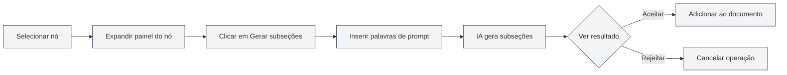
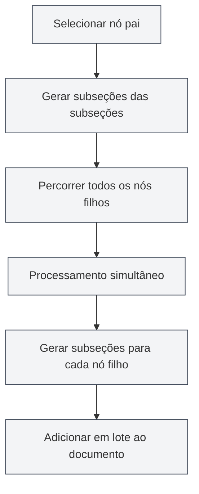

# Funcionalidade IA de Esquema

## Visão Geral

A funcionalidade IA de Esquema utiliza tecnologia de IA para ajudá-lo a gerar e otimizar rapidamente a estrutura de documentos. Por meio dos recursos de IA, você pode gerar subseções, gerar conteúdo de seções, otimizar a estrutura do esquema, entre outros, aumentando significativamente a eficiência na criação de documentos.

<Outline mode="demo" />

A funcionalidade IA de Esquema suporta vários modos de operação, incluindo operações em nó único e operações em lote, permitindo que você use a IA de forma flexível para auxiliar na criação de documentos.

<Outline mode="demo" />

## Gerar Subseções

### Gerar Subseções para um Nó

Para gerar subseções para um nó específico:

<OutlineAiToolbar mode="demo" />

1.  **Selecione o nó**: No modo de exibição de esquema, selecione o nó para o qual deseja gerar subseções.
2.  **Expanda o nó**: Clique no nó para expandir o painel de detalhes.
3.  **Gere subseções**: Clique no botão "Gerar subseções".
4.  **Insira um prompt**: Opcionalmente, insira palavras de prompt para orientar a geração da IA.
5.  **Aguarde a geração**: A IA gerará subseções com base no título e conteúdo do nó.
6.  **Confirme e aceite**: Revise o resultado gerado e aceite após confirmação.

Você pode acessar o modo de exibição de esquema através da barra lateral:

<ViewMenuItemsDemo mode="demo" :items='["outline"]' />

As subseções geradas são automaticamente adicionadas ao documento e a estrutura do esquema é atualizada.

### Princípio de Geração

<OutlineTreeDisplay mode="demo" />

Ao gerar subseções, a IA considera:

-   **Título do nó**: Compreende o tópico da seção com base no título do nó.
-   **Estrutura do documento**: Considera a estrutura geral do documento.
-   **Prompt do usuário**: Ajusta o conteúdo gerado de acordo com as palavras de prompt do usuário.
-   **Requisitos de formatação**: Gera o formato de título correto de acordo com o formato do documento (Markdown/LaTeX).

### Dicas de Uso

1.  **Forneça prompts claros**: Insira palavras de prompt claras para orientar a IA a gerar subseções que atendam às suas necessidades.
2.  **Consulte a estrutura existente**: A IA consultará a estrutura existente do documento para manter a consistência de estilo.
3.  **Gere várias vezes**: Se não estiver satisfeito, você pode gerar várias vezes para escolher o melhor resultado.

## Gerar Conteúdo da Seção

<Outline mode="demo" />

### Gerar Conteúdo para um Nó

Para gerar conteúdo de texto para um nó específico:

1.  **Selecione o nó**: No modo de exibição de esquema, selecione o nó para o qual deseja gerar conteúdo.
2.  **Expanda o nó**: Clique no nó para expandir o painel de detalhes.
3.  **Gere conteúdo**: Clique no botão "Gerar conteúdo".
4.  **Insira um prompt**: Opcionalmente, insira palavras de prompt para orientar a geração da IA.
5.  **Defina a contagem de palavras**: Opcionalmente, defina a contagem de palavras alvo.
6.  **Aguarde a geração**: A IA gerará conteúdo com base no título do nó e na estrutura do documento.
7.  **Confirme e aceite**: Revise o resultado gerado e aceite após confirmação.

O conteúdo gerado é automaticamente adicionado à seção correspondente no documento.

### Modos de Geração de Conteúdo

<OutlineAiToolbar mode="demo" />

A geração de conteúdo suporta os seguintes modos:

-   **Geração completa**: Gera o conteúdo completo da seção.
-   **Geração parcial**: Gera apenas parte do conteúdo (de acordo com a configuração).
-   **Acrescentar conteúdo**: Adiciona novo conteúdo com base no conteúdo existente.

### Controle de Contagem de Palavras

Você pode definir a contagem de palavras alvo ao gerar conteúdo:

-   **Definir contagem de palavras**: Insira a contagem de palavras alvo na caixa de diálogo de geração.
-   **Ajuste da IA**: A IA ajustará o nível de detalhe do conteúdo gerado de acordo com o requisito de contagem de palavras.
-   **Controle flexível**: Você pode definir diferentes contagens de palavras de acordo com a importância da seção.

<OutlineTreeDisplay mode="demo" />

## Gerar Subseções das Subseções

### Gerar Subseções em Lote

Para gerar subseções em lote para todos os nós filhos de um nó específico:

1.  **Selecione o nó**: Selecione o nó para a operação em lote.
2.  **Expanda o nó**: Clique no nó para expandir o painel de detalhes.
3.  **Gerar subseções das subseções**: Clique no botão "Gerar subseções das subseções".
4.  **Insira um prompt**: Insira palavras de prompt para orientar a geração da IA.
5.  **Aguarde a geração**: A IA processará todos os nós filhos simultaneamente, gerando subseções para cada um.
6.  **Confirme e aceite**: Revise o resultado gerado e aceite após confirmação.

Esta funcionalidade utiliza um mecanismo de processamento simultâneo, permitindo gerar rapidamente subseções em lote para várias seções.

### Vantagens do Processamento Simultâneo

<OutlineAiToolbar mode="demo" />

A geração em lote utiliza um mecanismo de processamento simultâneo:

-   **Processamento eficiente**: Processa vários nós ao mesmo tempo, aumentando a velocidade em dezenas de vezes.
-   **Sincronização automática**: Sincroniza automaticamente com o documento após a conclusão da geração.
-   **Exibição de progresso**: Exibe o progresso de geração de cada nó.

### Cenários de Uso

Adequado para os seguintes cenários:

-   **Geração em larga escala**: Quando é necessário gerar subseções para várias seções.
-   **Operação em lote**: Gera subseções para todas as seções com um clique.
-   **Geração estruturada**: Gera conteúdo em lote de acordo com a estrutura do esquema.

## Gerar Conteúdo das Subseções

### Gerar Conteúdo em Lote

Para gerar conteúdo em lote para todos os nós filhos de um nó específico:

1.  **Selecione o nó**: Selecione o nó para a operação em lote.
2.  **Expanda o nó**: Clique no nó para expandir o painel de detalhes.
3.  **Gerar conteúdo das subseções**: Clique no botão "Gerar conteúdo das subseções".
4.  **Insira um prompt**: Insira palavras de prompt para orientar a geração da IA.
5.  **Defina a contagem de palavras**: Opcionalmente, defina a contagem de palavras alvo.
6.  **Aguarde a geração**: A IA processará todos os nós filhos simultaneamente, gerando conteúdo para cada um.
7.  **Confirme e aceite**: Revise o resultado gerado e aceite após confirmação.

Esta funcionalidade pode gerar rapidamente conteúdo para todas as seções de um documento inteiro.

### Geração Recursiva

A geração de conteúdo das subseções processa recursivamente:

-   **Percorrer todos os nós filhos**: Percorre recursivamente todos os nós filhos.
-   **Gerar conteúdo**: Gera conteúdo para cada nó filho.
-   **Manter estrutura**: Mantém a estrutura hierárquica do documento.

### Acompanhamento de Progresso

O progresso é exibido durante a geração em lote:

-   **Progresso do nó**: Exibe o nó atualmente sendo processado.
-   **Progresso geral**: Exibe o progresso geral da geração.
-   **Atualização em tempo real**: Atualiza o conteúdo gerado em tempo real.

<Outline mode="demo" />

## Otimização de Esquema

### Funcionalidade de Otimização

A funcionalidade de otimização de esquema pode ajudá-lo com:

-   **Ajuste de estrutura**: Otimiza a estrutura e hierarquia do documento.
-   **Otimização de títulos**: Otimiza a nomenclatura e formatação dos títulos.
-   **Reorganização estrutural**: Reorganiza a estrutura do documento.

### Operações de Otimização

A otimização de esquema suporta as seguintes operações:

-   **Mover nó**: Move o nó para uma nova posição.
-   **Excluir nó**: Exclui nós desnecessários.
-   **Ajustar nível**: Ajusta a relação hierárquica dos nós.
-   **Mesclar nós**: Mescla nós semelhantes.

### Uso da Otimização

<OutlineTreeDisplay mode="demo" />

1.  **Analisar estrutura**: A IA analisará a estrutura atual do documento.
2.  **Fornecer sugestões**: Fornece sugestões de otimização.
3.  **Aplicar otimização**: Aplica o resultado da otimização após confirmação.

## Configuração da Funcionalidade IA

### Configuração de Temperatura

Você pode definir o parâmetro de temperatura ao gerar com IA:

-   **Faixa de temperatura**: 0.0 - 1.0
-   **Valor padrão**: De acordo com a configuração.
-   **Função**: Controla a criatividade da geração da IA (quanto maior a temperatura, mais criativa).

### Configuração de Palavras de Prompt

Você pode definir palavras de prompt para cada operação:

-   **Prompt geral**: Define palavras de prompt gerais.
-   **Prompt de operação**: Define palavras de prompt específicas para cada operação.
-   **Requisito de contagem de palavras**: Inclui requisitos de contagem de palavras nas palavras de prompt.

### Reconhecimento de Formato

A IA reconhece automaticamente o formato do documento:

-   **Formato Markdown**: Gera títulos e conteúdo no formato Markdown.
-   **Formato LaTeX**: Gera títulos e conteúdo no formato LaTeX.
-   **Adaptação automática**: Ajusta automaticamente o conteúdo gerado de acordo com o formato do documento.

## Dicas de Uso

### Geração Eficiente

1.  **Use operações em lote**: Ao precisar gerar uma grande quantidade de conteúdo, use operações em lote para aumentar a eficiência.
2.  **Forneça prompts claros**: Insira palavras de prompt claras para obter melhores resultados de geração.
3.  **Geração passo a passo**: Primeiro gere a estrutura, depois gere o conteúdo, aperfeiçoando o documento gradualmente.

### Controle de Qualidade

1.  **Verifique o resultado gerado**: Após a geração, verifique cuidadosamente o resultado para garantir que atenda aos requisitos.
2.  **Gere várias vezes**: Se não estiver satisfeito, você pode gerar várias vezes para escolher o melhor resultado.
3.  **Ajuste manual**: Após a geração, você pode ajustar e aperfeiçoar manualmente o conteúdo.

### Planejamento de Estrutura

1.  **Planeje a estrutura primeiro**: Use a IA para gerar subseções e planejar a estrutura do documento.
2.  **Depois gere o conteúdo**: Após definir a estrutura, gere o conteúdo específico.
3.  **Aperfeiçoe gradualmente**: Aperfeiçoe o documento gradualmente, não gere todo o conteúdo de uma vez.

## Perguntas Frequentes

### P: O conteúdo gerado pela IA está impreciso?

R: O conteúdo gerado pela IA é apenas para referência. Recomenda-se verificar e ajustar após a geração. Fornecer palavras de prompt mais detalhadas pode resultar em melhores resultados.

### P: A geração em lote está muito lenta?

R: A geração em lote usa processamento simultâneo e já é muito rápida. Se ainda estiver lenta, pode ser um problema de rede ou resposta lenta do serviço de IA.

### P: Como cancelar a geração?

R: Durante o processo de geração, você pode clicar no botão "Cancelar" para cancelar a operação. O conteúdo já gerado não será perdido.

### P: O formato do conteúdo gerado está incorreto?

R: A IA reconhece automaticamente o formato do documento. Se o formato estiver incorreto, verifique as configurações de formato do documento ou ajuste manualmente o conteúdo gerado.

### P: Posso modificar o conteúdo gerado?

R: Sim. O conteúdo gerado pode ser editado e modificado a qualquer momento. A geração é apenas uma assistência à criação; o conteúdo final é determinado por você.

## Documentação Relacionada

-   [[outline.basics|Funcionalidade de Modo de Exibição de Esquema]]
-   [[ai.llm-config|Configuração LLM]]
-   [[markdown.editor|Guia de Uso do Editor Markdown]]
-   [[latex.editor|Guia de Uso do Editor LaTeX]]

<Outline mode="demo" />

<OutlineAiToolbar mode="demo" />

<ViewMenuItemsDemo mode="demo" :items='["ai"]' />
