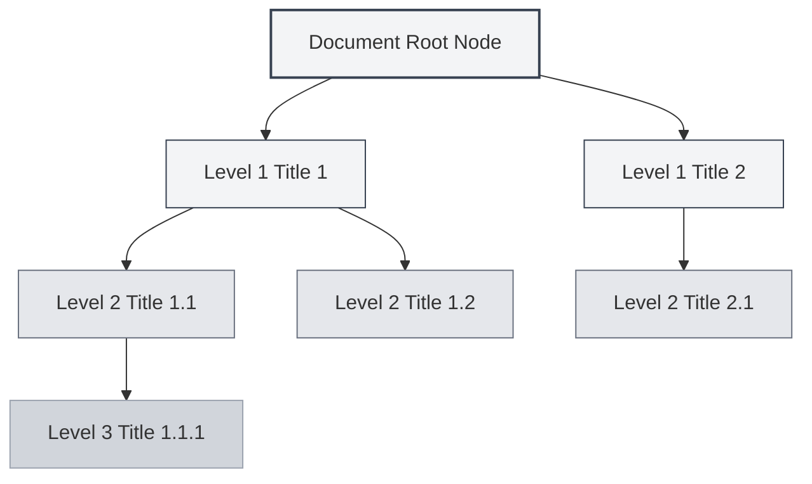
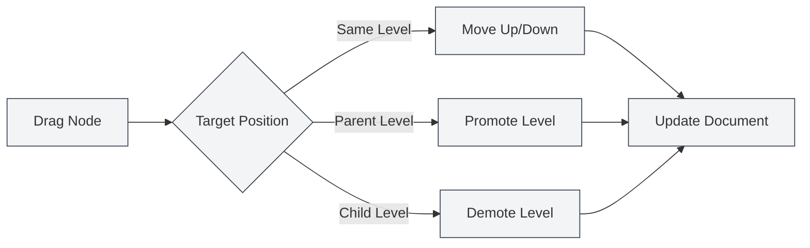

# Funcionalidade de Visualização de Estrutura

## Visão Geral

A visualização de estrutura exibe a hierarquia de títulos do documento em formato de árvore, ajudando você a navegar e editar rapidamente a estrutura do documento. Através da visualização de estrutura, você pode saltar rapidamente para qualquer posição do documento, editar a estrutura do documento e usar funcionalidades de IA para gerar conteúdo.

A visualização de estrutura do MetaDoc suporta extração automática, edição manual, ordenação por arrastar e soltar, geração por IA e outras funcionalidades, permitindo que você organize e gerencie a estrutura do documento de forma eficiente.

## Introdução à Visualização de Estrutura

### Localização da Visualização

A visualização de estrutura é normalmente exibida na barra lateral esquerda ou direita do editor:

- **Barra lateral**: A visualização de estrutura é exibida como parte da barra lateral
- **Painel independente**: A visualização de estrutura pode ser exibida ou ocultada independentemente
- **Ajuste de largura**: A largura da visualização de estrutura pode ser ajustada

Você pode acessar a visualização de estrutura através da barra lateral, que oferece alternância entre visualizações como editor, estrutura, etc.:

<ViewMenuItemsDemo mode="demo" :items='["editor", "outline"]' />

### Prévia da Interface

A visualização de estrutura apresenta a hierarquia de títulos do documento em formato de árvore, suportando ordenação por arrastar e soltar e edição de nós:

<Outline mode="demo" />

<ViewMenuItemsDemo mode="demo" :items='["outline"]" />

### Estrutura da Visualização

A visualização de estrutura exibe a hierarquia de títulos do documento em formato de árvore:

- **Nó raiz**: O nó raiz do documento (normalmente não exibido)
- **Título de nível 1**: Títulos de nível 1 (H1) do documento
- **Título de nível 2**: Títulos de nível 2 (H2) do documento
- **Aninhamento de múltiplos níveis**: Suporta exibição aninhada de títulos de múltiplos níveis

### Extração Automática

A visualização de estrutura extrai automaticamente a estrutura de títulos do documento:

- **Documentos Markdown**: Extrai de títulos Markdown (`#`, `##`, etc.)
- **Documentos LaTeX**: Extrai de comandos de seção LaTeX (`\section`, `\subsection`, etc.)
- **Atualização em tempo real**: Atualiza automaticamente a estrutura da visualização ao editar o documento

## Operações com Nós da Estrutura

### Adicionar Nó Filho

Adicionar um novo nó filho na estrutura:

1. **Selecionar nó**: Clique no nó ao qual deseja adicionar um filho
2. **Botão adicionar**: Clique no botão "Adicionar nó filho" (+ ícone) ao lado do nó
3. **Inserir título**: Digite o título do novo nó
4. **Confirmar criação**: Após confirmar, o novo nó será criado

O novo nó será adicionado à posição correspondente no documento, e o conteúdo do documento será atualizado automaticamente.

<Outline mode="demo" />

### Editar Nó

Editar o título de um nó da estrutura:

1. **Selecionar nó**: Clique no nó que deseja editar
2. **Botão editar**: Clique no botão "Editar" ao lado do nó
3. **Modificar título**: Modifique o título do nó
4. **Confirmar salvamento**: Após confirmar, as alterações serão salvas

Editar o título de um nó atualizará automaticamente o título correspondente no documento.

<TitleMenu mode="demo" title="Título de Exemplo" path="1" :tree='{}' />

<ViewMenuItemsDemo mode="demo" :items='["outline"]' />

### Excluir Nó

Excluir um nó da estrutura:

1. **Selecionar nó**: Clique no nó que deseja excluir
2. **Botão excluir**: Clique no botão "Excluir" ao lado do nó
3. **Confirmar exclusão**: Após confirmar, o nó será excluído

Excluir um nó também excluirá o título e conteúdo correspondentes no documento (se configurado).

<SectionOptimizer mode="demo" title="Exemplo de Otimização de Nó da Estrutura" path="1" :tree='{}' language="markdown" :adapter='null' />

<OutlineTreeDisplay mode="demo" />

### Mover Nó

Mover a posição de um nó da estrutura:

- **Mover para cima/baixo**: Use os botões "Mover para cima" e "Mover para baixo" para alterar a ordem dos nós
- **Mover para esquerda/direita**: Use os botões "Mover para esquerda" e "Mover para direita" para alterar o nível do nó
- **Mover por arrastar**: Arraste e solte o nó diretamente para a posição desejada

Mover um nó atualizará automaticamente a estrutura do documento.

<OutlineTreeDisplay mode="demo" />

## Arrastar e Soltar Nós da Estrutura

### Operação de Arrastar e Soltar

A visualização de estrutura suporta operações de arrastar e soltar para reorganizar a estrutura do documento:

1. **Pressionar mouse**: Pressione e segure o botão esquerdo do mouse sobre um nó
2. **Arrastar nó**: Arraste o nó até a posição desejada
3. **Soltar mouse**: Solte o botão do mouse para completar a movimentação

Durante o arraste, haverá feedback visual mostrando a posição de destino do nó.

### Modos de Arrastar e Soltar

O arrastar e soltar suporta os seguintes modos:

- **Mover para cima/baixo**: Mover o nó para cima ou para baixo dentro do mesmo nível
- **Mover para esquerda/direita**: Alterar o nível do nó (promover ou rebaixar)
- **Mover entre níveis**: Mover o nó para outros níveis

### Restrições de Arrastar e Soltar

A operação de arrastar e soltar tem as seguintes restrições:

- **Nó raiz**: O nó raiz não pode ser arrastado
- **Auto-contenção**: Não é possível arrastar um nó para dentro de seus próprios nós filhos (evita ciclos)
- **Limites de nível**: Algumas operações podem estar sujeitas a limites de nível

<Outline mode="demo" />

## Expandir/Recolher Estrutura

### Expandir Nó

Expandir um nó para visualizar seus nós filhos:

- **Clicar no nó**: Clique no título do nó para expandir ou recolher
- **Ícone expandir**: Clique no ícone de expansão antes do nó
- **Expandir tudo**: Use a função "Expandir tudo" para expandir todos os nós

### Recolher Nó

Recolher um nó para ocultar seus nós filhos:

- **Clicar no nó**: Clique novamente em um nó já expandido para recolhê-lo
- **Ícone recolher**: Clique no ícone de recolhimento antes do nó
- **Recolher tudo**: Use a função "Recolher tudo" para recolher todos os nós

### Estado de Expansão

O estado de expansão da estrutura é salvo:

- **Salvamento automático**: O estado de expansão é salvo automaticamente
- **Restaurar estado**: O estado de expansão é restaurado na próxima vez que o documento for aberto
- **Estado independente**: O estado de expansão é salvo independentemente para cada documento

## Ajuste de Largura da Estrutura

### Ajustar Largura

A largura da visualização de estrutura pode ser ajustada:

1. **Arrastar borda**: Posicione o mouse na borda da visualização de estrutura
2. **Pressionar e arrastar**: Pressione e segure o botão esquerdo do mouse para arrastar e ajustar a largura
3. **Soltar mouse**: Solte o botão do mouse para completar o ajuste

### Limites de Largura

A largura da estrutura tem os seguintes limites:

- **Largura mínima**: Não pode ser menor que a largura mínima (normalmente 150px)
- **Largura máxima**: Não pode ser maior que a largura máxima (normalmente 50% da largura da tela)
- **Adaptação automática**: A largura se ajusta automaticamente ao conteúdo

<ResizableDivider mode="demo" />

## Navegação Rápida

### Navegação por Clique

Clicar em um nó da estrutura permite saltar rapidamente para a posição correspondente no documento:

- **Clicar no nó**: Clique no título do nó para saltar para a posição correspondente
- **Realce**: Após o salto, o título correspondente será realçado
- **Posicionamento por rolagem**: O editor rolará automaticamente para a posição correspondente

### Rolagem Sincronizada

A visualização de estrutura suporta rolagem sincronizada com o editor:

- **Sincronização durante edição**: Ao editar o documento, a estrutura realçará automaticamente a posição atual de edição
- **Sincronização durante rolagem**: Ao rolar o editor, a estrutura realçará automaticamente os títulos visíveis
- **Sincronização bidirecional**: Sincronização bidirecional entre a estrutura e o editor

## Exibição de Informações do Nó

### Título do Nó

O nó da estrutura exibe as seguintes informações:

- **Texto do título**: Exibe o conteúdo textual do título
- **Nível do título**: Exibe o nível do título através do recuo
- **Estado do nó**: Exibe o estado do nó (expandido/recolhido)

### Operações do Nó

Cada nó fornece os seguintes botões de operação:

- **Adicionar nó filho**: Adicionar um nó filho abaixo do nó atual
- **Editar**: Editar o título do nó
- **Excluir**: Excluir o nó
- **Mover**: Mover o nó para cima, baixo, esquerda ou direita

Os botões de operação são exibidos ao passar o mouse sobre o nó ou ao selecioná-lo.

<OutlineTreeDisplay mode="demo" />

<ViewMenuItemsDemo mode="demo" :items='["editor", "outline"]' />

## Dicas de Uso

### Organizar a Estrutura do Documento

1. **Usar a estrutura para planejar**: Primeiro planeje a estrutura do documento na visualização de estrutura, depois preencha o conteúdo
2. **Ajustar níveis**: Use arrastar e soltar para ajustar rapidamente os níveis dos títulos
3. **Operações em lote**: Use a visualização de estrutura para gerenciar vários títulos em lote

### Navegação Rápida

1. **Usar salto**: Clique em um nó da estrutura para saltar rapidamente para a posição no documento
2. **Usar busca**: Busque títulos na estrutura para localização rápida
3. **Usar recolhimento**: Recolha seções que não precisa visualizar para focar no conteúdo atual

### Eficiência na Edição

1. **Ordenação por arrastar**: Use arrastar e soltar para ajustar rapidamente a estrutura do documento
2. **Edição em lote**: Edite vários títulos em lote na visualização de estrutura
3. **Prévia da estrutura**: Use a visualização de estrutura para visualizar toda a estrutura do documento

<OutlineTreeDisplay mode="demo" />

## Perguntas Frequentes

### P: A estrutura não está atualizando?

R: A estrutura é atualizada automaticamente. Se não atualizar, tente alternar a visualização ou atualizar o documento. Certifique-se de que o documento possui o formato de título correto.

### P: Como adicionar vários títulos rapidamente?

R: Use a função "Adicionar nó filho" para adicionar títulos rapidamente, ou digite os títulos diretamente no editor, e a estrutura será atualizada automaticamente.

### P: Falha ao arrastar um nó?

R: Verifique se está tentando arrastar o nó para dentro de seus próprios nós filhos (isso criaria um ciclo). Certifique-se de que a posição de destino é válida.

### P: A estrutura está sendo exibida incorretamente?

R: Verifique se o formato dos títulos no documento está correto. Markdown usa `#`, LaTeX usa comandos como `\section`, etc.

### P: Como redefinir a estrutura?

R: A estrutura é extraída automaticamente do documento. Se precisar redefini-la, você pode reabrir o documento ou editar manualmente a estrutura do documento.

## Documentação Relacionada

- [[outline.ai-features|Funcionalidades de IA da Estrutura]]
- [[markdown.editor|Guia de Uso do Editor Markdown]]
- [[latex.editor|Guia de Uso do Editor LaTeX]]
- [[core.editor-basics|Operações Básicas do Editor]]