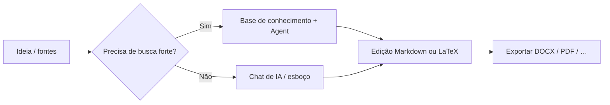

# 🚀 MetaDoc – Boas práticas

O MetaDoc não é um programa com **um único fluxo fixo**.

É mais um **conjunto de ferramentas**: para escrever, fazer gráficos ou traduzir, **há vários caminhos** para o mesmo resultado.

👉 Isso significa:

* A mesma tarefa pode ter **várias rotas**
* Cada rota equilibra de um jeito diferente **velocidade, custo e controle**
* Escolher a rota certa pesa mais do que decorar todos os menus

Este guia não é um catálogo de recursos. Ele responde a uma pergunta prática:

> 👉 **No meu caso, qual abordagem devo tentar primeiro?**

---

## 🧭 Como ler as marcas

| Marca      | Significado                                      |
| ---------- | ------------------------------------------------ |
| ⭐⭐⭐⭐⭐ | Primeira opção na maioria das situações          |
| ⭐⭐⭐⭐   | Muito confiável; às vezes um passo a mais        |
| ⭐⭐⭐     | Especialmente útil em contextos específicos    |
| ⚠️       | Atenção a qualidade, conformidade ou risco       |
| 💰         | Maior uso de tokens / custo de API               |

---

Abas da janela principal (exemplo):

<MainTabs mode="demo" />

---

# 📝 1. Escrita: da ideia ao texto pronto

Há três caminhos comuns. Basta escolher o que combina com seu objetivo.

---

## ⭐⭐⭐⭐⭐ Caminho 1 (recomendação padrão)

### Rascunho no chat de IA → edição Markdown → exportar

**Fluxo**:
[[ai.chat|Chat de IA]] → edição Markdown → [[core.export|Exportar]]

**Faz sentido se você:**

* quer começar rápido
* espera várias rodadas de revisão
* precisa entregar Word, PDF ou LaTeX

---

**Por que costuma ser o padrão**

* Markdown reduz **ruído de formatação** e foca no conteúdo
* Primeiro estrutura e texto; depois o visual
* Depois de exportar, dá para finalizar no Word ou LaTeX

👉 Em resumo: **conteúdo primeiro, formato depois**

---

**Cuidados**

* Confira fatos, citações e números gerados pela IA
* Dê uma olhada rápida no layout após exportar

---

Chat de IA (exemplo de tela):

<AIChat mode="demo" />

---

## ⭐⭐⭐⭐ Caminho 2

### Escrita com base de conhecimento (especialmente técnica ou com fontes)

**Fluxo**:
[[knowledge-base.usage|Base de conhecimento]] → [[agent.introduction|Agent]] → consolidar no editor

---

**Faz sentido se você:**

* escreve textos **com respaldo em fontes** (artigos, relatórios)
* já tem PDFs, documentos ou anotações

---

**Vantagens**

* A geração pode se apoiar nos arquivos que você enviou
* Fica mais fácil manter o texto **ligado a fontes que você controla**

---

**Atenção**

* ⚠️ A qualidade depende dos arquivos e do fatiamento (chunks)
* 💰 Diálogos longos costumam gastar mais tokens

---

👉 Em uma frase:

> Se precisa escrever **com base em fontes**, comece por aqui.

---

Base de conhecimento (exemplo de tela):

<KnowledgeBase mode="demo" />

---

## ⭐⭐⭐ Caminho 3

### O Agent gera um projeto LaTeX inteiro

**Fluxo**:
Agent → projeto LaTeX → compilar PDF

---

**Faz sentido se você:**

* precisa de uma estrutura tipo artigo acadêmico
* já decidiu usar LaTeX
* está com o tempo apertado

---

### ⚠️ Antes de depender disso

* 💰 Em geral **gasta mais tokens** do que conversas curtas ou ações pequenas no menu de contexto
* Pacotes, caminhos ou codificação podem precisar de ajuste manual
* Conteúdo sensível ou muito regulado: não automatize tudo sem revisão

---

Agent (exemplo de tela):

<AgentView mode="demo" />

---

**Modelo de prompt (substitua o título)**

```text
Você é editor técnico LaTeX. Para o tema «(título do trabalho aqui)», gere um projeto LaTeX compilável no espaço de trabalho atual.

Requisitos:
1) Classe article ou a indicada; arquivo principal main.tex; capítulos em vários .tex com \input.
2) Estrutura clara: figures/, sections/, bib/; figuras de exemplo e entradas bibliográficas.
3) Pacotes padrão para matemática (amsmath), figuras (graphicx), citações (biblatex ou natbib); liste pacotes extras a instalar.
4) Indique comando de compilação recomendado (latexmk -pdf; para Unicode/CJK, XeLaTeX ou LuaLaTeX).
5) Não omita o corpo dos arquivos; caminhos consistentes. Se faltarem dados, declare suposições e então gere.
```

---

# 📊 2. Gráficos e visualização

A pergunta certa não é “onde fica o botão?”, e sim:

> 👉 **Você quer velocidade ou controle fino?**

---


| Via | O que fazer | Avaliação | Quando |
| --- | ----------- | --------- | ------ |
| A | Chat de IA ou Agent para código Mermaid / PlantUML / ECharts, colado no Markdown | ⭐⭐⭐⭐ | Iterar rápido junto ao texto |
| B | Janela de gráficos ([[charts.introduction|Gráficos]]) | ⭐⭐⭐⭐ | Prefere interface gráfica |
| C | Selecionar texto → menu de contexto → inserir gráfico | ⭐⭐⭐⭐⭐ | Máxima ligação com o parágrafo atual |

Relacionado: [[ai.chat|Chat de IA]], [[agent.introduction|Agent]].

---

**Dicas rápidas**

* Escrita do dia a dia → menu de contexto costuma ser o mais rápido
* Diagramas complexos → janela de gráficos
* Testar variações → código gerado pela IA

---

Janela de gráficos (exemplo):

<GraphWindow mode="demo" />

---

# 🌐 3. Tradução

Em uma frase:

> 👉 **Quanto mais curto o texto, mais simples pode ser a ferramenta**

---


| Via | Avaliação | Ideal para |
| --- | --------- | ---------- |
| Traduzir no menu de contexto | ⭐⭐⭐⭐⭐ | Frases / parágrafos curtos |
| Chat de IA | ⭐⭐⭐⭐   | Vários blocos |
| Agent | ⭐⭐⭐⭐   | Documentos longos |

---

👉 Regra prática:

* Curto → menu de contexto
* Longo → chat de IA ou Agent

---

Barra divisória redimensionável (exemplo):

<ResizableDivider mode="demo" />

---

# ✨ 4. Refinar parágrafos

Mandar o manuscrito inteiro de uma vez costuma ser mais lento e caro.

Melhor:

---


| Via | Avaliação | Motivo |
| --- | --------- | ------ |
| Otimizar com clique direito no parágrafo | ⭐⭐⭐⭐⭐ | Contexto pequeno, custo menor |
| Passes pela árvore do esboço | ⭐⭐⭐⭐   | Organizar a estrutura |
| Chat de IA / Agent | ⭐⭐⭐⭐   | Mudanças amplas |

---

👉 Ideia central:

> **Trabalhar em pedaços pequenos**

---

Vista de esboço (exemplo):

<Outline mode="demo" />

---

# 🎯 5. Escolher por cenário

Se estiver em dúvida, leia só esta parte.

---

## 🎒 Anotações de aula

**Sugestões**

* ⭐⭐⭐⭐⭐ Markdown rápido na aula → expandir com IA depois
* ⭐⭐⭐⭐ PDF de slides na base → resumos para revisar

👉 Primeiro registrar, depois organizar

---

## 🧪 Relatórios de laboratório

**Sugestões**

* ⭐⭐⭐⭐⭐ Markdown → exportar DOCX para rascunhos
* ⭐⭐⭐⭐ Base de conhecimento para partes de análise

⚠️ Dados medidos: confira você mesmo

---

## 🛠️ Documentação técnica

**Sugestões**

* ⭐⭐⭐⭐⭐ Markdown + retoques locais com clique direito
* ⭐⭐⭐⭐ Agent + base para alinhar com docs antigos

👉 Clareza e consistência em primeiro lugar

---

## 💬 Perguntas e respostas / blog

**Sugestões**

* ⭐⭐⭐⭐⭐ Esboço primeiro → corpo depois
* ⭐⭐⭐⭐ Árvore do esboço em textos longos

👉 Estrutura antes do volume

---

## 📱 Newsletters / criação de conteúdo

**Sugestões**

* ⭐⭐⭐⭐⭐ Finalizar em Markdown → exportar → diagramar na plataforma
* ⭐⭐⭐⭐ IA para variantes de título e resumo

⚠️ Pedir o texto completo de uma vez: custo alto e voz difícil de controlar

---

# 🔁 Visão geral do fluxo



---

# 📚 Leitura adicional

* [[quick-start.guide|Guia de início rápido]]
* [[core.export|Exportar]]
* [[features.paragraph-optimization|Otimização de parágrafos]]
* [[charts.introduction|Introdução a gráficos]]
