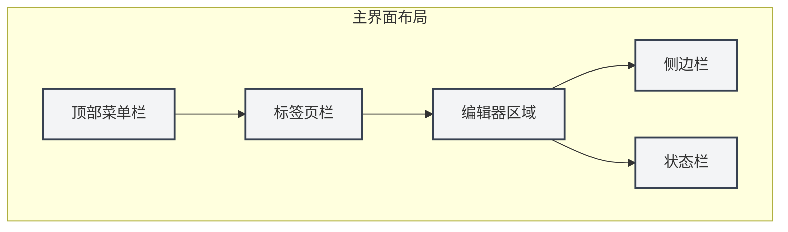
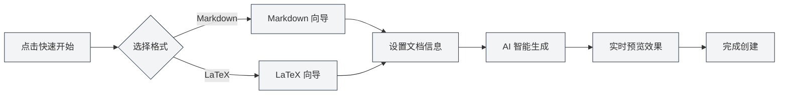

# Guia de Início Rápido

## Visão Geral

Bem-vindo ao MetaDoc! Esta é uma ferramenta inteligente de processamento de documentos projetada para trabalhadores do conhecimento. Seja você um redator de blogs técnicos, organizador de anotações de estudo ou preparador de artigos acadêmicos, o MetaDoc oferece uma experiência de edição profissional e elegante.

O MetaDoc integra profundamente capacidades de inteligência artificial, suportando os dois principais formatos de documentos: Markdown e LaTeX. Ele não é apenas um editor de texto, mas também seu assistente de escrita inteligente — recursos integrados como conversa com IA, autocompletar, correção inteligente e outros tornam a criação de documentos mais eficiente e agradável.

## Primeiro Uso

### Iniciando o Aplicativo

Ao iniciar o MetaDoc, a primeira coisa que você vê é a página inicial. Este é um ponto de partida cuidadosamente projetado para que você possa começar a trabalhar rapidamente:

- **Início Rápido**: Um assistente inteligente o guiará na escolha do formato do documento e na criação de um novo documento.
- **Novo Documento**: Crie diretamente um documento em branco, escolhendo o formato necessário.
- **Abrir Arquivo**: Navegue e abra documentos existentes.
- **Manual do Usuário**: Consulte o guia de uso detalhado a qualquer momento.

### Apresentação da Interface

O design da interface do MetaDoc segue o conceito de layout de editores modernos, sendo claro e intuitivo:

1. **Barra de Menu Superior**

   Localizada na parte superior da janela, reúne funções principais como arquivo, editar, visualizar, etc. Seja para criar um novo documento, localizar e substituir texto ou alternar modos de visualização, você encontrará a entrada aqui. A barra de menu suporta personalização, permitindo ajustar a exibição e ordenação dos itens de menu de acordo com seus hábitos de uso.

2. **Barra de Abas**

   Localizada abaixo da barra de menu, exibe todos os documentos atualmente abertos. Cada documento corresponde a uma aba, clique para alternar. As abas suportam ordenação por arrastar e soltar, e você pode fixar documentos usados frequentemente para evitar fechamento acidental. Quando há muitas abas, também é possível organizar documentos entre janelas.

3. **Área do Editor**

   Esta é sua área de trabalho principal. O MetaDoc fornece ambientes de edição especializados para diferentes tipos de documentos:

   - **Editor Markdown**: Experiência de edição WYSIWYG (What You See Is What You Get), suportando visualização em tempo real, fórmulas matemáticas, gráficos e outros recursos ricos.
   - **Editor LaTeX**: Ambiente profissional de escrita acadêmica, suportando realce de sintaxe, sugestões inteligentes, pré-visualização de compilação e outros recursos.

4. **Barra Lateral**

   Localizada à esquerda do editor, é o centro de navegação do seu documento. Aqui você pode:

   - Alternar entre diferentes visualizações, como editor, esboço, Agent, etc.
   - Visualizar a estrutura de esboço do documento.
   - Gerenciar base de conhecimento e materiais de referência.

5. **Barra de Status**

   Localizada na parte inferior da janela, exibe em tempo real informações de status do documento atual, incluindo contagem de palavras, estado de salvamento, configurações de idioma, etc., permitindo que você tenha uma visão clara do progresso do trabalho.

Abaixo estão os controles de interface real correspondentes, para facilitar sua operação de referência:

**Barra de Menu Superior**

Localizada na parte superior da janela, contém os menus principais como arquivo, editar, visualizar, fornecendo pontos de entrada para operações de nível de aplicativo. Você pode executar ações como novo, abrir, salvar documentos, bem como acessar várias funções de edição e visualização através da barra de menu.

<MenuItemsDemo mode="demo" :items='[{"id": "file", "items": ["new", "open", "save"]}, {"id": "edit", "items": ["undo", "redo", "find"]}, {"id": "view", "items": ["editor", "outline"]}]' />

**Barra de Abas**

Localizada abaixo da barra de menu, exibe todas as abas de documentos atualmente abertos. Você pode alternar documentos clicando nas abas, ajustar a ordem arrastando as abas ou clicar com o botão direito em uma aba para mais ações (como fechar, fixar, mover para nova janela, etc.).

<MainTabs mode="demo" />

**Barra Lateral**

Localizada à esquerda do editor, fornece acesso a vários painéis de funções auxiliares. Você pode alternar rapidamente entre a visualização do editor, visualização de esboço, visualização do Agent, etc., através da barra lateral, aumentando a eficiência da edição de documentos.

<ViewMenuItemsDemo mode="demo" :items='["editor", "outline", "home"]' />

## Criação Rápida de Documentos

### Método 1: Usando o Assistente de Início Rápido

O assistente de início rápido do MetaDoc é um design atencioso. Ele não apenas cria um documento em branco de forma simples, mas age como um assistente experiente, guiando-o em cada etapa da criação do documento:

1. Clique no botão "Início Rápido" na página inicial.
2. Escolha o formato do documento de acordo com sua necessidade:
   - **Markdown**: Se você vai escrever blogs, documentação técnica, atas de reuniões ou qualquer conteúdo de texto diário, esta é a opção mais leve. A sintaxe do Markdown é simples e intuitiva, ao mesmo tempo que atende a ricas necessidades de formatação.
   - **LaTeX**: Se você está preparando um artigo acadêmico, tese ou documento técnico que requer formatação precisa, o LaTeX é o padrão reconhecido pela academia. O MetaDoc torna a complexa compilação LaTeX simples e compreensível.
3. O assistente fornecerá modelos correspondentes e funções de assistência por IA de acordo com sua escolha.

#### Interface de Seleção de Formato

O primeiro passo do assistente é escolher o formato do documento. O MetaDoc recomendará inteligentemente opções adequadas de acordo com seu cenário de uso:

#### Início Rápido Markdown

Ao escolher Markdown, o assistente fornecerá:

- **Sugestões Inteligentes de Título**: A IA sugerirá títulos de documento apropriados com base em sua entrada inicial.
- **Esboço Estruturado**: Gera automaticamente a estrutura do documento, ajudando a organizar suas ideias.
- **Pré-visualização em Tempo Real**: Escreva e veja ao mesmo tempo, entendendo instantaneamente o efeito final de apresentação do documento.

#### Início Rápido LaTeX

Ao escolher LaTeX, o assistente fornecerá:

- **Modelos Profissionais**: Modelos otimizados para diferentes cenários acadêmicos (artigos, relatórios, apresentações, etc.).
- **Orientação de Estrutura**: Gera automaticamente a estrutura padrão de documento LaTeX.
- **Autocompletar Inteligente**: Assistência por IA para gerar código LaTeX, reduzindo a barreira de aprendizado.

#### Valor Central do Assistente

A essência do assistente de início rápido está em **reduzir barreiras e aumentar a eficiência**:

- **Amigável para Iniciantes**: Não é necessário memorizar sintaxe complexa, o assistente o guiará passo a passo.
- **Eficiente para Especialistas**: As funções de assistência por IA podem gerar rapidamente a estrutura do documento, economizando trabalho repetitivo.
- **Consciente do Contexto**: Se você já tem algumas ideias, pode dizer diretamente à IA, que ajudará a expandi-las em uma estrutura completa de documento.

#### Fluxo de Trabalho do Assistente

### Método 2: Criar Documento Diretamente

Se você já está familiarizado com o MetaDoc, pode criar um documento em branco diretamente para começar a trabalhar:

1. Clique no botão "Novo Documento" na página inicial ou use o atalho `Ctrl+N`.
2. Escolha o formato do documento (Markdown / LaTeX / Texto Puro).
3. O documento será aberto imediatamente no editor e você pode começar a criar.

Este método é adequado para usuários experientes ou cenários com um plano de escrita claro.

### Método 3: Abrir Arquivo Existente

Continuar seu trabalho anterior também é simples:

1. Clique no botão "Abrir Arquivo" na página inicial ou pressione `Ctrl+O`.
2. Encontre seu documento no navegador de arquivos.
3. O arquivo selecionado será aberto em uma nova aba, permitindo que você continue a edição sem interrupções.

O MetaDoc suporta a memorização automática dos documentos abertos recentemente, facilitando o retorno rápido ao estado de trabalho.

## Operações Básicas

### Editar Documento

A experiência de edição do MetaDoc é cuidadosamente projetada para manter seu foco no conteúdo em si:

- **Entrada Fluida**: Seja para anotar ideias rapidamente ou polir textos detalhadamente, o editor acompanha seu raciocínio.
- **Formatação Inteligente**: O editor Markdown suporta WYSIWYG, o editor LaTeX fornece realce de sintaxe e sugestões inteligentes.
- **Elementos Ricos**: Insira facilmente elementos como imagens, tabelas, blocos de código, fórmulas matemáticas, etc., tornando o documento mais vívido e profissional.
- **Pré-visualização em Tempo Real**: Documentos Markdown podem ser escritos e visualizados simultaneamente, entendendo o efeito final instantaneamente.

### Salvar Documento

O MetaDoc oferece várias formas de salvar, garantindo que seu trabalho não seja perdido:

- **Salvamento Instantâneo**: `Ctrl+S` salva rapidamente o documento atual, esta é a operação mais comum.
- **Salvar Como Novo Documento**: `Ctrl+Shift+S` use quando precisar salvar o documento atual como uma cópia.
- **Salvamento em Lote**: `Ctrl+K S` salva todos os documentos abertos de uma vez, adequado para finalizar a organização do trabalho.

Além disso, você pode habilitar a função de salvamento automático nas configurações, permitindo que o MetaDoc salve automaticamente seus documentos periodicamente.

### Alternar Visualização

O MetaDoc oferece vários modos de visualização para atender às necessidades de diferentes fases de trabalho:

- **Visualização do Editor**: Área de trabalho principal para edição de documentos, fornecendo funções completas de edição.
- **Visualização de Esboço**: Exibe a hierarquia de títulos do documento em estrutura de árvore, adequada para navegação rápida e ajuste de estrutura.
- **Pré-visualização PDF**: Visualização após compilação de documentos LaTeX, facilitando a verificação do efeito final de formatação.

Através da barra lateral ou atalhos de teclado, você pode alternar rapidamente entre diferentes visualizações.

## Obter Ajuda

O MetaDoc possui um manual do usuário detalhado integrado, pronto para esclarecer suas dúvidas a qualquer momento:

1. Pressione a tecla `F1` ou clique no botão "Manual do Usuário" na página inicial.
2. O manual é classificado por tópicos, cobrindo desde operações básicas até funções avançadas.
3. Use a função de pesquisa para localizar rapidamente o conteúdo necessário.

O manual abrange:

- Guia detalhado de uso do editor.
- Técnicas de gerenciamento de arquivos e projetos.
- Tutoriais aprofundados sobre funções de IA.
- Princípios de funcionamento do framework Agent.
- Opções de configurações personalizadas.

## Explorar Mais

Completar o início rápido é apenas o primeiro passo. O MetaDoc tem muitos outros recursos poderosos esperando para serem explorados:

1. **Dominar Técnicas de Edição**: Conheça as [[core.editor-basics|operações básicas do editor]] para aumentar a eficiência na escrita.
2. **Aprofundar-se no Gerenciamento de Arquivos**: Aprenda as melhores práticas de [[core.file-operations|operações com arquivos]].
3. **Aprofundar-se nas Funções do Editor**:
   - Usuários Markdown: Consulte o [[markdown.editor|Guia de Uso do Editor Markdown]].
   - Usuários LaTeX: Consulte o [[latex.editor|Guia de Uso do Editor LaTeX]].
4. **Experimentar as Capacidades de IA**: Experimente as funções de [[ai.chat|Conversa com IA]] e [[ai.completion|Autocompletar com IA]].

A filosofia de design do MetaDoc é **tornar a tecnologia invisível e a criação livre**. Esperamos que esta ferramenta se torne um assistente eficaz para seu trabalho com conhecimento.

## Documentação Relacionada

- [[core.file-operations|Operações com Arquivos]]
- [[core.editor-basics|Operações Básicas do Editor]]
- [[markdown.editor|Guia de Uso do Editor Markdown]]
- [[latex.editor|Guia de Uso do Editor LaTeX]]
- [[settings.basic|Configurações Básicas]]
