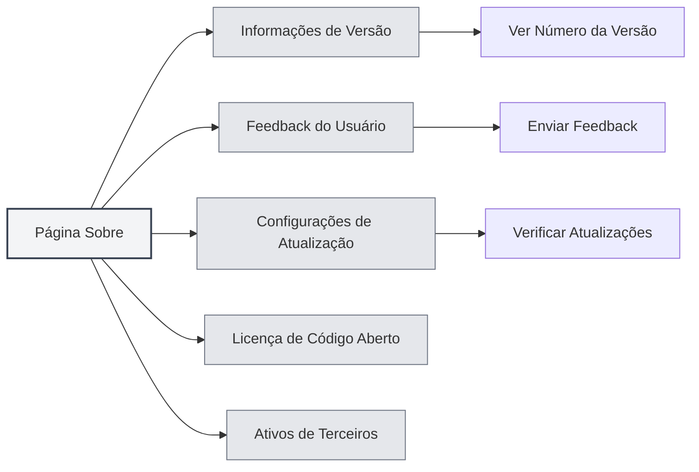
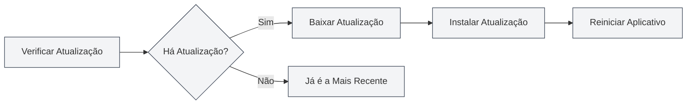

# Sobre Informações

## Visão Geral

A página Sobre fornece informações de versão, configurações de atualização, licenças de código aberto e informações de ativos de terceiros do MetaDoc. Você pode usar esta página para conhecer as informações do aplicativo, verificar atualizações, enviar feedback, entre outros.

## Informações de Versão

### Verificar Versão

Na página Sobre, você pode visualizar as seguintes informações:

- **Nome do Aplicativo**: MetaDoc
- **Número da Versão**: Número da versão atualmente instalada
- **Data de Lançamento**: Data de lançamento da versão atual
- **Ambiente de Build**: Versão de desenvolvimento ou versão de lançamento

Você pode acessar a página Sobre através da barra de menu superior:

<MenuItemsDemo mode="demo" :items='[{"id": "settings", "items": ["about"]}]' />



### Formato da Versão

O número da versão utiliza o formato de versionamento semântico:

```
Versão Principal.Versão Secundária.Revisão
```

Por exemplo: `0.12.1`

### Ambiente de Build

- **Versão de Desenvolvimento**: Versão construída em ambiente de desenvolvimento, pode conter informações de depuração
- **Versão de Lançamento**: Versão lançada oficialmente, testada e otimizada

<SettingAboutSection mode="demo" />

## Feedback do Usuário

### Enviar Feedback

Você pode enviar feedback das seguintes maneiras:

1. Na página Sobre, clique no botão "Feedback do Usuário"
2. Preencha o conteúdo do feedback na página de feedback
3. Envie o feedback

### Conteúdo do Feedback

Ao fornecer feedback, você pode incluir as seguintes informações:

- **Descrição do Problema**: Descreva detalhadamente o problema encontrado
- **Passos para Reproduzir**: Explique como reproduzir o problema
- **Comportamento Esperado**: Descreva o comportamento esperado
- **Comportamento Real**: Descreva o comportamento que realmente ocorreu
- **Informações do Ambiente**: Sistema operacional, número da versão, etc.

### Sugestões para o Feedback

- **Descrição Detalhada**: Descreva o problema de forma mais detalhada possível
- **Fornecer Capturas de Tela**: Se necessário, forneça capturas de tela ou gravações de tela
- **Informações da Versão**: Inclua o número da versão e informações do ambiente de build
- **Passos para Reproduzir**: Forneça passos claros para reproduzir o problema

<UserFeedbackView mode="demo" />

## Grupo QQ Oficial

### Entrar no Grupo QQ

Grupo QQ oficial do MetaDoc: **1079841705**

Entrar no grupo QQ permite:

- Obter as últimas notícias e avisos de atualização
- Trocar experiências de uso com outros usuários
- Obter suporte técnico
- Participar de discussões sobre funcionalidades

### Recursos do Grupo

O grupo QQ oferece os seguintes recursos:

- **Tutoriais de Uso**: Tutoriais de uso nos arquivos do grupo
- **Resolução de Dúvidas**: Membros do grupo se ajudam mutuamente
- **Notificações de Atualização**: Receba informações de atualização em primeira mão
- **Sugestões de Funcionalidades**: Participe de discussões e sugestões de funcionalidades

## Configurações de Atualização

### Verificar Atualizações Automaticamente

Ao habilitar "Verificar atualizações automaticamente", o MetaDoc verificará automaticamente se há uma nova versão ao iniciar:

- **Habilitado**: Verifica atualizações automaticamente ao iniciar
- **Desabilitado**: Não verifica atualizações automaticamente

### Canal de Atualização

Você pode escolher o canal de atualização:

- **Versão Estável**: Usa a versão lançada oficialmente (recomendado)
- **Versão de Desenvolvimento**: Usa a versão de desenvolvimento (pode ser instável)

<MainTabs mode="demo" />

### Verificar Atualizações Manualmente

Você pode verificar atualizações manualmente a qualquer momento:

1. Na aba "Configurações de Atualização" da página Sobre
2. Clique no botão "Verificar Atualizações"
3. Aguarde a conclusão da verificação

### Status da Atualização

Após verificar atualizações, os seguintes status serão exibidos:

- **Atualização Disponível**: Exibe informações da nova versão, é possível baixar a atualização
- **Já é a Versão Mais Recente**: A versão atual é a mais recente
- **Falha na Verificação**: Exibe mensagem de erro

### Baixar e Instalar Atualizações

Se houver uma atualização disponível:

1. **Baixar Atualização**: Clique no botão "Baixar Atualização"
2. **Aguardar Download**: Acompanhe o progresso do download
3. **Instalar Atualização**: Após o download, clique no botão "Instalar e Reiniciar"
4. **Reinício Automático**: O aplicativo será reiniciado automaticamente e instalará a atualização



<QuickStartPanel mode="demo" />

## Licença de Código Aberto

### Verificar Licença

Na aba "Licença de Código Aberto" da página Sobre, você pode visualizar:

- **Licença de Código Aberto**: A licença de código aberto utilizada pelo MetaDoc
- **Conteúdo da Licença**: O texto completo da licença

### Informações da Licença

O MetaDoc segue uma licença de código aberto, você pode:

- Visualizar o conteúdo da licença
- Conhecer os termos de uso
- Conhecer os direitos e obrigações

## Ativos de Terceiros

### Verificar Ativos de Terceiros

Na aba "Ativos de Terceiros" da página Sobre, você pode visualizar:

- **Bibliotecas de Terceiros**: Bibliotecas de código aberto de terceiros utilizadas pelo MetaDoc
- **Informações dos Ativos**: Informações de licença e origem dos ativos de terceiros

### Lista de Ativos

A lista de ativos de terceiros inclui:

- **Nome da Biblioteca**: Nome da biblioteca de terceiros
- **Versão**: Número da versão utilizada
- **Licença**: Tipo de licença da biblioteca
- **Origem**: Link de origem da biblioteca

## Melhores Práticas

1. **Atualizar Regularmente**: Recomenda-se habilitar a verificação automática de atualizações para obter novas versões prontamente
2. **Relatar Problemas**: Envie feedback imediatamente ao encontrar problemas
3. **Entrar no Grupo QQ**: Entre no grupo QQ oficial para obter suporte e informações
4. **Verificar Licença**: Conheça os termos de uso da licença de código aberto
5. **Acompanhar Atualizações**: Fique atento às notificações de atualização para conhecer novas funcionalidades e correções

## Observações

1. **Backup Antes de Atualizar**: Recomenda-se fazer backup de dados importantes antes de atualizar
2. **Conexão de Rede**: Verificar atualizações requer conexão com a internet
3. **Compatibilidade de Versão**: Após a atualização, pode ser necessário reconfigurar algumas definições
4. **Informações no Feedback**: Ao enviar feedback, tome cuidado para proteger informações privadas
5. **Cumprimento da Licença**: Ao usar o MetaDoc, por favor, cumpra os termos da licença de código aberto

<ResizableDivider mode="demo" />

## Documentação Relacionada

- [[settings.basic|Configurações Básicas]]
- [[settings.logging|Configuração de Logs]]
- [[quick-start.guide|Guia de Início Rápido]]

<SettingAboutSection mode="demo" />

<UserFeedbackView mode="demo" />

<MenuItemsDemo mode="demo" :items='[{"id": "settings", "items": ["about"]}]' />

<MainTabs mode="demo" />