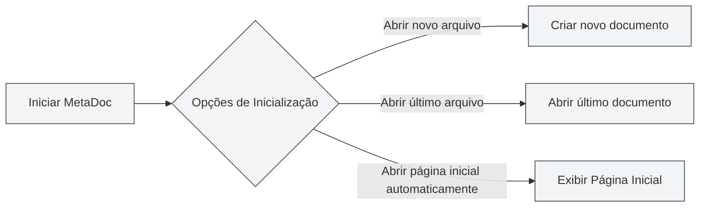
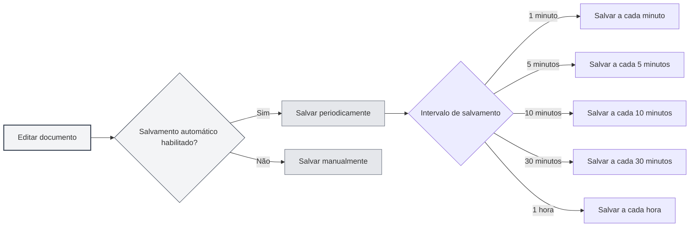
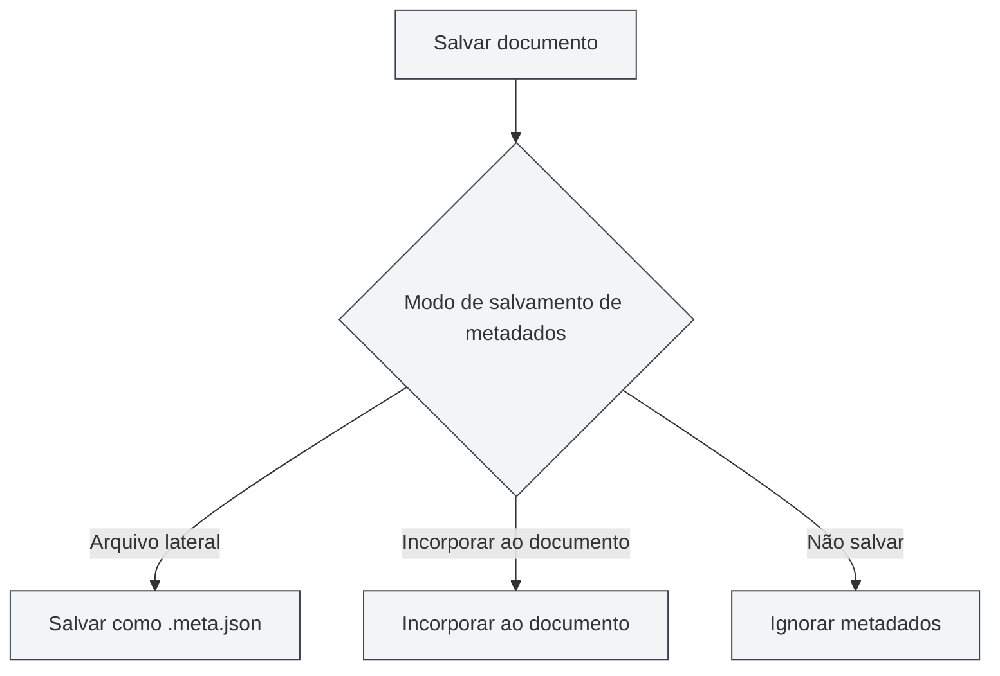

# Configurações Básicas

## Visão Geral

As Configurações Básicas são as opções de configuração central do MetaDoc, abrangendo funcionalidades importantes como comportamento de inicialização, salvamento automático, estatísticas de documentos, gerenciamento de metadados, entre outras. Configurar essas opções adequadamente pode melhorar sua experiência de uso e produtividade.

## Opções de Inicialização

### Configurar Comportamento de Inicialização

As opções de inicialização determinam o comportamento padrão do MetaDoc ao ser iniciado:

- **Abrir novo arquivo**: Cria um novo documento em branco sempre que o aplicativo é iniciado.
- **Abrir último arquivo editado**: Abre automaticamente o documento que estava sendo editado quando o aplicativo foi fechado pela última vez.

Você pode escolher a opção de inicialização que melhor se adequa aos seus hábitos de uso. Se você frequentemente precisa continuar de onde parou, é recomendável selecionar "Abrir último arquivo editado".

Você pode acessar as configurações pela barra de menu superior:

<MenuItemsDemo mode="demo" :items='[{"id": "settings"}]' />

### Interface das Configurações Básicas

A imagem abaixo mostra a interface completa da página de Configurações Básicas:

<SettingBasicSection mode="demo" />

A interface de Configurações Básicas contém as seguintes áreas principais de configuração:

- **Opções de Inicialização**: Define o comportamento padrão ao iniciar o aplicativo (abrir novo arquivo/último arquivo editado).
- **Salvamento Automático**: Configura o intervalo de salvamento automático para evitar perda de dados.
- **Salvamento de Metadados**: Escolhe como os metadados são armazenados (dentro do documento/em arquivo separado).
- **Diretório de Referências**: Gerencia a localização de armazenamento de arquivos externos referenciados pelo documento.
- **Outras Opções**: Configurações avançadas como processamento de blocos de código, incorporação de imagens, fórmulas matemáticas, etc.

### Abrir Página Inicial Automaticamente ao Iniciar

Quando esta opção está habilitada, o MetaDoc abre automaticamente a aba da Página Inicial ao ser iniciado. A Página Inicial oferece funcionalidades como início rápido, lista de documentos recentes, facilitando o acesso rápido às funções mais usadas.

## Salvamento Automático

<SettingBasicSection mode="demo" />

### Configurar Salvamento Automático

A funcionalidade de salvamento automático previne a perda de conteúdo devido a eventos inesperados (como falha do programa, queda de energia, etc.). O MetaDoc suporta os seguintes intervalos de salvamento automático:

- **Desligado**: Não salva automaticamente, requer salvamento manual.
- **1 minuto**: Salva automaticamente a cada minuto.
- **5 minutos**: Salva automaticamente a cada 5 minutos.
- **10 minutos**: Salva automaticamente a cada 10 minutos.
- **30 minutos**: Salva automaticamente a cada 30 minutos.
- **1 hora**: Salva automaticamente a cada hora.

### Recomendações de Uso

- **Edição frequente**: Recomenda-se definir um intervalo de salvamento automático curto (1-5 minutos) para garantir que o conteúdo seja salvo rapidamente.
- **Escrita prolongada**: Pode-se definir um intervalo mais longo (10-30 minutos) para reduzir a frequência de gravação no disco.
- **Documentos importantes**: Recomenda-se habilitar o salvamento automático e complementar com salvamento manual (`Ctrl+S`) para garantir a segurança dos dados.

O salvamento automático ocorre silenciosamente em segundo plano, sem interromper seu trabalho de edição.

## Configurações de Estatísticas do Documento

<SettingBasicSection mode="demo" />

### Excluir Blocos de Código das Estatísticas

Quando esta opção está habilitada, ao contar palavras, frequência de termos e outras estatísticas do documento, o conteúdo dentro de blocos de código será excluído. Isso é especialmente útil para documentação técnica, pois o conteúdo dos blocos de código geralmente não deve ser contabilizado nas estatísticas de texto do documento.

**Cenários de uso**:

- Documentação técnica contendo muitos exemplos de código.
- Necessidade de contar com precisão o conteúdo textual real do documento.
- Evitar que o código influencie os resultados da análise de frequência de palavras.

## Configurações de Processamento de Imagens

<SettingBasicSection mode="demo" />

### Analisar Imagens Incorporadas (Função OCR)

Quando esta opção está habilitada, o MetaDoc processará as imagens incorporadas no documento usando OCR (Reconhecimento Óptico de Caracteres) para extrair o conteúdo textual das imagens. Isso é particularmente útil para processar documentos que contêm imagens (como PDFs, documentos Word).

**Descrição da funcionalidade**:

- Imagens em arquivos DOCX, PPTX, PDF enviados serão processadas por OCR.
- Arquivos de imagem enviados diretamente ainda serão processados por OCR (não é afetado por esta opção).
- Os resultados do OCR podem ser usados para busca na base de conhecimento e funções assistidas por IA.

**Atenção**:

- O processamento OCR requer certos recursos computacionais e pode afetar a velocidade de carregamento do documento.
- Se não for necessário extrair texto das imagens, esta função pode ser desligada para melhorar o desempenho.

### Números em Linha para Fórmulas Matemáticas

Quando esta opção está habilitada, os números nas fórmulas matemáticas serão exibidos no modo em linha (inline), em vez do modo em bloco. Isso permite que as fórmulas se integrem melhor ao fluxo do texto, sendo adequado para inserir expressões matemáticas simples dentro de parágrafos.

## Modo de Salvamento de Metadados

<SettingBasicSection mode="demo" />

### Definir Método de Salvamento

As informações de metadados do documento (título, autor, descrição, palavras-chave, etc.) podem ser salvas de três maneiras:

- **Arquivo lateral**: Salva os metadados em um arquivo independente (`.meta.json`) no mesmo diretório do documento.
  - Vantagem: Não afeta o conteúdo original do documento, facilita o controle de versão.
  - Desvantagem: Requer gerenciar dois arquivos simultaneamente.
- **Incorporar ao documento**: Incorpora os metadados dentro do arquivo do documento.
  - Vantagem: Gerenciamento de arquivo único, fácil para compartilhamento.
  - Desvantagem: Alguns formatos podem não suportar incorporação.
- **Não salvar**: Não salva os metadados.
  - Cenário de uso: Documentos temporários ou que não necessitam de metadados.

### Recomendações de Escolha

- **Documentação técnica**: Recomenda-se o modo "Arquivo lateral", facilitando o gerenciamento por sistemas de controle de versão como Git.
- **Notas pessoais**: Pode-se usar o modo "Incorporar ao documento", mantendo o arquivo único organizado.
- **Documentos temporários**: Pode-se escolher o modo "Não salvar".

## Gerenciamento do Diretório de Arquivos de Referência

<SettingBasicSection mode="demo" />

### Verificar Informações do Diretório

O diretório de arquivos de referência é usado para armazenar arquivos externos referenciados pelo documento (como imagens, anexos, etc.). Na página de Configurações Básicas, você pode:

- **Verificar tamanho do diretório**: Mostra o espaço em disco ocupado pelo diretório de arquivos de referência.
- **Atualizar**: Atualiza as informações de tamanho do diretório.
- **Abrir diretório**: Abre o diretório de arquivos de referência no gerenciador de arquivos.
- **Esvaziar diretório**: Exclui todos os arquivos dentro do diretório (ação irreversível).

### Cenários de Uso

O diretório de arquivos de referência é normalmente usado para:

- Armazenar imagens inseridas no documento.
- Salvar anexos do documento.
- Gerenciar arquivos de recursos relacionados ao documento.

**Atenção**:

- A ação de esvaziar o diretório é irreversível; proceda com cautela.
- Recomenda-se fazer backup de arquivos importantes antes de esvaziar.
- O tamanho do diretório aumentará conforme mais arquivos forem referenciados no documento.

## Observações Importantes

1. **Opções de Inicialização**: As alterações nas opções de inicialização só terão efeito na próxima vez que o aplicativo for iniciado.
2. **Salvamento Automático**: O salvamento automático não substitui suas ações de salvamento manual; ambos podem ser usados em conjunto.
3. **Modo de Metadados**: Após alterar o modo de salvamento de metadados, os novos documentos salvos usarão o novo modo; documentos existentes não são afetados.
4. **Diretório de Referências**: Antes de esvaziar o diretório de referências, certifique-se de que nenhum documento esteja usando esses arquivos.

## Documentação Relacionada

- [[core.file-operations|Operações com Arquivos]]
- [[core.document-metadata|Metadados do Documento]]
- [[settings.theme|Configurações de Tema]]
- [[settings.image|Configurações de Imagem]]

<MenuItemsDemo mode="demo" :items='[{"id": "settings", "items": ["basic"]}]' />