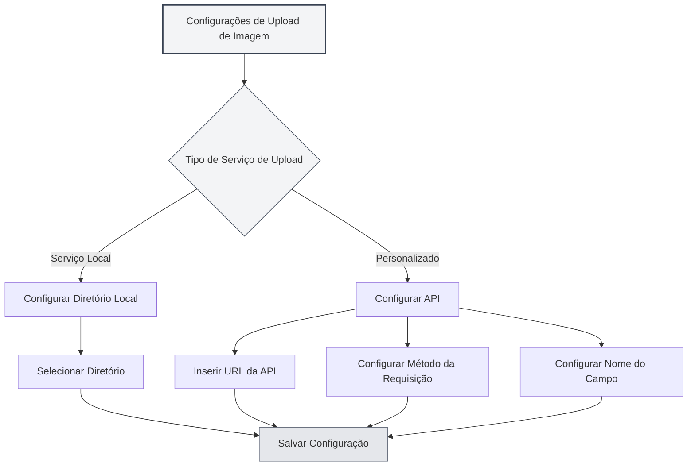

# Configurações do Serviço de Upload

## Visão Geral

As configurações do serviço de upload permitem que você configure o serviço de destino para o upload de imagens. O MetaDoc suporta dois tipos de serviços de upload: serviço local e API personalizada. Você pode escolher o serviço apropriado de acordo com suas necessidades.

## Tipos de Serviço de Upload

### Seleção de Serviço

Na página de configurações de imagem, quando a "Ação de inserção de imagem" está definida como "Upload", você pode selecionar o serviço de upload:

- **Serviço Local**: Salva a imagem em um diretório local
- **Personalizado**: Usa uma API personalizada para fazer upload da imagem

Você pode acessar as configurações de upload de imagem através da barra de menu superior:

<MenuItemsDemo mode="demo" :items='[{"id": "settings"}]' />



### Serviço Local

O serviço local salva a imagem no sistema de arquivos local:

- **Vantagens**: Controle totalmente local, segurança dos dados
- **Desvantagens**: Requer configuração de um diretório local
- **Cenários de Uso**: Uso local, requisitos altos de privacidade de dados

<SettingImageSection mode="demo" />

### Serviço Personalizado

O serviço personalizado usa uma API externa para fazer upload da imagem:

- **Vantagens**: Pode fazer upload para armazenamento em nuvem, image hosting, etc.
- **Desvantagens**: Requer configuração da interface da API
- **Cenários de Uso**: Necessidade de armazenamento em nuvem, CDN de imagens, etc.

<MainTabs mode="demo" />

## Configuração do Diretório de Imagens Local

### Definir Diretório

Ao usar o serviço local, é necessário configurar o diretório de salvamento das imagens:

1. Na página de configurações de imagem, selecione "Serviço Local"
2. Clique no botão "Procurar" para selecionar um diretório
3. Ou insira o caminho do diretório diretamente na caixa de entrada
4. Clique no botão "Abrir" para abrir o diretório no gerenciador de arquivos

### Seleção de Diretório

Ao selecionar o diretório de imagens:

- **Botão Procurar**: Abre a caixa de diálogo de seleção de diretório
- **Entrada de Caminho**: Insira o caminho do diretório diretamente
- **Botão Abrir**: Abre o diretório já configurado no gerenciador de arquivos

### Diretório Padrão

Se nenhum diretório de imagens local for configurado, o sistema usará o diretório padrão:

- **Windows**: `%APPDATA%/MetaDoc/images`
- **macOS**: `~/Library/Application Support/MetaDoc/images`
- **Linux**: `~/.config/MetaDoc/images`

<QuickStartPanel mode="demo" />

### Gerenciamento de Diretório

- **Visualizar Diretório**: Clique no botão "Abrir" para ver o conteúdo do diretório
- **Alterar Diretório**: Clique no botão "Procurar" para selecionar um novo diretório
- **Requisitos do Diretório**: Certifique-se de que o diretório existe e tem permissões de escrita

## Configuração da API de Upload Personalizada

### Configuração da URL da API

Ao usar o serviço personalizado, é necessário configurar o endereço da API:

1. Na página de configurações de imagem, selecione o serviço "Personalizado"
2. No campo de entrada "URL da API de Upload Personalizada", insira o endereço da API
3. Exemplo de formato: `https://api.exemplo.com/upload`

### Configuração do Método da API

Configure o método da requisição da API:

- **POST**: Usa o método POST para upload (recomendado)
- **PUT**: Usa o método PUT para upload

A maioria das APIs usa o método POST, algumas APIs específicas podem usar o método PUT.

### Configuração do Nome do Campo

Configure o nome do campo para o arquivo de upload:

- **Valor Padrão**: `file`
- **Personalizado**: Defina o nome do campo de acordo com os requisitos da API

APIs diferentes podem usar nomes de campo diferentes, como `file`, `image`, `upload`, etc.

### Exemplos de Configuração de API

**Exemplo 1: API de Image Hosting Padrão**

```
URL da API: https://api.exemplo.com/upload
Método: POST
Nome do Campo: file
```

**Exemplo 2: API com Nome de Campo Personalizado**

```
URL da API: https://api.exemplo.com/image
Método: POST
Nome do Campo: image
```

**Exemplo 3: API com Método PUT**

```
URL da API: https://api.exemplo.com/upload
Método: PUT
Nome do Campo: file
```

<ViewMenuItemsDemo mode="demo" :items='["home", "editor"]'
/>

## Formato da Resposta da API

### Requisitos da Resposta

A API personalizada precisa retornar uma resposta JSON no seguinte formato:

```json
{
  "success": true,
  "imagePath": "https://exemplo.com/image.png"
}
```

### Campos da Resposta

- **success**: Valor booleano, indica se o upload foi bem-sucedido
- **imagePath**: String, retorna a URL ou caminho da imagem

### Tratamento de Erros

Se o upload falhar, a API deve retornar:

```json
{
  "success": false,
  "message": "Mensagem de erro"
}
```

<DialogDemo mode="demo" dialogType="api-config" />

## Validação da Configuração

### Testar Configuração

Após configurar a API personalizada, é recomendado testar a configuração:

1. Insira uma imagem no documento
2. Verifique o resultado do upload
3. Se falhar, verifique se a configuração está correta

### Problemas Comuns

**Falha de Conexão**:

- Verifique se a URL da API está correta
- Verifique a conexão de rede
- Verifique se o serviço da API está funcionando normalmente

**Falha no Upload**:

- Verifique se o método da API está correto
- Verifique se o nome do campo está correto
- Verifique se o formato da resposta da API atende aos requisitos

**Problemas de Permissão**:

- Verifique se a API requer autenticação
- Verifique se a API Key ou Token está correta

<SettingBasicSection mode="demo" />

## Configuração do Serviço Local

### Permissões do Diretório

Ao usar o serviço local, certifique-se de que o diretório tem permissões de escrita:

- **Windows**: Verifique as configurações de permissão da pasta
- **macOS/Linux**: Verifique as permissões do diretório (chmod)

### Estrutura do Diretório

O serviço local salvará as imagens no diretório especificado:

- **Nomeação de Arquivos**: Usa timestamp + nome original do arquivo
- **Formato do Arquivo**: Mantém o formato original
- **Estrutura do Diretório**: Todas as imagens são salvas no mesmo diretório

<OcrWindow mode="demo" />

### Acesso às Imagens

As imagens do serviço local podem ser acessadas das seguintes formas:

- **Serviço HTTP**: Acessado através do caminho `/images/` do servidor em execução (o endereço padrão é configurado pelo aplicativo, por exemplo, `http://127.0.0.1:52521/images/`)
- **Caminho do Arquivo**: Usa diretamente o caminho do sistema de arquivos

## Melhores Práticas

1. **Uso Local**: Para uso local, recomenda-se o serviço local
2. **Armazenamento em Nuvem**: Use API personalizada quando precisar de armazenamento em nuvem
3. **Gerenciamento de Diretório**: Limpe regularmente o diretório de imagens para evitar uso excessivo de espaço
4. **Teste de API**: Teste a API personalizada após configurá-la
5. **Estratégia de Backup**: Recomenda-se fazer backup de imagens importantes

<MenuItemsDemo mode="demo" :items='[{"id": "file", "items": ["new", "open", "save"]}]' />

## Observações

1. **Configuração Efetiva**: As novas configurações só serão aplicadas a imagens inseridas após a alteração
2. **Compatibilidade da API**: Certifique-se de que a API personalizada atende aos requisitos de formato de resposta
3. **Permissões do Diretório**: Certifique-se de que o diretório local tem permissões de escrita
4. **Conexão de Rede**: A API personalizada requer conexão de rede
5. **Espaço de Armazenamento**: O serviço local ocupa espaço de armazenamento local

## Documentação Relacionada

- [[settings.image|Configuração de Upload de Imagem]]
- [[settings.basic|Configurações Básicas]]
- [[core.file-operations|Operações de Arquivo]]

<ResizableDivider mode="demo" />