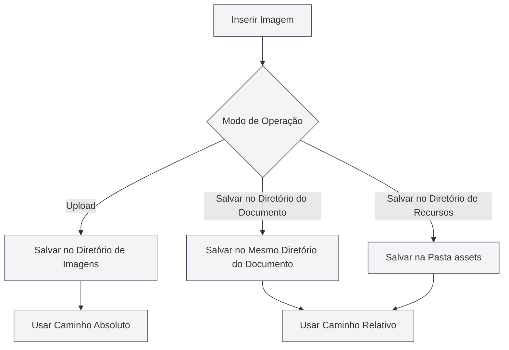

# Configuração de Upload de Imagens

## Visão Geral

A configuração de upload de imagens determina como as imagens são processadas ao serem inseridas em documentos. O MetaDoc suporta vários modos de processamento de imagens, permitindo que você escolha a configuração mais adequada às suas necessidades.

## Operação de Inserção de Imagens

### Modos de Operação

Ao inserir uma imagem, você pode escolher entre os seguintes modos de operação:

- **Upload**: Faz o upload da imagem para um diretório de imagens especificado.
- **Salvar no Diretório do Documento**: Salva a imagem no mesmo diretório onde o documento está localizado.
- **Salvar no Diretório de Recursos**: Salva a imagem na pasta `assets` dentro do diretório do documento.

Você pode acessar as configurações de imagem através da barra de menu superior:

<MenuItemsDemo mode="demo" :items='[{"id": "settings"}]' />

### Interface de Configuração de Imagens

A imagem abaixo mostra a interface completa da página de configurações de imagem:

<SettingImageSection mode="demo" />

A interface de configuração de imagens contém as seguintes áreas principais de configuração:

- **Serviço de Upload de Imagens**: Escolha entre armazenamento local ou serviço de hospedagem de imagens de terceiros.
- **Caminho de Armazenamento Local**: Define o diretório local onde as imagens serão salvas.
- **Processamento de Imagens da Web**: Configura opções como manter a URL original, fazer download automático, etc.

### Modo de Upload

O modo de upload salva a imagem no diretório de imagens local configurado:

- **Vantagens**: Gerencia centralmente todas as imagens, facilitando backup e migração.
- **Desvantagens**: Separa a imagem do documento; ao mover o documento, é necessário mover a imagem também.
- **Cenários de Uso**: Compartilhamento de imagens entre múltiplos documentos, gerenciamento centralizado de recursos de imagem.

<DialogDemo mode="demo" dialogType="image-upload" />

### Salvar no Diretório do Documento

Salva a imagem no mesmo diretório onde o documento está localizado:

- **Vantagens**: Imagem e documento ficam no mesmo diretório, facilitando o gerenciamento.
- **Desvantagens**: Cada diretório de documento terá suas próprias imagens, podendo haver duplicação.
- **Cenários de Uso**: Projetos de documento único, documentos que precisam ser empacotados de forma independente.

<DialogDemo mode="demo" dialogType="file-save" />

### Salvar no Diretório de Recursos

Salva a imagem na pasta `assets` dentro do diretório do documento:

- **Vantagens**: As imagens são armazenadas de forma unificada na pasta `assets`, mantendo a estrutura organizada.
- **Desvantagens**: Requer a criação da pasta `assets`.
- **Cenários de Uso**: Quando é necessária uma estrutura de arquivos clara, ou quando o documento precisa ser exportado e compartilhado.

<DialogDemo mode="demo" dialogType="folder-select" />

## Manter URL de Imagens da Web

### Descrição da Funcionalidade

Quando a opção "Manter URL de imagens da web" está ativada, ao inserir uma imagem da web, ela não é baixada, mas sim usada diretamente a partir da URL original:

- **Ativado**: Mantém a URL original da imagem da web, sem fazer download para o local.
- **Desativado**: Faz o download da imagem da web para o local, usando um caminho local.

### Cenários de Uso

- **Cenários para Ativar**:

  - O recurso de imagem é grande e não requer backup local.
  - A imagem é atualizada periodicamente e precisa exibir a versão mais recente em tempo real.
  - Para economizar espaço de armazenamento local.

- **Cenários para Desativar**:
  - É necessário acesso offline às imagens.
  - É necessário fazer backup dos recursos de imagem.
  - A imagem da web pode se tornar indisponível.

### Considerações

- Ao manter a URL da web, é necessária conexão com a internet para exibir a imagem.
- Se a imagem da web se tornar indisponível, a imagem no documento não será exibida.
- Para imagens importantes, recomenda-se desativar esta opção para garantir a disponibilidade da imagem.

## Escapar Automaticamente a URL da Imagem

### Descrição da Funcionalidade

Quando a opção "Escapar automaticamente a URL da imagem" está ativada, caracteres especiais nas URLs são automaticamente escapados ao inserir uma imagem:

- **Ativado**: Escapa automaticamente caracteres especiais na URL (como espaços, caracteres chineses, etc.).
- **Desativado**: Mantém a URL no seu formato original, sem realizar o escape.

### Regras de Escape

O sistema escapa automaticamente os seguintes caracteres:

- **Espaço**: Convertido para `%20`.
- **Caracteres Chineses**: Codificados para URL.
- **Caracteres Especiais**: Convertidos para um formato seguro para URL.

### Recomendações de Uso

- **Ativar**: Recomenda-se ativar para garantir que a URL seja interpretada corretamente em diversos ambientes.
- **Desativar**: Desative apenas quando tiver certeza de que o formato da URL está correto e não requer escape.

## Formato do Caminho

### Caminho Absoluto

Ao usar o modo de upload, a imagem usa um caminho absoluto:

- **Formato**: `/caminho/para/imagem.png`
- **Vantagens**: O caminho é explícito e não é afetado pela localização do documento.
- **Desvantagens**: O caminho se torna inválido se o documento ou a imagem for movido.

### Caminho Relativo

Ao usar os modos "Salvar no Diretório do Documento" ou "Salvar no Diretório de Recursos", a imagem usa um caminho relativo:

- **Formato**: `./imagem.png` ou `./assets/imagem.png`
- **Vantagens**: O documento e a imagem podem ser movidos juntos.
- **Desvantagens**: Se a localização do documento mudar, o caminho precisa ser ajustado.

## Aplicação da Configuração

### Momento de Efeito

As alterações na configuração de upload de imagens entram em vigor nas seguintes situações:

- **Novas imagens inseridas**: Usam a nova configuração imediatamente.
- **Documentos já abertos**: É necessário reabrir o documento para que as alterações tenham efeito.
- **Documentos já salvos**: Documentos já salvos não são afetados.

### Reabrir Arquivo

Algumas alterações de configuração exigem que o arquivo seja reaberto para entrarem em vigor:

1. Modifique a configuração de upload de imagens.
2. Feche o documento atual.
3. Reabra o documento.
4. A nova configuração entra em vigor.

## Melhores Práticas

1. **Gerenciamento Unificado**: Use o modo de upload para gerenciar imagens de forma centralizada.
2. **Documento Independente**: Quando o documento precisa ser independente, use o modo "Salvar no Diretório do Documento".
3. **Estrutura Clara**: Use o modo de diretório de recursos para manter uma estrutura de arquivos clara.
4. **Imagens da Web**: Para imagens importantes, recomenda-se desativar a opção de manter a URL.
5. **Escape de Caminho**: Recomenda-se ativar o escape automático para garantir compatibilidade.

## Considerações Importantes

1. **Aplicação da Configuração**: Algumas configurações exigem que o arquivo seja reaberto para entrarem em vigor.
2. **Formato do Caminho**: Observe a diferença entre caminhos absolutos e relativos.
3. **Imagens da Web**: Ao manter a URL da web, é necessária conexão com a internet.
4. **Backup de Imagens**: Para imagens importantes, desative a opção de manter a URL para garantir o backup.
5. **Espaço de Armazenamento**: O modo de upload consome espaço de armazenamento local.

## Documentação Relacionada

- [[settings.image-upload|Configurações do Serviço de Upload]]
- [[settings.basic|Configurações Básicas]]
- [[core.file-operations|Operações com Arquivos]]

<SettingImageSection mode="demo" />

<MenuItemsDemo mode="demo" :items='[{"id": "settings", "items": ["image"]}]' />

<DialogDemo mode="demo" dialogType="image-upload" />

<DialogDemo mode="demo" dialogType="file-save" />
