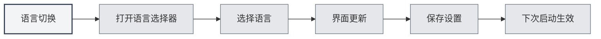

# Suporte Multilíngue

## Visão Geral

O MetaDoc oferece suporte a interface multilíngue, permitindo que você escolha o idioma de acordo com seus hábitos de uso. Após a troca de idioma, a interface será atualizada imediatamente para o idioma selecionado.

## Idiomas Suportados

Atualmente, o MetaDoc suporta os seguintes idiomas:

- **Chinês Simplificado** (zh_CN): Idioma padrão
- **English** (en_US): Inglês
- **日本語** (ja_JP): Japonês
- **한국어** (ko_KR): Coreano
- **Français** (fr_FR): Francês
- **Deutsch** (de_DE): Alemão

## Troca de Idioma

### Alterar Idioma

1. Clique no seletor de idioma na parte inferior do menu esquerdo
2. Selecione o idioma que deseja usar
3. A interface será atualizada imediatamente para o idioma selecionado

Você pode acessar as configurações de idioma através da barra de menu superior:

<MenuItemsDemo mode="demo" :items='[{"id": "settings"}]' />

<SettingBasicSection mode="demo" />

<SettingLlmSection mode="demo" />



### Salvamento do Idioma

O idioma selecionado é salvo automaticamente:

- **Salvamento Automático**: Salvo imediatamente após a seleção do idioma
- **Próxima Inicialização**: O aplicativo usará o último idioma selecionado na próxima vez que for iniciado
- **Sincronização de Múltiplas Janelas**: Todas as janelas sincronizarão automaticamente as configurações de idioma

<SettingThemeSection mode="demo" />

## Localização da Interface

### Escopo da Localização

A troca de idioma afeta os seguintes elementos da interface:

- **Itens de Menu**: Todos os menus e itens de menu
- **Texto dos Botões**: O texto de todos os botões
- **Diálogos**: Todos os diálogos e mensagens de prompt
- **Páginas de Configuração**: Rótulos e descrições de todas as páginas de configuração
- **Mensagens de Erro**: Mensagens de erro e aviso

### Idioma do Conteúdo

A configuração de idioma afeta apenas a linguagem da interface, não afetando:

- **Conteúdo do Documento**: O conteúdo do documento permanece inalterado
- **Caminhos de Arquivo**: Os caminhos dos arquivos permanecem inalterados
- **Entrada do Usuário**: O conteúdo inserido pelo usuário não é afetado

<ViewMenuItemsDemo mode="demo" :items='["settings"]' />

## Sugestões para Escolha de Idioma

### De Acordo com o Hábito de Uso

- **Usuários Chineses**: Use Chinês Simplificado para uma interface mais familiar
- **Usuários de Inglês**: Use English para corresponder ao hábito de uso
- **Outros Idiomas**: Escolha de acordo com sua preferência pessoal

### De Acordo com o Idioma do Documento

- **Documentos em Chinês**: Pode usar a interface em chinês
- **Documentos em Inglês**: Pode usar a interface em inglês
- **Documentos Multilíngues**: Escolha o idioma mais utilizado

## Efeito da Troca de Idioma

### Efeito Imediato

A troca de idioma entra em vigor imediatamente:

- **Atualização da Interface**: Todos os elementos da interface são atualizados imediatamente
- **Sem Reinicialização**: Não é necessário reiniciar o aplicativo
- **Manutenção do Estado**: O estado de edição atual não será perdido

<MainTabs mode="demo" />

### Sincronização de Múltiplas Janelas

Todas as janelas sincronizam automaticamente o idioma:

- **Janela Principal**: Troca de idioma na janela principal
- **Janelas Auxiliares**: Todas as janelas auxiliares são atualizadas em sincronia
- **Nova Janela**: As janelas recém-abertas usarão o idioma atual

## Arquivos de Idioma

### Localização dos Arquivos de Idioma

Os arquivos de idioma são armazenados no diretório do aplicativo:

- **Formato do Arquivo**: Formato JSON
- **Localização do Arquivo**: `src/renderer/src/locales/`
- **Nome do Arquivo**: Nomeado usando o código do idioma (ex: `zh_cn.json`)

### Estrutura do Arquivo de Idioma

Os arquivos de idioma utilizam uma estrutura de pares chave-valor:

```json
{
  "common": {
    "confirm": "确认",
    "cancel": "取消"
  },
  "setting": {
    "basic": "基础设置"
  }
}
```

## Observações

1. **Código do Idioma**: Os códigos de idioma usam o formato com sublinhado (ex: `zh_CN`)
2. **Integridade da Tradução**: Algumas novas funcionalidades podem ter tradução apenas parcial temporariamente
3. **Idioma de Fallback**: Se uma tradução estiver ausente, o sistema reverterá para o Chinês Simplificado
4. **Conteúdo do Documento**: A configuração de idioma não afeta o conteúdo do documento
5. **Caminhos de Arquivo**: A configuração de idioma não afeta a exibição dos caminhos de arquivo

## Documentação Relacionada

- [[settings.basic|Configurações Básicas]]
- [[quick-start.guide|Guia de Início Rápido]]

<ViewMenuItemsDemo mode="demo" :items='["settings"]' />