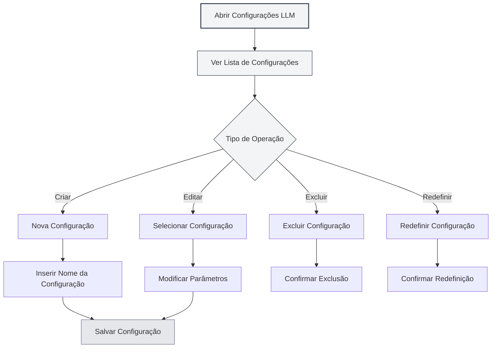

# Gerenciamento de Configurações de LLM

## Visão Geral

O gerenciamento de configurações de LLM permite que você crie, edite, exclua e gerencie múltiplas configurações de LLM. Através do gerenciamento de configurações, você pode configurar diferentes serviços de LLM para diferentes cenários de uso, alternando entre eles de forma flexível para atender a várias necessidades.

## Criar Configuração

### Criar Nova Configuração

1. Na página de configurações de LLM, clique no botão "Nova Configuração" (+ ícone) acima da lista de configurações à esquerda
2. Insira o nome da configuração na caixa de diálogo que aparece
3. O sistema criará uma nova configuração baseada nas configurações atuais
4. Após a criação bem-sucedida, o sistema alternará automaticamente para a nova configuração

Você pode acessar as configurações de LLM através da barra de menu superior:

<MenuItemsDemo mode="demo" :items='[{"id": "settings"}]' />

### Demonstração da Interface de Configuração

A figura abaixo mostra as principais funcionalidades da interface de gerenciamento de configurações de LLM:

<SettingLlmSection mode="demo" />

**Atenção**:

- O nome da configuração não pode estar vazio
- O nome da configuração deve ser descritivo para facilitar a identificação
- As novas configurações criadas herdarão todas as configurações atuais
- O tipo de configuração manual (manual) não suporta a criação de novas configurações



### Criar a Partir das Configurações Atuais

Ao criar uma nova configuração, o sistema irá:

- Copiar o tipo de LLM atualmente selecionado
- Copiar todos os parâmetros de configuração atuais (URL da API, Chave da API, modelo, etc.)
- Criar um novo ID de configuração
- Adicionar a nova configuração à lista de configurações

Você pode criar uma nova configuração baseada em uma configuração existente e depois modificar os parâmetros, permitindo criar rapidamente configurações semelhantes.

<DialogDemo mode="demo" dialogType="llm-config" />

## Editar Configuração

### Modificar Parâmetros da Configuração

1. Selecione a configuração que deseja editar na lista de configurações
2. Modifique os vários parâmetros no formulário à direita
3. Após a modificação, o sistema marcará como "Alterações não salvas"
4. Clique no botão "Salvar Alterações" para salvar as modificações

<DialogDemo mode="demo" dialogType="api-config" />

### Explicação dos Parâmetros de Configuração

Diferentes tipos de LLM têm parâmetros de configuração diferentes:

- **MetaDoc API**: Seleção de modelo
- **Ollama**: URL da API, seleção de modelo, número máximo de Tokens
- **Compatível com OpenAI**: URL da API, Chave da API, seleção de modelo, configuração de sufixo
- **OpenAI Oficial**: Chave da API, seleção de modelo
- **DeepSeek**: Chave da API, seleção de modelo
- **Gemini**: Chave da API, seleção de modelo

### Visualização em Tempo Real

Ao modificar os parâmetros de configuração, o sistema detecta as alterações em tempo real:

- Exibe um rótulo de aviso quando há alterações não salvas
- É possível clicar em "Descartar Alterações" a qualquer momento para reverter
- As alterações entram em vigor imediatamente após salvar

<AIChat mode="demo" />

## Excluir Configuração

### Excluir Configuração

1. Clique no botão "Mais" (ícone de três pontos) à direita do item de configuração
2. Selecione "Excluir Configuração"
3. Confirme a operação de exclusão

**Restrições**:

- É necessário manter pelo menos uma configuração; a última configuração não pode ser excluída
- A configuração padrão (isDefault) não pode ser excluída, apenas redefinida
- A operação de exclusão é irreversível; proceda com cautela

### Confirmação de Exclusão

Antes de excluir uma configuração, o sistema solicitará sua confirmação:

- Após a confirmação, a configuração será excluída permanentemente
- Se a configuração em uso for excluída, o sistema alternará automaticamente para outra configuração
- A exclusão é irreversível; certifique-se de que a configuração não é mais necessária

<DialogDemo mode="demo" dialogType="confirm-delete" />

## Redefinir Configuração

### Redefinir Configuração Padrão

Para configurações padrão (como "Ollama (padrão)"), você pode redefini-las para os valores iniciais:

1. Clique no botão "Mais" à direita do item de configuração
2. Selecione "Redefinir Configuração"
3. Confirme a operação de redefinição

Após a redefinição, a configuração retornará aos valores padrão originais de criação, e todas as modificações personalizadas serão removidas.

**Cenários de Aplicação**:

- A configuração foi modificada acidentalmente e precisa ser restaurada para os valores padrão
- Necessidade de redefinir após testar uma configuração
- Limpar configurações personalizadas desnecessárias

## Exportar Configuração

### Exportar Configuração Individual

1. Clique no botão "Mais" à direita do item de configuração
2. Selecione "Exportar Configuração"
3. O sistema gerará um arquivo de configuração no formato JSON
4. Salve o arquivo localmente

<DialogDemo mode="demo" dialogType="export-config" />

O arquivo de configuração exportado contém:

- ID e nome da configuração
- Tipo de LLM
- Todos os parâmetros de configuração
- Data de criação e atualização

### Exportar Todas as Configurações

1. Clique no botão "Exportar Todas as Configurações" (ícone de download) acima da lista de configurações
2. O sistema exportará todas as configurações para um único arquivo JSON
3. Salve o arquivo localmente

Exportar todas as configurações pode ser útil para:

- Fazer backup de todas as configurações
- Migrar para outro dispositivo
- Compartilhar configurações com outros usuários

## Importar Configuração

### Importar Configuração

1. Clique no botão "Importar Configuração" (ícone de cópia de documento) acima da lista de configurações
2. Selecione o arquivo de configuração exportado anteriormente
3. O sistema analisará e importará a configuração
4. A configuração importada será adicionada à lista de configurações

<DialogDemo mode="demo" dialogType="import-config" />

**Regras de Importação**:

- Suporta a importação de uma configuração individual ou de um array de configurações
- Se o ID da configuração importada já existir, um novo ID será criado para evitar conflitos
- Após a importação, é necessário alternar manualmente para a nova configuração

### Formato de Importação

O arquivo de configuração deve estar no formato JSON, suportando as seguintes estruturas:

```json
{
  "id": "config-xxx",
  "name": "Nome da Configuração",
  "type": "ollama",
  "ollama": {
    "apiUrl": "http://localhost:11434/api",
    "selectedModel": "llama2"
  }
}
```

Ou um array de configurações:

```json
[
  { "id": "config-1", ... },
  { "id": "config-2", ... }
]
```

## Ordenação de Configurações

### Ordenação por Arrastar e Soltar

A lista de configurações suporta ordenação por arrastar e soltar:

1. Clique e segure o item de configuração
2. Arraste-o para a posição desejada
3. Solte o botão do mouse para concluir a ordenação

A ordem após a ordenação será salva e mantida na próxima vez que você abrir a página de configurações.

**Cenários de Uso**:

- Colocar configurações usadas frequentemente no topo
- Ordenar por frequência de uso
- Agrupar por tipo de LLM

## Status da Configuração

### Configuração Atual

A configuração atualmente em uso irá:

- Ser destacada na lista
- Exibir o rótulo "Alterações não salvas" (se houver modificações não salvas)
- Ser utilizada por todas as funcionalidades de IA para o serviço de LLM

### Alternância de Configuração

Ao alternar entre configurações:

- O sistema verificará se a configuração atual tem alterações não salvas
- Se houver alterações não salvas, é recomendável salvá-las ou descartá-las primeiro
- A alternância entra em vigor imediatamente; todas as funcionalidades de IA usarão a nova configuração

## Melhores Práticas

1. **Padrão de Nomenclatura**: Use nomes de configuração claros, como "Trabalho-Ollama", "Experimento-OpenAI"
2. **Backup Regular**: Exporte e faça backup de configurações importantes periodicamente
3. **Testar Configuração**: Teste novas configurações após criá-las e use-as apenas após confirmar que funcionam
4. **Limpar Configurações Inúteis**: Exclua regularmente configurações que não são mais usadas para manter a lista organizada
5. **Documentar**: Adicione notas ou documentação para configurações complexas

## Atenção

1. **Segurança da Configuração**: Mantenha configurações que contenham Chaves de API em segurança e não as compartilhe
2. **Conflitos de Configuração**: Preste atenção a conflitos de ID ao importar configurações
3. **Configuração Padrão**: Configurações padrão não podem ser excluídas, apenas redefinidas
4. **Dependências de Configuração**: Algumas funcionalidades podem depender de configurações específicas; verifique antes de excluir
5. **Sincronização Multijanela**: As modificações nas configurações serão sincronizadas entre todas as janelas

## Documentação Relacionada

- [[settings.llm|Configurações de LLM]]
- [[settings.llm-types|Configuração de Tipos de LLM]]
- [[ai.chat|Funcionalidade de Conversa com IA]]
- [[agent.config|Gerenciamento de Configurações de Agente]]

<QuickStartPanel mode="demo" />

<MainTabs mode="demo" />