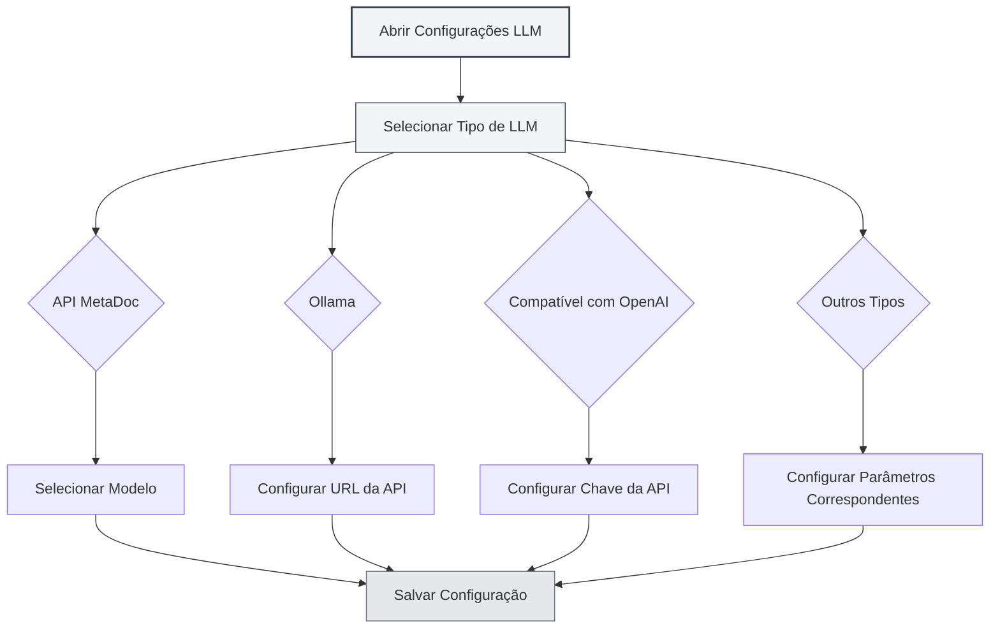

# Configuração de Tipos de LLM

## Visão Geral

O MetaDoc suporta vários provedores de serviços de LLM, cada tipo com requisitos de configuração diferentes. Este documento explica como configurar os diversos tipos de LLM, incluindo API MetaDoc, Ollama, OpenAI, DeepSeek e Gemini.

## API MetaDoc

### Instruções de Configuração

A API MetaDoc é o serviço de LLM oficial fornecido pelo MetaDoc, de uso simples e sem necessidade de configurar chaves de API.

### Passos de Configuração

1.  No menu suspenso de tipo de LLM, selecione "MetaDoc"
2.  No menu suspenso "Selecionar modelo", escolha um modelo disponível
3.  Configure o número máximo de Tokens (opcional)

Você pode acessar as configurações de LLM através da barra de menu superior:

<MenuItemsDemo mode="demo" :items='[{"id": "settings"}]' />

### Demonstração da Interface de Configuração de LLM

A imagem abaixo mostra as principais áreas funcionais da página de configuração de LLM:

<SettingLlmSection mode="demo" />

### Requisitos de Configuração

-   **Conta de Login**: É necessário fazer login em uma conta MetaDoc para usar
-   **Seleção de Modelo**: Escolha a partir da lista de modelos disponíveis
-   **Número Máximo de Tokens**: Opcional, limita o número máximo de Tokens por solicitação

<MainTabs mode="demo" />

### Cenários de Aplicação

-   Início rápido do uso de funcionalidades de IA
-   Não requer configuração de serviços externos
-   Uso do serviço oficial do MetaDoc

<DialogDemo mode="demo" dialogType="llm-config" />

## Ollama

### Instruções de Configuração

O Ollama é um ambiente de execução de LLM local, permitindo executar modelos de linguagem grandes localmente, sem necessidade de conexão com a internet.

### Passos de Configuração

1.  No menu suspenso de tipo de LLM, selecione "Ollama"
2.  Configure a URL base da API (padrão: `http://localhost:11434/api`)
3.  Clique no menu suspenso "Selecionar modelo", o sistema obterá automaticamente a lista de modelos disponíveis localmente
4.  Selecione o modelo a ser usado
5.  Configure o número máximo de Tokens (opcional)

### Requisitos de Configuração

-   **Instalação do Ollama**: É necessário instalar o Ollama e iniciar o serviço primeiro
-   **URL da API**: O padrão é `http://localhost:11434/api`. Se o Ollama estiver rodando em outro endereço, é necessário modificá-lo
-   **Download do Modelo**: É necessário baixar o modelo usando o Ollama primeiro (ex.: `ollama pull llama2`)

### Obter Lista de Modelos

Ao clicar no menu suspenso "Selecionar modelo", o MetaDoc se conectará automaticamente ao serviço Ollama e obterá a lista de modelos disponíveis. Se a conexão falhar, verifique:

-   Se o serviço Ollama está em execução
-   Se a URL da API está correta
-   Se a conexão de rede está normal

### Cenários de Aplicação

-   Execução local de LLM, protegendo a privacidade dos dados
-   Não requer conexão com a internet
-   Possui recursos computacionais suficientes (GPU recomendada)

<DialogDemo mode="demo" dialogType="api-config" />

## Compatível com OpenAI

### Instruções de Configuração

A API compatível com OpenAI suporta todos os serviços compatíveis com o formato de API da OpenAI, incluindo a API oficial da OpenAI e serviços de terceiros compatíveis.

### Passos de Configuração

1.  No menu suspenso de tipo de LLM, selecione "Compatível com OpenAI"
2.  Configure a URL base da API (padrão: `https://api.openai.com/v1`)
3.  Insira a Chave da API
4.  Clique no menu suspenso "Selecionar modelo" para obter a lista de modelos disponíveis
5.  Selecione o modelo a ser usado
6.  Configure o sufixo de Completion e o sufixo de Chat (opcional, para personalizar o caminho da API)
7.  Configure o número máximo de Tokens (opcional)

### Requisitos de Configuração

-   **URL da API**: Endereço da API oficial da OpenAI ou de serviço compatível
-   **Chave da API**: Chave de API obtida do provedor do serviço
-   **Lista de Modelos**: O sistema obterá automaticamente a lista de modelos disponíveis

### Configuração de Sufixos da API

Alguns serviços compatíveis podem exigir caminhos de API personalizados:

-   **Sufixo de Completion**: Sufixo de caminho personalizado para a API de Completion
-   **Sufixo de Chat**: Sufixo de caminho personalizado para a API de Chat

Na maioria dos casos, não é necessário configurar, basta usar os valores padrão.

### Cenários de Aplicação

-   Uso da API oficial da OpenAI
-   Uso de serviços de terceiros compatíveis com a API da OpenAI
-   Serviços que requerem caminhos de API personalizados

<QuickStartPanel mode="demo" />

<MainTabs mode="demo" />

## OpenAI Oficial

### Instruções de Configuração

A configuração oficial da OpenAI é especificamente para a API oficial da OpenAI, com configuração mais simples e URL da API fixa.

### Passos de Configuração

1.  No menu suspenso de tipo de LLM, selecione "OpenAI Oficial"
2.  Insira a Chave da API da OpenAI
3.  Clique no menu suspenso "Selecionar modelo" para obter a lista de modelos disponíveis
4.  Selecione o modelo a ser usado
5.  Configure o número máximo de Tokens (opcional)

### Requisitos de Configuração

-   **Chave da API**: Chave de API obtida no site oficial da OpenAI
-   **URL da API**: Fixada como `https://api.openai.com/v1`, não pode ser modificada

### Obter Chave da API

1.  Acesse o [site oficial da OpenAI](https://platform.openai.com/)
2.  Registre-se ou faça login em uma conta
3.  Acesse a página de API Keys
4.  Crie uma nova Chave da API
5.  Copie a Chave da API e cole-a na configuração do MetaDoc

<ResizableDivider mode="demo" />

### Cenários de Aplicação

-   Uso dos modelos GPT oficiais da OpenAI
-   Necessidade de serviço oficial estável
-   Possui conta OpenAI e cota de API

## DeepSeek

### Instruções de Configuração

O DeepSeek é um provedor de serviços de LLM de alto desempenho, oferecendo forte capacidade de compreensão em chinês.

### Passos de Configuração

1.  No menu suspenso de tipo de LLM, selecione "DeepSeek"
2.  Insira a Chave da API do DeepSeek
3.  Selecione o modelo (deepseek-chat ou deepseek-reasoner)
4.  Configure o número máximo de Tokens (opcional)

### Requisitos de Configuração

-   **Chave da API**: Chave de API obtida no site oficial do DeepSeek
-   **Seleção de Modelo**:
    -   `deepseek-chat`: Modelo de diálogo geral
    -   `deepseek-reasoner`: Modelo de raciocínio

### Obter Chave da API

1.  Acesse o [site oficial do DeepSeek](https://www.deepseek.com/)
2.  Registre-se ou faça login em uma conta
3.  Acesse a página de API Keys
4.  Crie uma nova Chave da API
5.  Copie a Chave da API e cole-a na configuração do MetaDoc

### Cenários de Aplicação

-   Necessidade de forte capacidade de compreensão em chinês
-   Necessidade de capacidade de raciocínio (use deepseek-reasoner)
-   Serviço de LLM com boa relação custo-benefício

<SettingKnowledgeBaseSection mode="demo" />

<CompletionSettingsPanel mode="demo" />

## Gemini

### Instruções de Configuração

O Gemini é o serviço de LLM fornecido pelo Google, com suporte a capacidades multimodais.

### Passos de Configuração

1.  No menu suspenso de tipo de LLM, selecione "Gemini"
2.  Insira a Chave da API do Gemini
3.  Clique no menu suspenso "Selecionar modelo" para obter a lista de modelos disponíveis
4.  Selecione o modelo a ser usado
5.  Configure o número máximo de Tokens (opcional)

### Requisitos de Configuração

-   **Chave da API**: Chave de API obtida no Google AI Studio
-   **Seleção de Modelo**: O sistema obterá automaticamente a lista de modelos disponíveis

### Obter Chave da API

1.  Acesse o [Google AI Studio](https://makersuite.google.com/app/apikey)
2.  Faça login com uma conta do Google
3.  Crie uma nova Chave da API
4.  Copie a Chave da API e cole-a na configuração do MetaDoc

### Cenários de Aplicação

-   Uso do serviço de LLM do Google
-   Necessidade de capacidades multimodais
-   Possui conta do Google

<AgentView mode="demo" />

## Configuração do Número Máximo de Tokens

### Descrição da Funcionalidade

O número máximo de Tokens limita a quantidade máxima de Tokens que podem ser gerados em uma única solicitação. Ativar esta funcionalidade permite:

-   Controlar o comprimento do conteúdo gerado
-   Economizar custos da API
-   Evitar a geração de conteúdo excessivamente longo

### Método de Configuração

1.  Ative o interruptor "Número Máximo de Tokens"
2.  Defina a quantidade de Tokens (intervalo: 1-32768)
3.  Salve a configuração

### Sugestões de Uso

-   **Geração de Texto Curto**: 100-500 tokens
-   **Comprimento Médio**: 500-2000 tokens
-   **Geração de Texto Longo**: 2000-8000 tokens
-   **Sem Limite**: Desative esta opção

## Validação da Configuração

### Testar Configuração

Após concluir a configuração, é recomendável testar se ela está funcionando normalmente:

1.  Salve a configuração
2.  Ative a funcionalidade de LLM
3.  Tente usar a funcionalidade de diálogo com IA
4.  Se ocorrer um erro, verifique se a configuração está correta

### Problemas Comuns

**Falha na Conexão**:

-   Verifique se a URL da API está correta
-   Verifique a conexão de rede
-   Verifique se o serviço está funcionando normalmente

**Falha na Autenticação**:

-   Verifique se a Chave da API está correta
-   Verifique se a Chave da API expirou
-   Verifique se a conta tem cota suficiente

**Modelo Indisponível**:

-   Verifique se o nome do modelo está correto
-   Verifique se a conta tem permissão para usar esse modelo
-   Verifique se o serviço suporta esse modelo

## Observações

1.  **Segurança da Chave da API**: Guarde bem suas chaves de API, não as compartilhe com outras pessoas
2.  **Controle de Custos**: O uso de APIs externas pode gerar custos, fique atento ao volume de uso
3.  **Requisitos de Rede**: O uso de APIs externas requer uma conexão de rede estável
4.  **Disponibilidade do Serviço**: A disponibilidade e estabilidade podem variar entre diferentes serviços
5.  **Seleção de Modelo**: Diferentes modelos têm diferentes capacidades e limitações, escolha de acordo com sua necessidade

## Documentação Relacionada

-   [[settings.llm|Configuração de LLM]]
-   [[settings.llm-management|Gerenciamento de Configuração de LLM]]
-   [[ai.chat|Funcionalidade de Diálogo com IA]]
-   [[ai.completion|Auto-completar com IA]]

<MenuItemsDemo mode="demo" :items='[{"id": "file"}]' />

<ViewMenuItemsDemo mode="demo" :items='["settings"]' />

<SettingLlmSection mode="demo" />

<DialogDemo mode="demo" dialogType="llm-config" />

<MainTabs mode="demo" />