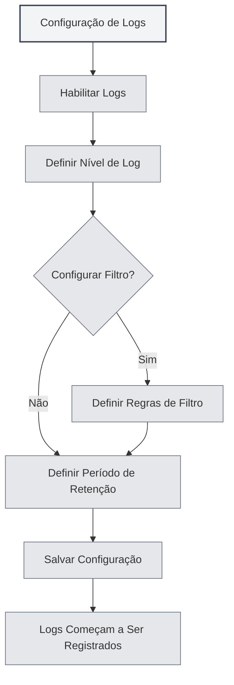

# Configuração de Logs

## Visão Geral

A configuração de logs permite gerenciar a funcionalidade de registro do MetaDoc. Ao configurar os logs, você pode registrar o estado de execução do aplicativo, facilitando a solução de problemas e a análise de desempenho.

<Demo component="SettingLoggerSection" mode="demo" />

## Habilitar Logs

### Ativar a funcionalidade de logs

Na página de configurações de log, primeiro é necessário habilitar a funcionalidade de logs:

1.  Encontre o interruptor "Habilitar logs"
2.  Mude o interruptor para o estado "Habilitado"
3.  Os logs começarão a ser registrados em arquivo

Você pode acessar as configurações de log através da barra de menu superior:

<MenuItemsDemo mode="demo" :items='[{"id": "settings"}]' />

Após habilitar os logs, o sistema registrará informações de execução do aplicativo, incluindo:

-   Registros de operações
-   Informações de erro
-   Informações de aviso
-   Informações de depuração (se habilitadas)



**Atenção**:

-   Os logs ocupam espaço em disco
-   Recomenda-se habilitá-los apenas quando necessário para solucionar problemas
-   Em ambiente de produção, podem ser desativados para reduzir o consumo de recursos

## Nível de Log

### Descrição dos Níveis

O nível de log determina quais níveis de log serão registrados:

<ConsoleTerminal mode="demo" consoleKey="log-levels" :history='[{"content": "[INFO] 应用启动完成", "type": "out"}, {"content": "[DEBUG] 加载配置文件", "type": "out"}, {"content": "[WARN] 配置项缺失，使用默认值", "type": "warn"}, {"content": "[ERROR] 连接失败，正在重试...", "type": "error"}]' />

-   **DEBUG**: Informações detalhadas de depuração, incluindo todos os detalhes das operações
-   **INFO**: Informações gerais, registrando operações e estados importantes
-   **WARN**: Informações de aviso, registrando possíveis problemas
-   **ERROR**: Informações de erro, registrando erros e exceções

### Prioridade dos Níveis

Os níveis de log têm uma relação de prioridade:

```
DEBUG < INFO < WARN < ERROR
```

Ao selecionar um nível, serão registrados os logs desse nível e dos níveis superiores. Por exemplo:

-   Selecionar INFO: registra INFO, WARN, ERROR
-   Selecionar WARN: registra apenas WARN, ERROR
-   Selecionar ERROR: registra apenas ERROR

### Sugestões para Escolha do Nível

-   **Desenvolvimento/Depuração**: Use o nível DEBUG para obter informações detalhadas
-   **Uso Diário**: Use o nível INFO para registrar operações importantes
-   **Solução de Problemas**: Use o nível WARN para focar em avisos e erros
-   **Ambiente de Produção**: Use o nível ERROR para registrar apenas erros

<SettingLoggerSection mode="demo" />

## Filtro de Logs

### Funcionalidade de Filtro

O filtro de logs permite registrar apenas logs de um escopo específico:

-   **Filtrar por escopo**: Registrar apenas logs de módulos específicos
-   **Correspondência por prefixo**: Suporta correspondência por prefixo, por exemplo, "ai-graph" corresponderá a todos os escopos que começam com "ai-graph"
-   **Correspondência exata**: Suporta correspondência exata, por exemplo, "[ai-graph][WorkflowTool]"

### Regras de Filtro

As regras de filtro suportam os seguintes formatos:

-   **Correspondência simples**: `ai-graph` - Corresponde a todos os escopos que contêm "ai-graph"
-   **Correspondência por prefixo**: `ai-` - Corresponde a todos os escopos que começam com "ai-"
-   **Correspondência exata**: `[ai-graph][WorkflowTool]` - Corresponde exatamente a esse escopo

### Cenários de Uso

-   **Depurar um módulo específico**: Registrar apenas os logs de um determinado módulo
-   **Reduzir o volume de logs**: Filtrar logs que não são de interesse
-   **Localizar problemas**: Concentrar-se nos logs de uma funcionalidade específica

<SettingDebugSection mode="demo" />

### Exemplos de Filtro

**Exemplo 1: Registrar apenas logs relacionados a IA**

```
Condição de filtro: ai-
```

**Exemplo 2: Registrar apenas logs de fluxo de trabalho**

```
Condição de filtro: workflow
```

**Exemplo 3: Registrar apenas logs de uma ferramenta específica**

```
Condição de filtro: [ai-graph][WorkflowTool]
```

## Período de Retenção de Logs

### Configuração do Período de Retenção

O período de retenção de logs determina por quanto tempo os arquivos de log são mantidos:

-   **Não reter**: Não limpa os logs automaticamente
-   **1 dia**: Retém logs por 1 dia
-   **3 dias**: Retém logs por 3 dias
-   **7 dias**: Retém logs por 7 dias
-   **1 mês**: Retém logs por 1 mês
-   **3 meses**: Retém logs por 3 meses
-   **6 meses**: Retém logs por 6 meses
-   **1 ano**: Retém logs por 1 ano
-   **Permanente**: Retém logs permanentemente

### Limpeza Automática

Após definir o período de retenção, o sistema limpará automaticamente os arquivos de log expirados:

-   **Momento da limpeza**: A limpeza é executada imediatamente ao alterar o período de retenção
-   **Regra de limpeza**: Exclui arquivos de log que excederam o período de retenção
-   **Escopo da limpeza**: Limpa apenas os arquivos no diretório de logs

<ConsoleTerminal mode="demo" consoleKey="cleanup" :history='[{"content": "[INFO] 开始清理过期日志文件...", "type": "out"}, {"content": "[INFO] 删除: 2026-02-10 10-30-45.log (超过保留期限)", "type": "out"}, {"content": "[INFO] 删除: 2026-02-11 14-20-30.log (超过保留期限)", "type": "out"}, {"content": "[INFO] 清理完成，共删除 2 个文件", "type": "out"}]' />

### Sugestões de Escolha

-   **Ambiente de Desenvolvimento**: Use um período de retenção curto (1-3 dias)
-   **Ambiente de Produção**: Use um período de retenção médio (7 dias - 1 mês)
-   **Projetos Importantes**: Use um período de retenção longo (3-6 meses)
-   **Requisitos de Auditoria**: Use retenção permanente

## Caminho do Arquivo de Log

### Visualizar o Caminho do Log

Na página de configurações de log, você pode visualizar:

-   **Caminho do arquivo de log**: O caminho completo do arquivo de log atual
-   **Caminho do diretório de logs**: O caminho do diretório onde os arquivos de log estão localizados

### Abrir Arquivo de Log

1.  Na página de configurações de log, encontre "Caminho do arquivo de log"
2.  Clique no botão "Abrir arquivo de log"
3.  O sistema abrirá o arquivo de log com o editor de texto padrão

### Abrir Diretório de Logs

1.  Na página de configurações de log, encontre "Diretório de logs"
2.  Clique no botão "Abrir diretório de logs"
3.  O sistema abrirá o diretório de logs no gerenciador de arquivos

<ViewMenuItemsDemo mode="demo" :items='["home", "editor"]'
/>

## Console de Logs

### Visualizar Logs em Tempo Real

A página de configurações de log fornece um console de logs para visualização em tempo real:

-   **Exibição em tempo real**: Exibe as entradas de log mais recentes
-   **Histórico**: Exibe o histórico recente de logs (máximo de 500 entradas)
-   **Nível de log**: Logs de diferentes níveis são exibidos em cores diferentes

<ConsoleTerminal mode="demo" consoleKey="realtime-logs" :history='[{"content": "[2026-02-24 10:30:15] [INFO] [main][App] 应用启动完成", "type": "out"}, {"content": "[2026-02-24 10:30:16] [DEBUG] [renderer][Editor] 编辑器初始化", "type": "out"}, {"content": "[2026-02-24 10:30:18] [INFO] [renderer][Workspace] 加载工作目录", "type": "out"}]' />

### Funcionalidades do Console

-   **Visualizar logs**: Ver os logs do aplicativo em tempo real
-   **Filtrar exibição**: Filtrar a exibição com base no nível de log
-   **Pesquisar logs**: Pesquisar conteúdo nos logs dentro do console

## Formato do Arquivo de Log

### Nomenclatura do Arquivo

Os arquivos de log usam o seguinte formato de nome:

```
YYYY-MM-DD HH-mm-ss.log
```

Exemplo: `2026-02-19 14-30-45.log`

### Formato do Log

Cada entrada de log contém as seguintes informações:

-   **Timestamp**: Hora em que o log foi registrado
-   **Nível**: Nível do log (DEBUG/INFO/WARN/ERROR)
-   **Tipo de processo**: main (processo principal) ou renderer (processo de renderização)
-   **Escopo**: Módulo ou componente de origem do log
-   **Mensagem**: Conteúdo da mensagem do log

### Exemplo de Log

```
[2026-02-19 14:30:45] [INFO] [main][Logger] 日志配置更新: enabled=true, level=info
[2026-02-19 14:30:46] [DEBUG] [renderer][Editor] 文档已保存
[2026-02-19 14:30:47] [WARN] [main][RAG] 知识库文件未找到
[2026-02-19 14:30:48] [ERROR] [renderer][LLM] API调用失败
```

<ConsoleTerminal mode="demo" consoleKey="log-examples" :history='[{"content": "[2026-02-19 14:30:45] [INFO] [main][Logger] 日志配置更新: enabled=true, level=info", "type": "out"}, {"content": "[2026-02-19 14:30:46] [DEBUG] [renderer][Editor] 文档已保存", "type": "out"}, {"content": "[2026-02-19 14:30:47] [WARN] [main][RAG] 知识库文件未找到", "type": "warn"}, {"content": "[2026-02-19 14:30:48] [ERROR] [renderer][LLM] API调用失败", "type": "error"}]' />

## Melhores Práticas

1.  **Definir nível adequadamente**: Escolha o nível de log apropriado de acordo com o cenário de uso
2.  **Usar filtros**: Use a funcionalidade de filtro para reduzir o volume de logs
3.  **Limpar periodicamente**: Defina um período de retenção razoável para evitar ocupar muito espaço
4.  **Solução de problemas**: Ao encontrar problemas, aumente temporariamente o nível de log para obter informações detalhadas
5.  **Backup de logs**: Recomenda-se fazer backup de logs importantes

<MainTabs mode="demo" />

## Atenção

1.  **Espaço em disco**: Os logs ocupam espaço em disco, atenção à limpeza periódica
2.  **Impacto no desempenho**: O nível DEBUG pode afetar o desempenho, recomenda-se usar apenas durante a depuração
3.  **Privacidade e segurança**: Os logs podem conter informações sensíveis, atenção à proteção dos arquivos de log
4.  **Permissões de arquivo**: Certifique-se de que o diretório de logs tenha permissão de escrita
5.  **Localização dos logs**: A localização dos arquivos de log é gerenciada automaticamente pelo sistema, não é recomendado modificá-la manualmente

## Documentação Relacionada

-   [[settings.basic|Configurações Básicas]]
-   [[settings.about|Informações Sobre]]


<ResizableDivider mode="demo" />
