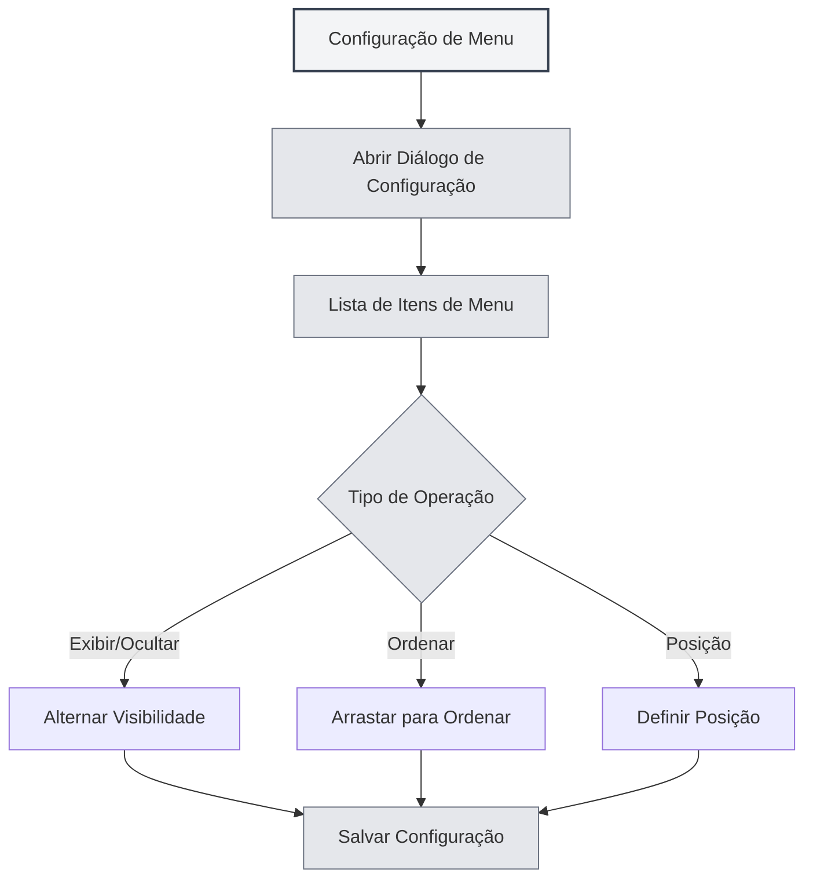

# Configuração de Menu

## Visão Geral

A funcionalidade de configuração de menu permite personalizar a exibição e a ordem do menu lateral. Através da configuração de menu, você pode ocultar itens desnecessários, ajustar a ordem dos itens, definir a posição dos menus e criar um layout de interface personalizado.

## Abrir a Configuração de Menu

### Formas de Acesso

Você pode abrir a configuração de menu das seguintes formas:

- **Página de Configurações**: Pode haver uma entrada para configuração de menu na página de configurações
- **Opção de Menu**: Pode haver uma opção de configuração de menu em "Mais Funcionalidades" no menu lateral
- **Menu de Contexto (Clique Direito)**: Alguns itens de menu podem ter opções de configuração

Você pode acessar a configuração de menu através da barra de menu superior:

<MenuItemsDemo mode="demo" :items='[{"id": "settings"}]' />

## Gerenciamento de Itens de Menu

### Lista de Itens de Menu

A página de configuração de menu exibe todos os itens de menu configuráveis:

- **Nome do Item**: Exibe o nome do item de menu
- **Visibilidade**: Indica se o item de menu está visível
- **Posição**: Exibe a posição do item (topo/base)
- **Identificador Principal**: Identifica os itens de menu principais (não podem ser ocultados)

### Tipos de Itens de Menu

Os itens de menu são divididos em dois tipos:

- **Itens de Menu Principais**: Itens que devem ser exibidos, não podem ser ocultados
  - Página Inicial
  - Arquivo
  - Configurações
  - Mais Funcionalidades
  - Sair
- **Itens de Menu Comuns**: Itens que podem ser ocultados
  - Assistente de IA
  - Arquivos Recentes
  - Base de Conhecimento
  - Diretório de Trabalho
  - Manual do Usuário
  - Feedback do Usuário
  - Estatísticas de LLM
  - Ferramentas de Depuração (ambiente de desenvolvimento)

## Exibir/Ocultar Itens de Menu

### Ocultar Itens de Menu

Você pode ocultar itens de menu desnecessários:

1. **Abrir Configuração**: Abra o diálogo de configuração de menu
2. **Localizar o Item**: Encontre o item de menu que deseja ocultar
3. **Alternar Visibilidade**: Mude o interruptor de visibilidade do item
4. **Salvar Configuração**: Clique no botão "Salvar" para salvar a configuração

<DialogDemo mode="demo" dialogType="menu-config" />

### Exibir Itens de Menu

Você pode exibir itens de menu que foram ocultados:

1. **Abrir Configuração**: Abra o diálogo de configuração de menu
2. **Localizar o Item**: Encontre o item de menu que deseja exibir
3. **Alternar Visibilidade**: Mude o interruptor de visibilidade do item
4. **Salvar Configuração**: Clique no botão "Salvar" para salvar a configuração

### Restrições para Itens Principais

Itens de menu principais não podem ser ocultados:

- **Exibição Obrigatória**: Itens principais são sempre exibidos
- **Não Podem Ser Ocultados**: O interruptor de visibilidade dos itens principais fica desabilitado
- **Restauração Automática**: Se tentar ocultar um item principal, ele será automaticamente restaurado para o estado visível

## Ordenação de Itens de Menu

### Ordenação por Arrastar

Você pode ajustar a ordem dos itens de menu arrastando-os:

1. **Abrir Configuração**: Abra o diálogo de configuração de menu
2. **Arrastar o Item**: Clique e arraste a alça de arraste do item de menu
3. **Ajustar Posição**: Arraste o item para a posição desejada
4. **Salvar Configuração**: Clique no botão "Salvar" para salvar a configuração

### Regras de Ordenação

A ordenação dos itens de menu segue as seguintes regras:

- **Agrupamento por Posição**: Itens do topo e da base são ordenados separadamente
- **Linha Divisória**: Uma linha divisória é exibida entre os itens do topo e da base
- **Ajuste Automático**: Arrastar para uma posição diferente ajusta automaticamente o atributo de posição

## Configuração da Posição do Menu

### Tipos de Posição

Os itens de menu podem ser configurados em duas posições:

- **Topo**: Exibido na área superior da barra de menu
- **Base**: Exibido na área inferior da barra de menu

### Definir Posição

Você pode definir a posição de um item de menu:

1. **Abrir Configuração**: Abra o diálogo de configuração de menu
2. **Arrastar para a Posição**: Arraste o item de menu para a área do topo ou da base
3. **Ajuste Automático**: O sistema ajusta automaticamente o atributo de posição
4. **Salvar Configuração**: Clique no botão "Salvar" para salvar a configuração

<LeftMenu mode="demo" />

### Linha Divisória de Posição

Uma linha divisória é exibida entre o topo e a base:

- **Exibição Automática**: A linha divisória é exibida automaticamente se houver itens no topo e na base
- **Não Arrastável**: A linha divisória não pode ser arrastada, serve para separação visual
- **Ocultação Automática**: A linha divisória é ocultada automaticamente se houver itens apenas no topo ou apenas na base

## Salvamento da Configuração

### Salvamento Automático

Algumas operações salvam a configuração automaticamente:

- **Alternância de Visibilidade**: Salva automaticamente ao alternar a visibilidade de um item
- **Ajuste de Posição**: Salva automaticamente ao ajustar a posição de um menu

### Salvamento Manual

Você também pode salvar a configuração manualmente:

1. **Ajustar Configuração**: Ajuste a ordem e a visibilidade dos itens de menu
2. **Clicar em Salvar**: Clique no botão "Salvar"
3. **Configuração Ativa**: A configuração entra em vigor imediatamente

### Redefinir Configuração

Você pode redefinir a configuração do menu:

1. **Abrir Configuração**: Abra o diálogo de configuração de menu
2. **Clicar em Redefinir**: Clique no botão "Redefinir"
3. **Confirmar Redefinição**: Confirme a operação de redefinição
4. **Restaurar Padrão**: A configuração será restaurada para o estado padrão

**Atenção**:

- A operação de redefinição não pode ser desfeita
- Após a redefinição, os itens de menu principais permanecerão visíveis

<DialogDemo mode="demo" dialogType="confirm-reset" />

## Persistência da Configuração

### Armazenamento da Configuração

A configuração do menu é salva localmente:

- **Armazenamento Local**: A configuração é salva nas configurações locais
- **Carregamento Automático**: A configuração é carregada automaticamente na próxima inicialização do aplicativo
- **Sincronização entre Janelas**: A configuração é sincronizada entre todas as janelas

### Migração de Configuração

Configurações de versões antigas são migradas automaticamente:

- **Migração de Posição**: A posição "middle" de versões antigas é automaticamente migrada para "bottom"
- **Tratamento de Compatibilidade**: O sistema trata automaticamente o formato de configuração de versões antigas
- **Atualização Suave**: Após a atualização, a configuração é automaticamente adaptada para a nova versão

## Melhores Práticas

1. **Simplificar o Menu**: Oculte itens de menu pouco usados para manter a interface limpa
2. **Ordenação Racional**: Coloque os itens de menu mais usados no início para facilitar o acesso
3. **Agrupamento por Posição**: Coloque itens de menu relacionados na mesma área de posição
4. **Ajustes Periódicos**: Ajuste periodicamente a configuração do menu conforme seus hábitos de uso
5. **Backup da Configuração**: Faça backup de configurações importantes para facilitar a recuperação

## Atenção

1. **Itens de Menu Principais**: Itens principais não podem ser ocultados, devem ser exibidos
2. **Salvamento da Configuração**: Algumas operações salvam automaticamente, outras requerem salvamento manual
3. **Operação de Redefinição**: A operação de redefinição não pode ser desfeita, use com cautela
4. **Sincronização entre Janelas**: A configuração é sincronizada entre todas as janelas
5. **Ferramentas de Desenvolvimento**: Ferramentas de depuração são exibidas apenas no ambiente de desenvolvimento

## Documentação Relacionada

- [[settings.basic|Configurações Básicas]]
- [[core.multi-tab|Gerenciamento de Múltiplas Abas]]

<MainTabs mode="demo" />

<LeftMenu mode="demo" />

<MenuItemsDemo mode="demo" :items='[{"id": "settings"}]' />

<DialogDemo mode="demo" dialogType="menu-config" />

<MenuItemsDemo mode="demo" :items='[{"id": "file", "items": ["new", "open"]}]' />

<DialogDemo mode="demo" dialogType="confirm-reset" />
