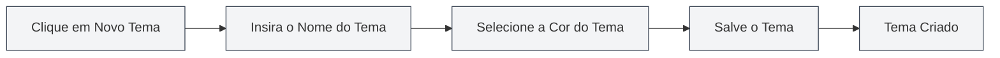

# Gerenciamento de Temas Personalizados

## Visão Geral

O gerenciamento de temas personalizados permite que você crie, edite, exclua e copie temas personalizados. Com temas personalizados, você pode criar uma aparência de interface que corresponda às suas preferências pessoais, melhorando a experiência de uso.

## Criar um Novo Tema Personalizado

### Criar um Novo Tema

1.  Na página de configurações de tema, clique no cartão "Novo Tema" (ícone +)
2.  Na caixa de diálogo que aparece:
    -   Insira o nome do tema (opcional, o valor da cor é usado por padrão)
    -   Selecione a cor do tema (usando o seletor de cores)
3.  Clique no botão "Salvar"

Você pode acessar as configurações de tema através da barra de menu superior:

<MenuItemsDemo mode="demo" :items='[{"id": "settings"}]' />

### Seleção de Cor do Tema

O seletor de cores oferece as seguintes funcionalidades:

-   **Seleção de Cor**: Clique na área de cor para selecionar uma cor
-   **Cores Predefinidas**: Selecione a partir de uma lista de cores predefinidas
-   **Ajuste de Transparência**: Ajuste a transparência da cor (canal Alfa)
-   **Entrada de Valor de Cor**: Insira diretamente o valor de cor HEX

### Nomeação do Tema

-   **Nomeação Automática**: Se nenhum nome for inserido, o sistema usará o valor da cor como nome
-   **Nome Personalizado**: Insira um nome significativo para facilitar a identificação e o gerenciamento
-   **Sugestão de Nome**: Use nomes descritivos, como "Tema de Trabalho", "Modo Noturno", etc.

<SettingThemeSection mode="demo" />

## Editar um Tema Personalizado

### Modificar um Tema

1.  Na lista de temas, localize o tema personalizado que deseja editar
2.  Clique no botão "Mais" (ícone de três pontos) no cartão do tema
3.  Selecione "Editar"
4.  Na caixa de diálogo, modifique o nome ou a cor do tema
5.  Clique no botão "Salvar"

<DialogDemo mode="demo" dialogType="theme-edit" />

### Edição Rápida de Cor

Você também pode editar a cor diretamente no cartão do tema:

1.  Clique no seletor de cores no cartão do tema
2.  Selecione uma nova cor
3.  A cor será aplicada imediatamente

**Observações**:

-   Temas predefinidos não podem ser editados
-   Apenas temas personalizados podem ser editados
-   Após a edição, é necessário salvar para que as alterações sejam permanentes

## Excluir um Tema Personalizado

### Excluir um Tema

1.  Na lista de temas, localize o tema personalizado que deseja excluir
2.  Clique no botão "Mais" no cartão do tema
3.  Selecione "Excluir"
4.  Confirme a operação de exclusão

**Observações**:

-   A operação de exclusão não pode ser desfeita
-   Se o tema em uso for excluído, o sistema alternará automaticamente para o tema padrão
-   Temas predefinidos não podem ser excluídos

## Copiar um Tema

### Copiar um Tema Existente

1.  Na lista de temas, localize o tema que deseja copiar
2.  Clique no botão "Mais" no cartão do tema
3.  Selecione "Copiar"
4.  O sistema criará uma cópia, adicionando "Cópia" ao nome
5.  Você pode editar a cópia para criar um novo tema

### Casos de Uso

-   **Criar um novo tema baseado em um existente**: Copie e depois modifique as cores
-   **Criar uma variante de tema**: Crie temas semelhantes, mas ligeiramente diferentes
-   **Fazer backup de um tema**: Copie como backup

## Configuração de Cores do Tema

### Funcionalidades do Seletor de Cores

O seletor de cores oferece recursos abrangentes para seleção de cores:

-   **Painel de Cores**: Clique para selecionar uma cor
-   **Cores Predefinidas**: Selecione rapidamente cores comuns
-   **Entrada de Valor de Cor**: Insira diretamente formatos como HEX, RGB, HSL
-   **Ajuste de Transparência**: Ajuste a transparência da cor

<DialogDemo mode="demo" dialogType="color-picker" />

### Cores Predefinidas

O MetaDoc oferece várias cores predefinidas:

-   **Cores Básicas**: Vermelho, Laranja, Amarelo, Verde, Ciano, Azul, Roxo, Cinza
-   **Tons Claros**: Vermelho Claro, Laranja Claro, Amarelo Claro, etc.
-   **Tons Escuros**: Vermelho Escuro, Laranja Escuro, Amarelo Escuro, etc.

### Formatos de Cor

Formatos de cor suportados:

-   **HEX**: `#FF5733` (mais comum)
-   **RGB**: `rgb(255, 87, 51)`
-   **HSL**: `hsl(9, 100%, 60%)`

## Aplicação do Tema

### Aplicar um Tema Personalizado

1.  Na lista de temas, clique no cartão do tema personalizado que deseja usar
2.  O tema será aplicado imediatamente
3.  As cores da interface serão geradas automaticamente com base na cor do tema

### Influência da Cor do Tema

A cor do tema afeta os seguintes elementos da interface:

-   **Cor de Fundo**: Fundo principal e secundário
-   **Cor do Texto**: Texto principal e secundário
-   **Barra Lateral**: Fundo e texto da barra lateral
-   **Editor**: Fundo e barra de ferramentas do editor
-   **Outros Elementos**: Botões, bordas, realces, etc.

### Paleta de Cores Automática

O MetaDoc gera automaticamente um esquema de cores com base na cor do tema:

-   **Tema Claro**: Quando a cor do tema é clara, gera uma paleta de cores claras
-   **Tema Escuro**: Quando a cor do tema é escura, gera uma paleta de cores escuras
-   **Algoritmo de Paleta**: Usa mistura de cores e ajuste de saturação

## Gerenciamento de Temas

### Lista de Temas

A página de configurações de tema exibe todos os temas disponíveis:

-   **Temas Predefinidos**: Temas integrados ao sistema
-   **Temas Personalizados**: Temas criados pelo usuário
-   **Tema Atual**: Exibe uma marcação de seleção

### Ordenação dos Temas

Os temas são exibidos na seguinte ordem:

1.  Tema sincronizado com o sistema (Segue o sistema)
2.  Temas predefinidos claro/escuro
3.  Temas personalizados (por data de criação)

### Status do Tema

Cada cartão de tema exibe:

-   **Prévia da Cor do Tema**: Exibe a cor principal do tema
-   **Nome do Tema**: Exibe o nome do tema
-   **Valor da Cor**: Exibe o valor HEX da cor
-   **Marcação de Seleção**: Tema atualmente em uso

## Melhores Práticas

1.  **Nomeação do Tema**: Use nomes significativos para facilitar a identificação
2.  **Seleção de Cor**: Escolha cores que não cansem os olhos, evite cores muito vibrantes
3.  **Backup de Tema**: Recomenda-se copiar temas importantes como backup
4.  **Limpeza Regular**: Exclua temas não utilizados para manter a lista organizada
5.  **Testar o Efeito**: Após criar um tema, teste o efeito real e ajuste conforme a experiência de uso

## Observações

1.  **Temas Predefinidos**: Temas predefinidos não podem ser editados ou excluídos
2.  **Compatibilidade do Tema**: Alguns temas podem ter aparência diferente em diferentes ambientes
3.  **Seleção de Cor**: Recomenda-se escolher cores com contraste moderado para garantir a legibilidade
4.  **Número de Temas**: Recomenda-se não criar muitos temas para manter a lista concisa
5.  **Sincronização de Tema**: As alterações no tema serão sincronizadas entre todas as janelas

## Documentação Relacionada

-   [[settings.theme|Configuração de Tema]]
-   [[settings.basic|Configurações Básicas]]
-   [[core.editor-settings|Configurações do Editor]]

<ResizableDivider mode="demo" />

<SettingThemeSection mode="demo" />

<MenuItemsDemo mode="demo" :items='[{"id": "settings", "items": ["theme"]}]' />

<DialogDemo mode="demo" dialogType="color-picker" />

<DialogDemo mode="demo" dialogType="theme-edit" />

<MenuItemsDemo mode="demo" :items='[{"id": "settings"}]' />
