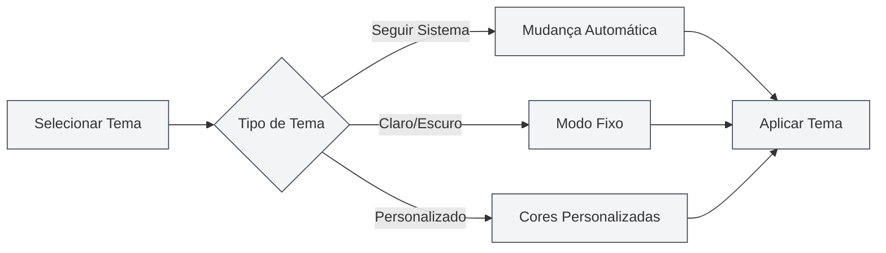

# Configuração de Tema

## Visão Geral

A configuração de tema permite personalizar a aparência do MetaDoc, incluindo tema global, tema de conteúdo, tema de código, entre outros. Uma configuração adequada do tema pode melhorar a experiência de uso e reduzir a fadiga visual.

## Tema Global

### Tipos de Tema

O MetaDoc suporta os seguintes tipos de tema global:

- **Seguir modo claro/escuro do sistema**: Segue automaticamente o modo claro/escuro do sistema operacional
- **Seguir cor do sistema**: Segue a cor do tema do sistema operacional (Windows 11)
- **Claro**: Usa o tema claro de forma fixa
- **Escuro**: Usa o tema escuro de forma fixa
- **Personalizado**: Usa cores de tema personalizadas

### Selecionar Tema

1. Na página de configurações de tema, navegue pelos cartões de tema
2. Clique no cartão do tema que deseja usar
3. O tema será aplicado imediatamente

Você pode acessar as configurações de tema através da barra de menu superior:

<MenuItemsDemo mode="demo" :items='[{"id": "settings"}]' />

### Prévia do Tema Claro

<SettingThemeSection mode="demo" theme="light" />

### Prévia do Tema Escuro

<SettingThemeSection mode="demo" theme="dark" />

### Interface de Configuração de Tema

A imagem abaixo mostra a interface completa da página de configurações de tema:

<SettingThemeSection mode="demo" />

<ViewMenuItemsDemo mode="demo" :items='["editor", "outline"]' />

A interface de configuração de tema contém as seguintes áreas funcionais principais:

- **Tema Global**: Selecionar tema claro, escuro, seguir sistema ou personalizado
- **Tema de Conteúdo**: Definir o tema de exibição da área do editor
- **Tema de Código**: Selecionar o tema de realce de sintaxe para blocos de código
- **Exibição de Números de Linha**: Controlar se os blocos de código exibem números de linha
- **Tema Personalizado**: Criar e gerenciar temas de cores personalizados

### Prévia do Tema

Cada cartão de tema exibirá:

- **Prévia da Cor do Tema**: Mostra a cor principal do tema
- **Nome do Tema**: Exibe o nome do tema
- **Marcador de Seleção**: O tema atualmente em uso exibirá um marcador de seleção

## Tema de Conteúdo

<SettingThemeSection mode="demo" />

### Definir Tema de Conteúdo

O tema de conteúdo controla o tema de exibição da área de edição de documentos:

- **Automático**: Segue o tema global
- **Claro**: Usa o tema de conteúdo claro de forma fixa
- **Escuro**: Usa o tema de conteúdo escuro de forma fixa

### Cenários de Uso

- **Global Escuro, Conteúdo Claro**: Adequado para editar documentos claros em ambientes escuros
- **Global Claro, Conteúdo Escuro**: Adequado para editar documentos escuros em ambientes claros
- **Modo Automático**: O tema de conteúdo segue automaticamente o tema global

## Tema de Código

<SettingThemeSection mode="demo" />

### Definir Tema de Código

O tema de código controla o tema de realce de sintaxe para blocos de código:

- **Automático**: Seleciona automaticamente com base no tema global
- **Personalizado**: Escolha a partir da lista de temas de código

### Lista de Temas de Código

O MetaDoc suporta vários temas de código, incluindo:

- **Temas Claros**: GitHub, VS, OneLight, etc.
- **Temas Escuros**: Monokai, Dracula, OneDark, etc.

### Sugestões de Seleção

- **Documento Claro**: Use temas de código claros
- **Documento Escuro**: Use temas de código escuros
- **Modo Automático**: Deixe o sistema escolher automaticamente para manter a consistência

## Exibição de Números de Linha

<SettingThemeSection mode="demo" />

### Exibir Números de Linha

Ao habilitar "Exibir números de linha no bloco de código", os blocos de código mostrarão números de linha:

- **Habilitado**: Números de linha são exibidos à esquerda do bloco de código
- **Desabilitado**: Números de linha não são exibidos

### Cenários de Uso

- **Depuração de Código**: Números de linha ajudam a localizar posições no código
- **Compartilhamento de Código**: Números de linha facilitam a referência a linhas específicas
- **Leitura de Código**: Números de linha ajudam a entender a estrutura do código

## Troca de Tema

<SettingThemeSection mode="demo" />

<ViewMenuItemsDemo mode="demo" :items='["editor", "outline"]' />

### Troca em Tempo Real

A troca de tema tem efeito imediato:

1. Selecione um novo tema
2. A interface é atualizada imediatamente
3. Aplicado de forma sincronizada em todas as janelas

### Sincronização de Tema

- **Sincronização Multijanela**: Todas as janelas sincronizam o tema automaticamente
- **Salvamento de Configurações**: A seleção de tema é salva automaticamente
- **Próxima Inicialização**: Usará o tema selecionado anteriormente na próxima inicialização

## Temas Pré-definidos

<SettingThemeSection mode="demo" />

### Temas Integrados

O MetaDoc oferece vários temas pré-definidos:

- **Temas Claros**: Adequados para ambientes claros
- **Temas Escuros**: Adequados para ambientes escuros
- **Sincronização com Sistema**: Segue automaticamente as configurações do sistema

### Características dos Temas Pré-definidos

- **Paleta Otimizada**: Esquemas de cores cuidadosamente projetados
- **Design que Protege os Olhos**: Reduz a fadiga visual
- **Consistência**: Garante uniformidade entre os elementos da interface

## Melhores Práticas

1. **Adaptação ao Ambiente**: Escolha o tema de acordo com o ambiente de uso
2. **Compatibilidade com Conteúdo**: Combine o tema de conteúdo com o tipo de documento
3. **Legibilidade do Código**: Escolha temas de código com alta legibilidade
4. **Ajustes Periódicos**: Ajuste as configurações de tema com base na experiência de uso

## Considerações

1. **Compatibilidade do Sistema**: Seguir o tema do sistema requer suporte do sistema operacional
2. **Consistência do Tema**: Recomenda-se manter a consistência entre o tema global e o tema de conteúdo
3. **Tema de Código**: O tema de código afeta a legibilidade do código
4. **Tema Personalizado**: Temas personalizados precisam ser criados e gerenciados manualmente

## Documentação Relacionada

- [[settings.theme-custom|Gerenciamento de Temas Personalizados]]
- [[settings.basic|Configurações Básicas]]
- [[core.editor-settings|Configurações do Editor]]