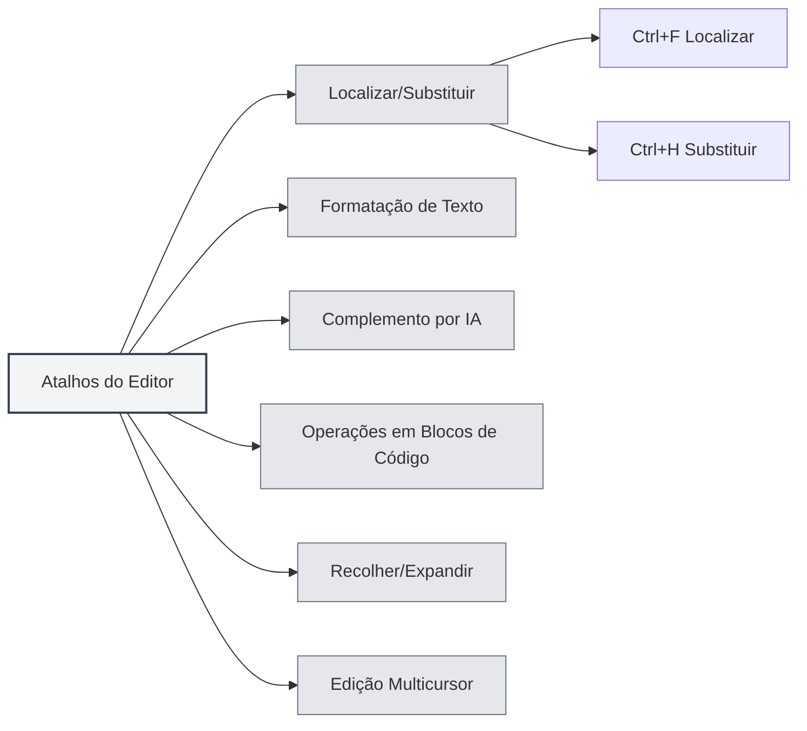

# Atalhos do Editor

## Visão Geral

Os atalhos do editor são combinações de teclas utilizadas na interface do editor, incluindo funções como edição de texto, localizar e substituir, formatação, entre outras. Dominar esses atalhos pode aumentar significativamente a eficiência na edição.

<MenuItemsDemo mode="demo" :items='[{"id": "edit"}]' />

<ViewMenuItemsDemo mode="demo" :items='["editor", "outline"]' />

**Observação**: Localizar/Substituir (Ctrl+F, Ctrl+H) são implementados globalmente pela aplicação; Negrito/Itálico/Link/Bloco de código, etc., são fornecidos pelo editor subjacente (Markdown usa Vditor, LaTeX usa Monaco). Se não funcionarem, considere o comportamento real do editor.

## Localizar e Substituir

### Localizar

- **Atalho**: `Ctrl+F` (Windows/Linux) ou `Cmd+F` (macOS)
- **Função**: Abre a caixa de diálogo de localização
- **Cenário de uso**: Encontrar um texto específico no documento

### Localizar e Substituir

- **Atalho**: `Ctrl+H` (Windows/Linux) ou `Cmd+H` (macOS)
- **Função**: Abre a caixa de diálogo de localizar e substituir
- **Cenário de uso**: Localizar e substituir texto

### Funcionalidades de Localização

A caixa de diálogo de localização suporta as seguintes funcionalidades:

- **Localizar texto**: Insira o texto a ser encontrado
- **Substituir texto**: Insira o texto de substituição
- **Expressões regulares**: Suporte a busca por expressões regulares
- **Diferenciar maiúsculas/minúsculas**: Busca sensível a caixa
- **Palavra inteira**: Corresponder apenas palavras completas

A interface do menu Localizar e Substituir é a seguinte:

<SearchReplaceMenu mode="demo" :position='{"top": 100, "left": 200}' :adapter='null' />

<SearchReplaceMenu mode="demo" :position='{"top": 150, "left": 200}' :adapter='null' />

## Formatação de Texto

<TextFormatToolbar mode="demo" />

### Negrito

- **Atalho**: `Ctrl+B` (Windows/Linux) ou `Cmd+B` (macOS)
- **Função**: Aplica negrito ao texto selecionado
- **Cenário de uso**: Destacar conteúdo importante

### Itálico

- **Atalho**: `Ctrl+I` (Windows/Linux) ou `Cmd+I` (macOS)
- **Função**: Aplica itálico ao texto selecionado
- **Cenário de uso**: Indicar citação ou ênfase

### Inserir Link

- **Atalho**: `Ctrl+K` (Windows/Linux) ou `Cmd+K` (macOS)
- **Função**: Insere um link
- **Cenário de uso**: Adicionar um hiperlink

**Atenção**: Este atalho pode entrar em conflito com Salvar Tudo (Ctrl+K S). É necessário pressionar Ctrl+K primeiro e depois K, e não simultaneamente.

## Complemento por IA

<AISuggestionGhost mode="demo" />

<CompletionSettingsPanel mode="demo" />

### Acionar Complemento Manualmente

- **Atalho**: `Shift+Tab`
- **Função**: Aciona manualmente o complemento automático por IA
- **Cenário de uso**: Acionar o complemento por IA quando necessário

### Teclas de Acionamento do Complemento

O complemento por IA também pode ser acionado automaticamente pelas seguintes teclas:

- **Enter**: Acionado pela tecla Enter
- **Espaço**: Acionado pela tecla Espaço
- **Ponto e vírgula**: Acionado pela tecla ponto e vírgula (;)
- **Barra**: Acionado pela tecla barra (/)

Essas teclas de acionamento podem ser configuradas em [[settings.llm|Configuração de LLM]].

## Operações em Blocos de Código

### Inserir Bloco de Código

- **Atalho**: `Ctrl+Shift+K` (Editor Markdown)
- **Função**: Insere um bloco de código
- **Cenário de uso**: Adicionar exemplos de código

## Recolher e Expandir

### Recolher Bloco de Código

- **Atalho**: `Ctrl+Shift+[` (Windows/Linux) ou `Cmd+Option+[` (macOS)
- **Função**: Recolhe o bloco de código ou ambiente atual
- **Cenário de uso**: Ocultar código que não precisa ser visualizado

### Expandir Bloco de Código

- **Atalho**: `Ctrl+Shift+]` (Windows/Linux) ou `Cmd+Option+]` (macOS)
- **Função**: Expande um bloco de código ou ambiente recolhido
- **Cenário de uso**: Visualizar conteúdo recolhido

## Edição Multicursor

### Selecionar Todas as Palavras Iguais

- **Atalho**: `Ctrl+Shift+L` (Windows/Linux) ou `Cmd+Shift+L` (macOS)
- **Função**: Seleciona todas as palavras idênticas no documento e adiciona cursores
- **Cenário de uso**: Editar em massa textos idênticos

## Desfazer e Refazer

### Desfazer

- **Atalho**: `Ctrl+Z` (Windows/Linux) ou `Cmd+Z` (macOS)
- **Função**: Desfaz a última operação
- **Cenário de uso**: Corrigir uma operação acidental

### Refazer

- **Atalho**: `Ctrl+Y` ou `Ctrl+Shift+Z` (Windows/Linux) ou `Cmd+Shift+Z` (macOS)
- **Função**: Refaz uma operação desfeita
- **Cenário de uso**: Restaurar uma operação desfeita

## Operações de Seleção

### Selecionar Tudo

- **Atalho**: `Ctrl+A` (Windows/Linux) ou `Cmd+A` (macOS)
- **Função**: Seleciona todo o texto
- **Cenário de uso**: Selecionar todo o conteúdo para copiar ou deletar

### Copiar

- **Atalho**: `Ctrl+C` (Windows/Linux) ou `Cmd+C` (macOS)
- **Função**: Copia o texto selecionado
- **Cenário de uso**: Copiar conteúdo para a área de transferência

### Colar

- **Atalho**: `Ctrl+V` (Windows/Linux) ou `Cmd+V` (macOS)
- **Função**: Cola o conteúdo da área de transferência
- **Cenário de uso**: Colar conteúdo copiado

### Recortar

- **Atalho**: `Ctrl+X` (Windows/Linux) ou `Cmd+X` (macOS)
- **Função**: Recorta o texto selecionado
- **Cenário de uso**: Mover conteúdo de texto

## Lista de Atalhos do Editor

### Atalhos para Windows/Linux

| Função                     | Atalho                     |
| -------------------------- | -------------------------- |
| Localizar                  | `Ctrl+F`                   |
| Localizar e Substituir     | `Ctrl+H`                   |
| Negrito                    | `Ctrl+B`                   |
| Itálico                    | `Ctrl+I`                   |
| Inserir Link               | `Ctrl+K`                   |
| Inserir Bloco de Código    | `Ctrl+Shift+K`             |
| Recolher                   | `Ctrl+Shift+[`             |
| Expandir                   | `Ctrl+Shift+]`             |
| Selecionar Palavras Iguais | `Ctrl+Shift+L`             |
| Desfazer                   | `Ctrl+Z`                   |
| Refazer                    | `Ctrl+Y` ou `Ctrl+Shift+Z` |
| Selecionar Tudo            | `Ctrl+A`                   |
| Copiar                     | `Ctrl+C`                   |
| Colar                      | `Ctrl+V`                   |
| Recortar                   | `Ctrl+X`                   |
| Complemento por IA         | `Shift+Tab`                |

### Atalhos para macOS

| Função                     | Atalho         |
| -------------------------- | -------------- |
| Localizar                  | `Cmd+F`        |
| Localizar e Substituir     | `Cmd+H`        |
| Negrito                    | `Cmd+B`        |
| Itálico                    | `Cmd+I`        |
| Inserir Link               | `Cmd+K`        |
| Inserir Bloco de Código    | `Cmd+Shift+K`  |
| Recolher                   | `Cmd+Option+[` |
| Expandir                   | `Cmd+Option+]` |
| Selecionar Palavras Iguais | `Cmd+Shift+L`  |
| Desfazer                   | `Cmd+Z`        |
| Refazer                    | `Cmd+Shift+Z`  |
| Selecionar Tudo            | `Cmd+A`        |
| Copiar                     | `Cmd+C`        |
| Colar                      | `Cmd+V`        |
| Recortar                   | `Cmd+X`        |
| Complemento por IA         | `Shift+Tab`    |

## Atalhos Específicos do Editor Markdown

<LaTeXEditorDemo mode="demo" />

### Atalhos do Vditor

O editor Markdown é baseado no Vditor e suporta os seguintes atalhos:

- **Negrito**: `Ctrl+B`
- **Itálico**: `Ctrl+I`
- **Inserir Link**: `Ctrl+K`
- **Inserir Bloco de Código**: `Ctrl+Shift+K`

## Atalhos Específicos do Editor LaTeX

<LaTeXEditorDemo mode="demo" />

### Atalhos do Editor Monaco

O editor LaTeX é baseado no Monaco Editor e suporta os seguintes atalhos:

- **Recolher**: `Ctrl+Shift+[`
- **Expandir**: `Ctrl+Shift+]`
- **Selecionar Todas as Palavras Iguais**: `Ctrl+Shift+L`
- **Edição Multicursor**: `Alt+Clique` para adicionar cursor

## Dicas para Uso de Atalhos

<LaTeXEditorDemo mode="demo" />

<Outline mode="demo" />

### Uso Combinado

É possível combinar vários atalhos:

1.  **Localizar e Substituir**: `Ctrl+H` para abrir a caixa de diálogo, depois use Tab para alternar entre os campos.
2.  **Formatar Texto**: Selecione o texto e use `Ctrl+B` ou `Ctrl+I` para formatar.
3.  **Edição em Massa**: Use `Ctrl+Shift+L` para selecionar todas as palavras iguais e editar simultaneamente.

### Memorização de Atalhos

- **Formatação**: B (Bold/Negrito), I (Italic/Itálico) correspondem a negrito e itálico.
- **Localizar**: F (Find/Encontrar), H (Hunt/Procurar e substituir).
- **Recolher**: `[` e `]` correspondem a recolher e expandir.

## Melhores Práticas

<MainTabs mode="demo" />

1.  **Domine o uso**: Familiarize-se com os atalhos de edição mais comuns.
2.  **Combine operações**: Use múltiplos atalhos em sequência para tarefas complexas.
3.  **Edição em massa**: Utilize a funcionalidade de múltiplos cursores para editar em massa.
4.  **Formatação rápida**: Use atalhos para formatar texto rapidamente.
5.  **Localizar e substituir**: Use a função de localizar e substituir para aumentar a eficiência.

## Observações Importantes

1.  **Diferenças de plataforma**: Windows/Linux usam Ctrl, macOS usa Cmd.
2.  **Conflitos de atalhos**: Alguns atalhos podem entrar em conflito com funções do editor.
3.  **Contexto específico**: Alguns atalhos só funcionam em contextos específicos.
4.  **Diferenças entre editores**: Os editores Markdown e LaTeX podem suportar atalhos diferentes.
5.  **Complemento por IA**: Shift+Tab é o acionamento manual; o acionamento automático requer configuração das teclas de gatilho.

## Documentação Relacionada

- [[shortcuts.global|Atalhos Globais]]
- [[core.editor-basics|Operações Básicas do Editor]]
- [[markdown.features|Funcionalidades do Editor Markdown]]
- [[ai.completion|Complemento Automático por IA]]

<MenuItemsDemo mode="demo" :items='[{"id": "file"}]' />

<ViewMenuItemsDemo mode="demo" :items='["editor"]' />

<AISuggestionGhost mode="demo" />

<CompletionSettingsPanel mode="demo" />

<LaTeXEditorDemo mode="demo" />