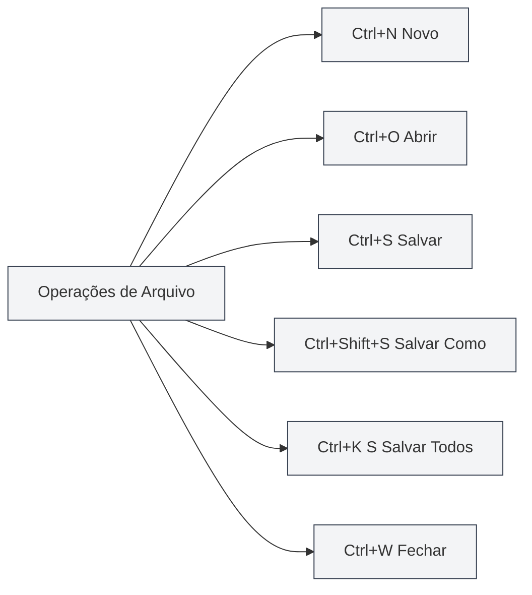

# Atalhos Globais

## Visão Geral

Os atalhos globais são combinações de teclas no MetaDoc que podem ser usadas em qualquer interface. Dominar esses atalhos pode melhorar significativamente a produtividade.

**Observação**: Os atalhos neste documento foram verificados com a implementação atual do código e estão implementados e disponíveis no processo principal ou nos processos de renderização.

## Operações de Arquivo

### Novo Documento

- **Atalho**: `Ctrl+N` (Windows/Linux) ou `Cmd+N` (macOS)
- **Função**: Criar um novo documento em branco
- **Cenário de Uso**: Iniciar rapidamente a edição de um novo documento

### Abrir Documento

- **Atalho**: `Ctrl+O` (Windows/Linux) ou `Cmd+O` (macOS)
- **Função**: Abrir a caixa de diálogo de seleção de arquivos
- **Cenário de Uso**: Abrir um documento existente

### Salvar Documento

- **Atalho**: `Ctrl+S` (Windows/Linux) ou `Cmd+S` (macOS)
- **Função**: Salvar o documento atual
- **Cenário de Uso**: Salvar o conteúdo editado para evitar perdas

### Salvar Como

- **Atalho**: `Ctrl+Shift+S` (Windows/Linux) ou `Cmd+Shift+S` (macOS)
- **Função**: Salvar o documento atual como um novo arquivo
- **Cenário de Uso**: Criar uma cópia do documento ou alterar o local de salvamento

### Salvar Todos os Documentos

- **Atalho**: `Ctrl+K S` (Windows/Linux) ou `Cmd+K S` (macOS)
- **Função**: Salvar todos os documentos abertos
- **Instruções de Uso**: Primeiro pressione `Ctrl+K` (ou `Cmd+K`), depois pressione `S`
- **Cenário de Uso**: Salvar todos os documentos de uma vez

<MenuItemsDemo mode="demo" :items='[{"id": "file", "items": ["save-all"]}]' />

### Fechar Arquivo

- **Atalho**: `Ctrl+W` (Windows/Linux) ou `Cmd+W` (macOS)
- **Função**: Fechar a aba atual
- **Cenário de Uso**: Fechar documentos não necessários

## Operações de Abas

A barra de abas exibe todos os documentos abertos e suporta operações como criar, alternar e fechar:

<MainTabs mode="demo" />

<ViewMenuItemsDemo mode="demo" :items='["editor", "outline"]' />

### Nova Aba

- **Atalho**: `Ctrl+T` (Windows/Linux) ou `Cmd+T` (macOS)
- **Função**: Criar uma nova aba
- **Cenário de Uso**: Criar rapidamente um novo documento

### Alternar Aba

#### Próxima Aba

- **Atalho**: `Ctrl+Tab` (Windows/Linux) ou `Cmd+Tab` (macOS)
- **Função**: Alternar para a próxima aba
- **Instruções de Uso**: Manter pressionado `Ctrl+Tab` exibe uma sobreposição de alternância de abas, você pode continuar pressionando Tab para selecionar ou clicar diretamente
- **Cenário de Uso**: Alternar rapidamente entre vários documentos

<TabSwitcherOverlay mode="demo" />

#### Aba Anterior

- **Atalho**: `Ctrl+Shift+Tab` (Windows/Linux) ou `Cmd+Shift+Tab` (macOS)
- **Função**: Alternar para a aba anterior
- **Cenário de Uso**: Alternar abas na ordem inversa

### Reabrir Aba Fechada

- **Atalho**: `Ctrl+Shift+T` (Windows/Linux) ou `Cmd+Shift+T` (macOS)
- **Função**: Reabrir a aba fechada mais recentemente
- **Instruções de Uso**: Pode ser usado repetidamente para restaurar sequencialmente as abas fechadas mais recentemente (até 20)
- **Cenário de Uso**: Restaurar rapidamente após fechar uma aba por engano

<MainTabs mode="demo" />

## Outros Atalhos

### Abrir Manual do Usuário

- **Atalho**: `F1`
- **Função**: Abrir a página do manual do usuário
- **Cenário de Uso**: Quando é necessário consultar a documentação de ajuda

<MenuItemsDemo mode="demo" :items='[{"id": "help"}]' />

## Lista de Atalhos

### Atalhos Windows/Linux

| Função                | Atalho             |
| --------------------- | ------------------ |
| Novo Documento        | `Ctrl+N`           |
| Abrir Documento       | `Ctrl+O`           |
| Salvar Documento      | `Ctrl+S`           |
| Salvar Como           | `Ctrl+Shift+S`     |
| Salvar Todos          | `Ctrl+K S`         |
| Fechar Aba            | `Ctrl+W`           |
| Nova Aba              | `Ctrl+T`           |
| Próxima Aba           | `Ctrl+Tab`         |
| Aba Anterior          | `Ctrl+Shift+Tab`   |
| Reabrir Fechada       | `Ctrl+Shift+T`     |
| Abrir Manual do Usuário | `F1`               |

### Atalhos macOS

| Função                | Atalho            |
| --------------------- | ----------------- |
| Novo Documento        | `Cmd+N`           |
| Abrir Documento       | `Cmd+O`           |
| Salvar Documento      | `Cmd+S`           |
| Salvar Como           | `Cmd+Shift+S`     |
| Salvar Todos          | `Cmd+K S`         |
| Fechar Aba            | `Cmd+W`           |
| Nova Aba              | `Cmd+T`           |
| Próxima Aba           | `Cmd+Tab`         |
| Aba Anterior          | `Cmd+Shift+Tab`   |
| Reabrir Fechada       | `Cmd+Shift+T`     |
| Abrir Manual do Usuário | `F1`              |

## Dicas de Uso de Atalhos

### Sequência de Teclas de Combinação

Alguns atalhos requerem pressionar as teclas em sequência:

- **Salvar Todos**: Primeiro pressione `Ctrl+K`, depois pressione `S` (não simultaneamente)
- **Alternar Abas**: Mantenha pressionado `Ctrl+Tab` para exibir a sobreposição, depois continue pressionando Tab para selecionar

### Conflitos de Atalhos

Se um atalho entrar em conflito com o sistema ou outro software:

- **Atalhos do Sistema**: Alguns atalhos do sistema podem ter prioridade
- **Outro Software**: Feche o software conflitante ou modifique seus atalhos
- **Atalhos Personalizados**: Versões futuras podem suportar personalização de atalhos

### Técnicas de Memorização

- **Operações de Arquivo**: Use os atalhos padrão de operação de arquivos (Ctrl+N/O/S)
- **Operações de Abas**: Use combinações relacionadas à tecla Tab
- **Salvar Todos**: Use Ctrl+K como prefixo de comando

## Melhores Práticas

1.  **Uso Proficiente**: Domine os atalhos comuns para aumentar a eficiência
2.  **Uso Combinado**: Combine vários atalhos para realizar operações complexas
3.  **Alternância de Abas**: Use Ctrl+Tab para alternar rapidamente, evitando o uso do mouse
4.  **Salvamento Regular**: Cultive o hábito de salvar regularmente com Ctrl+S
5.  **Recuperação Rápida**: Use Ctrl+Shift+T para recuperar rapidamente uma aba fechada por engano

## Observações

1.  **Diferenças de Plataforma**: Windows/Linux usam Ctrl, macOS usa Cmd
2.  **Conflitos de Atalhos**: Atenção a conflitos com atalhos de outros softwares
3.  **Sequência de Teclas**: Alguns atalhos precisam ser pressionados em sequência
4.  **Alternância de Abas**: Ctrl+Tab exibe uma sobreposição, onde você pode continuar a seleção
5.  **Salvar Todos**: Ctrl+K S requer pressionar Ctrl+K primeiro, depois S

## Documentação Relacionada

- [[shortcuts.editor|Atalhos do Editor]]
- [[core.file-operations|Operações de Arquivo]]
- [[core.multi-tab|Gerenciamento de Múltiplas Abas]]

<MenuItemsDemo mode="demo" :items='[{"id": "file"}]' />

<MainTabs mode="demo" />

<ViewMenuItemsDemo mode="demo" :items='["editor", "outline", "agent"]' />

<QuickStartPanel mode="demo" />