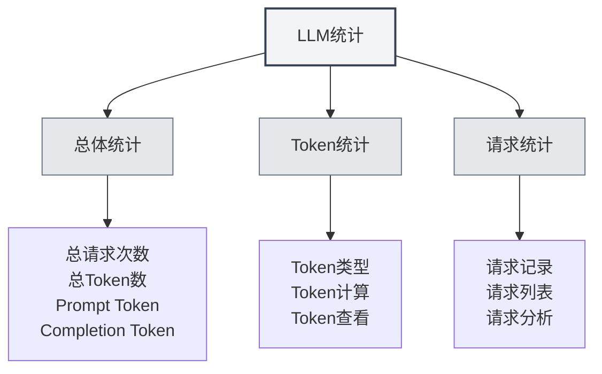

# Estatísticas de LLM

## Visão Geral

A funcionalidade de Estatísticas de LLM é usada para rastrear e visualizar o uso da API de LLM, incluindo informações como consumo de Tokens, número de requisições, estatísticas de custos, entre outras. Esses dados estatísticos podem ajudá-lo a entender o uso do LLM e otimizar sua estratégia de utilização.

## Abrir Estatísticas de LLM

### Formas de Acesso

Você pode abrir a página de Estatísticas de LLM das seguintes maneiras:

- **Página de Configurações**: Pode haver uma entrada para Estatísticas de LLM na página de configurações
- **Opções de Menu**: Alguns menus podem ter uma opção de Estatísticas de LLM
- **Atalho de Teclado**: Em alguns casos, pode haver um atalho (possível suporte futuro)

<SettingLlmSection mode="demo" />

## Informações Estatísticas

<LlmStatisticsView mode="demo" />

<LlmStatisticsContent mode="demo" />

### Estatísticas Gerais

A página de Estatísticas de LLM exibe as seguintes informações estatísticas gerais:

- **Total de Requisições**: O número total de todas as requisições LLM
- **Total de Tokens**: O número total de Tokens usados em todas as requisições
- **Tokens de Prompt**: O total de Tokens de Prompt de todas as requisições
- **Tokens de Conclusão**: O total de Tokens de Conclusão de todas as requisições

### Filtro por Período de Tempo

Você pode filtrar os dados estatísticos por período de tempo:

- **Todo o Período**: Visualizar estatísticas de todo o tempo
- **Hoje**: Visualizar as estatísticas de hoje
- **Esta Semana**: Visualizar as estatísticas desta semana
- **Este Mês**: Visualizar as estatísticas deste mês
- **Intervalo Personalizado**: Escolher uma data de início e fim personalizada

### Gráficos Estatísticos

<ChartGenerationDisplay mode="demo" />

A página de estatísticas pode conter os seguintes gráficos:

- **Tendência de Uso de Tokens**: Mostra a tendência de variação do uso de Tokens ao longo do tempo
- **Tendência do Número de Requisições**: Mostra a tendência de variação do número de requisições ao longo do tempo
- **Distribuição de Uso de Modelos**: Mostra o uso de diferentes modelos
- **Distribuição de Tipos de Requisição**: Mostra a distribuição de diferentes tipos de requisição

## Estatísticas de Tokens

<DataAnalysisDisplay mode="demo" />

### Tipos de Token

As estatísticas de Tokens incluem os seguintes tipos:

- **Tokens de Prompt**: Número de Tokens do prompt de entrada
- **Tokens de Conclusão**: Número de Tokens do conteúdo gerado
- **Total de Tokens**: Número total de Tokens (Prompt + Conclusão)

### Cálculo de Tokens

Método de cálculo de Tokens:

- **Registro Automático**: O uso de Tokens é registrado automaticamente após cada requisição LLM
- **Atualização em Tempo Real**: Os dados estatísticos são atualizados em tempo real
- **Estatísticas Acumuladas**: Os dados estatísticos são calculados de forma cumulativa

### Visualização de Tokens

Você pode visualizar as seguintes informações de Tokens:

- **Total de Tokens**: O número total de Tokens de todas as requisições
- **Média de Tokens**: O número médio de Tokens por requisição
- **Máximo de Tokens**: O número máximo de Tokens em uma única requisição
- **Mínimo de Tokens**: O número mínimo de Tokens em uma única requisição

## Estatísticas de Requisições

<LlmStatisticsContent mode="demo" />

### Registro de Requisições

Cada requisição LLM registra as seguintes informações:

- **Timestamp**: O horário da requisição
- **Nome do Modelo**: O nome do modelo usado
- **Tipo de Requisição**: O tipo de requisição (chat/completion)
- **Uso de Tokens**: O uso de Tokens desta requisição

### Lista de Requisições

Você pode visualizar a lista de requisições:

- **Ordenação por Tempo**: Ordenadas em ordem decrescente de tempo
- **Detalhes**: Visualizar informações detalhadas de cada requisição
- **Funcionalidade de Filtro**: Filtrar requisições por modelo, tipo, etc.

### Análise de Requisições

Você pode analisar as requisições:

- **Frequência de Requisições**: Analisar a frequência das requisições
- **Uso de Modelos**: Analisar o uso de diferentes modelos
- **Distribuição de Tipos**: Analisar a distribuição de diferentes tipos de requisição

## Estatísticas de Custos

<LlmStatisticsView mode="demo" />

### Cálculo de Custos

As estatísticas de custos são baseadas nas seguintes informações:

- **Uso de Tokens**: O custo é calculado com base no uso de Tokens
- **Precificação do Modelo**: Diferentes modelos têm preços diferentes
- **Estimativa de Custo**: Fornece uma estimativa de custo (se suportado)

### Visualização de Custos

Você pode visualizar as seguintes informações de custo:

- **Custo Total**: O custo total de todas as requisições
- **Custo Médio Diário**: O custo médio por dia
- **Custo por Modelo**: A distribuição de custos entre diferentes modelos
- **Tendência de Custos**: A tendência de variação dos custos ao longo do tempo

**Observação**: As estatísticas de custos são apenas para referência; o custo real deve ser verificado na fatura do provedor da API.

## Exportação de Dados

<DataAnalysisDisplay mode="demo" />

### Funcionalidade de Exportação

Você pode exportar os dados estatísticos:

- **Formato de Exportação**: Pode suportar vários formatos (JSON, CSV, etc.)
- **Escopo da Exportação**: Pode escolher exportar todos os dados ou apenas os dados filtrados
- **Conteúdo da Exportação**: Pode escolher quais informações estatísticas exportar

### Backup de Dados

Os dados estatísticos são salvos automaticamente:

- **Armazenamento Local**: Os dados estatísticos são salvos localmente
- **Salvamento Automático**: Salvos automaticamente após cada requisição
- **Persistência de Dados**: Os dados permanecem após a reinicialização do aplicativo

## Limpar Estatísticas

### Operação de Limpeza

Você pode limpar os dados estatísticos:

1.  Abra a página de Estatísticas de LLM
2.  Encontre o botão "Limpar Estatísticas"
3.  Confirme a operação de limpeza
4.  Os dados estatísticos serão limpos

**Observações**:

-   A operação de limpeza é irreversível
-   Recomenda-se exportar um backup dos dados antes de limpar
-   Todos os dados estatísticos serão perdidos após a limpeza

## Configurações de Estatísticas

### Ativar/Desativar Estatísticas

Você pode controlar a funcionalidade de estatísticas:

- **Ativar Estatísticas**: Ativa o rastreamento do uso de LLM
- **Desativar Estatísticas**: Desativa a funcionalidade de estatísticas (não registra dados)

### Precisão das Estatísticas

Você pode configurar a precisão das estatísticas:

- **Registro Detalhado**: Registra informações detalhadas de cada requisição
- **Registro Simplificado**: Registra apenas informações estatísticas gerais

## Melhores Práticas

1.  **Verificação Regular**: Verifique regularmente as estatísticas de uso do LLM para entender o padrão de utilização
2.  **Controle de Custos**: Controle o volume de uso com base nas estatísticas de custos
3.  **Otimização de Estratégia**: Otimize sua estratégia de uso com base nos dados estatísticos
4.  **Backup de Dados**: Exporte regularmente backups dos dados estatísticos
5.  **Uso Racional**: Use a funcionalidade LLM de forma racional com base nas informações estatísticas

## Observações

1.  **Precisão das Estatísticas**: Os dados estatísticos são baseados nas informações de Tokens retornadas pela API
2.  **Estimativa de Custos**: As estatísticas de custos são apenas para referência; o custo real deve ser verificado na fatura
3.  **Armazenamento de Dados**: Os dados estatísticos são armazenados localmente e não são enviados para nenhum servidor
4.  **Proteção de Privacidade**: Os dados estatísticos não contêm conteúdo específico, apenas informações sobre o volume de uso
5.  **Impacto no Desempenho**: A funcionalidade de estatísticas tem um impacto mínimo no desempenho e pode ser usada com tranquilidade

## Documentação Relacionada

- [[settings.llm|Configuração de LLM]]
- [[ai.chat|Funcionalidade de Conversa com IA]]
- [[ai.completion|Auto-completar com IA]]

<LlmStatisticsView mode="demo" />

<LlmStatisticsContent mode="demo" />