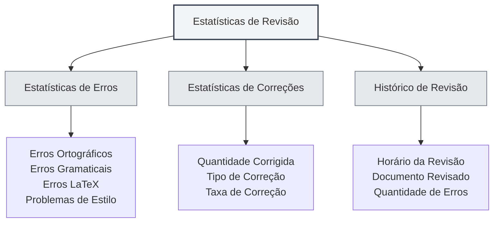

# Estatísticas da Ferramenta de Revisão

## Visão Geral

A funcionalidade de estatísticas da ferramenta de revisão é usada para rastrear e visualizar o uso da revisão de documentos, incluindo informações estatísticas como verificação ortográfica, verificação gramatical, etc. Esses dados estatísticos podem ajudá-lo a entender o uso dos recursos de revisão e otimizar a estratégia de correção.

<ProofreadView mode="demo" />

<ProofreadDisplay mode="demo" />

<DataAnalysisDisplay mode="demo" />

## Introdução às Estatísticas de Revisão

### O que são Estatísticas de Revisão

As estatísticas de revisão registram informações relevantes durante o processo de correção de documentos:

- **Estatísticas de Erros**: Registram a quantidade e os tipos de erros detectados.
- **Estatísticas de Correções**: Registram a quantidade de erros corrigidos.
- **Histórico de Revisão**: Registra o histórico das operações de revisão.

### Tipos de Estatísticas

As estatísticas de revisão incluem os seguintes tipos:

- **Erros Ortográficos**: Erros encontrados pela verificação ortográfica.
- **Erros Gramaticais**: Erros encontrados pela verificação gramatical.
- **Erros LaTeX**: Erros encontrados pela verificação de sintaxe LaTeX.
- **Problemas de Estilo**: Problemas encontrados pela verificação de estilo.
- **Outros Erros**: Outros tipos de erros.

## Estatísticas de Erros

<DataAnalysisDisplay mode="demo" />

<ChartGenerationDisplay mode="demo" />

### Classificação de Erros

A ferramenta de revisão classifica e contabiliza os erros:

- **Erros Ortográficos**: Quantidade de erros de ortografia de palavras.
- **Erros Gramaticais**: Quantidade de erros gramaticais.
- **Erros LaTeX**: Quantidade de erros de sintaxe LaTeX.
- **Problemas de Estilo**: Quantidade de problemas de estilo de escrita.
- **Outros Erros**: Quantidade de outros tipos de erros.

### Contagem de Erros

Cada revisão contabiliza os erros:

- **Total de Erros**: A soma de todos os erros.
- **Número por Tipo**: A quantidade de erros de cada tipo.
- **Distribuição de Erros**: A distribuição dos tipos de erro.

## Estatísticas de Correções

### Registro de Correções

Registra a situação das correções de erros:

- **Quantidade Corrigida**: Número de erros já corrigidos.
- **Tipo de Correção**: Tipo dos erros corrigidos.
- **Taxa de Correção**: Proporção de erros corrigidos.

### Histórico de Correções

É possível visualizar o histórico de correções:

- **Horário da Correção**: Momento em que o erro foi corrigido.
- **Conteúdo Corrigido**: O conteúdo específico que foi corrigido.
- **Método de Correção**: A forma como foi corrigido (manual/automático).

## Histórico de Revisão

### Registro Histórico

Registra o histórico das operações de revisão:

- **Horário da Revisão**: Momento da operação de revisão.
- **Documento Revisado**: O documento que foi revisado.
- **Quantidade de Erros**: Número de erros encontrados.
- **Quantidade Corrigida**: Número de erros corrigidos.

### Visualização do Histórico

É possível visualizar o histórico de revisão:

- **Lista Histórica**: Exibe todos os registros do histórico de revisão.
- **Detalhes**: Visualiza informações detalhadas de cada revisão.
- **Análise Estatística**: Realiza análise estatística dos dados históricos.

## Visualização de Estatísticas

<ProofreadView mode="demo" />

### Visualização Unificada

A visualização unificada exibe todos os erros:

- **Lista de Erros**: Exibe todos os erros em sequência.
- **Detalhes do Erro**: Exibe informações detalhadas de cada erro.
- **Localização do Erro**: Permite localizar a posição do erro.

<DataAnalysisDisplay mode="demo" />

### Visualização por Categoria

A visualização por categoria exibe os erros por tipo:

- **Agrupamento por Tipo**: Os erros são exibidos agrupados por tipo.
- **Estatísticas por Tipo**: Exibe a quantidade de erros de cada tipo.
- **Filtro por Tipo**: Permite filtrar erros de tipos específicos.

## Exportação de Estatísticas

### Funcionalidade de Exportação

É possível exportar as estatísticas de revisão:

- **Formato de Exportação**: Pode suportar múltiplos formatos (JSON, CSV, etc.).
- **Escopo da Exportação**: Pode-se escolher exportar todos os dados ou dados filtrados.
- **Conteúdo da Exportação**: Pode-se escolher quais informações estatísticas exportar.

<ChartGenerationDisplay mode="demo" />

## Melhores Práticas

1. **Revisão Regular**: Use a funcionalidade de revisão regularmente para verificar documentos.
2. **Atenção às Estatísticas**: Preste atenção às estatísticas de erros para entender a qualidade do documento.
3. **Correção Imediata**: Corrija os erros assim que forem descobertos.
4. **Análise de Tendências**: Analise as tendências de erros para melhorar os hábitos de escrita.
5. **Utilize o Histórico**: Use os registros históricos para acompanhar a melhoria do documento.

## Observações

1. **Precisão das Estatísticas**: Os dados estatísticos são baseados nos resultados de detecção da ferramenta de revisão.
2. **Tratamento de Falsos Positivos**: Algumas detecções podem ser falsos positivos, exigindo julgamento manual.
3. **Armazenamento de Dados**: Os dados estatísticos são armazenados localmente e não são enviados.
4. **Proteção de Privacidade**: Os dados estatísticos não contêm conteúdo específico, apenas informações estatísticas.
5. **Impacto no Desempenho**: A funcionalidade de estatísticas tem impacto mínimo no desempenho e pode ser usada com tranquilidade.

## Documentação Relacionada

- [[ai.proofread|Funcionalidade de Revisão por IA]]
- [[statistics.llm|Estatísticas LLM]]
