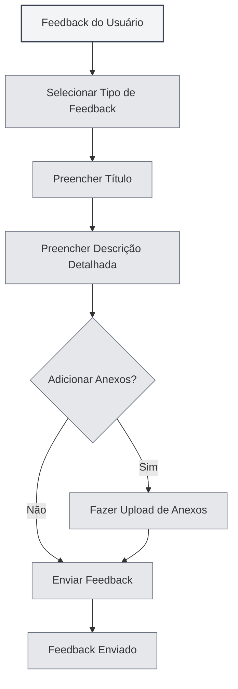

# Feedback do Usuário

## Visão Geral

A funcionalidade de feedback do usuário permite que você envie relatórios de problemas, sugestões de funcionalidades ou outros comentários à equipe do MetaDoc. Seu feedback é muito importante para melhorarmos o produto.

## Abrir o Feedback do Usuário

### Formas de Acesso

Você pode abrir a página de feedback do usuário das seguintes maneiras:

- **Página de Configurações**: Clique no botão "Feedback do Usuário" na página de configurações "Sobre"
- **Opção de Menu**: Alguns menus podem ter uma opção de feedback do usuário
- **Atalho de Teclado**: Em alguns casos, pode haver um atalho de teclado (suporte futuro possível)

<SettingAboutSection mode="demo" />

## Tipos de Feedback

### Seleção do Tipo de Feedback

Ao enviar um feedback, é necessário selecionar o tipo:

- **Relatar BUG**: Reportar erros ou problemas no software
- **Sugestão de Funcionalidade**: Propor novas funcionalidades ou melhorias
- **Feedback de Segurança**: Reportar problemas de segurança
- **Outro**: Outros tipos de feedback

<DialogDemo mode="demo" dialogType="feedback" />

### Descrição dos Tipos

- **Relatar BUG**: Usado para reportar erros de software, travamentos, comportamentos anormais, etc.
- **Sugestão de Funcionalidade**: Usado para propor necessidades de novas funcionalidades ou melhorias nas existentes
- **Feedback de Segurança**: Usado para reportar vulnerabilidades de segurança ou problemas relacionados
- **Outro**: Usado para outros tipos de feedback, como problemas de uso, problemas na documentação, etc.

## Conteúdo do Feedback

### Título

O título do feedback deve:

- **Ser conciso e claro**: Descrever brevemente o problema ou sugestão
- **Ser específico e preciso**: Evitar títulos vagos
- **Ser obrigatório**: O título é um campo obrigatório

### Descrição Detalhada

A descrição detalhada deve conter:

- **Descrição do Problema**: Descrever claramente o problema encontrado
- **Resultado Esperado**: Explicar o resultado esperado
- **Outras Informações**: Fornecer outras informações que ajudem no diagnóstico
- **Informações de Contato**: Informações de contato opcionais para facilitar o acompanhamento

### Modelo de Feedback

O sistema fornecerá um modelo de feedback, contendo as seguintes partes:

- **Informações do Sistema**: Preenchidas automaticamente
- **Descrição do Problema**: Área para descrever o problema
- **Resultado Esperado**: Área para o resultado esperado
- **Outras Informações**: Área para outras informações
- **Informações de Contato**: Informações de contato opcionais

<MenuItemsDemo mode="demo" :items='[{"id": "settings"}]' />

## Upload de Anexos

### Suporte a Anexos

Você pode fazer upload de anexos para auxiliar na explicação do problema:

- **Tipos de Arquivo**: Suporta qualquer tipo de arquivo
- **Tamanho do Arquivo**: Cada arquivo não deve exceder 10MB
- **Tamanho Total**: O tamanho total de todos os anexos não deve exceder 50MB
- **Quantidade de Arquivos**: É possível fazer upload de no máximo 5 anexos

<SettingImageSection mode="demo" />

### Finalidade dos Anexos

Os anexos podem ser usados para:

- **Capturas de Tela**: Fornecer capturas de tela do problema
- **Arquivos de Log**: Fornecer logs de erro
- **Arquivos de Exemplo**: Fornecer arquivos de exemplo que demonstrem o problema
- **Outros Arquivos**: Fornecer outros arquivos relacionados

### Regras para Anexos

- **Limite por Arquivo**: Cada arquivo não deve exceder 10MB
- **Limite de Tamanho Total**: O tamanho total de todos os anexos não deve exceder 50MB
- **Limite de Quantidade**: No máximo 5 anexos
- **Limite de Tipo**: Não há restrição de tipo de arquivo, sujeito à capacidade do Gist

## Enviar Feedback

### Etapas para Envio

1. **Selecionar Tipo**: Escolher o tipo de feedback
2. **Preencher Título**: Preencher o título do feedback
3. **Preencher Descrição**: Preencher a descrição detalhada
4. **Adicionar Anexos**: Opcional, adicionar anexos
5. **Enviar Feedback**: Clicar no botão "Enviar Feedback"

Você pode acessar o feedback do usuário pela página de configurações:

<MenuItemsDemo mode="demo" :items='[{"id": "settings"}]' />

### Validação do Envio

Antes do envio, uma validação será realizada:

- **Validação do Título**: Garantir que o título não esteja vazio
- **Validação da Descrição**: Garantir que a descrição não esteja vazia
- **Validação dos Anexos**: Garantir que os anexos estejam de acordo com as regras

<DialogDemo mode="demo" dialogType="submit-confirm" />

### Resultado do Envio

Após o envio, o resultado será exibido:

- **Envio Bem-sucedido**: Exibe uma mensagem de sucesso
- **Falha no Envio**: Exibe uma mensagem de erro e a causa

## Outros Meios de Contato

### Feedback por E-mail

Também é possível enviar feedback por e-mail:

- **Endereço de E-mail**: Exibido na parte inferior da página de feedback
- **Copiar E-mail**: É possível copiar o endereço de e-mail
- **Assunto do E-mail**: Recomenda-se usar um assunto claro

<ViewMenuItemsDemo mode="demo" :items='["settings"]' />

### Grupo QQ

Você pode entrar no grupo QQ oficial:

- **Número do Grupo QQ**: Exibido na parte inferior da página de feedback
- **Copiar Número do Grupo**: É possível copiar o número do grupo QQ
- **Entrar no Grupo**: Após entrar no grupo, é possível fornecer feedback em tempo real

## Processamento do Feedback

### Fluxo do Feedback

O fluxo de processamento após o envio do feedback:

1. **Recebimento do Feedback**: O sistema recebe seu feedback
2. **Classificação**: Categorização de acordo com o tipo de feedback
3. **Análise do Problema**: Análise do problema ou sugestão
4. **Acompanhamento**: Acompanhamento e tratamento conforme a situação
5. **Resposta ao Feedback**: Possível resposta por e-mail ou grupo QQ

### Prioridade do Feedback

A prioridade será definida com base no tipo e gravidade do feedback:

- **Feedback de Segurança**: Prioridade mais alta
- **BUG Grave**: Alta prioridade
- **Sugestão de Funcionalidade**: Prioridade média
- **Outro Feedback**: Prioridade geral

<MainTabs mode="demo" />

## Melhores Práticas

1. **Descrever em Detalhe**: Descrever o problema ou sugestão com o máximo de detalhes possível
2. **Fornecer Capturas de Tela**: Se possível, fornecer capturas de tela do problema
3. **Fornecer Logs**: Se encontrar um erro, fornecer os logs de erro
4. **Fornecer Exemplos**: Se possível, fornecer arquivos de exemplo do problema
5. **Informações de Contato**: Fornecer informações de contato para facilitar o acompanhamento

## Observações Importantes

1. **Formato do Feedback**: Preencher o feedback de acordo com o formato do modelo
2. **Tamanho dos Anexos**: Atenção aos limites de tamanho dos anexos
3. **Informações de Contato**: Fornecer informações de contato para facilitar o acompanhamento
4. **Tipo de Feedback**: Escolher o tipo de feedback correto
5. **Informações do Sistema**: As informações do sistema são preenchidas automaticamente, não as exclua

## Documentação Relacionada

- [[settings.about|Informações Sobre]]
- [[user.profile|Perfil do Usuário]]

<AIChat mode="demo" />
