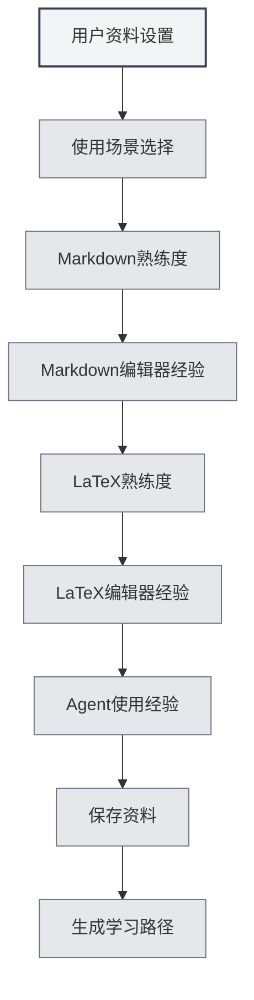

# Perfil do Usuário

## Visão Geral

A funcionalidade de perfil do usuário permite que você configure suas informações pessoais e preferências de uso, ajudando o MetaDoc a compreender melhor suas necessidades e oferecendo uma experiência de uso personalizada e um caminho de aprendizado adaptado.

## Configuração do Perfil do Usuário

### Abrir o Perfil do Usuário

Você pode abrir a caixa de diálogo do perfil do usuário das seguintes maneiras:

- **Sugestão na Página Inicial**: No primeiro uso, a página inicial pode sugerir a configuração do perfil do usuário
- **Manual do Usuário**: É possível acessar as configurações do perfil do usuário no manual do usuário
- **Opção de Menu**: Alguns menus podem ter uma opção para o perfil do usuário

<QuickStartPanel mode="demo" />

### Interface do Perfil do Usuário

A interface do perfil do usuário contém as seguintes partes principais:

<UserProfileView mode="demo" />

### Assistente de Configuração do Perfil

A configuração do perfil do usuário segue um assistente passo a passo:

1. **Cenário de Uso**: Selecione o cenário de uso principal
2. **Proficiência em Markdown**: Avalie seu nível de familiaridade com a sintaxe Markdown
3. **Experiência com Editores Markdown**: Selecione os tipos de editores Markdown que você já utilizou
4. **Proficiência em LaTeX**: Avalie seu nível de familiaridade com a sintaxe LaTeX
5. **Experiência com Editores LaTeX**: Selecione os tipos de editores LaTeX que você já utilizou
6. **Experiência com Agentes (Agents)**: Avalie sua experiência com o uso de frameworks de Agent

## Seleção do Cenário de Uso

### Tipos de Cenário

Você pode selecionar os seguintes cenários de uso:

- **Estudante**: Adequado para usuários estudantes, foca no aprendizado de edição básica e funcionalidades Markdown
- **Pesquisador**: Adequado para pesquisadores, foca no aprendizado de LaTeX e funcionalidades de escrita acadêmica
- **Profissional de TI**: Adequado para profissionais de TI, foca no aprendizado de frameworks de Agent e funcionalidades avançadas
- **Usuário de Escritório**: Adequado para usuários de escritório, foca no aprendizado de funcionalidades básicas e exportação
- **Outro**: Outros cenários de uso

### Impacto do Cenário

O cenário selecionado afetará:

- **Caminho de Aprendizado**: O sistema recomendará um caminho de aprendizado correspondente
- **Recomendações de Funcionalidades**: Priorizará a recomendação de funcionalidades relacionadas
- **Compreensão da IA**: Ajudará a IA a compreender melhor suas necessidades

## Avaliação de Habilidades

### Proficiência em Markdown

Avalie seu nível de familiaridade com a sintaxe Markdown:

- **Sem experiência**: Nunca usou Markdown
- **Básico**: Conhece a sintaxe básica (títulos, listas, links, etc.)
- **Intermediário**: Familiarizado com a sintaxe comum e funcionalidades estendidas
- **Avançado**: Domina o Markdown, conhece várias sintaxes estendidas

<QuickStartLatex mode="demo" />

### Proficiência em LaTeX

Avalie seu nível de familiaridade com a sintaxe LaTeX:

- **Sem experiência**: Nunca usou LaTeX
- **Básico**: Conhece a sintaxe básica e a estrutura de documentos
- **Intermediário**: Familiarizado com ambientes e comandos comuns
- **Avançado**: Domina o LaTeX, consegue escrever documentos complexos

<MenuItemsDemo mode="demo" :items='[{"id": "file"}]' />

### Experiência com Agentes (Agents)

Avalie sua experiência com o uso de frameworks de Agent:

- **Sem experiência**: Nunca usou funcionalidades de Agent
- **Básico**: Entende os conceitos básicos, usou funcionalidades simples
- **Intermediário**: Familiarizado com conjuntos de ferramentas e fluxos de trabalho
- **Avançado**: Capaz de criar configurações e fluxos de trabalho complexos para Agents

<AgentView mode="demo" />

## Experiência com Editores

### Experiência com Editores Markdown

Selecione os tipos de editores Markdown que você já utilizou:

- **Editor WYSIWYG**: Usou editores do tipo "o que você vê é o que você obtém"
- **Outros Editores Markdown**: Usou outros editores Markdown

### Experiência com Editores LaTeX

Selecione os tipos de editores LaTeX que você já utilizou:

- **Editor LaTeX Online**: Usou editores LaTeX online
- **Editor LaTeX Local**: Usou editores LaTeX instalados localmente

## Configuração de Preferências de Uso

### Preferências de Edição

Você pode configurar preferências relacionadas à edição:

- **Modo de Edição**: Modo de edição preferido
- **Método de Visualização**: Método de visualização preferido
- **Salvamento Automático**: Preferência de salvamento automático

<MainTabs mode="demo" />

### Preferências de Funcionalidades

Você pode configurar preferências relacionadas a funcionalidades:

- **Funcionalidades Frequentes**: Marcar funcionalidades usadas com frequência
- **Prioridade de Funcionalidades**: Definir a prioridade das funcionalidades
- **Layout da Interface**: Layout de interface preferido

<ViewMenuItemsDemo mode="demo" :items='["settings"]' />

## Configuração da Persona do Usuário

### Geração da Persona

Com base em suas configurações, o sistema gerará uma persona do usuário:

- **Nível de Habilidade**: Avalia o nível de cada habilidade
- **Cenário de Uso**: Identifica o cenário de uso principal
- **Necessidade de Aprendizado**: Analisa as necessidades de aprendizado

### Aplicação da Persona

A persona do usuário será aplicada em:

- **Caminho de Aprendizado**: Recomenda um caminho de aprendizado personalizado
- **Recomendações de Funcionalidades**: Prioriza a recomendação de funcionalidades relacionadas
- **Assistência da IA**: Ajuda a IA a compreender melhor as necessidades

## Recomendação de Caminho de Aprendizado

### Tipos de Caminho

De acordo com o perfil do usuário, o sistema recomendará o caminho de aprendizado correspondente:

- **Caminho para Estudante**: Caminho de aprendizado adequado para usuários estudantes
- **Caminho para Pesquisador**: Caminho de aprendizado adequado para pesquisadores
- **Caminho para Profissional de TI**: Caminho de aprendizado adequado para profissionais de TI
- **Caminho para Usuário de Escritório**: Caminho de aprendizado adequado para usuários de escritório

<AIChat mode="demo" />

### Conteúdo do Caminho

O caminho de aprendizado contém:

- **Lista de Documentos**: Documentos de aprendizado organizados em sequência
- **Objetivos de Aprendizado**: Objetivos de aprendizado para cada documento
- **Tempo Estimado**: Tempo estimado necessário para concluir o aprendizado

## Atualização do Perfil

### Modificar o Perfil

Você pode modificar o perfil do usuário a qualquer momento:

1. Abra a caixa de diálogo do perfil do usuário
2. Modifique as configurações desejadas
3. Salve as alterações

### Sincronização do Perfil

O perfil do usuário será:

- **Salvo Localmente**: Salvo no armazenamento local
- **Sincronizado entre Janelas**: Sincronizado entre todas as janelas
- **Persistente**: Continuará válido na próxima inicialização

## Melhores Práticas

1. **Preencher com Precisão**: Preencha todas as informações com precisão para obter recomendações mais acertadas
2. **Atualizar Regularmente**: Atualize o perfil regularmente conforme suas habilidades evoluem
3. **Escolher o Cenário**: Selecione o cenário que melhor corresponde à sua situação real de uso
4. **Avaliar Habilidades**: Avalie seu nível de habilidade de forma objetiva
5. **Utilizar as Recomendações**: Aproveite ao máximo o caminho de aprendizado recomendado pelo sistema

## Observações Importantes

1. **Privacidade do Perfil**: O perfil do usuário é armazenado apenas localmente e não é enviado para servidores
2. **Perfil Opcional**: A configuração do perfil do usuário é opcional, você pode optar por não configurá-lo
3. **Recomendações como Referência**: As recomendações de caminho de aprendizado servem apenas como referência, você pode ajustá-las conforme necessário
4. **Mudança nas Habilidades**: O nível de habilidade pode mudar, recomenda-se atualizar o perfil regularmente
5. **Múltiplos Cenários**: Se você utiliza múltiplos cenários, pode selecionar o cenário principal

## Documentos Relacionados

- [[home.features|Funcionalidades da Página Inicial]]
- [[user.feedback|Feedback do Usuário]]
- [[quick-start.guide|Guia de Início Rápido]]

<QuickStartPanel mode="demo" />

<MenuItemsDemo mode="demo" :items='[{"id": "settings"}]' />

<MainTabs mode="demo" />