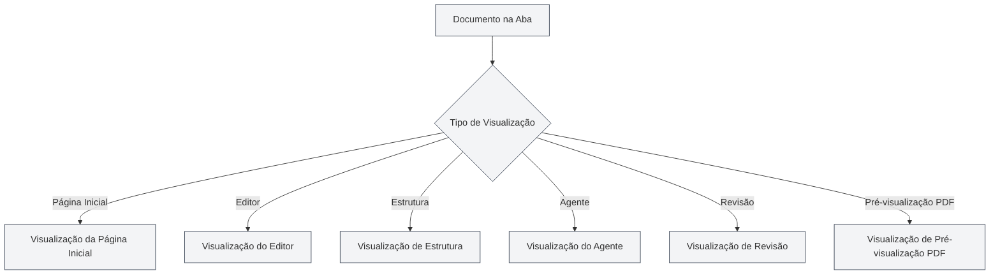

# Tipos de Visualização

## Visão Geral

O MetaDoc suporta vários tipos de visualização, cada um oferecendo funcionalidades e interfaces diferentes. Você pode alternar entre as diferentes visualizações conforme necessário para realizar várias tarefas.

## Introdução aos Tipos de Visualização

### Visualização da Página Inicial

A visualização da página inicial é a interface de entrada do MetaDoc, fornecendo funcionalidades de início rápido e documentos recentes.

<QuickStartPanel mode="demo" />

**Funcionalidades Principais**:

- **Início Rápido**: Escolha o formato do documento e crie um novo documento rapidamente
- **Documentos Recentes**: Exibe a lista de documentos abertos recentemente
- **Manual do Usuário**: Acesso rápido ao manual do usuário
- **Perfil do Usuário**: Acesse as configurações do perfil do usuário

**Cenários de Uso**:

- Interface inicial após iniciar o aplicativo
- Quando precisa criar um novo documento rapidamente
- Para visualizar documentos usados recentemente

Você pode alternar entre diferentes visualizações através da barra lateral.

### Visualização do Editor

A visualização do editor é a interface principal para edição de documentos, suportando edição em Markdown, LaTeX e texto puro.

<LaTeXEditor mode="demo" />

**Funcionalidades Principais**:

- **Edição Markdown**: Use o editor Vditor para editar documentos Markdown
- **Edição LaTeX**: Use o editor Monaco para editar documentos LaTeX
- **Edição de Texto Puro**: Use o editor Monaco para editar texto puro
- **Pré-visualização em Tempo Real**: O editor Markdown suporta pré-visualização em tempo real

**Cenários de Uso**:

- Editar o conteúdo do documento
- Escrever documentação técnica
- Criar artigos acadêmicos

### Visualização de Estrutura

A visualização de estrutura exibe o esqueleto estruturado do documento, facilitando a visualização e edição da estrutura do documento.

<Outline mode="demo" />

**Funcionalidades Principais**:

- **Exibição da Estrutura**: Exibe os títulos do documento em uma estrutura de árvore
- **Operações em Nós**: Adicionar, editar, excluir, mover nós
- **Ordenação por Arrastar e Soltar**: Ajuste a ordem arrastando os nós
- **Funcionalidades de IA**: Gerar subcapítulos, gerar conteúdo, otimizar estrutura

**Cenários de Uso**:

- Visualizar a estrutura do documento
- Navegar rapidamente para um capítulo específico
- Editar o esqueleto do documento
- Usar IA para gerar conteúdo

### Visualização do Agente

A visualização do Agente fornece a interface de interação do framework de Agentes, usada para criar e gerenciar sessões de Agente.

<AgentView mode="demo" />

**Funcionalidades Principais**:

- **Gerenciamento de Sessões**: Criar, editar, excluir sessões de Agente
- **Configuração de Ferramentas**: Configurar o conjunto de ferramentas usadas pelo Agente
- **Fluxo de Trabalho**: Criar e executar fluxos de trabalho
- **Interação por Mensagens**: Dialogar com o Agente

**Cenários de Uso**:

- Usar o Agente para concluir tarefas complexas
- Processamento automatizado de documentos
- Operações em lote em documentos

### Visualização de Revisão

A visualização de revisão fornece funcionalidade de revisão por IA, verificando erros no documento e fornecendo sugestões de modificação.

<ProofreadView mode="demo" />

**Funcionalidades Principais**:

- **Detecção de Erros**: Detecta erros de ortografia, gramática e sintaxe LaTeX
- **Lista de Erros**: Exibe todos os erros detectados
- **Correção de Erros**: Correção individual ou correção de todos com um clique
- **Gerenciamento de Dicionário**: Adicionar palavras ao dicionário

**Cenários de Uso**:

- Verificar erros no documento
- Melhorar a qualidade do documento
- Corrigir erros de ortografia e gramática

### Visualização de Pré-visualização PDF

A visualização de pré-visualização PDF exibe a pré-visualização do PDF compilado a partir do documento LaTeX (apenas para documentos LaTeX).

<PdfPreviewPanel mode="demo" pdfUrl="" />

**Funcionalidades Principais**:

- **Exibição do PDF**: Exibe o conteúdo do PDF compilado
- **Controle de Zoom**: Ampliar, reduzir o PDF
- **Atualizar PDF**: Recompilar e atualizar o PDF
- **Localizar no Código**: Localizar no código LaTeX a partir de uma posição no PDF

**Cenários de Uso**:

- Pré-visualizar o resultado do documento LaTeX
- Verificar o formato do PDF
- Localizar problemas no PDF

## Alternância de Visualização

### Métodos de Alternância

Você pode alternar entre visualizações das seguintes maneiras:

<MainTabs mode="demo" />

<ViewMenuItemsDemo mode="demo" :items='["editor", "outline", "agent"]' />

1. **Menu de Visualização**: Clique no botão do menu de visualização à esquerda
2. **Seletor de Visualização**: No menu de visualização, escolha a visualização para a qual deseja alternar
3. **Atalhos de Teclado**: Algumas visualizações podem ter atalhos (possível suporte futuro)

### Menu de Visualização

O menu de visualização é exibido na barra lateral esquerda:

- **Página Inicial**: Alterna para a visualização da página inicial
- **Editor**: Alterna para a visualização do editor
- **Estrutura**: Alterna para a visualização de estrutura
- **Agente**: Alterna para a visualização do Agente
- **Revisão**: Alterna para a visualização de revisão
- **Pré-visualização PDF**: Alterna para a visualização de pré-visualização PDF (apenas documentos LaTeX)

### Estado da Visualização

Cada aba de documento tem um estado de visualização independente:

- **Memória de Visualização**: Após alternar a visualização, o estado da visualização é salvo
- **Próxima Abertura**: Ao abrir o documento novamente, ele retornará à última visualização usada
- **Múltiplas Abas**: Diferentes abas podem usar visualizações diferentes

## Características das Visualizações

### Independência das Visualizações

Cada visualização é independente:

- **Estado Independente**: Cada visualização tem seu estado independente
- **Sincronização de Dados**: Os dados são sincronizados automaticamente entre as visualizações
- **Alternância Rápida**: A alternância entre visualizações é muito rápida, sem necessidade de recarregar

### Combinação de Visualizações

Algumas visualizações podem ser usadas em combinação:

- **Editor + Estrutura**: Visualizar o editor e a estrutura simultaneamente
- **Editor + Pré-visualização PDF**: O editor LaTeX pode exibir o código e o PDF ao mesmo tempo
- **Editor + Revisão**: É possível revisar enquanto edita

## Sugestões de Uso das Visualizações

### Editar Documentos

- **Visualização do Editor**: Use principalmente a visualização do editor para editar
- **Visualização de Estrutura**: Alterne para a visualização de estrutura quando precisar ver a estrutura
- **Pré-visualização PDF**: Use a pré-visualização PDF ao editar documentos LaTeX para ver o resultado

### Revisar Documentos

- **Visualização de Revisão**: Especificamente para revisão de documentos
- **Visualização do Editor**: Após a revisão, volte para a visualização do editor para continuar editando

### Tarefas com Agente

- **Visualização do Agente**: Criar e gerenciar sessões do Agente
- **Visualização do Editor**: Visualizar o documento após o processamento pelo Agente

## Observações

1. **Alternância de Visualização**: A alternância de visualização salva o estado atual
2. **Pré-visualização PDF**: Apenas documentos LaTeX suportam a visualização de pré-visualização PDF
3. **Estado da Visualização**: O estado da visualização de cada aba é salvo independentemente
4. **Sincronização de Dados**: Os dados são sincronizados automaticamente entre as visualizações
5. **Considerações de Desempenho**: Algumas visualizações podem consumir mais recursos

## Documentação Relacionada

- [[core.multi-tab|Gerenciamento de Múltiplas Abas]]
- [[outline.basics|Funcionalidades da Visualização de Estrutura]]
- [[agent.session|Gerenciamento de Sessões do Agente]]
- [[ai.proofread|Funcionalidade de Revisão por IA]]
- [[latex.pdf-preview|Funcionalidade de Pré-visualização PDF]]