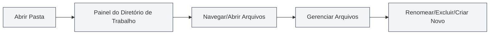

# Gerenciamento de Diretório de Trabalho

## Visão Geral

O gerenciamento de diretório de trabalho permite que você abra e gerencie pastas no MetaDoc, fornecendo funcionalidades semelhantes a um gerenciador de arquivos. Através do diretório de trabalho, você pode navegar, abrir e gerenciar arquivos de projeto de forma conveniente.

## Introdução ao Diretório de Trabalho

<ViewMenuItemsDemo mode="demo" :items='["workspace"]' />

### O que é um Diretório de Trabalho

Um diretório de trabalho é uma pasta aberta no MetaDoc, que permite que você:

- **Navegar por arquivos**: Visualizar arquivos e subpastas dentro da pasta
- **Abrir arquivos**: Abrir arquivos diretamente no MetaDoc
- **Gerenciar arquivos**: Operações como renomear, excluir arquivos, etc.
- **Organização de projeto**: Organizar arquivos relacionados em um diretório

### Cenários de Uso

O diretório de trabalho é adequado para os seguintes cenários:

- **Gerenciamento de projetos**: Gerenciar todos os documentos em um projeto
- **Navegação de arquivos**: Navegar e abrir arquivos rapidamente
- **Organização de documentos**: Organizar documentos relacionados juntos
- **Operações em lote**: Realizar operações em múltiplos arquivos

## Abrir um Diretório de Trabalho

<ViewMenuItemsDemo mode="demo" :items='["workspace", "editor"]' />

### Abrir um Diretório

1. Clique no ícone "Diretório de Trabalho" no menu lateral esquerdo
2. Se nenhum diretório estiver aberto, uma caixa de diálogo de seleção de diretório será exibida
3. Selecione a pasta que deseja abrir
4. O diretório será exibido na barra lateral

Você pode acessar a visualização do diretório de trabalho através da barra lateral:

<ViewMenuItemsDemo mode="demo" :items='["workspace"]' />

<ViewMenuItemsDemo mode="demo" :items='["editor", "outline", "home"]' />

### Alternar Diretório

Se precisar alternar para outro diretório:

1. Clique no botão de menu na barra de título do diretório de trabalho
2. Selecione "Abrir pasta"
3. Selecione a nova pasta
4. O novo diretório substituirá o diretório atual

### Fechar Diretório

Você pode fechar o diretório de trabalho atualmente aberto:

1. Clique no botão de menu na barra de título do diretório de trabalho
2. Selecione "Fechar diretório de trabalho"
3. O painel do diretório de trabalho será ocultado

## Navegação de Arquivos

<ViewMenuItemsDemo mode="demo" :items='["workspace", "editor", "outline"]' />

### Estrutura de Árvore de Diretórios

O diretório de trabalho é exibido em uma estrutura de árvore:

- **Pastas**: Exibem um ícone de pasta, podem ser expandidas/recolhidas
- **Arquivos**: Exibem um ícone de arquivo, mostram o nome do arquivo
- **Estrutura hierárquica**: Suporta aninhamento de pastas em múltiplos níveis

### Expandir e Recolher

- **Expandir pasta**: Clique no ícone ou nome da pasta
- **Recolher pasta**: Clique novamente na pasta expandida
- **Expandir tudo**: O menu de contexto pode ter a opção de expandir tudo
- **Recolher tudo**: O menu de contexto pode ter a opção de recolher tudo

### Identificação de Tipo de Arquivo

O diretório de trabalho identifica os tipos de arquivo:

- **Arquivos Markdown** (.md): Exibem ícone do Markdown
- **Arquivos LaTeX** (.tex): Exibem ícone do LaTeX
- **Arquivos de imagem** (.png, .jpg, etc.): Exibem ícone de imagem
- **Outros arquivos**: Exibem ícone de arquivo genérico

## Operações com Arquivos

<ViewMenuItemsDemo mode="demo" :items='["workspace"]' />

<MenuItemsDemo mode="demo" :items='[{"id": "file", "items": ["new", "open"]}]' />

### Abrir Arquivo

Existem várias maneiras de abrir um arquivo:

- **Duplo clique no arquivo**: Clique duas vezes no ícone ou nome do arquivo
- **Menu de contexto**: Clique com o botão direito no arquivo, selecione "Abrir"
- **Arrastar e soltar**: Arraste o arquivo para a área do editor

Após abrir, o arquivo será aberto em uma nova aba.

### Visualizar Arquivo

<ViewMenuItemsDemo mode="demo" :items='["workspace"]' />

É possível visualizar um arquivo sem abri-lo:

- **Menu de contexto**: Clique com o botão direito no arquivo, selecione "Visualizar"
- **Modo de visualização**: O arquivo é aberto em uma aba de visualização
- **Alternar para edição**: No modo de visualização, pode-se alternar para o modo de edição

### Renomear Arquivo

<ViewMenuItemsDemo mode="demo" :items='["workspace"]' />

1. Clique com o botão direito no arquivo que deseja renomear
2. Selecione "Renomear"
3. Digite o novo nome do arquivo
4. Pressione Enter para confirmar, ou Esc para cancelar

**Atenção**:

- Renomear altera o nome do arquivo no sistema de arquivos
- Se o arquivo estiver sendo editado, é necessário salvá-lo primeiro
- O caminho do arquivo mudará após o renomeamento

### Excluir Arquivo

<ViewMenuItemsDemo mode="demo" :items='["workspace"]' />

1. Clique com o botão direito no arquivo que deseja excluir
2. Selecione "Excluir"
3. Confirme a operação de exclusão

**Atenção**:

- A operação de exclusão é irreversível
- Se o arquivo estiver sendo editado, é necessário fechá-lo primeiro
- Excluir uma pasta excluirá todos os arquivos dentro dela

### Criar Novo Arquivo

1. Clique com o botão direito em uma pasta ou área em branco
2. Selecione "Novo arquivo"
3. Digite o nome do arquivo (incluindo a extensão)
4. Pressione Enter para confirmar

O novo arquivo será aberto imediatamente no editor.

### Criar Nova Pasta

<ViewMenuItemsDemo mode="demo" :items='["workspace"]' />

1. Clique com o botão direito em uma pasta ou área em branco
2. Selecione "Nova pasta"
3. Digite o nome da pasta
4. Pressione Enter para confirmar

## Funcionalidades Avançadas de Operações com Arquivos

<ViewMenuItemsDemo mode="demo" :items='["workspace", "editor"]' />

### Copiar Arquivo

1. Clique com o botão direito no arquivo que deseja copiar
2. Selecione "Copiar"
3. Clique com o botão direito no local de destino
4. Selecione "Colar"

### Recortar Arquivo

1. Clique com o botão direito no arquivo que deseja recortar
2. Selecione "Recortar"
3. Clique com o botão direito no local de destino
4. Selecione "Colar"

### Colar Arquivo

1. Após copiar ou recortar um arquivo
2. Clique com o botão direito no local de destino
3. Selecione "Colar"

**Atenção**:

- Colar em uma pasta criará o arquivo dentro dessa pasta
- Se já existir um arquivo com o mesmo nome no destino, será solicitado sobrescrever ou renomear

### Operações em Lote

É possível selecionar múltiplos arquivos simultaneamente para operações:

- **Seleção múltipla**: Mantenha a tecla Ctrl pressionada e clique em vários arquivos
- **Selecionar tudo**: Use Ctrl+A para selecionar todos os arquivos
- **Operações em lote**: Execute operações como copiar, excluir, etc., nos arquivos selecionados

## Busca de Arquivos

<ViewMenuItemsDemo mode="demo" :items='["workspace"]' />

### Funcionalidade de Busca

O diretório de trabalho suporta busca de arquivos:

1. No painel do diretório de trabalho, use a caixa de busca
2. Digite o nome do arquivo ou palavras-chave
3. Os resultados da busca serão destacados

### Escopo da Busca

A busca é realizada dentro dos seguintes escopos:

- **Diretório atual**: O diretório de trabalho atualmente aberto
- **Subdiretórios**: Inclui todas as subpastas
- **Nome do arquivo**: Busca pelo nome do arquivo, não pelo conteúdo

## Monitoramento de Diretório

<ViewMenuItemsDemo mode="demo" :items='["workspace", "outline"]' />

### Atualização Automática

O diretório de trabalho monitora automaticamente as alterações no sistema de arquivos:

- **Criação de arquivo**: Novos arquivos são exibidos automaticamente
- **Exclusão de arquivo**: Arquivos excluídos são removidos automaticamente
- **Renomeação de arquivo**: Arquivos renomeados são atualizados automaticamente
- **Modificação de arquivo**: Modificações em arquivos exibem uma marca de atualização

### Atualização Manual

Se for necessário atualizar o diretório manualmente:

1. Clique com o botão direito em uma pasta ou área em branco
2. Selecione "Atualizar"
3. O diretório será recarregado

## Caminhos de Arquivo

### Exibir Caminho

O diretório de trabalho exibe o caminho completo do arquivo:

- **Dica ao passar o mouse**: Passar o mouse sobre o arquivo mostra o caminho completo
- **Barra de caminho**: Algumas visualizações podem exibir uma barra de caminho
- **Menu de contexto**: O menu de contexto pode exibir informações do caminho

### Operações com Caminhos

- **Copiar caminho**: É possível copiar o caminho completo do arquivo
- **Abrir localização**: É possível abrir a localização do arquivo no gerenciador de arquivos
- **Navegação por caminho**: É possível localizar rapidamente um arquivo através do caminho

## Melhores Práticas

1. **Organização de projeto**: Organize arquivos relacionados em um diretório de trabalho
2. **Nomeação de arquivos**: Use uma convenção de nomenclatura clara
3. **Backup regular**: Faça backup regular de arquivos importantes
4. **Limpeza de arquivos**: Limpe regularmente arquivos desnecessários
5. **Estrutura de diretórios**: Mantenha uma estrutura de diretórios clara

## Considerações

1. **Permissões de arquivo**: Certifique-se de ter permissões de leitura e escrita nos arquivos
2. **Bloqueio de arquivo**: Alguns arquivos podem estar bloqueados por outros programas
3. **Comprimento do caminho**: Atenção às limitações de comprimento do caminho do arquivo
4. **Caracteres especiais**: Evite usar caracteres especiais em nomes de arquivo
5. **Tamanho do arquivo**: A abertura de arquivos grandes pode levar tempo

## Documentação Relacionada

- [[core.file-operations|Operações com Arquivos]]
- [[core.multi-tab|Gerenciamento de Múltiplas Abas]]
- [[core.multi-window|Gerenciamento de Múltiplas Janelas]]