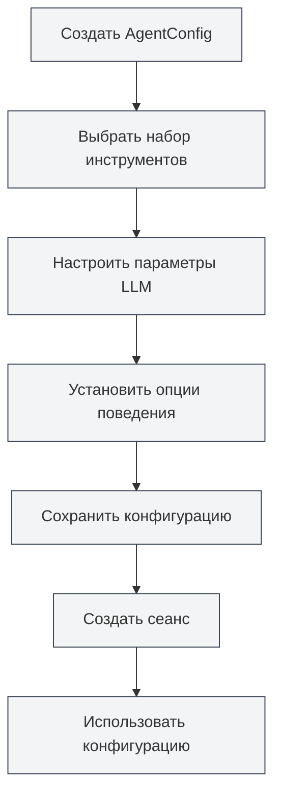

# Управление конфигурацией Agent

## Обзор

Конфигурация Agent (AgentConfig) — это основной компонент фреймворка Agent, используемый для определения идентичности и области возможностей Agent. Каждый AgentConfig связан с набором инструментов, определяет, какие инструменты может использовать Agent, и позволяет настраивать параметры LLM и опции поведения.

AgentConfig с помощью механизма пересечения наборов инструментов гибко контролирует область возможностей Agent, позволяя создавать специализированные конфигурации Agent для различных сценариев.

<AgentView mode="demo" />

## Основные понятия

### Структура AgentConfig

AgentConfig включает следующие основные части:

- **Основная информация**: ID, название, описание, номер версии
- **Связь с наборами инструментов**: Список связанных ID наборов инструментов (берётся пересечение)
- **Конфигурация LLM**: Модель, температура, максимальное количество токенов, системный промпт и т.д.
- **Конфигурация поведения**: Разрешать ли вызов инструментов, максимальное количество вызовов и т.д.
- **Тип сценария**: outline, editor, analysis, visualization, custom

### Пересечение наборов инструментов

Когда AgentConfig связан с несколькими наборами инструментов, доступные инструменты представляют собой пересечение всех наборов инструментов:

- Набор инструментов A содержит: `[tool1, tool2, tool3]`
- Набор инструментов B содержит: `[tool2, tool3, tool4]`
- Доступные инструменты для AgentConfig: `[tool2, tool3]`

Этот механизм позволяет точно контролировать область возможностей Agent.

<AgentConfigManager mode="demo" />

## Создание AgentConfig

### Создание новой конфигурации

Шаги для создания AgentConfig:

1. **Открыть управление Agent**: В представлении Agent нажмите "Управление" → "Конфигурации Agent"
2. **Создать конфигурацию**: Нажмите кнопку "Новая конфигурация"
3. **Заполнить основную информацию**:
   - Название: Название конфигурации (поддерживает многоязычность)
   - Описание: Описание конфигурации (поддерживает многоязычность)
4. **Выбрать набор инструментов**: Выберите один или несколько наборов инструментов из выпадающего списка
5. **Настроить LLM** (опционально):
   - Системный промпт: Пользовательский системный промпт
   - Внедрение временной метки: Внедрять ли текущее время в системный промпт
6. **Установить поведение** (опционально):
   - Максимальное количество вызовов инструментов: Ограничить количество вызовов инструментов Agent (null означает без ограничений)
7. **Сохранить конфигурацию**: Нажмите кнопку "Сохранить"

<AgentView mode="demo" />

Вы можете получить доступ к представлению Agent через боковую панель:

### Конфигурация по умолчанию

Система предоставляет конфигурацию AgentConfig по умолчанию (`default-agent-config`), которая содержит все встроенные инструменты. Её нельзя удалить, но можно скопировать.

## Редактирование AgentConfig

### Операция редактирования

Редактирование существующего AgentConfig:

1. **Открыть интерфейс управления**: В интерфейсе управления конфигурациями Agent найдите конфигурацию для редактирования
2. **Нажать "Редактировать"**: Нажмите кнопку "Редактировать" на карточке конфигурации
3. **Изменить конфигурацию**: Измените название, описание, наборы инструментов, конфигурацию LLM или конфигурацию поведения
4. **Сохранить изменения**: Нажмите кнопку "Сохранить"

**Примечание**: Конфигурация по умолчанию (`default-agent-config`) не позволяет редактирование, но её можно скопировать и затем отредактировать.

<AgentConfigManager mode="demo" />

## Удаление AgentConfig

### Операция удаления

Удаление ненужного AgentConfig:

1. **Открыть интерфейс управления**: В интерфейсе управления конфигурациями Agent найдите конфигурацию для удаления
2. **Нажать "Удалить"**: Нажмите кнопку "Удалить" на карточке конфигурации
3. **Подтвердить удаление**: Подтвердите удаление во всплывающем диалоговом окне подтверждения

<AgentConfigManager mode="demo" />

**Примечание**:

- Конфигурация по умолчанию (`default-agent-config`) не может быть удалена
- Удаление конфигурации не повлияет на уже созданные сеансы, но новые сеансы не смогут использовать эту конфигурацию
- Если конфигурация используется сеансом, перед удалением будет выведено предупреждение

## Копирование AgentConfig

### Операция копирования

Копирование существующего AgentConfig:

1. **Открыть интерфейс управления**: В интерфейсе управления конфигурациями Agent найдите конфигурацию для копирования
2. **Нажать "Копировать"**: Нажмите кнопку "Копировать" на карточке конфигурации
3. **Редактировать копию**: Система создаст копию, название автоматически получит суффикс " (копия)"
4. **Сохранить изменения**: При необходимости измените копию и сохраните

<AgentView mode="demo" />

Копирование конфигурации копирует все настройки, включая связь с наборами инструментов, конфигурацию LLM и конфигурацию поведения.

## Импорт/Экспорт AgentConfig

### Экспорт конфигурации

Экспорт AgentConfig в файл JSON:

1. **Открыть интерфейс управления**: В интерфейсе управления конфигурациями Agent найдите конфигурацию для экспорта
2. **Нажать "Экспорт"**: Нажмите кнопку "Экспорт" на карточке конфигурации
3. **Выбрать место**: Выберите место сохранения и имя файла
4. **Сохранить файл**: Нажмите сохранить для экспорта конфигурации

Экспортированный файл JSON содержит всю информацию о конфигурации и может использоваться для резервного копирования или обмена.

<AgentConfigManager mode="demo" />

### Импорт конфигурации

Импорт AgentConfig из файла JSON:

1. **Открыть интерфейс управления**: В интерфейсе управления конфигурациями Agent
2. **Нажать "Импорт"**: Нажмите кнопку "Импорт конфигурации"
3. **Выбрать файл**: Выберите файл JSON для импорта
4. **Проверить данные**: Система проверяет формат и содержимое файла
5. **Импортировать конфигурацию**: После успешного импорта создаётся новая конфигурация

Импортированная конфигурация получает новый ID и не перезаписывает существующие конфигурации (если не используется режим перезаписи).

## Конфигурация LLM

### Системный промпт

AgentConfig может настраивать пользовательский системный промпт:

- **Промпт по умолчанию**: Если не установлен, используется системный промпт по умолчанию фреймворка Agent
- **Пользовательский промпт**: Можно установить специализированный системный промпт, определяющий роль и поведение Agent
- **Внедрение временной метки**: Можно выбрать, внедрять ли текущее время в системный промпт

### Параметры LLM

AgentConfig может переопределять глобальную конфигурацию LLM:

- **Модель**: Указать используемую модель LLM
- **Температура**: Контролировать случайность вывода (0-2)
- **Максимальное количество токенов**: Ограничить максимальное количество токенов для одного вызова

**Примечание**: Если AgentConfig не устанавливает параметры LLM, будет использоваться глобальная конфигурация LLM.

<AgentConfigManager mode="demo" />

## Конфигурация поведения

### Контроль вызова инструментов

AgentConfig может контролировать поведение вызова инструментов:

- **Разрешить вызов инструментов**: Разрешать ли Agent вызывать инструменты (по умолчанию разрешено)
- **Максимальное количество вызовов инструментов**: Ограничить максимальное количество вызовов инструментов для одной задачи (null означает без ограничений)
- **Разрешить вызов рабочих процессов**: Разрешать ли Agent вызывать рабочие процессы (по умолчанию разрешено)

### Сценарии использования

Разные конфигурации поведения подходят для разных сценариев:

- **Чисто диалоговый сценарий**: Отключить вызов инструментов, только диалог
- **Сценарий с ограниченными инструментами**: Ограничить количество вызовов инструментов, избегая чрезмерных вызовов
- **Полнофункциональный сценарий**: Разрешить все вызовы инструментов, без ограничений

<AgentConfigManager mode="demo" />

## Типы сценариев

AgentConfig может устанавливать тип сценария для классификации и управления:

- **outline**: Сценарий структуры, для задач, связанных со структурой документа
- **editor**: Сценарий редактора, для задач редактирования документа
- **analysis**: Сценарий анализа, для задач анализа документа
- **visualization**: Сценарий визуализации, для задач генерации диаграмм
- **custom**: Пользовательский сценарий

Тип сценария в основном используется для классификации и не влияет на фактическое поведение Agent.

## Советы по использованию

### Организация конфигураций

1. **Соглашение об именовании**: Используйте понятные названия, например "Agent анализа данных", "Agent редактирования документов"
2. **Классификация по сценариям**: Используйте типы сценариев для классификации и управления
3. **Выбор набора инструментов**: Выбирайте подходящие комбинации наборов инструментов в соответствии с требованиями задачи

<AgentConfigManager mode="demo" />

### Пересечение наборов инструментов

1. **Точный контроль**: Используйте пересечение нескольких наборов инструментов для точного контроля возможностей Agent
2. **Проектирование наборов инструментов**: Создавайте специализированные наборы инструментов, а затем комбинируйте их через пересечение
3. **Тестирование и проверка**: После создания конфигурации проверьте, правильно ли работает пересечение наборов инструментов

<AgentConfigManager mode="demo" />

### Конфигурация LLM

1. **Системный промпт**: Пишите специализированные системные промпты для разных сценариев
2. **Настройка параметров**: Настраивайте температуру и максимальное количество токенов в соответствии с особенностями задачи
3. **Внедрение временной метки**: Для задач, требующих осознания времени, включайте внедрение временной метки

## Часто задаваемые вопросы

### В: Как создать специализированную конфигурацию Agent?

О: Создайте новую конфигурацию, выберите специализированный набор инструментов, установите пользовательский системный промпт и конфигурацию поведения. Например, создайте "Agent анализа данных", свяжите набор инструментов для анализа данных, установите специализированный системный промпт.

### В: Что означает пересечение наборов инструментов?

О: Когда AgentConfig связан с несколькими наборами инструментов, доступные инструменты представляют собой пересечение всех наборов инструментов. Например, набор инструментов A содержит `[tool1, tool2, tool3]`, набор инструментов B содержит `[tool2, tool3, tool4]`, тогда доступные инструменты для AgentConfig — `[tool2, tool3]`.

### В: Можно ли изменить конфигурацию по умолчанию?

О: Конфигурация по умолчанию (`default-agent-config`) не позволяет редактирование, но её можно скопировать и затем отредактировать. Скопируйте конфигурацию по умолчанию, а затем измените копию.

### В: Каково соотношение конфигурации LLM и глобальной конфигурации?

О: Если AgentConfig установил параметры LLM, будут использоваться настройки AgentConfig; в противном случае используется глобальная конфигурация LLM. Настройки AgentConfig имеют более высокий приоритет.

### В: Как ограничить количество вызовов инструментов Agent?

О: В конфигурации поведения AgentConfig установите "Максимальное количество вызовов инструментов". Установите конкретное число (например, 10), чтобы ограничить количество вызовов, установите null для отсутствия ограничений.

### В: Повлияет ли удаление конфигурации на существующие сеансы?

О: Удаление конфигурации не повлияет на уже созданные сеансы, но новые сеансы не смогут использовать эту конфигурацию. Если конфигурация используется сеансом, перед удалением будет выведено предупреждение.

<AgentView mode="demo" />

## Связанная документация

- [[agent.introduction|Обзор фреймворка Agent]]
- [[agent.tools|Управление наборами инструментов]]
- [[agent.session|Управление сеансами Agent]]
- [[agent.engine|Управление движком Agent]]
