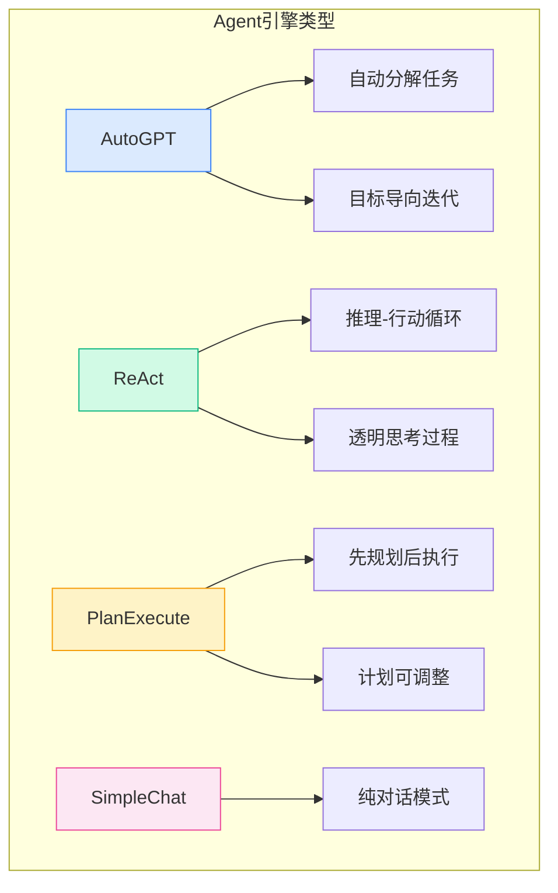
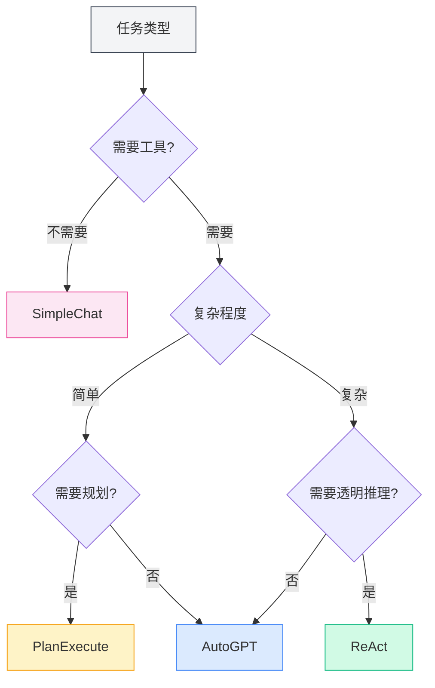
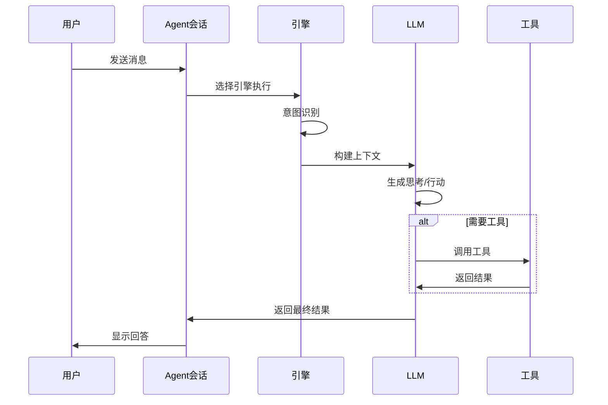

# Управление движками Agent

## Обзор

Движок Agent определяет стратегию выполнения и модель поведения агента. MetaDoc предоставляет несколько встроенных движков, каждый из которых использует различную парадигму выполнения на основе ИИ и подходит для разных сценариев задач. Выбирая подходящий движок, вы можете поручить агенту выполнение конкретной задачи наиболее оптимальным способом.

<AgentView mode="demo" />

## Типы движков

MetaDoc поддерживает следующие движки Agent:

| Название движка   | Особенности                     | Сценарии применения      |
| ----------------- | ------------------------------- | ------------------------ |
| **AutoGPT**       | Автоматическая декомпозиция задач, итерации, ориентированные на цель | Сложные многошаговые задачи |
| **ReAct**         | Цикл "Рассуждение-Действие", прозрачный процесс мышления | Задачи, требующие детальных рассуждений |
| **PlanExecute**   | Сначала планирование, затем выполнение, план можно корректировать | Структурированные задачи |
| **SimpleChat**    | Чистый диалог, без вызова инструментов | Простые вопросы и ответы |



## Подробное описание движков

### Движок AutoGPT

**Особенности**:

- **Автоматическая декомпозиция задач**: Автоматически разбивает сложные задачи на подзадачи
- **Ориентированность на цель**: Итеративное выполнение, сфокусированное на конечной цели
- **Автономное принятие решений**: Агент самостоятельно определяет следующие действия

<AgentView mode="demo" />
<AgentEngineManager mode="demo" />

**Сценарии применения**:

- Исследования и сбор информации
- Многоэтапная обработка документов
- Открытые творческие задачи

**Пример**:

```
Пользователь: Помогите написать обзорную статью об искусственном интеллекте
Agent: [Автоматически разбивает на: 1. Сбор материалов 2. Составление плана 3. Написание содержания 4. Редактирование и полировка]
```

### Движок ReAct

**Особенности**:

- **Цикл "Рассуждение-Действие"**: Явное отображение процесса мышления (Reasoning) и действий (Action)
- **Прослеживаемость**: Каждый шаг имеет четкое обоснование
- **Прозрачность и управляемость**: Пользователь может видеть логику мышления агента

<AgentView mode="demo" />
<AgentEngineManager mode="demo" />

**Сценарии применения**:

- Задачи, требующие объяснения процесса рассуждений
- Задачи логического анализа
- Сценарии обучающих демонстраций

**Пример**:

```
Рассуждение: Пользователю нужно, чтобы я объяснил функционал этого кода
Действие: Вызов инструмента анализа кода
Наблюдение: [Результат, возвращенный инструментом]
Рассуждение: На основе результатов анализа я могу объяснить...
```

### Движок PlanExecute

**Особенности**:

- **Сначала планирование, затем выполнение**: Сначала создается полный план, затем выполнение по плану
- **План можно корректировать**: В процессе выполнения план можно изменять
- **Структурированный вывод**: Формат вывода стандартизирован, легко воспринимается

<AgentView mode="demo" />
<AgentEngineManager mode="demo" />

**Сценарии применения**:

- Задачи управления проектами
- Генерация структурированных документов
- Процессная работа

**Пример**:

```
План:
1. Анализ требований
2. Разработка решения
3. Реализация функционала
4. Тестирование и проверка

Выполнение: Выполнение каждого этапа по шагам
```

### Движок SimpleChat

**Особенности**:

- **Режим чистого диалога**: Только диалог, без вызова каких-либо инструментов
- **Быстрый отклик**: Не нужно ждать выполнения инструментов
- **Простота и прямота**: Подходит для простых вопросов и ответов

**Сценарии применения**:

- Общие вопросы и ответы
- Объяснение концепций
- Простой диалог

**Примечание**: Этот движок не вызывает инструменты, поэтому не может выполнять операции с файлами, анализ данных и другие подобные функции.

<AgentEngineManager mode="demo" />

## Выбор движка

### Как выбрать подходящий движок

Выбирайте движок в зависимости от особенностей задачи:



<AgentView mode="demo" />

### Рекомендации по выбору

| Сценарий задачи | Рекомендуемый движок       |
| --------------- | -------------------------- |
| Повседневные вопросы и ответы | SimpleChat           |
| Редактирование документов | AutoGPT или ReAct     |
| Анализ данных   | ReAct или PlanExecute |
| Написание кода  | ReAct                |
| Исследовательская работа | AutoGPT              |
| Управление проектами | PlanExecute          |

<AgentView mode="demo" />

## Настройка движка

### Выбор движка в конфигурации Agent

1. Перейдите в [[agent.introduction|Управление конфигурацией Agent]]
2. Создайте или отредактируйте конфигурацию Agent
3. В опции "Движок" выберите нужный тип движка
4. Сохраните конфигурацию

### Настройка параметров движка

Разные движки могут иметь специфические настройки параметров:

**Общие параметры**:

- **Максимальное количество итераций**: Ограничивает количество циклов мышления и действий агента
- **Таймаут**: Максимальное время ожидания для одного вызова
- **Температура**: Управляет степенью креативности вывода

**Специфические параметры движка**:

- **AutoGPT**: Глубина декомпозиции цели
- **ReAct**: Опции отображения процесса мышления
- **PlanExecute**: Права на корректировку плана

## Процесс выполнения движка

### Общий процесс выполнения



### Особенности выполнения разных движков

**Особенности выполнения AutoGPT**:

1. Анализ цели пользователя
2. Автоматическая декомпозиция на подзадачи
3. Последовательное выполнение подзадач
4. Обобщение и возврат результатов

**Особенности выполнения ReAct**:

1. Генерация процесса рассуждений
2. Определение следующего действия
3. Выполнение действия (вызов инструмента или генерация ответа)
4. Наблюдение результата
5. Цикл до завершения задачи

**Особенности выполнения PlanExecute**:

1. Анализ требований
2. Разработка полного плана
3. Выполнение по шагам
4. Возврат структурированного результата

## Пользовательские движки

### Настройка пользовательского движка

Для продвинутых пользователей доступна настройка поведения движка:

1. **Изменение системных промптов**: Настройка роли и поведения агента
2. **Настройка предпочтений инструментов**: Указание приоритетных инструментов
3. **Корректировка параметров рассуждений**: Температура, максимальное количество токенов и т.д.

### Создание пользовательского движка (продвинутый уровень)

Разработчики могут создавать новые типы движков:

1. Наследование базового интерфейса движка
2. Реализация специфической логики выполнения
3. Регистрация в менеджере движков
4. Выбор для использования в конфигурации

## Лучшие практики

### Принципы выбора движка

1. **Начните с простого**: Если не уверены, сначала протестируйте с SimpleChat
2. **Выбирайте по сложности**: Для сложных задач используйте AutoGPT или ReAct
3. **Учитывайте объяснимость**: Если требуется объяснение, используйте ReAct

### Оптимизация эффективности движка

1. **Четко описывайте требования**: Эффективность движка во многом зависит от ясности ввода
2. **Рационально используйте инструменты**: Настройте для агента подходящий набор инструментов
3. **Устанавливайте разумные ограничения**: Контролируйте затраты через параметры, такие как максимальное количество итераций
4. **Своевременно давайте обратную связь**: Оставляйте отзывы на ответы агента, чтобы помочь в улучшении

## Часто задаваемые вопросы

### В: Почему Agent не выполнил задачу, как ожидалось?

О: Возможные причины:

- Неподходящий выбор движка
- Недостаточная конфигурация набора инструментов
- Нечеткое описание задачи
- Достигнуто ограничение по максимальному количеству итераций

### В: Можно ли переключать движок в процессе диалога?

О: В настоящее время переключение движка в рамках одного диалога не поддерживается. Если необходимо сменить движок, рекомендуется:

1. Завершить текущую сессию
2. Создать новую сессию
3. Выбрать конфигурацию Agent с другим движком

### В: Какой движок лучше всего подходит для начинающих?

О: Рекомендации:

- Сначала используйте SimpleChat, чтобы ознакомиться с функциями диалога
- Затем попробуйте ReAct, чтобы наблюдать процесс рассуждений
- После освоения используйте AutoGPT для обработки сложных задач

### В: Влияет ли движок на качество ответов?

О: Да. Разные движки имеют различные подходы к мышлению и стратегии выполнения:

- Одна и та же задача может быть решена разными движками по-разному
- Выбор подходящего движка может значительно повысить эффективность
- Рекомендуется настраивать разных агентов для разных типов задач

## Связанная документация

- [[agent.introduction|Обзор фреймворка Agent]]
- [[agent.introduction|Управление конфигурацией Agent]]
- [[agent.session|Управление сессиями Agent]]
- [[agent.tools|Управление набором инструментов]]