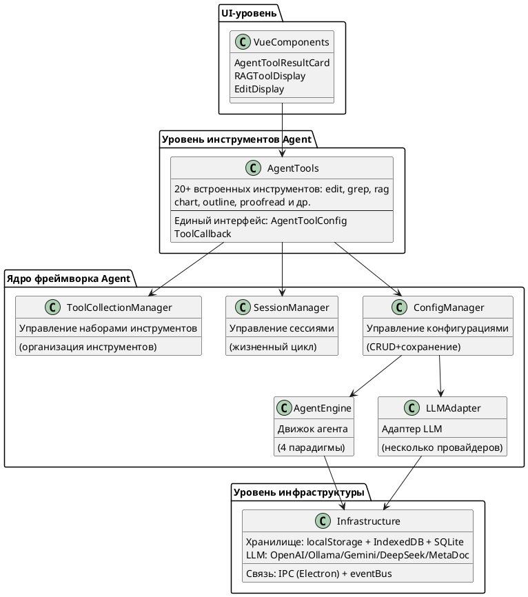
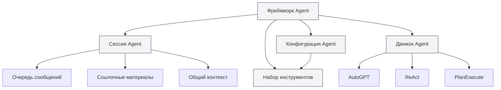
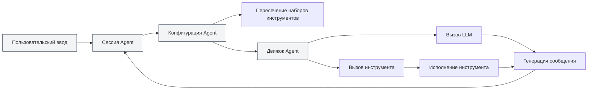
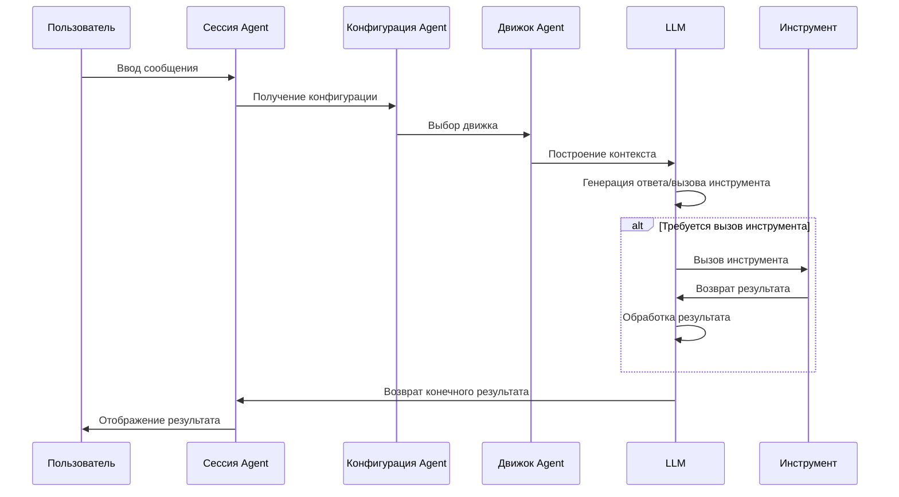

# Обзор фреймворка Agent

## Обзор

Фреймворк Agent — это ядро MetaDoc для построения и управления системами интеллектуальных агентов, использующее **многоуровневую архитектуру**. Он предоставляет полный жизненный цикл управления агентами, включая управление сессиями, конфигурацией, наборами инструментов и движками.

Фреймворк Agent построен на основе существующей системы Tool и реализует гибкую, расширяемую систему агентов через ключевые компоненты: конфигурацию агента (AgentConfig), набор инструментов (ToolCollection) и сессию агента (AgentSession).

<AgentSessionManager mode="demo" />

## Предварительный просмотр интерфейса

Фреймворк Agent предоставляет интуитивно понятный интерфейс для управления сессиями и инструментами агента:

<AgentView mode="demo" />

## Техническая архитектура

### Уровни архитектуры



### Ключевые пути к файлам

| Категория         | Путь к файлу                                                              | Описание                              |
| ----------------- | ------------------------------------------------------------------------- | ------------------------------------- |
| **Определения типов** | `src/renderer/src/types/agent-framework.ts`                               | Основные определения типов фреймворка Agent |
| **Определения типов** | `src/renderer/src/types/agent-tool.ts`                                    | Определения типов инструментов Agent  |
| **Управление конфигурацией** | `src/renderer/src/utils/agent-framework/agent-config-manager.ts`          | CRUD и сохранение AgentConfig         |
| **Управление сессиями** | `src/renderer/src/utils/agent-framework/agent-session-manager.ts`         | Управление жизненным циклом AgentSession |
| **Управление наборами инструментов** | `src/renderer/src/utils/agent-framework/tool-collection-manager.ts`       | Организация и управление наборами инструментов |
| **Управление движком** | `src/renderer/src/utils/agent-framework/agent-engine-manager.ts`          | Управление конфигурацией движка Agent |
| **Исполнение движка** | `src/renderer/src/utils/agent-framework/agent-engine-executor.ts`         | Реализация 4 парадигм исполнения      |
| **Запуск инструментов** | `src/renderer/src/utils/agent-framework/tool-runner.ts`                   | Единая точка входа для вызова инструментов |
| **Адаптер LLM**   | `src/renderer/src/utils/agent-framework/llm-adapter.ts`                   | Адаптация для нескольких провайдеров LLM |



## Ключевые концепции

### Сессия агента (AgentSession)

<AgentView mode="demo" />

Сессия агента — это экземпляр AgentConfig, представляющий независимую, контекстную среду исполнения агента. Реализована на основе `agent-session-manager.ts`. Каждая сессия поддерживает свою историю сообщений, ссылочные материалы, общее контекстное пространство и предоставляет расширенные функции, такие как очередь сообщений, повторные попытки, Duplicate и другие.

**Определение типа** (строки 387-424 в `types/agent-framework.ts`):

```typescript
export interface AgentSession {
  entityType: 'agent-session'
  id: string
  title: string
  agentConfigId: string // Связанный AgentConfig
  messages: AgentMessage[] // История сообщений
  messageQueue: QueuedMessage[] // Очередь сообщений
  referenceStore: Reference[] // Ссылочные материалы
  publicContext: PublicContext // Общий контекст
  executionNodes: ExecutionNode[] // Узлы исполнения (для повторных попыток)
  status: AgentSessionStatus // Статус сессии
}
```

**Машина состояний сессии**:

```
idle → thinking → generating → tool-calling → waiting-input → error
```

Подробнее см. [[agent.session|Управление сессиями Agent]].

### Конфигурация агента (AgentConfig)

<CompletionSettingsPanel mode="demo" />

AgentConfig определяет личность агента и область его возможностей. Реализована на основе `agent-config-manager.ts`.

**Определение типа** (строки 242-289 в `types/agent-framework.ts`):

```typescript
export interface AgentConfig {
  entityType: 'agent-config'
  id: string
  name: LocalizedText // Имя с поддержкой i18n
  description: LocalizedText // Описание с поддержкой i18n
  toolCollectionIds: string[] // Связанные ID наборов инструментов (пересечение)
  maxToolCalls?: number | null // Максимальное количество вызовов инструментов
  llmConfig?: {
    model?: string
    temperature?: number
    systemPrompt?: string // Системный промпт
    injectTimestamp?: boolean
  }
  behavior?: {
    allowToolCalls?: boolean
  }
  scenario?: 'outline' | 'editor' | 'analysis' | 'visualization' | 'custom'
}
```

**Ключевые функции**:

- **Конфигурация по умолчанию**: `default-agent-config` (встроенная, нельзя удалить)
- **Пересечение наборов инструментов**: при связывании нескольких наборов инструментов доступные инструменты — это пересечение всех наборов.
- **Переопределение параметров LLM**: можно переопределить глобальную конфигурацию LLM.
- **Сохранение**: хранится в `localStorage` с ключом `'agent-configs'`.

Управление, связанное с агентом, сосредоточено в меню **представления Agent**. Начните с [[agent.tools|Управление наборами инструментов]] и [[agent.capabilities|Правила, навыки и управление MCP]]. (Запись индекса «Конфигурация Agent» удалена; статья остаётся для справки.)

### Набор инструментов (ToolCollection)

<DataAnalysisDisplay mode="demo" />

Набор инструментов — это коллекция инструментов агента, используемая для организации и управления инструментами, доступными агенту. AgentConfig может быть связан с несколькими наборами инструментов, при этом доступные инструменты — это пересечение всех связанных наборов.

Подробнее см. [[agent.tools|Управление наборами инструментов]].

### Ссылочные материалы (Reference)

<RAGToolDisplay mode="demo" />

Ссылочные материалы — это документы и файлы, на которые ссылается сессия агента. Агент может воспринимать это содержимое и выполнять рассуждения и операции на его основе. Поддерживаются различные типы ссылок: файлы, URL, базы знаний и другие.

Ссылки используются в сессиях; см. [[agent.session|Управление сессиями Agent]]. (Отдельная запись «Ссылочные материалы» удалена из индекса.)

### Движок агента (AgentEngine)

<DiffDisplay mode="demo" />

Движок агента определяет стратегию исполнения и поведение агента, включая такие парадигмы, как AutoGPT, ReAct, PlanExecute и другие. Разные движки подходят для разных сценариев задач.

Парадигмы выполнения выбираются по контексту сессии; см. [[agent.session|Управление сессиями Agent]]. (Запись «Движок Agent» удалена из индекса.)

## Архитектура системы

Архитектура системы фреймворка Agent выглядит следующим образом:



## Процесс исполнения

Базовый процесс исполнения агента:

1. **Пользовательский ввод**: пользователь вводит сообщение в сессию агента.
2. **Распознавание намерения**: система распознает намерение пользователя и обновляет описания доступных инструментов.
3. **Выбор движка**: выбор движка исполнения на основе конфигурации агента.
4. **Построение контекста**: построение контекста, включающего историю сообщений, ссылочные материалы, описания инструментов.
5. **Вызов LLM**: вызов LLM для генерации ответа или вызова инструмента.
6. **Исполнение инструмента**: если LLM решает вызвать инструмент, выполняется соответствующий инструмент.
7. **Обработка результата**: результат исполнения инструмента возвращается в LLM как наблюдение (Observation).
8. **Итерационный цикл**: в зависимости от типа движка может выполняться несколько итераций до завершения задачи.
9. **Вывод результата**: конечный результат отображается пользователю.



## Функциональные возможности

### Основные функции

- **Управление сессиями**: создание, удаление, копирование, экспорт/импорт сессий.
- **Управление конфигурацией**: гибкая конфигурация агента с поддержкой пересечения нескольких наборов инструментов.
- **Управление наборами инструментов**: организация и управление инструментами агента.
- **Управление ссылочными материалами**: управление ссылочными документами и файлами в сессии.
- **Управление движком**: поддержка нескольких парадигм исполнения, возможность настройки движка.

### Расширенные функции

- **Очередь сообщений**: вставка сообщений в процессе исполнения агента.
- **Механизм повторных попыток**: поддержка повторных попыток для неудачных узлов исполнения.
- **Функция Duplicate**: копирование сессии или узлов исполнения.
- **Общий контекст**: общее контекстное пространство на уровне сессии.
- **Отслеживание узлов исполнения**: запись состояния и результата каждого узла исполнения.

## Сценарии использования

Фреймворк Agent подходит для следующих сценариев:

- **Редактирование документов**: использование инструментов агента для редактирования и оптимизации документов.
- **Анализ данных**: использование инструментов анализа данных для обработки и визуализации данных.
- **Генерация контента**: использование движка агента и наборов инструментов для генерации структурированного контента.
- **Поиск знаний**: интеллектуальный поиск и анализ в сочетании с базой знаний.
- **Автоматизация задач**: выполнение многошаговых задач через агента и наборы инструментов.

## Быстрый старт

Чтобы начать использовать фреймворк Agent, рекомендуется изучить материалы в следующем порядке:

1. [[agent.introduction|Обзор фреймворка Agent]] (этот документ)
2. [[agent.tools|Управление наборами инструментов]]: научитесь управлять наборами инструментов.
3. [[agent.capabilities|Правила, навыки и управление MCP]]: правила, навыки рабочей области и MCP.
4. [[agent.session|Управление сессиями Agent]]: создавайте и управляйте сессиями.

## Часто задаваемые вопросы

### В: Чем фреймворк Agent отличается от AI-диалога?

О: AI-диалог — это простая функция общения, тогда как фреймворк Agent предоставляет полную систему агентов, включая расширенные функции, такие как вызов инструментов, управление ссылочными материалами и другие. Фреймворк Agent может выполнять сложные задачи, а не только вести диалог.

### В: Как выбрать подходящий движок агента?

О:

- **Движок AutoGPT**: подходит для большинства интеллектуальных задач, обладает сильной способностью к автономному принятию решений.
- **Движок ReAct**: подходит для задач, требующих детальных шагов рассуждения, с явным процессом мышления.
- **Движок PlanExecute**: подходит для задач, требующих структурированного исполнения: сначала планирование, затем выполнение.
- **Движок SimpleChat**: подходит для чисто диалоговых задач без вызова инструментов.

### В: Что означает пересечение наборов инструментов?

О: Когда AgentConfig связан с несколькими наборами инструментов, доступные инструменты — это пересечение всех наборов. Например, если набор инструментов A содержит `[tool1, tool2, tool3]`, а набор B содержит `[tool2, tool3, tool4]`, то доступные инструменты для AgentConfig будут `[tool2, tool3]`.

## Связанная документация

- [[agent.session|Управление сессиями Agent]]
- [[agent.tools|Управление наборами инструментов]]
- [[agent.capabilities|Правила, навыки и управление MCP]]
- [[ai.llm-config|Конфигурация LLM]]

<QuickStartPanel mode="demo" />