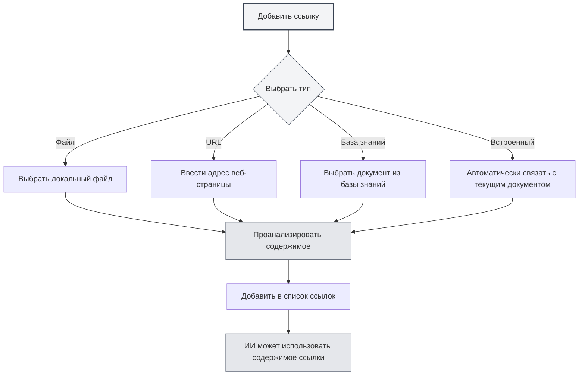

# Управление ссылочными материалами

## Обзор

Ссылочные материалы — важная функция в сессиях агента, позволяющая включать в диалог внешние документы, веб-страницы, файлы и другой контент. Агент может рассуждать и отвечать на основе этих материалов, делая ответы ИИ более точными и релевантными.

С помощью ссылочных материалов вы можете:

- Заставить ИИ обращаться к содержимому конкретных документов
- Обсуждать информацию на основе веб-страниц
- Анализировать содержимое локальных файлов
- Проводить глубокие вопросы и ответы с использованием базы знаний

## Открытие управления ссылками

В интерфейсе сессии агента нажмите вкладку "Ссылки", чтобы открыть панель управления ссылочными материалами.

На панели ссылок отображаются все добавленные в текущую сессию ссылочные материалы, включая:

- Имя файла или URL
- Тип ссылки (файл/URL/база знаний/встроенный документ)
- Статус активности
- Предварительный просмотр содержимого

Вы можете получить доступ к представлению агента через боковую панель:

<ReferenceManager mode="demo" />
<ReferenceDisplay mode="demo" />

## Добавление ссылок

### Добавление ссылки на файл

Добавление локального файла в качестве ссылочного материала:

1. На панели ссылок нажмите кнопку "Добавить ссылку"
2. Выберите тип "Файл"
3. В окне выбора файла выберите файл для ссылки
4. Подтвердите добавление

**Поддерживаемые форматы файлов**:

- Документы Markdown (.md)
- Документы LaTeX (.tex)
- PDF-файлы (.pdf)
- Документы Word (.docx)
- Текстовые файлы (.txt)
- Файлы изображений (.png, .jpg)

<ReferenceManager mode="demo" />

### Добавление ссылки на URL

Ссылка на содержимое веб-страницы:

1. На панели ссылок нажмите кнопку "Добавить ссылку"
2. Выберите тип "URL"
3. Введите адрес веб-страницы для ссылки
4. Нажмите "Подтвердить"

MetaDoc автоматически извлечет содержимое веб-страницы и добавит его в ссылки.

<ReferenceManager mode="demo" />
<ReferenceDisplay mode="demo" />

### Добавление ссылки на базу знаний

Ссылка на документ из базы знаний:

1. На панели ссылок нажмите кнопку "Добавить ссылку"
2. Выберите тип "База знаний"
3. Из списка базы знаний выберите документ для ссылки
4. Подтвердите добавление

<ReferenceDisplay mode="demo" />

### Ссылка на встроенный документ

В каждой сессии агента по умолчанию включена "Ссылка на встроенный документ" (ссылка №0), которая динамически получает содержимое текущего открытого документа в качестве ссылочного материала.



## Управление ссылками

### Включение/отключение ссылок

Статус активности каждого ссылочного материала можно контролировать независимо:

- **Включено**: Содержимое ссылки участвует в процессе рассуждения ИИ
- **Отключено**: Содержимое ссылки временно не участвует в рассуждении, но остается в списке

Нажмите переключатель рядом со ссылочным материалом, чтобы изменить статус активности.

<ReferenceDisplay mode="demo" />

### Предварительный просмотр содержимого ссылки

Нажмите на ссылочный материал, чтобы просмотреть его содержимое:

- **Ссылка на файл**: Отображает текстовый предварительный просмотр содержимого файла
- **Ссылка на URL**: Отображает извлеченное содержимое веб-страницы
- **Ссылка на базу знаний**: Отображает соответствующие фрагменты из базы знаний
- **Встроенная ссылка**: Отображает содержимое текущего документа

### Удаление ссылки

Удаление ненужных ссылок из списка:

1. На панели ссылок найдите ссылку для удаления
2. Нажмите кнопку удаления (значок ×)
3. Подтвердите удаление

**Примечание**: Удаление ссылки удаляет только связь ссылки, не затрагивая исходный файл.

<ReferenceManager mode="demo" />

## Роль ссылок в диалоге

### Осведомленность о ссылках

Когда вы активируете ссылки, агент при ответе будет:

1. **Анализировать содержимое ссылок**: Понимать содержимое документов, веб-страниц или файлов
2. **Учитывать контекст**: Сочетать содержимое ссылок с историей диалога
3. **Формировать ответ**: Генерировать более точные ответы на основе содержимого ссылок

### Примеры использования

**Сценарий 1: Вопросы и ответы на основе документа**

```
Пользователь: [Добавил технический документ в качестве ссылки]
Вопрос пользователя: Какие лучшие практики упоминаются в этом документе?
ИИ: Согласно документу, на который вы ссылаетесь, лучшие практики включают...
```

**Сценарий 2: Сравнение нескольких документов**

```
Пользователь: [Добавил две научные статьи в качестве ссылок]
Вопрос пользователя: Сравните методы исследования в этих двух статьях
ИИ: В первой статье используется..., а во второй применяется...
```

**Сценарий 3: Анализ содержимого веб-страницы**

```
Пользователь: [Добавил новостную веб-страницу в качестве ссылки]
Вопрос пользователя: Обобщите основное содержание этого репортажа
ИИ: Согласно содержимому веб-страницы, в основном сообщается о...
```

## Лучшие практики

### Эффективное использование ссылок

1. **Выбирайте релевантные материалы**: Добавляйте только ссылки, относящиеся к текущей теме, чтобы избежать информационной перегрузки
2. **Контролируйте количество ссылок**: Рекомендуется одновременно активировать не более 5 ссылок для обеспечения эффективности обработки
3. **Своевременно очищайте**: После завершения диалога удаляйте ненужные ссылки, чтобы поддерживать список в порядке

### Стратегии использования ссылок

1. **Анализ документов**: При анализе длинных документов добавляйте ссылки на документы и задавайте конкретные вопросы
2. **Поиск знаний**: Используйте ссылки на базу знаний для вопросов и ответов на основе базы знаний
3. **Актуальная информация**: Получайте самую свежую информацию через ссылки на URL
4. **Продолжение контекста**: Используйте встроенные ссылки, чтобы ИИ понимал редактируемый в данный момент документ

## Советы по использованию

### Быстрое добавление

- **Добавление перетаскиванием**: Перетащите файл прямо на панель ссылок
- **Добавление через контекстное меню**: Щелкните правой кнопкой мыши на файле или веб-странице и выберите "Добавить в ссылки"
- **Горячие клавиши**: Используйте горячие клавиши для быстрого открытия панели ссылок

<ReferenceManager mode="demo" />

### Комбинирование ссылок

Можно одновременно добавлять несколько ссылок разных типов:

- PDF-документ + ссылка на веб-страницу
- Несколько документов из базы знаний
- Локальный файл + встроенная ссылка на документ

ИИ будет комплексно анализировать содержимое всех включенных ссылок.

<ReferenceDisplay mode="demo" />

### Временное отключение

Если вы не уверены, полезна ли ссылка, вы можете сначала отключить ее:

1. Наблюдайте за ответами ИИ без этой ссылки
2. Затем включите ссылку и сравните разницу в ответах
3. Решите, оставлять ли ссылку, основываясь на результате

## Часто задаваемые вопросы

### В: Есть ли ограничения на размер содержимого ссылки?

О: Да. Слишком большие файлы могут быть обработаны с усечением. Рекомендуется:

- Добавлять очень большие документы по главам
- Использовать базу знаний для обработки большого количества документов
- Сначала извлекать ключевые части из длинных документов

### В: Почему ИИ, кажется, не использует добавленную ссылку?

О: Возможные причины:

- Ссылка не включена (проверьте статус переключателя)
- Содержимое ссылки не относится к вопросу
- Не удалось проанализировать ссылку (проверьте формат файла)

### В: Что делать, если ссылка на URL не работает?

О: Возможные причины:

- Для доступа к веб-странице требуется вход в систему
- На веб-странице есть механизм защиты от парсинга
- Проблемы с сетевым подключением
  Рекомендация: Сохраните содержимое веб-страницы как файл и добавьте ссылку на файл

### В: Занимают ли ссылки место в хранилище?

О: Сами ссылки — это просто связи и не занимают дополнительного места. Однако результаты анализа ссылок кэшируются локально.

## Связанные документы

- [[agent.session|Управление сессиями агента]]
- [[agent.config|Управление конфигурацией агента]]
- [[knowledge-base.usage|Использование базы знаний]]
- [[agent.introduction|Обзор фреймворка агента]]