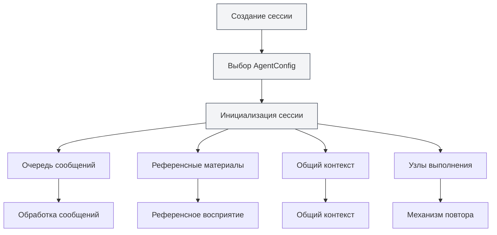
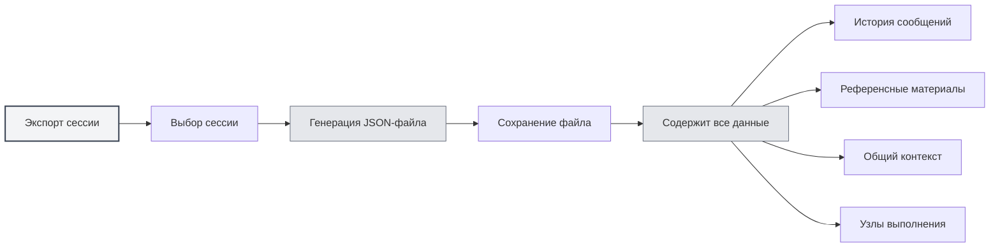
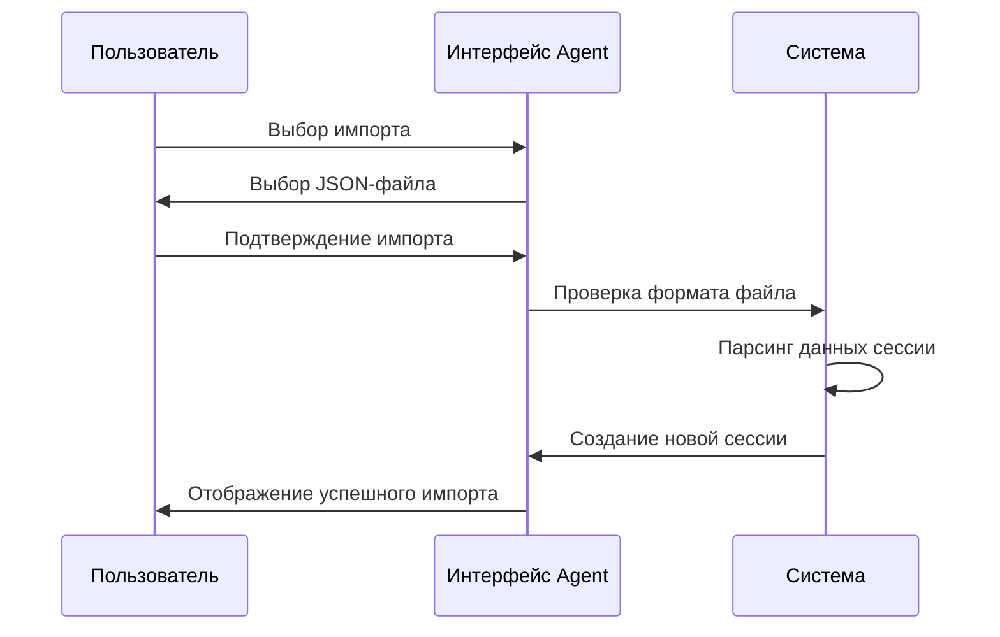
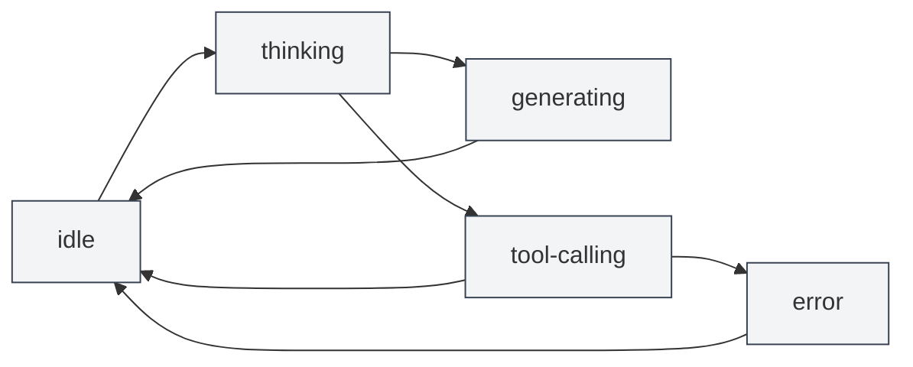

# Управление сессиями агента

## Обзор

Сессия агента — это основной компонент фреймворка Agent, представляющий собой независимую, контекстную среду выполнения агента. Каждая сессия поддерживает собственную историю сообщений, референсные материалы, общее контекстное пространство, а также расширенные функции, такие как очередь сообщений, повторные попытки, дублирование и другие.

<AgentView mode="demo" />

Сессия агента создается на основе AgentConfig, наследует набор инструментов и область возможностей AgentConfig, но каждая сессия имеет независимое состояние выполнения и историю.

## Создание сессии

### Создание новой сессии

Шаги для создания сессии агента:

<AgentView mode="demo" />

1.  **Откройте представление Agent**: Нажмите "AI" → "Agent" в строке меню, чтобы открыть представление Agent.
2.  **Выберите AgentConfig**: Выберите AgentConfig, который хотите использовать, над списком сессий.
3.  **Создайте сессию**: Нажмите кнопку "Новая сессия".
4.  **Введите заголовок**: При желании введите заголовок сессии (по умолчанию используется первое сообщение в качестве заголовка).
5.  **Начните диалог**: Введите первое сообщение, чтобы начать взаимодействие с агентом.

### Инициализация сессии

При создании сессии система автоматически:

<AgentSessionManager mode="demo" />

-   **Создает ID сессии**: Генерирует уникальный идентификатор сессии.
-   **Связывает AgentConfig**: Привязывает к указанному AgentConfig.
-   **Инициализирует очередь сообщений**: Создает пустую очередь сообщений.
-   **Инициализирует референсные материалы**: Создает хранилище для референсных материалов.
-   **Инициализирует общий контекст**: Создает общее контекстное пространство, включая текущее время и другую информацию.
-   **Создает приветствие**: Автоматически добавляет приветственное сообщение агента.
-   **Включает встроенные ссылки**: По умолчанию включает встроенную ссылку №0 (динамическое получение содержимого текущего документа).

## Переименование сессии

### Операция переименования

Переименование существующей сессии:

<AgentView mode="demo" />

1.  **Контекстное меню**: Щелкните правой кнопкой мыши по сессии и выберите "Переименовать".
2.  **Введите новое имя**: Введите новое имя сессии во всплывающем диалоговом окне.
3.  **Подтвердите сохранение**: Нажмите "Подтвердить", чтобы сохранить новое имя.

Имя сессии используется для идентификации и различения разных сессий, рекомендуется использовать описательные имена.

## Удаление сессии

### Операция удаления

Удаление ненужных сессий:

<AgentSessionManager mode="demo" />

1.  **Контекстное меню**: Щелкните правой кнопкой мыши по сессии и выберите "Удалить".
2.  **Подтвердите удаление**: Подтвердите удаление во всплывающем диалоговом окне подтверждения.

**Внимание**: Удаление сессии также удаляет всю историю сообщений, референсные материалы и узлы выполнения этой сессии. Эта операция необратима.

### Массовое удаление

В настоящее время массовое удаление не поддерживается, сессии необходимо удалять по одной.

## Копирование сессии

### Операция копирования

Копирование существующей сессии:

<AgentView mode="demo" />

1.  **Контекстное меню**: Щелкните правой кнопкой мыши по сессии и выберите "Копировать".
2.  **Создание копии**: Система создаст новую копию сессии.

Копирование сессии включает:

-   **Историю сообщений**: Все записи сообщений.
-   **Референсные материалы**: Все референсные материалы.
-   **Общий контекст**: Содержимое общего контекстного пространства.
-   **Узлы выполнения**: Все записи узлов выполнения.

Скопированная сессия является независимой, ее изменения не повлияют на исходную сессию.

### Сценарии использования

Копирование сессии подходит для:

-   **Ветвление обсуждения**: Продолжение обсуждения разных тем на основе существующего диалога.
-   **Эксперименты и тестирование**: Тестирование различных конфигураций агента или наборов инструментов.
-   **Резервное копирование**: Сохранение важного состояния сессии.

## Экспорт/Импорт сессии

### Экспорт сессии

<AgentView mode="demo" />

Экспорт сессии в файл JSON:

<AgentView mode="demo" />

1.  **Контекстное меню**: Щелкните правой кнопкой мыши по сессии и выберите "Экспорт".
2.  **Выберите расположение**: Выберите место сохранения и имя файла.
3.  **Сохраните файл**: Нажмите "Сохранить" для экспорта сессии.

Экспортированный файл JSON содержит:

-   Основную информацию о сессии (ID, заголовок, описание и т.д.)
-   Историю сообщений
-   Референсные материалы
-   Общий контекст
-   Узлы выполнения

### Импорт сессии

<AgentSessionManager mode="demo" />

Импорт сессии из файла JSON:

1.  **Откройте импорт**: Найдите функцию импорта в представлении Agent.
2.  **Выберите файл**: Выберите JSON-файл для импорта.
3.  **Проверка данных**: Система проверяет формат и содержимое файла.
4.  **Импорт сессии**: После успешного импорта создается новая сессия.

Импортированная сессия получает новый ID сессии и не перезаписывает существующие сессии.

## Повтор сессии

### Функция повтора

Повтор сессии позволяет повторно выполнить неудавшиеся задачи агента:

1.  **Просмотр узлов выполнения**: Просмотрите список узлов выполнения в сессии.
2.  **Выбор узла**: Выберите узел выполнения для повтора.
3.  **Повторное выполнение**: Нажмите кнопку "Повторить" для повторного выполнения.

Повтор начинается с выбранного узла выполнения, сохраняя предыдущую историю сообщений.

### Узлы выполнения

Узлы выполнения записывают каждый шаг в процессе выполнения агента:

-   **Узел сообщения**: Сообщение пользователя или ответ ИИ.
-   **Узел вызова инструмента**: Вызов инструмента и результат выполнения.
-   **Узел вызова рабочего процесса**: Процесс выполнения рабочего процесса.
-   **Узел вызова LLM**: Вызов LLM и ответ.

Каждый узел имеет состояние (ожидание, выполнение, успех, сбой, отменено) и результат.

## Управление сообщениями сессии

### Операции с сообщениями

С сообщениями сессии можно выполнять следующие операции:

-   **Редактирование сообщения**: Редактирование сообщения пользователя и повторная отправка.
-   **Повторная генерация**: Повторная генерация ответа ИИ.
-   **Копирование сообщения**: Копирование содержимого сообщения.
-   **Удаление сообщения**: Удаление сообщения (удаляет все сообщения после этого).

### Очередь сообщений

<AgentView mode="demo" />

Очередь сообщений позволяет вставлять сообщения во время выполнения агента:

1.  **Момент вставки**: Когда агент генерирует ответ или вызывает инструмент, сообщения временно помещаются в очередь.
2.  **Момент обработки**: После завершения текущей задачи, перед выполнением следующего шага, сначала обрабатываются сообщения в очереди.
3.  **Аннотация информации**: Сообщения в очереди аннотируются временной меткой вставки и ID сообщения на момент вставки, что помогает агенту понять контекст.

Функция очереди сообщений позволяет предоставлять дополнительную информацию или инструкции во время выполнения агента.

## Управление референсными материалами

### Добавление ссылок

<ReferenceManager mode="demo" />

Добавление референсных материалов для сессии:

1.  **Откройте управление ссылками**: Нажмите вкладку "Референсы" в сессии.
2.  **Добавьте ссылку**: Нажмите кнопку "Добавить ссылку".
3.  **Выберите тип**: Выберите тип ссылки (файл, URL, текст и т.д.).
4.  **Выберите содержимое**: Выберите содержимое для ссылки.

Подробнее см. [[agent.references|Управление референсными материалами]].

### Типы ссылок

Поддерживаются следующие типы ссылок:

-   **Ссылка на файл**: Ссылка на локальный файл (Markdown, LaTeX, PDF, Word, изображения и т.д.).
-   **Ссылка на URL**: Ссылка на веб-страницу.
-   **Ссылка на текст**: Ссылка на пользовательское текстовое содержимое.
-   **Ссылка на базу знаний**: Ссылка на содержимое базы знаний.
-   **Встроенная ссылка**: Динамическое получение содержимого текущего документа (включено по умолчанию).

### Активация ссылок

<ReferenceManager mode="demo" />

Референсные материалы можно активировать или деактивировать:

-   **Активация ссылки**: Активированные ссылки используются при выполнении агента.
-   **Деактивация ссылки**: Деактивированные ссылки не влияют на выполнение агента.

Агент может воспринимать содержимое референсных материалов и выполнять рассуждения и операции на их основе.

## Общий контекст

### Контекстное пространство

Общий контекст — это общее контекстное пространство на уровне сессии, содержащее:

<AgentView mode="demo" />

-   **Текущее время**: Автоматически обновляемая временная метка.
-   **Информация о документе**: Информация о текущем открытом документе (если включено).
-   **Пользовательские данные**: Пользовательские контекстные данные.

### Сценарии использования

Общий контекст подходит для:

-   **Восприятие времени**: Позволяет агенту знать текущее время.
-   **Восприятие документа**: Позволяет агенту знать текущий открытый документ.
-   **Общий статус**: Обмен информацией о состоянии в рабочем процессе.

## Состояние сессии

<AgentSessionManager mode="demo" />

### Типы состояний

Сессия имеет следующие состояния:

-   **idle**: Состояние ожидания, ожидание ввода пользователя.
-   **thinking**: Агент обдумывает.
-   **generating**: Агент генерирует ответ.
-   **tool-calling**: Агент вызывает инструмент.
-   **waiting-input**: Ожидание ввода пользователя.
-   **error**: Произошла ошибка.

### Переходы состояний

## Советы по использованию

<AgentView mode="demo" />

### Организация сессий

1.  **Категоризация**: Создавайте разные сессии для разных тем.
2.  **Соглашения об именовании**: Используйте понятные имена сессий.
3.  **Регулярная очистка**: Регулярно удаляйте ненужные сессии.

### Управление сообщениями

1.  **Редактирование сообщений**: Если ответ ИИ неудовлетворителен, можно отредактировать сообщение пользователя и отправить заново.
2.  **Использование ссылок**: Добавляйте референсные материалы для предоставления большего контекста.
3.  **Очередь сообщений**: Используйте очередь сообщений для вставки дополнительной информации во время выполнения агента.

### Механизм повтора

1.  **Просмотр узлов**: Просматривайте узлы выполнения, чтобы понять процесс выполнения агента.
2.  **Выбор повтора**: Выбирайте неудавшиеся узлы для повтора.
3.  **Корректировка конфигурации**: Если сбои происходят часто, рассмотрите возможность корректировки AgentConfig или набора инструментов.

## Часто задаваемые вопросы

<AgentView mode="demo" />

### В: Как создать новую сессию?

О: В представлении Agent выберите AgentConfig, затем нажмите кнопку "Новая сессия". После создания сессии введите первое сообщение, чтобы начать диалог.

### В: Сохраняется ли история сообщений сессии?

О: Да, история сообщений сессии автоматически сохраняется в метаданных документа. Все сессии восстанавливаются при повторном открытии документа.

### В: Как удалить сессию?

О: Щелкните правой кнопкой мыши по сессии, выберите "Удалить", затем подтвердите удаление в диалоговом окне подтверждения. Операция удаления необратима.

### В: Что копируется при копировании сессии?

О: При копировании сессии копируются история сообщений, референсные материалы, общий контекст и узлы выполнения. Скопированная сессия является независимой.

### В: Как экспортировать сессию?

О: Щелкните правой кнопкой мыши по сессии, выберите "Экспорт", затем выберите место сохранения. Экспортированный JSON-файл содержит всю информацию о сессии.

### В: Что такое очередь сообщений?

О: Очередь сообщений позволяет вставлять сообщения во время выполнения агента. Сообщения в очереди обрабатываются после завершения текущей задачи.

### В: Как повторить неудачное выполнение?

О: В сессии просмотрите список узлов выполнения, выберите неудавшийся узел, затем нажмите кнопку "Повторить".

### В: Как референсные материалы влияют на агента?

О: Агент может воспринимать содержимое референсных материалов и выполнять рассуждения и операции на их основе