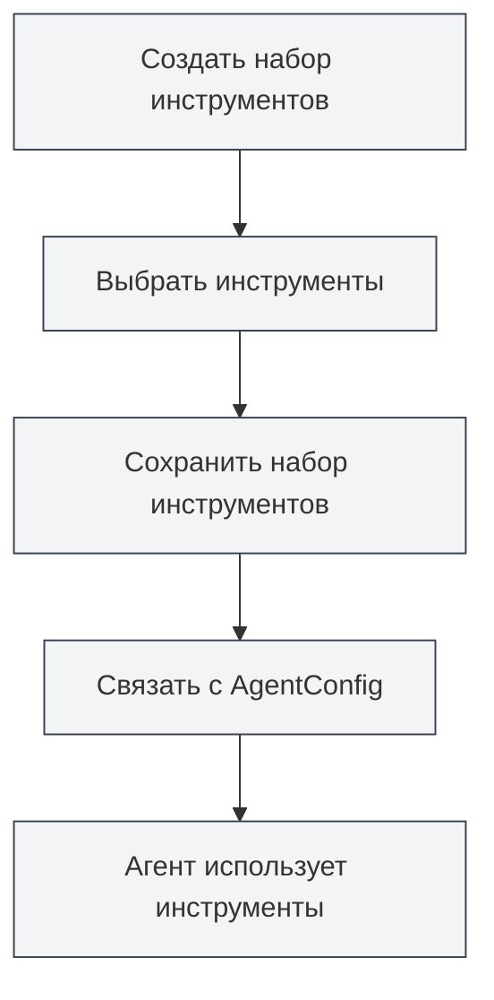

# Управление наборами инструментов

## Обзор

Набор инструментов (ToolCollection) — это коллекция в рамках Agent Framework, предназначенная для организации и управления инструментами агента. Наборы инструментов группируют связанные инструменты вместе, что упрощает управление и повторное использование. AgentConfig определяет, какие инструменты доступны агенту, путем связывания с наборами инструментов.

Наборы инструментов поддерживают динамическое добавление и удаление инструментов. Можно создавать наборы для конкретных целей или комбинировать несколько наборов.

## Ключевые концепции

### Структура набора инструментов

<AgentView mode="demo" />

Набор инструментов включает следующие основные части:

- **Основная информация**: ID, название, описание, номер версии
- **Список инструментов**: список ID включенных инструментов (включая внутренние и внешние инструменты)
- **Статус активности**: включен ли данный набор инструментов
- **Теги**: теги для категоризации и поиска
- **Признак встроенного**: является ли набор встроенным (не удаляемым)

### Типы инструментов

<GrepDisplay mode="demo" />

Набор инструментов может содержать инструменты следующих типов:

- **Внутренние инструменты**: встроенные инструменты агента MetaDoc (например, edit-tool, proofread-tool и т.д.)
- **Внешние инструменты**: пользовательские внешние инструменты

### Набор инструментов по умолчанию

Система предоставляет набор инструментов по умолчанию (`default-tool-set`), содержащий все встроенные инструменты агента. Его нельзя удалить, но можно скопировать.

## Создание набора инструментов

<AgentView mode="demo" />

### Создание нового набора инструментов

Шаги для создания набора инструментов:

1. **Откройте управление наборами инструментов**: в представлении Agent нажмите "Управление" → "Наборы инструментов"
2. **Создайте набор инструментов**: нажмите кнопку "Новый набор инструментов"
3. **Заполните основную информацию**:
   - Название: название набора инструментов (поддержка нескольких языков)
   - Описание: описание набора инструментов (поддержка нескольких языков)
4. **Выберите инструменты**: выберите один или несколько инструментов из выпадающего списка
   - Можно искать по названию инструмента
   - Поддерживается множественный выбор
   - Отображается тип и описание инструмента
5. **Сохраните набор инструментов**: нажмите кнопку "Сохранить"

Вы можете получить доступ к представлению Agent через боковую панель:

### Интерфейс набора инструментов агента

На следующем рисунке показаны основные функции интерфейса управления наборами инструментов:

<AgentView mode="demo" />

### Выбор инструментов

При выборе инструментов система отображает:

- **Название инструмента**: отображаемое имя инструмента
- **ID инструмента**: уникальный идентификатор инструмента
- **Тип инструмента**: внутренний инструмент, внешний инструмент или инструмент рабочего процесса
- **Описание инструмента**: краткое описание инструмента

<DialogDemo mode="demo" dialogType="tool-select" />

## Редактирование набора инструментов

<AgentView mode="demo" />

### Операция редактирования

Редактирование существующего набора инструментов:

1. **Откройте интерфейс управления**: найдите набор инструментов для редактирования в интерфейсе управления наборами инструментов
2. **Нажмите "Редактировать"**: нажмите кнопку "Редактировать" на карточке набора инструментов
3. **Измените информацию**: измените название, описание или список инструментов
4. **Сохраните изменения**: нажмите кнопку "Сохранить"

**Примечание**: набор инструментов по умолчанию (`default-tool-set`) редактировать нельзя, но его можно скопировать и затем отредактировать копию.

### Добавление инструментов

Добавление инструментов в набор:

1. **Откройте интерфейс редактирования**: отредактируйте набор инструментов
2. **Выберите инструменты**: выберите инструменты для добавления в выпадающем списке инструментов
3. **Сохраните изменения**: нажмите кнопку "Сохранить"

### Удаление инструментов

Удаление инструментов из набора:

1. **Откройте интерфейс редактирования**: отредактируйте набор инструментов
2. **Снимите выбор**: снимите выбор с инструментов, которые нужно удалить, в списке инструментов
3. **Сохраните изменения**: нажмите кнопку "Сохранить"

## Удаление набора инструментов

<AgentView mode="demo" />

### Операция удаления

Удаление ненужного набора инструментов:

1. **Откройте интерфейс управления**: найдите набор инструментов для удаления в интерфейсе управления наборами инструментов
2. **Нажмите "Удалить"**: нажмите кнопку "Удалить" на карточке набора инструментов
3. **Подтвердите удаление**: подтвердите удаление во всплывающем диалоговом окне подтверждения

**Примечание**:

- Набор инструментов по умолчанию (`default-tool-set`) нельзя удалить
- Удаление набора инструментов не влияет на созданные AgentConfig, но AgentConfig, связанные с этим набором, не смогут его использовать
- Если набор инструментов используется AgentConfig, перед удалением появится предупреждение

## Копирование набора инструментов

### Операция копирования

<OutlineTreeDisplay mode="demo" />

Копирование существующего набора инструментов:

1. **Откройте интерфейс управления**: найдите набор инструментов для копирования в интерфейсе управления наборами инструментов
2. **Нажмите "Копировать"**: нажмите кнопку "Копировать" на карточке набора инструментов
3. **Отредактируйте копию**: система создаст копию, к названию автоматически добавится суффикс " (копия)"
4. **Сохраните изменения**: при необходимости измените копию и сохраните

Копирование набора инструментов копирует все инструменты, включая список инструментов и конфигурацию.

## Импорт/экспорт набора инструментов

### Экспорт набора инструментов

Экспорт набора инструментов в файл JSON:

1. **Откройте интерфейс управления**: найдите набор инструментов для экспорта в интерфейсе управления наборами инструментов
2. **Нажмите "Экспорт"**: нажмите кнопку "Экспорт" на карточке набора инструментов
3. **Выберите расположение**: выберите место сохранения и имя файла
4. **Сохраните файл**: нажмите "Сохранить" для экспорта набора инструментов

<DialogDemo mode="demo" dialogType="export-config" />

Экспортированный файл JSON содержит всю информацию о наборе инструментов и может использоваться для резервного копирования или обмена.

### Импорт набора инструментов

<DataAnalysisDisplay mode="demo" />

Импорт набора инструментов из файла JSON:

1. **Откройте интерфейс управления**: в интерфейсе управления наборами инструментов
2. **Нажмите "Импорт"**: нажмите кнопку "Импорт набора инструментов"
3. **Выберите файл**: выберите файл JSON для импорта
4. **Проверьте данные**: система проверяет формат и содержимое файла
5. **Импортируйте набор инструментов**: после успешного импорта создается новый набор инструментов

<DialogDemo mode="demo" dialogType="import-config" />

Импортированный набор инструментов получает новый ID и не перезаписывает существующие наборы (если не используется режим перезаписи).

## Наборы инструментов и AgentConfig

### Связывание наборов инструментов

AgentConfig определяет доступные инструменты путем связывания с наборами инструментов:

1. **Создайте AgentConfig**: создайте новый AgentConfig
2. **Выберите набор(ы) инструментов**: выберите один или несколько наборов инструментов в AgentConfig
3. **Пересечение инструментов**: если выбрано несколько наборов инструментов, доступные инструменты представляют собой пересечение всех выбранных наборов

### Пересечение наборов инструментов

<DiffDisplay mode="demo" />

Когда AgentConfig связан с несколькими наборами инструментов:

- Набор инструментов A содержит: `[tool1, tool2, tool3]`
- Набор инструментов B содержит: `[tool2, tool3, tool4]`
- Доступные инструменты для AgentConfig: `[tool2, tool3]` (пересечение)

Этот механизм позволяет точно контролировать возможности агента.

## Советы по использованию

### Организация наборов инструментов

1. **Классификация по функциям**: создавайте наборы инструментов, классифицированные по функциям, например, "Набор инструментов для редактирования документов", "Набор инструментов для анализа данных"
2. **Классификация по сценариям**: создавайте наборы инструментов, классифицированные по сценариям, например, "Набор инструментов для академического письма", "Набор инструментов для анализа кода"
3. **Соглашения об именовании**: используйте четкие названия для удобства идентификации и управления

### Проектирование наборов инструментов

1. **Единственная ответственность**: каждый набор инструментов должен быть сосредоточен на конкретной функции или сценарии
2. **Комбинация инструментов**: разумно комбинируйте связанные инструменты, избегая слишком больших наборов
3. **Повторное использование**: проектируйте наборы инструментов для повторного использования, чтобы их можно было легко применять в разных AgentConfig

### Управление наборами инструментов

1. **Регулярная очистка**: удаляйте неиспользуемые наборы инструментов
2. **Управление версиями**: создавайте резервные копии важных наборов инструментов с помощью функции экспорта
3. **Документирование**: указывайте назначение и сценарии использования в описании набора инструментов

## Часто задаваемые вопросы

### В: Как создать специализированный набор инструментов?

О: Создайте новый набор инструментов, выберите соответствующие инструменты, задайте четкое название и описание. Например, создайте "Набор инструментов для анализа данных", выбрав инструменты, связанные с анализом данных.

### В: Какая связь между набором инструментов и AgentConfig?

О: AgentConfig определяет доступные инструменты путем связывания с наборами инструментов. Один AgentConfig может быть связан с несколькими наборами инструментов, доступные инструменты представляют собой пересечение всех этих наборов.

### В: Можно ли изменить набор инструментов по умолчанию?

О: Набор инструментов по умолчанию (`default-tool-set`) редактировать нельзя, но его можно скопировать и затем отредактировать копию. Скопируйте набор по умолчанию и измените копию.

### В: Как добавить пользовательский инструмент в набор инструментов?

О: Сначала необходимо зарегистрировать пользовательский инструмент, а затем выбрать его при создании или редактировании набора инструментов. Пользовательский инструмент должен соответствовать спецификации инструментов агента.

### В: Повлияет ли удаление набора инструментов на AgentConfig?

О: Удаление набора инструментов не влияет на созданные AgentConfig, но AgentConfig, связанные с этим набором, не смогут его использовать. Если набор инструментов используется, перед удалением появится предупреждение.

## Связанная документация

- [[agent.introduction|Обзор Agent Framework]]
- [[agent.introduction|Управление конфигурацией Agent]]
- [[agent.session|Управление сессиями Agent]]