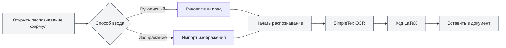

# Функция AI-помощника

## Обзор

Функция AI-помощника предоставляет множество интеллектуальных вспомогательных инструментов, помогающих выполнять задачи по созданию документов, распознаванию формул, генерации диаграмм, анализу данных и другие. С помощью AI-помощника вы можете эффективно выполнять различную работу по обработке документов.

Функция AI-помощника включает: AI-диалог, распознавание рукописных формул, интеллектуальный помощник для рисования, инструменты анализа данных, OCR-распознавание текста, инструмент анализа вложений, детектор AIGC и другие.

<AgentView mode="demo" />

## AI-диалог

### Описание функции

Функция AI-диалога предоставляет интеллектуального помощника для диалога, который может вести беседу на основе содержимого текущего документа:

- **Понимание контекста**: Понимает содержание и контекст текущего документа.
- **Интеллектуальные ответы**: Отвечает на связанные вопросы в соответствии с содержанием документа.
- **Анализ документа**: Анализирует структуру, содержание, стиль документа и т.д.

Вы можете получить доступ к функции AI-диалога через меню AI-помощника:

<MenuItemsDemo mode="demo" :items='[{"id": "ai-assistant", "items": ["ai-chat"]}]' />

### Предварительный просмотр интерфейса

Интерфейс AI-диалога включает список сессий и область диалога, поддерживает управление несколькими сессиями и ссылки на материалы:

<AIChat mode="demo" />

Подробнее см. [[ai.chat|AI-диалог]].

## Распознавание рукописных формул

### Описание функции

Функция распознавания рукописных формул преобразует рукописные математические формулы в код LaTeX:

<FormulaRecognition mode="demo" />

- **Рукописный ввод**: Поддерживает рукописный ввод с помощью мыши/сенсорного экрана.
- **Импорт изображений**: Поддерживает импорт изображений формул для распознавания.
- **Распознавание в реальном времени**: Использует SimpleTex OCR API для распознавания.
- **Вывод LaTeX**: Автоматическое преобразование в стандартный формат LaTeX.

### Способ использования

1. **Откройте распознавание формул**: Откройте окно распознавания формул из меню AI-помощника.
2. **Рукописный ввод**: Напишите математическую формулу от руки на холсте.
3. **Или импортируйте изображение**: Нажмите кнопку импорта, выберите изображение формулы.
4. **Начните распознавание**: Нажмите кнопку распознавания.
5. **Просмотрите результат**: Просмотрите полученный код LaTeX.
6. **Вставьте в документ**: Вставьте код LaTeX в документ.

Вы можете получить доступ к функции распознавания рукописных формул через меню AI-помощника:

<MenuItemsDemo mode="demo" :items='[{"id": "ai-assistant", "items": ["formula-recognition"]}]' />

### Точность распознавания

- **Высокая точность распознавания**: SimpleTex OCR API обеспечивает высокоточное распознавание математических формул.
- **Поддержка сложных формул**: Поддерживает сложные формулы, такие как дроби, корни, интегралы, суммы и т.д.
- **Автоматическая коррекция ошибок**: Результаты распознавания можно редактировать и исправлять вручную.

## Интеллектуальный помощник для рисования

### Описание функции

Интеллектуальный помощник для рисования использует ИИ для генерации кода диаграмм, поддерживает множество форматов диаграмм:

- **Диаграммы Mermaid**: Блок-схемы, диаграммы последовательностей, диаграммы классов, диаграммы состояний и т.д.
- **Диаграммы PlantUML**: UML-диаграммы, диаграммы последовательностей, диаграммы активности и т.д.
- **Диаграммы ECharts**: Линейные графики, гистограммы, круговые диаграммы, точечные диаграммы и т.д.
- **Прямая вставка**: Сгенерированные диаграммы можно напрямую вставлять в документ.

### Предварительный просмотр интерфейса

Интеллектуальный помощник для рисования поддерживает управление несколькими сессиями, автоматический выбор движка диаграмм и генерацию визуализаций:

<GraphWindow mode="demo" />

<MenuItemsDemo mode="demo" :items='[{"id": "ai-assistant"}]' />

### Способ использования

1. **Откройте помощник для рисования**: Откройте помощник для рисования из меню или панели инструментов.
2. **Опишите задачу**: Опишите желаемую диаграмму на естественном языке.
3. **Выберите тип**: Выберите тип диаграммы (Mermaid, PlantUML, ECharts и т.д.).
4. **Сгенерируйте диаграмму**: ИИ сгенерирует код диаграммы на основе описания.
5. **Предварительный просмотр**: Просмотрите сгенерированную диаграмму.
6. **Вставьте в документ**: Вставьте диаграмму в документ.

### Поддерживаемые типы диаграмм

- **Mermaid**: Блок-схемы, диаграммы последовательностей, диаграммы классов, диаграммы состояний, ER-диаграммы, диаграммы Ганта, круговые диаграммы, Git-графы, диаграммы путешествий, ментальные карты, временные шкалы и т.д.
- **PlantUML**: UML-диаграммы, диаграммы последовательностей, диаграммы активности, диаграммы компонентов, диаграммы развертывания и т.д.
- **ECharts**: Линейные графики, гистограммы, круговые диаграммы, точечные диаграммы, радиальные диаграммы, тепловые карты, древовидные диаграммы, диаграммы вложенности, солнечные диаграммы и т.д.

Подробнее см. [[charts.introduction|Описание функций диаграмм]].

## Инструменты анализа данных

### Описание функции

Инструменты анализа данных могут анализировать таблицы данных в документе и генерировать визуализации:

- **Распознавание таблиц**: Автоматическое распознавание табличных данных в документе.
- **Анализ данных**: Анализ статистической информации табличных данных.
- **Генерация диаграмм**: Генерация визуализаций на основе данных.
- **Вставка диаграмм**: Вставка сгенерированных диаграмм в документ.

<DataAnalysisWindow mode="demo" />

### Способ использования

1. **Откройте анализ данных**: Откройте окно анализа данных из меню или панели инструментов.
2. **Выберите таблицу**: Выберите таблицу в документе для анализа.
3. **Проанализируйте данные**: Нажмите кнопку анализа, ИИ проанализирует табличные данные.
4. **Сгенерируйте диаграмму**: Сгенерируйте визуализацию на основе результатов анализа.
5. **Вставьте в документ**: Вставьте диаграмму в документ.

## OCR-распознавание текста

### Описание функции

Функция OCR-распознавания текста может распознавать текст на изображениях и извлекать текстовое содержимое:

- **Распознавание изображений**: Распознавание текстового содержимого на изображениях.
- **Поддержка нескольких языков**: Поддерживает китайский, английский и другие языки.
- **Извлечение текста**: Извлечение распознанного текстового содержимого.
- **Вставка в документ**: Вставка извлеченного текста в документ.

### Предварительный просмотр интерфейса

Окно OCR-распознавания поддерживает управление несколькими изображениями, настройку параметров предварительной обработки изображений и редактирование результатов распознавания:

<OcrWindow mode="demo" />

<MenuItemsDemo mode="demo" :items='[{"id": "ai-assistant", "items": ["proofread"]}]' />

### Способ использования

1. **Откройте OCR-распознавание**: Откройте окно OCR-распознавания из меню или панели инструментов.
2. **Импортируйте изображение**: Импортируйте изображение для распознавания.
3. **Начните распознавание**: Нажмите кнопку распознавания.
4. **Просмотрите результат**: Просмотрите распознанный текстовый контент.
5. **Вставьте в документ**: Вставьте текст в документ.

## Инструмент анализа вложений

### Описание функции

Инструмент анализа вложений может анализировать вложенные файлы, такие как PDF, Word, и извлекать их содержимое:

- **Анализ файлов**: Анализ форматов файлов, таких как PDF, Word.
- **Извлечение содержимого**: Извлечение текста и изображений из файла.
- **Добавление в базу знаний**: Добавление извлеченного содержимого в базу знаний.
- **Ссылки в документе**: Ссылки на содержимое вложений в документе.

<KnowledgeBase mode="demo" />

### Способ использования

1. **Откройте анализ вложений**: Откройте окно анализа вложений из меню или панели инструментов.
2. **Выберите файл**: Выберите PDF или Word файл для анализа.
3. **Начните анализ**: Нажмите кнопку анализа.
4. **Просмотрите результат**: Просмотрите проанализированное содержимое.
5. **Добавьте в базу знаний**: Добавьте содержимое в базу знаний (опционально).

## Детектор AIGC

### Описание функции

Функция детектора AIGC может определять, является ли текст сгенерированным ИИ:

- **Детекция текста**: Определение, является ли текст сгенерированным ИИ.
- **Оценка достоверности**: Предоставление оценки вероятности генерации ИИ.
- **Отчет о детекции**: Генерация подробного отчета о детекции.

<AigcDetectionWindow mode="demo" />

### Способ использования

1. **Откройте детектор AIGC**: Откройте окно детектора AIGC из меню или панели инструментов.
2. **Выберите текст**: Выберите текст для проверки.
3. **Начните детекцию**: Нажмите кнопку детекции.
4. **Просмотрите результат**: Просмотрите результат детекции и оценку достоверности.

## Советы по использованию

### Эффективное использование AI-помощника

1. **Четко формулируйте задачу**: Четко описывайте задачу для получения лучших результатов.
2. **Предоставляйте контекст**: Предоставляйте достаточную контекстную информацию.
3. **Итеративная оптимизация**: Итеративно оптимизируйте задачу на основе результатов.

### Советы по распознаванию формул

1. **Пишите разборчиво**: При рукописном вводе пишите четко, избегайте неразборчивого почерка.
2. **Правильный формат**: Используйте правильный формат математических символов.
3. **Проверяйте результат**: После распознавания проверяйте результат, при необходимости исправляйте вручную.

### Советы по генерации диаграмм

1. **Подробное описание**: Подробно описывайте требования к диаграмме, включая тип данных, стиль и т.д.
2. **Выбор типа**: Выбирайте подходящий тип диаграммы в соответствии с задачей.
3. **Предпросмотр и корректировка**: После предпросмотра диаграммы корректируйте при необходимости.

## Часто задаваемые вопросы

### В: Распознавание формул неточно?

О: Распознавание формул основано на SimpleTex OCR API и может быть неточным. Рекомендуется писать четко при рукописном вводе или использовать импорт изображений.

### В: Сгенерированная диаграмма не соответствует ожиданиям?

О: Можно подробнее описать задачу или вручную отредактировать сгенерированный код диаграммы для корректировки.

### В: Какие языки поддерживает OCR-распознавание?

О: OCR-распознавание поддерживает китайский, английский и другие языки, что зависит от используемого OCR-сервиса.

### В: Какие форматы поддерживает анализ вложений?

О: Анализ вложений поддерживает распространенные форматы, такие как PDF, Word, что зависит от возможностей сервиса анализа.

<AgentView mode="demo" />

## Связанная документация

- [[ai.chat|AI-диалог]]
- [[charts.introduction|Описание функций диаграмм]]
- [[knowledge-base.usage|Использование базы знаний]]
