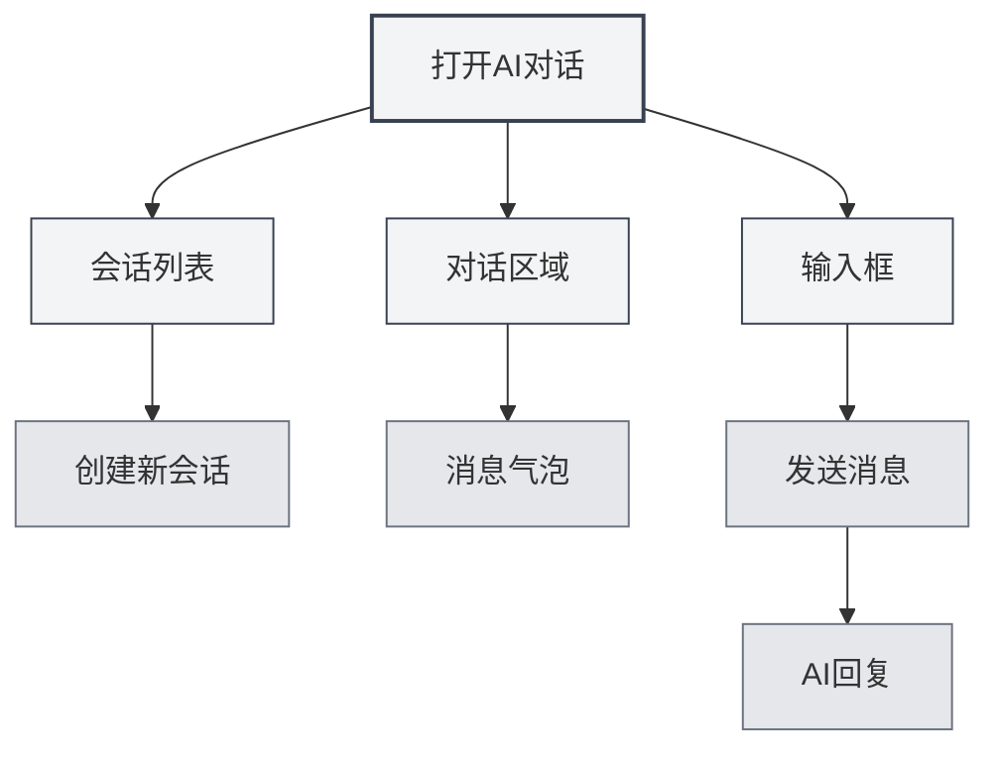
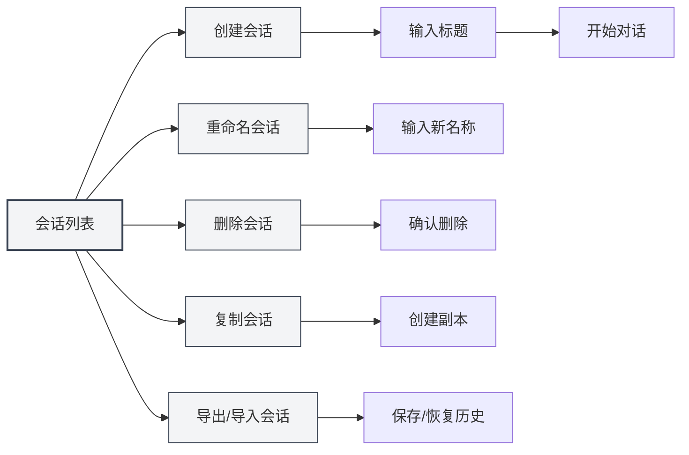
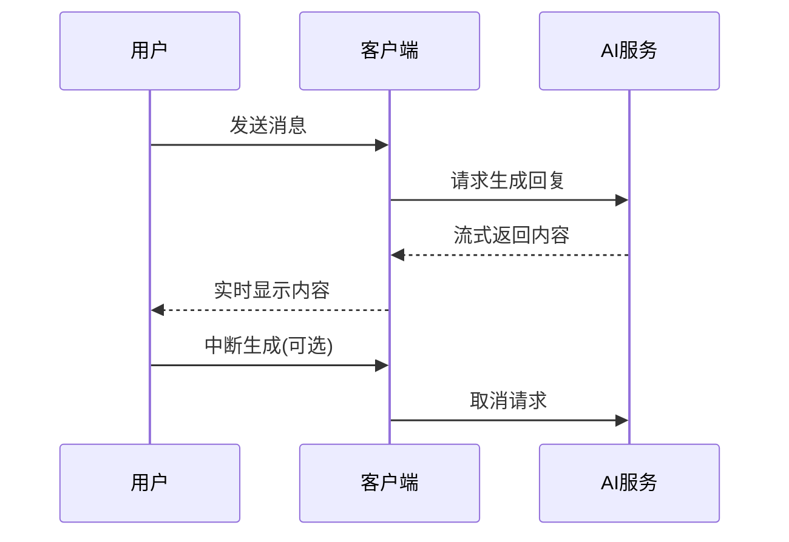
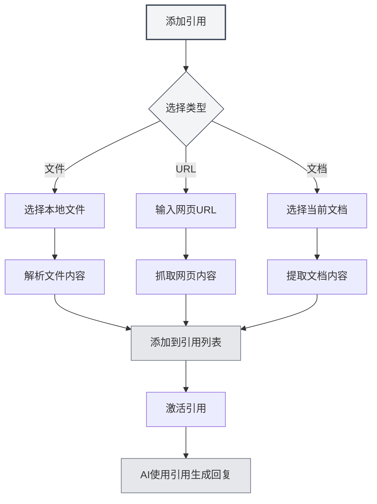

# AI Диалог

## Обзор

Функция AI Диалог предоставляет интеллектуального помощника для общения, который может помочь вам ответить на вопросы, генерировать контент, анализировать документы и т.д. С помощью AI Диалога вы можете взаимодействовать с ИИ на естественном языке, получая интеллектуальную помощь и рекомендации.

AI Диалог поддерживает управление несколькими сессиями, ссылки на материалы, интеграцию с базой знаний и другие функции, позволяя эффективно использовать ИИ для выполнения различных задач.

## Открытие AI Диалога

### Способы открытия

Есть несколько способов открыть AI Диалог:

- **Панель меню**: Нажмите меню "AI", выберите "AI Диалог"
- **Горячие клавиши**: Используйте горячие клавиши для быстрого открытия (если настроены)
- **Боковая панель**: Откройте панель AI Диалога с боковой панели

Вы можете получить доступ к функции AI Диалог через меню AI-помощника в верхней панели меню:

<MenuItemsDemo mode="demo" :items='[{"id": "ai-assistant", "items": ["ai-chat"]}]' />

### Описание интерфейса

Интерфейс AI Диалога включает следующие части:

<AIChat mode="demo" />

- **Список сессий**: Слева отображается список всех сессий
- **Область диалога**: В центре отображаются сообщения диалога
- **Поле ввода**: Внизу для ввода сообщений
- **Управление ссылками**: Управление ссылочными материалами

## Управление сессиями

AI Диалог поддерживает управление несколькими сессиями. Вы можете создавать, переименовывать, удалять и копировать сессии.

<AIChat mode="demo" />

### Создание сессии

Создание новой сессии AI Диалога:

1. **Нажмите "Создать"**: Нажмите кнопку "Новая сессия" над списком сессий
2. **Введите заголовок**: При желании введите заголовок сессии (по умолчанию используется первое сообщение)
3. **Начните диалог**: Введите первое сообщение, чтобы начать диалог

### Операции с сессиями

### Переименование сессии

Переименование существующей сессии:

1. **Контекстное меню**: Щелкните правой кнопкой мыши по сессии, выберите "Переименовать"
2. **Введите новое имя**: Введите новое имя сессии
3. **Подтвердите сохранение**: После подтверждения сохраните новое имя

### Удаление сессии

Удаление ненужных сессий:

1. **Контекстное меню**: Щелкните правой кнопкой мыши по сессии, выберите "Удалить"
2. **Подтвердите удаление**: После подтверждения удалите сессию

Удаление сессии также удаляет всю историю сообщений этой сессии.

### Копирование сессии

Копирование существующей сессии:

1. **Контекстное меню**: Щелкните правой кнопкой мыши по сессии, выберите "Копировать"
2. **Создание копии**: Система создаст новую копию сессии

Копирование сессии копирует всю историю сообщений, что позволяет продолжить обсуждение на основе существующего диалога.

### Экспорт/Импорт сессий

Экспорт и импорт сессий:

- **Экспорт сессии**: Щелкните правой кнопкой мыши по сессии, выберите "Экспорт", сохраните как JSON-файл
- **Импорт сессии**: Импортируйте сессию из файла, восстановите историю сообщений

Функция экспорта/импорта удобна для резервного копирования и обмена содержимым диалогов.

<MenuItemsDemo mode="demo" :items='[{"id": "file", "items": ["save", "open"]}]' />

## Отправка сообщений

AI Диалог предоставляет богатые возможности для отправки сообщений.

<AIChat mode="demo" />

### Ввод сообщения

Ввод сообщения в поле ввода:

1. **Введите текст**: Введите ваш вопрос или запрос в поле ввода
2. **Форматирование**: Поддерживается формат Markdown, можно форматировать текст
3. **Отправка сообщения**: Нажмите кнопку отправки или клавишу `Enter` для отправки

### Типы сообщений

Поддерживаются следующие типы сообщений:

- **Текстовые сообщения**: Обычные текстовые сообщения
- **Сообщения Markdown**: Сообщения с поддержкой формата Markdown
- **Сообщения с кодом**: Сообщения, содержащие код

### Горячие клавиши

Горячие клавиши для отправки сообщений:

- **Enter**: Отправить сообщение
- **Shift+Enter**: Перевод строки (без отправки)
- **Ctrl+Enter**: Отправить сообщение (при некоторых настройках)

## Ответы ИИ

Функция ответов ИИ предоставляет потоковый вывод и операции с сообщениями.

<AIChat mode="demo" />

<AIChat mode="demo" />

### Потоковый вывод

Ответы ИИ используют потоковый вывод:

- **Отображение в реальном времени**: Содержимое, генерируемое ИИ, отображается в реальном времени
- **Постепенная генерация**: Содержимое генерируется постепенно, не нужно ждать завершения
- **Возможность прерывания**: Генерацию ИИ можно прервать в любой момент

### Операции с сообщениями

С ответами ИИ можно выполнять следующие операции:

- **Копировать**: Скопировать содержимое ответа ИИ
- **Сгенерировать заново**: Повторно сгенерировать ответ ИИ
- **Редактировать**: Редактировать ответ ИИ (если поддерживается)
- **Удалить**: Удалить ответ ИИ

### Редактирование сообщений

Редактирование сообщений пользователя:

1. **Нажмите "Редактировать"**: Нажмите кнопку редактирования рядом с сообщением
2. **Измените содержимое**: Измените содержимое сообщения
3. **Отправьте заново**: Повторно отправьте измененное сообщение

Редактирование сообщения удаляет все сообщения после него и начинает диалог заново.

## Ссылочные материалы

Вы можете добавлять ссылочные материалы для AI Диалога, чтобы помочь ИИ лучше понять контекст.

<AIChat mode="demo" />

### Добавление ссылок

Добавление ссылочных материалов для сессии:

1. **Откройте управление ссылками**: Нажмите на вкладку ссылок над областью диалога
2. **Добавьте ссылку**: Нажмите кнопку "Добавить ссылку"
3. **Выберите тип**: Выберите тип ссылки (файл, URL и т.д.)
4. **Выберите содержимое**: Выберите содержимое для ссылки

### Типы ссылок

Поддерживаются следующие типы ссылок:

- **Ссылки на файлы**: Ссылки на локальные файлы
- **Ссылки на URL**: Ссылки на веб-страницы (URL)
- **Ссылки на документы**: Ссылки на текущий открытый документ

### Активация ссылок

Активация и деактивация ссылок:

- **Активировать ссылку**: Нажмите на вкладку ссылки, чтобы активировать ее
- **Деактивировать ссылку**: Нажмите еще раз, чтобы деактивировать
- **Статус активации**: Активированные ссылки будут использоваться при ответе ИИ

После активации ссылки ИИ будет учитывать ее содержимое при генерации ответа.

### Предпросмотр ссылок

Предпросмотр содержимого ссылок:

- **Нажмите для предпросмотра**: Нажмите на вкладку ссылки, чтобы просмотреть содержимое
- **Просмотр деталей**: Просмотрите подробное содержимое ссылки
- **Редактирование ссылки**: Редактируйте или удаляйте ссылку

## Интеграция с базой знаний

AI Диалог может интегрироваться с базой знаний для автоматического поиска соответствующей информации.

<KnowledgeBase mode="demo" />

<AIChat mode="demo" />

### Включение базы знаний

Включение запросов к базе знаний:

1. **Откройте настройки**: Найдите переключатель базы знаний под полем ввода
2. **Включите запросы**: Переключите переключатель, чтобы включить запросы к базе знаний
3. **Автоматический поиск**: При ответе ИИ будет автоматически выполнять поиск в базе знаний

### Поиск в базе знаний

Функция поиска в базе знаний:

- **Автоматический поиск**: Автоматический поиск соответствующей информации при отправке сообщения
- **Понимание контекста**: Поиск соответствующего содержимого на основе контекста диалога
- **Интеграция результатов**: Интеграция результатов поиска в ответ ИИ

### Настройки поиска

Настройки поиска в базе знаний:

- **Порог достоверности**: Установите порог достоверности для поиска
- **Количество результатов**: Установите количество результатов поиска
- **Область поиска**: Установите область поиска

Подробнее см. [[knowledge-base.config|Конфигурация базы знаний]].

## Управление сообщениями

Управление сообщениями в AI Диалоге.

<AIChat mode="demo" />

### Операции с сообщениями

С сообщениями можно выполнять следующие операции:

- **Копировать сообщение**: Скопировать содержимое сообщения
- **Редактировать сообщение**: Редактировать сообщение пользователя
- **Удалить сообщение**: Удалить сообщение
- **Сгенерировать заново**: Повторно сгенерировать ответ ИИ

### История сообщений

Управление историей сообщений:

- **Автосохранение**: История сообщений сохраняется автоматически
- **Изоляция сессий**: История сообщений каждой сессии независима
- **Восстановление истории**: Восстановление истории при повторном открытии сессии

### Формат сообщений

Сообщения поддерживают следующие форматы:

<AIChat mode="demo" />

- **Markdown**: Поддержка формата Markdown
- **Блоки кода**: Поддержка подсветки синтаксиса в блоках кода
- **Математические формулы**: Поддержка математических формул LaTeX
- **Таблицы**: Поддержка отображения таблиц

## Советы по использованию

Следующие советы помогут более эффективно использовать функцию AI Диалог.

<AIChat mode="demo" />

### Эффективный диалог

1. **Четко формулируйте вопросы**: Задавайте четкие вопросы для получения лучших ответов
2. **Предоставляйте контекст**: Предоставляйте достаточную контекстную информацию
3. **Используйте ссылки**: Используйте ссылочные материалы для предоставления дополнительной информации

### Организация сессий

1. **Категоризация**: Создавайте отдельные сессии для разных тем
2. **Соглашения об именовании**: Используйте понятные имена сессий
3. **Регулярная очистка**: Регулярно удаляйте ненужные сессии

### Использование базы знаний

1. **Добавляйте соответствующие документы**: Добавляйте соответствующие документы в базу знаний
2. **Включайте запросы**: Включайте запросы к базе знаний для получения лучших ответов
3. **Настраивайте параметры**: Настраивайте параметры поиска в соответствии с потребностями

## Часто задаваемые вопросы

<AIChat mode="demo" />

<MenuItemsDemo mode="demo" :items='[{"id": "ai-assistant"}]' />

### В: Ответы ИИ неточны?

О: Ответы ИИ основаны на обучающих данных и могут быть неточными. Можно предоставить больше контекстной информации или использовать ссылочные материалы для повышения точности.

### В: Как прервать генерацию ИИ?

О: Нажмите кнопку "Отмена", чтобы прервать генерацию ИИ. Уже сгенерированное содержимое не будет потеряно.

### В: История сообщений потеряна?

О: История сообщений сохраняется автоматически. Если она потеряна, проверьте, не удалили ли вы сессию или не очистили ли данные.

### В: Как повысить качество ответов?

О: Предоставление четкого контекста, использование ссылочных материалов и включение запросов к базе знаний могут повысить качество ответов.

### В: Какие LLM поддерживаются?

О: Поддерживаются различные LLM, включая OpenAI, Ollama, DeepSeek и другие. Подробнее см. [[ai.llm-config|Конфигурация LLM]].

## Связанные документы

- [[ai.proofread|AI Проверка]]
- [[ai.completion|AI Автодополнение]]
- [[knowledge-base.config|Конфигурация базы знаний]]
- [[ai.llm-config|Конфигурация LLM]]