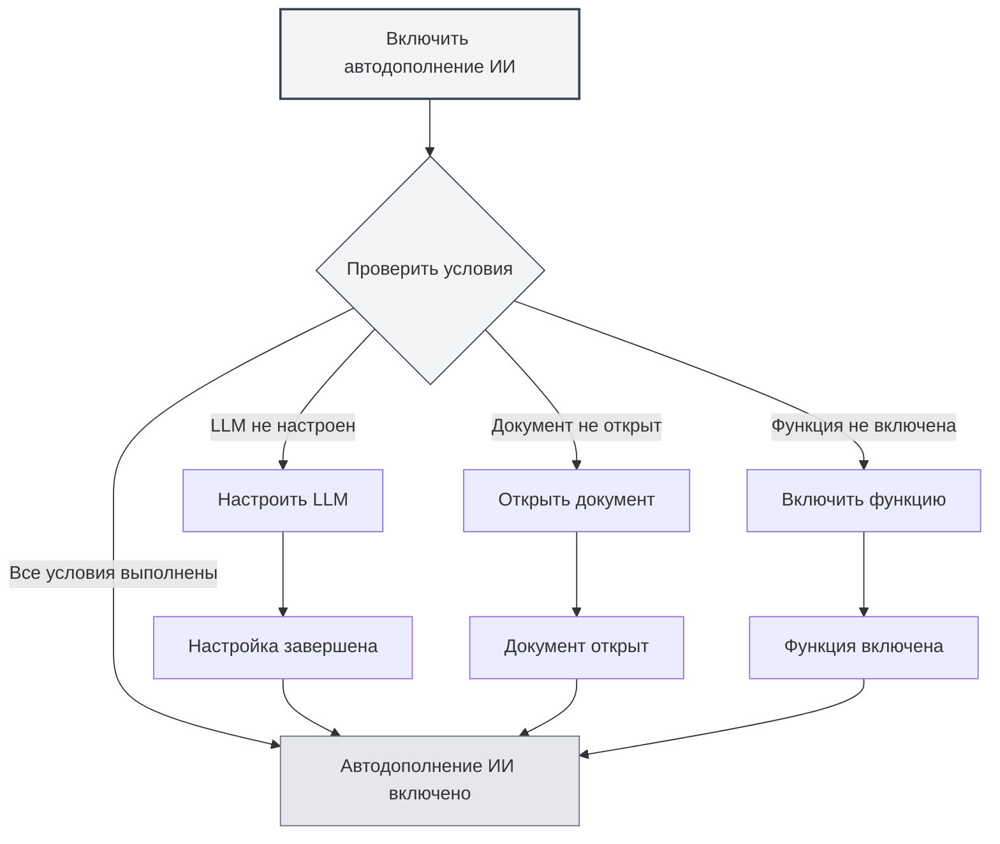
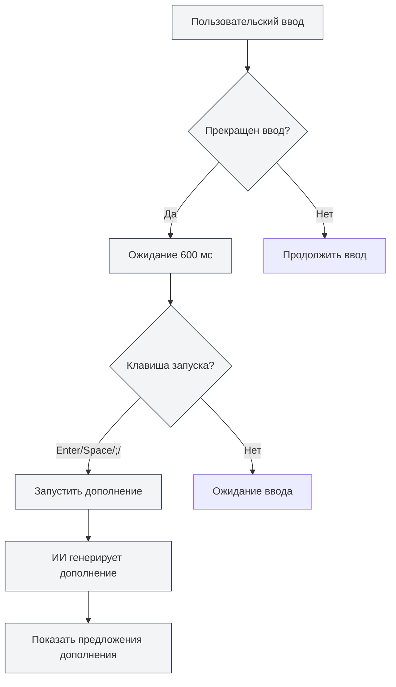

# Автодополнение с помощью ИИ

## Обзор

Функция автодополнения с помощью ИИ использует технологии искусственного интеллекта для автоматического завершения вводимого вами текста. Когда вы прекращаете ввод, ИИ автоматически генерирует предложения по дополнению на основе контекста, помогая вам быстро завершить написание документа.

Автодополнение с помощью ИИ поддерживает различные форматы документов (Markdown, LaTeX, простой текст), может интеллектуально понимать контекст и генерировать предложения по дополнению, соответствующие стилю и содержанию документа.

## Включение автодополнения ИИ

### Способы включения

Существует несколько способов включить автодополнение с помощью ИИ:

- **Контекстное меню**: Щелкните правой кнопкой мыши в редакторе и выберите "Включить автодополнение ИИ"
- **Страница настроек**: Включите функцию автодополнения ИИ в настройках
- **Горячие клавиши**: Используйте горячие клавиши для быстрого переключения (если настроено)

Вы можете получить доступ к настройкам через верхнюю строку меню:

<MenuItemsDemo mode="demo" :items='[{"id": "settings"}]' />

<CompletionSettingsPanel mode="demo" />

### Условия включения

Для включения автодополнения с помощью ИИ необходимо выполнить следующие условия:

- **LLM настроен**: Требуется настроить сервис LLM
- **Документ открыт**: Необходимо открыть документ в редакторе
- **Функция включена**: Необходимо включить функцию автодополнения ИИ в настройках



Подробнее см. [[ai.llm-config|Настройка LLM]].

<CompletionSettingsPanel mode="demo" />

## Автоматический запуск

<AISuggestionGhost mode="demo" />

### Условия запуска

Автодополнение с помощью ИИ автоматически запускается в следующих случаях:

- **Прекращение ввода**: Автоматически запускается через 600 мс после прекращения ввода
- **Клавиши запуска**: Запускается после ввода определенных клавиш (Enter, Space, `;`, `,` и т.д.)



### Задержка запуска

Настройки задержки запуска:

- **Задержка по умолчанию**: 600 мс (0.6 секунды)
- **Настраиваемая**: Время задержки можно настроить в параметрах
- **Баланс**: Слишком короткая задержка приводит к частым запускам, слишком длинная — ухудшает опыт использования

<CompletionSettingsPanel mode="demo" />

### Клавиши запуска

Поддерживаемые клавиши запуска:

- **Enter**: Запуск клавишей Enter
- **Space**: Запуск клавишей Space (пробел)
- **;**: Запуск точкой с запятой
- **,**: Запуск запятой

Клавиши запуска можно настроить в параметрах, поддерживается одновременное включение нескольких клавиш.

## Ручной запуск

<AISuggestionGhost mode="demo" />

### Способы запуска

Способы ручного запуска дополнения:

- **Горячие клавиши**: Нажмите `Shift+Tab` для ручного запуска дополнения
- **Контекстное меню**: Щелкните правой кнопкой мыши и выберите "Запустить дополнение вручную"

Ручной запуск немедленно инициирует дополнение, пропуская задержку автоматического запуска.

<CompletionSettingsPanel mode="demo" />

### Сценарии использования

Сценарии, подходящие для ручного запуска:

- **Требуется немедленное дополнение**: Когда нужно немедленно получить предложения по дополнению
- **Автозапуск не сработал**: Когда автоматический запуск не произошел
- **Конкретное место**: Когда дополнение требуется в конкретном месте документа

## Содержание дополнения

<AISuggestionGhost mode="demo" />

### Понимание контекста

Автодополнение ИИ понимает следующий контекст:

- **Текущий абзац**: Понимает содержание текущего абзаца
- **Структура документа**: Понимает общую структуру документа
- **Стиль документа**: Понимает стиль написания документа
- **Тема документа**: Понимает тему и содержание документа

### Режимы дополнения

Автодополнение ИИ поддерживает два режима:

- **Полная генерация**: Генерирует полное содержание дополнения
- **Частичная генерация**: Генерирует только часть содержания (в зависимости от настроек)

Режим дополнения можно настроить в параметрах.

<CompletionSettingsPanel mode="demo" />

### Длина дополнения

Управление длиной содержания дополнения:

- **Максимальное количество токенов**: Можно установить максимальное количество токенов для дополнения
- **Значение по умолчанию**: 50 токенов
- **Диапазон**: От 20 токенов до неограниченного (0 означает неограниченно)

Чем больше токенов, тем больше содержание дополнения, но время генерации также увеличивается.

<CompletionSettingsPanel mode="demo" />

## Принятие дополнения

<AISuggestionGhost mode="demo" />

### Способы принятия

Способы принятия предложений дополнения:

- **Клавиша Tab**: Нажмите клавишу `Tab` для принятия предложения дополнения
- **Щелчок "Принять"**: Нажмите кнопку "Принять" на предложении дополнения

### Отмена дополнения

Способы отмены предложений дополнения:

- **Клавиша Esc**: Нажмите клавишу `Esc` для отмены предложения дополнения
- **Продолжение ввода**: Продолжение ввода автоматически отменяет дополнение
- **Щелчок "Отмена"**: Нажмите кнопку "Отмена" на предложении дополнения

### Редактирование дополнения

После принятия дополнения можно продолжить его редактирование:

- **Прямое редактирование**: После принятия можно напрямую редактировать содержание дополнения
- **Частичное принятие**: Можно принять только часть содержания дополнения
- **Изменение дополнения**: Можно изменить содержание дополнения перед использованием

```mermaid
graph LR
    A[Показать предложения дополнения] --> B{Действие пользователя}
    B -->|Клавиша Tab| C[Принять дополнение]
    B -->|Щелчок "Принять"| C
    B -->|Клавиша Esc| D[Отменить дополнение]
    B -->|Продолжить ввод| D
    B -->|Щелчок "Отмена"| D
    C --> E[Применить содержание дополнения]
    E --> F[Продолжить редактирование]
    D --> G[Продолжить ввод]
    style A fill:#f3f4f6,stroke:#374151,stroke-width:2px
    style B fill:#f3f4f6,stroke:#374151
    style C fill:#e5e7eb,stroke:#6b7280
    style D fill:#e5e7eb,stroke:#6b7280
```

## Интеграция с базой знаний

### Включение базы знаний

Включение интеграции с базой знаний:

1. **Открыть настройки**: Включите интеграцию с базой знаний в настройках
2. **Настроить базу знаний**: Настройте параметры, связанные с базой знаний
3. **Автоматический поиск**: При дополнении будет автоматически выполняться поиск в базе знаний

Подробнее см. [[knowledge-base.config|Настройка базы знаний]].

### Контекстный поиск

Функция поиска в базе знаний:

- **Автоматический поиск**: Автоматический поиск соответствующих знаний при дополнении
- **Семантическое соответствие**: Соответствие связанного содержания на основе семантического сходства
- **Интеграция результатов**: Интеграция результатов поиска в предложения дополнения

### Настройки поиска

Настройки поиска в базе знаний:

- **Порог достоверности**: Установите порог достоверности для поиска
- **Количество результатов**: Установите количество результатов поиска
- **Область поиска**: Установите область поиска

## Настройки дополнения

### Основные настройки

Основные настройки автодополнения ИИ:

- **Включить/Выключить**: Включить или выключить функцию автодополнения ИИ
- **Задержка запуска**: Установить время задержки автоматического запуска
- **Клавиши запуска**: Настроить клавиши запуска
- **Максимальное количество токенов**: Установить максимальное количество токенов для дополнения

<CompletionSettingsPanel mode="demo" />

### Расширенные настройки

Расширенные настройки автодополнения ИИ:

- **Режим дополнения**: Выбрать режим дополнения (полная генерация/частичная генерация)
- **Длина контекста**: Установить длину контекста, используемого для дополнения
- **Настройка температуры**: Установить параметр температуры для генерации ИИ
- **Интеграция с базой знаний**: Настроить параметры интеграции с базой знаний

<CompletionSettingsPanel mode="demo" />

### Настройки форматов

Настройки дополнения для разных форматов:

- **Markdown**: Настройки дополнения для формата Markdown
- **LaTeX**: Настройки дополнения для формата LaTeX
- **Простой текст**: Настройки дополнения для формата простого текста

Для разных форматов могут быть разные стратегии и настройки дополнения.

## Советы по использованию

### Повышение качества дополнения

1. **Предоставьте контекст**: Предоставьте достаточную контекстную информацию в документе
2. **Включите базу знаний**: Включение интеграции с базой знаний может повысить качество дополнения
3. **Настройте параметры**: Настройте параметры дополнения в соответствии с потребностями

### Эффективное использование

1. **Разумное использование**: Не полагайтесь чрезмерно на автодополнение ИИ
2. **Проверяйте содержание**: Проверяйте правильность содержания после принятия дополнения
3. **Ручная корректировка**: При необходимости вручную корректируйте содержание дополнения

### Избегание проблем

1. **Избегайте частых запусков**: Избегайте частых запусков дополнения, чтобы не ухудшить опыт ввода
2. **Проверяйте точность**: Проверяйте точность содержания дополнения
3. **Своевременно отменяйте**: Своевременно отменяйте ненужные дополнения

## Часто задаваемые вопросы

### В: Дополнение неточное?

О: Автодополнение ИИ основано на контексте и обучающих данных, поэтому может быть неточным. Можно предоставить больше контекстной информации или включить интеграцию с базой знаний для повышения точности.

### В: Дополнение работает медленно?

О: Скорость дополнения зависит от скорости ответа сервиса ИИ. Можно настроить параметры дополнения или использовать более быстрый сервис LLM.

### В: Как отключить автодополнение?

О: Отключите функцию автодополнения ИИ в настройках или используйте контекстное меню для отключения.

### В: Можно ли настроить клавиши запуска?

О: Да. Настройте клавиши запуска в параметрах, поддерживается одновременное включение нескольких клавиш.

### В: Содержание дополнения слишком длинное?

О: Можно настроить максимальное количество токенов для дополнения в параметрах, чтобы ограничить длину содержания дополнения.

## Связанная документация

- [[ai.chat|Диалог с ИИ]]
- [[ai.proofread|Проверка орфографии ИИ]]
- [[knowledge-base.config|Настройка базы знаний]]
- [[ai.llm-config|Настройка LLM]]