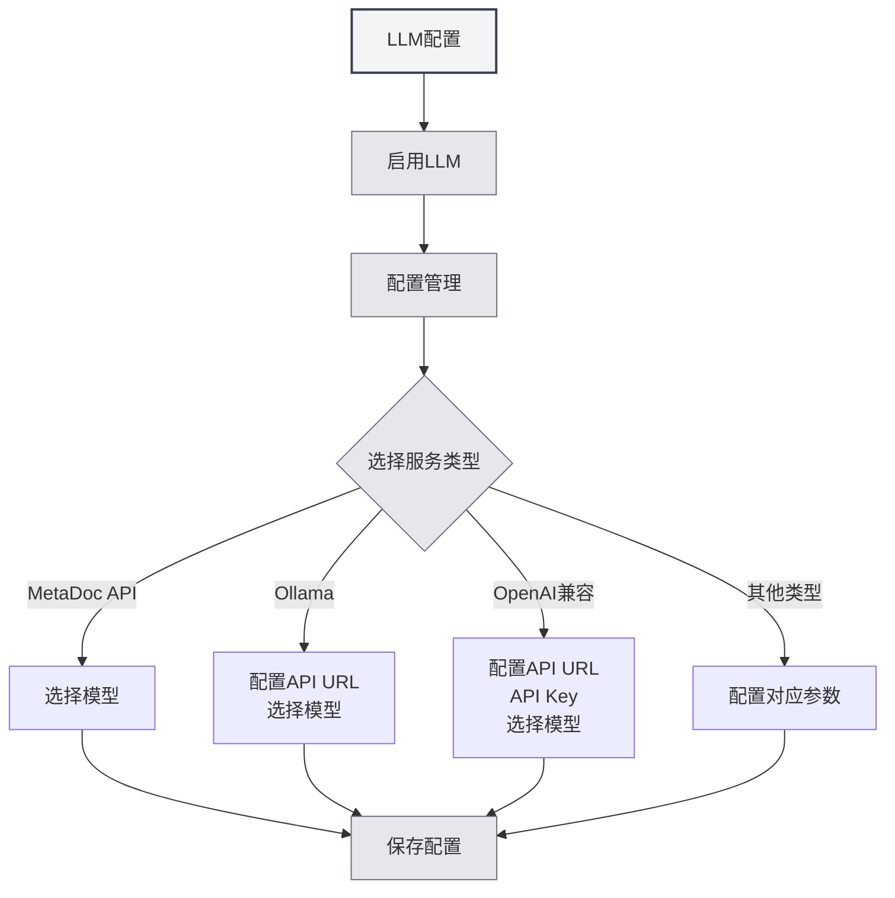

# Руководство по настройке LLM

## Обзор

LLM (большие языковые модели) являются общей основой для таких функций MetaDoc, как AI-диалог, проверка правописания, автодополнение, помощники и Agent. В этой статье объясняется, зачем настраивать LLM, на какие функции влияет настройка и как перейти к конкретному интерфейсу конфигурации.

<Demo component="SettingLlmSection" mode="demo" />

## Зачем настраивать LLM

- **API-вызовы**: Диалоги, автодополнение, проверка правописания и другие функции отправляют запросы к выбранному вами интерфейсу LLM, что требует правильной настройки адреса и ключа API.
- **Различия моделей**: Разные модели значительно отличаются по качеству, скорости и стоимости. Выбор подходящей модели для конкретной задачи улучшает опыт использования и помогает контролировать расходы.
- **Единая точка входа**: Централизованное управление статусом активации, температурой, тегами рассуждения и другими параметрами в [[settings.llm|настройках LLM]] позволяет одним действием повлиять на все AI-функции.

## На какие функции влияет настройка

После настройки и активации LLM будут затронуты следующие возможности:

| Функция      | Описание                                                                 |
| ------------ | ------------------------------------------------------------------------ | --------------------------------------------------------------------------------------- |
| **AI-диалог** | [[ai.chat            | Функция AI-диалога]]: Многораундовый диалог с ИИ, ответы на основе контекста |
| **AI-проверка** | [[ai.proofread       | Функция AI-проверки]]: Проверка грамматики и орфографии, предложения по исправлению     |
| **AI-дополнение** | [[ai.completion      | AI-автодополнение]]: Интеллектуальное продолжение и дополнение текста во время написания |
| **AI-помощник** | [[ai.assistants      | Функция AI-помощников]]: Распознавание формул, помощник по рисованию, анализ данных и др. |
| **Agent**    | [[agent.introduction | Фреймворк Agent]]: Сессии, вызов инструментов, выполнение рабочих процессов             |

Если LLM отключена или не настроен ни один доступный сервис, указанные выше функции будут недоступны или потребуют предварительной настройки.

## Как настроить LLM

### Переход на страницу настройки

1.  Откройте **Настройки** → **Настройка LLM** (или эквивалентный пункт в приложении).
2.  На странице «[[settings.llm|Настройка LLM]]» вы можете:
    -   Включить/отключить LLM
    -   Установить глобальные параметры, такие как температура, автоматическое удаление тегов рассуждения и др.
    -   Управлять несколькими конфигурациями LLM (создание, редактирование, удаление, сортировка)

Вы можете получить доступ к настройкам LLM через верхнюю строку меню:

<MenuItemsDemo mode="demo" :items='[{"id": "settings"}]' />

<MenuItemsDemo mode="demo" :items='[{"id": "ai"}]' />

### Настройка конкретного сервиса

В разделе **Управление конфигурациями LLM** выберите существующую или создайте новую конфигурацию и заполните поля в соответствии с типом сервиса:

-   **MetaDoc API / Ollama / OpenAI-совместимый / Официальный OpenAI / DeepSeek / Gemini** и др.  
    Подробные поля и шаги описаны в [[settings.llm-types|Настройке типов LLM]] (адрес API, ключ API, название модели, максимальное количество токенов и т.д.).

### Рекомендации по использованию

-   **Первый запуск**: Сначала завершите настройку одной рабочей конфигурации LLM и сохраните её, а затем включите опцию «Включить LLM».
-   **Несколько конфигураций**: Можно создать несколько конфигураций для разных сценариев (например, «Повседневный диалог», «Только для проверки») и выбирать их для использования в соответствующих функциях или настройках Agent.
-   **Стоимость и конфиденциальность**: Использование облачных API влечёт за собой расходы и может предполагать загрузку контента. Если требуется локальная работа и конфиденциальность, в первую очередь рассмотрите локальные варианты развёртывания, такие как Ollama (см. [[settings.llm-types|Настройка типов LLM]]).

## Связанная документация

- [[settings.llm|Настройка LLM]]
- [[settings.llm-types|Настройка типов LLM]]
- [[settings.llm-management|Управление конфигурациями LLM]]
- [[ai.chat|Функция AI-диалога]]
- [[agent.introduction|Обзор фреймворка Agent]]

<AIChat mode="demo" />
