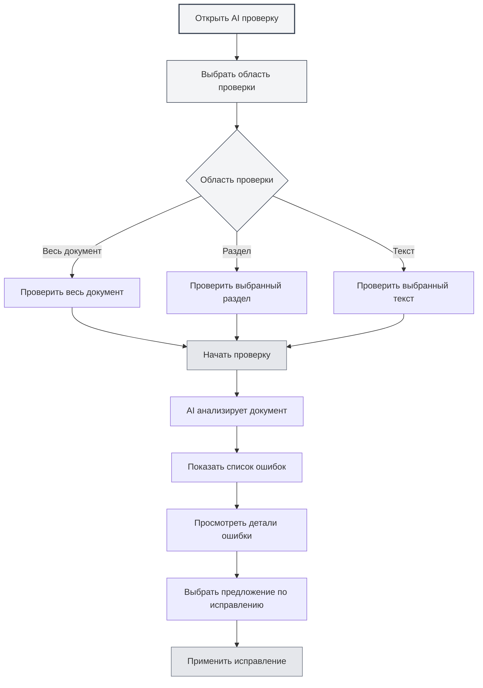
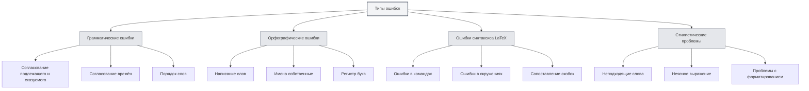
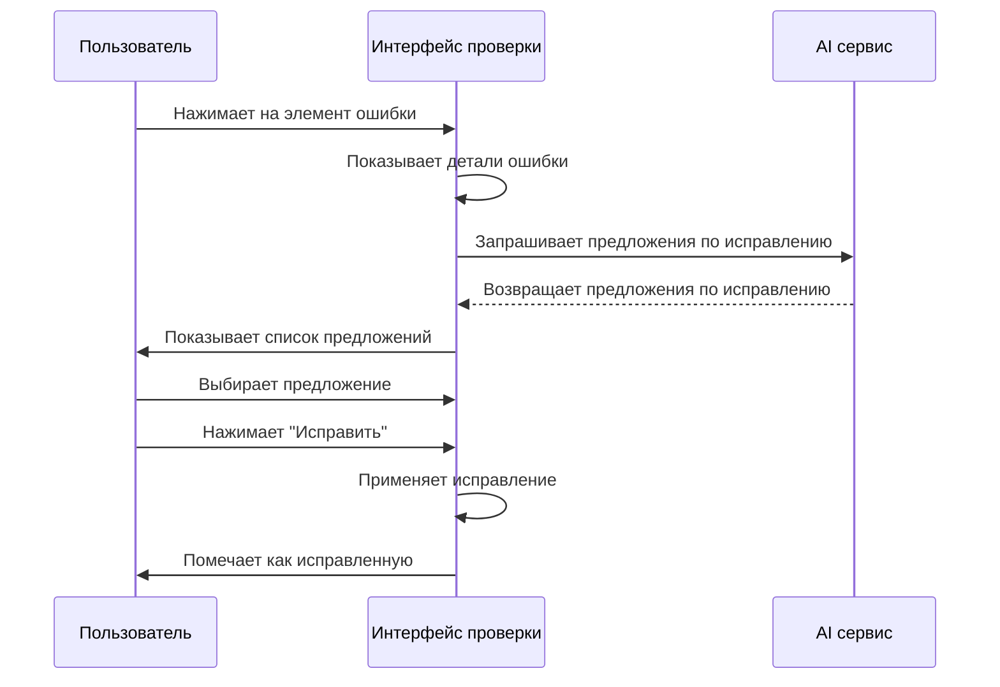

# AI Проверка

## Обзор

Функция AI проверки использует технологии искусственного интеллекта для автоматической проверки документов на наличие грамматических ошибок, орфографических ошибок, ошибок в синтаксисе LaTeX и других проблем, а также предоставляет предложения по исправлению. С помощью AI проверки вы можете быстро находить и исправлять ошибки в документах, повышая их качество.

AI проверка поддерживает множество форматов документов (Markdown, LaTeX, простой текст), может проверять весь текст или определённые разделы, предоставляя подробную информацию об ошибках и предложения по их исправлению.

## Открытие AI проверки

### Способы открытия

Есть несколько способов открыть AI проверку:

- **Меню**: Нажмите меню "AI", выберите "AI Проверка"
- **Горячие клавиши**: Используйте сочетание клавиш для быстрого открытия (если настроено)
- **Боковая панель**: Откройте панель AI проверки с боковой панели

Вы можете получить доступ к функции AI проверки через меню AI помощника в верхней строке меню:

<MenuItemsDemo mode="demo" :items='[{"id": "ai-assistant", "items": ["proofread"]}]' />

### Описание интерфейса

Интерфейс AI проверки содержит следующие части:

- **Список ошибок**: Слева отображаются все ошибки
- **Предпросмотр документа**: Справа отображается содержимое документа
- **Статистика ошибок**: Вверху отображается статистика ошибок
- **Кнопки действий**: Вверху предоставлены кнопки действий

<ProofreadView mode="demo" />

<ProofreadDisplay mode="demo" />

## Область проверки

### Проверка всего документа

Проверка всего документа:

1. **Открыть проверку**: Откройте панель AI проверки
2. **Нажать "Начать"**: Нажмите кнопку "Начать проверку"
3. **Дождаться завершения**: Дождитесь завершения проверки AI

Проверка всего документа автоматически проверяет всё содержимое документа.

<ProofreadView mode="demo" />

<ProofreadDisplay mode="demo" />

### Проверка определённого раздела

Проверка определённого раздела документа:

1. **Выбрать раздел**: Выберите раздел для проверки в представлении структуры
2. **Открыть проверку**: Откройте панель AI проверки
3. **Указать раздел**: Укажите путь к разделу в настройках проверки
4. **Начать проверку**: Нажмите кнопку "Начать проверку"

Проверка определённого раздела проверяет только содержимое выбранного раздела и его подразделов.

<ProofreadView mode="demo" />

<ProofreadDisplay mode="demo" />

### Проверка указанного текста

Проверка указанного текстового содержимого:

1. **Выбрать текст**: Выберите текст для проверки в редакторе
2. **Открыть проверку**: Откройте панель AI проверки
3. **Вставить текст**: Вставьте текст в поле ввода проверки
4. **Начать проверку**: Нажмите кнопку "Начать проверку"

<ProofreadDisplay mode="demo" />

## Типы ошибок

AI проверка может обнаруживать следующие типы ошибок:

### Грамматические ошибки

Проверка грамматических ошибок в документе:

<ProofreadDisplay mode="demo" />

- **Согласование подлежащего и сказуемого**: Проверка проблем согласования подлежащего и сказуемого
- **Согласование времён**: Проверка проблем согласования времён
- **Порядок слов**: Проверка проблем с порядком слов
- **Другая грамматика**: Проверка других грамматических проблем

### Орфографические ошибки

Проверка орфографических ошибок в документе:

- **Написание слов**: Проверка орфографических ошибок в словах
- **Имена собственные**: Проверка написания имён собственных
- **Регистр букв**: Проверка проблем с регистром букв

### Ошибки синтаксиса LaTeX

Проверка синтаксических ошибок в документах LaTeX:

- **Ошибки в командах**: Проверка ошибок в командах LaTeX
- **Ошибки в окружениях**: Проверка ошибок в окружениях LaTeX
- **Сопоставление скобок**: Проверка проблем сопоставления скобок
- **Другой синтаксис**: Проверка других синтаксических проблем LaTeX

### Стилистические проблемы

Проверка стилистических проблем в документе:

- **Неподходящие слова**: Проверка уместности используемых слов
- **Неясное выражение**: Проверка ясности выражения
- **Проблемы с форматированием**: Проверка проблем с форматированием

## Информация об ошибках

### Отображение ошибок

Информация об ошибке содержит следующее:

<ProofreadDisplay mode="demo" />

- **Тип ошибки**: Отображает тип ошибки (грамматика, орфография, LaTeX и т.д.)
- **Местоположение ошибки**: Отображает номер строки и столбца, где находится ошибка
- **Текст ошибки**: Отображает текстовое содержимое с ошибкой
- **Предложение по исправлению**: Отображает предложение по исправлению
- **Серьёзность**: Отображает степень серьёзности ошибки

### Степень серьёзности

Ошибки классифицируются по степени серьёзности:

- **Ошибка (Error)**: Ошибка, которую необходимо исправить
- **Предупреждение (Warning)**: Проблема, которую рекомендуется исправить
- **Информация (Info)**: Информация только для сведения

### Локализация ошибок

Быстрая локализация местоположения ошибки:

1. **Нажать на ошибку**: Нажмите на элемент ошибки в списке ошибок
2. **Автоматическая локализация**: Редактор автоматически прокручивается к местоположению ошибки
3. **Выделение**: Местоположение ошибки будет выделено

## Предложения по исправлению

### Просмотр предложений

Просмотр предложений по исправлению, предоставленных AI:

<ProofreadDisplay mode="demo" />

- **Одно предложение**: Если предложение только одно, оно отображается напрямую
- **Несколько предложений**: Если предложений несколько, они отображаются в виде меток
- **Выбор предложения**: Нажмите на метку предложения, чтобы выбрать его

### Применение исправлений

Применение предложений по исправлению:

<ProofreadDisplay mode="demo" />

1. **Выбрать предложение**: Нажмите на метку предложения, чтобы выбрать его
2. **Нажать "Исправить"**: Нажмите кнопку "Исправить"
3. **Подтвердить исправление**: После подтверждения применяется исправление

После исправления ошибка будет помечена как "Исправлена".

### Исправление всех одним кликом

Исправление всех ошибок одним кликом:

1. **Нажать "Исправить все"**: Нажмите кнопку "Исправить все одним кликом"
2. **Подтвердить исправление**: После подтверждения исправляются все ошибки

Исправление всех одним кликом использует первое предложение для исправления всех ошибок.

## Управление ошибками

### Игнорирование ошибок

Игнорирование ошибок, которые не нужно исправлять:

1. **Выбрать ошибку**: Выберите ошибку для игнорирования
2. **Нажать "Игнорировать"**: Нажмите кнопку "Игнорировать"
3. **Подтвердить игнорирование**: После подтверждения ошибка игнорируется

Игнорированные ошибки удаляются из списка ошибок.

### Добавление в словарь

Добавление слова в словарь:

1. **Выбрать ошибку**: Выберите орфографическую ошибку
2. **Добавить в словарь**: Нажмите кнопку "Добавить в словарь"
3. **Подтвердить добавление**: После подтверждения слово добавляется в словарь

После добавления в словарь это слово больше не будет помечаться как орфографическая ошибка.

### Очистка исправленных

Очистка исправленных ошибок:

1. **Нажать "Очистить"**: Нажмите кнопку "Очистить исправленные"
2. **Подтвердить очистку**: После подтверждения исправленные ошибки очищаются

Очистка исправленных ошибок делает список ошибок более понятным.

## Советы по использованию

<ProofreadView mode="demo" />

### Эффективная проверка

1. **Сначала весь документ**: Сначала проверьте весь документ, чтобы понять общую картину
2. **Затем разделы**: Проведите детальную проверку проблемных разделов
3. **Массовое исправление**: Используйте исправление всех одним кликом для быстрого исправления распространённых ошибок

### Обработка ошибок

1. **Приоритет ошибкам**: В первую очередь обрабатывайте серьёзные ошибки
2. **Проверять предложения**: Внимательно проверяйте предложения по исправлению
3. **Ручная корректировка**: При необходимости вручную корректируйте исправленное содержимое

### Управление словарём

1. **Добавлять термины**: Добавляйте профессиональные термины в словарь
2. **Регулярно обновлять**: Регулярно обновляйте содержимое словаря
3. **Экспортировать словарь**: Экспортируйте словарь для резервного копирования

## Часто задаваемые вопросы

### В: Результаты проверки неточны?

О: AI проверка основана на модели AI и может быть неточной. Рекомендуется вручную проверять результаты проверки, особенно профессиональные термины и особые выражения.

### В: Как проверить определённый раздел?

О: Укажите путь к разделу в настройках проверки (например, "1.1") или используйте представление структуры для выбора раздела.

### В: Можно ли игнорировать некоторые ошибки?

О: Да. Нажатие кнопки "Игнорировать" позволяет игнорировать ошибки, которые не нужно исправлять.

### В: Как добавить в словарь?

О: Выберите орфографическую ошибку, нажмите кнопку "Добавить в словарь", чтобы добавить слово в словарь.

### В: Проверка выполняется медленно?

О: Скорость проверки зависит от размера документа и скорости отклика AI сервиса. Для больших документов рекомендуется проверять по частям.

## Связанная документация

- [[ai.chat|AI Диалог]]
- [[ai.completion|AI Автодополнение]]
- [[outline.basics|Функции представления структуры]]