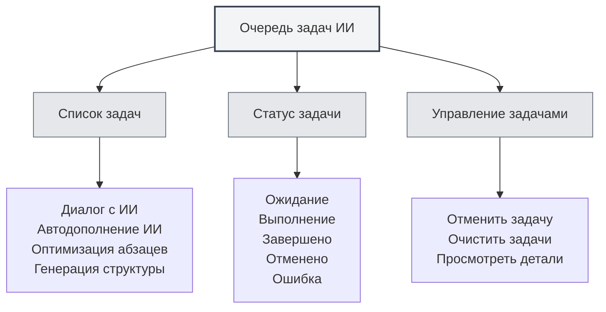

# Очередь задач ИИ

## Обзор

Очередь задач ИИ используется для управления и мониторинга всех выполняемых задач ИИ. Через очередь задач вы можете просматривать статус задач, отменять их, отслеживать прогресс выполнения, обеспечивая эффективную работу функций ИИ.

## Введение в очередь задач

<AITaskQueue mode="demo" />

### Что такое очередь задач

Очередь задач ИИ — это интерфейс управления, отображающий все выполняемые или ожидающие выполнения задачи ИИ:

- **Список задач**: отображает все задачи и их статусы
- **Статус задачи**: показывает состояние выполнения задачи
- **Прогресс задачи**: отображает ход выполнения задачи
- **Управление задачами**: позволяет отменять или управлять задачами

### Типы задач

В очереди задач могут содержаться задачи следующих типов:

- **Диалог с ИИ**: задачи диалога с ИИ
- **Автодополнение ИИ**: задачи автоматического дополнения ИИ
- **Оптимизация абзацев**: задачи оптимизации абзацев
- **Генерация структуры**: задачи генерации структуры
- **Другие задачи ИИ**: прочие задачи, связанные с ИИ

## Открытие очереди задач

### Способы доступа

Открыть очередь задач можно следующими способами:

- **Боковая панель**: на боковой панели может быть вход в очередь задач
- **Пункт меню**: в некоторых меню может быть опция очереди задач
- **Горячие клавиши**: в некоторых случаях могут быть горячие клавиши (возможно, будут поддерживаться в будущем)

### Панель очереди задач

<AITaskQueue mode="demo" />

Очередь задач обычно отображается как боковая панель:

- **Список задач**: отображает все задачи
- **Детали задачи**: показывает подробную информацию о выбранной задаче
- **Кнопки управления**: предоставляют функции управления задачами

## Просмотр задач

<AITaskQueue mode="demo" />

### Список задач

Список задач отображает все задачи:

- **Название задачи**: показывает название задачи
- **Статус задачи**: показывает текущее состояние задачи
- **Прогресс задачи**: отображает ход выполнения задачи
- **Время задачи**: показывает время создания задачи

### Статус задачи

Задача может находиться в следующих состояниях:

- **Ожидание**: задача создана, ожидает выполнения
- **Выполнение**: задача выполняется
- **Завершено**: задача выполнена
- **Отменено**: задача была отменена
- **Ошибка**: выполнение задачи завершилось неудачей

### Детали задачи

Можно просмотреть подробную информацию о задаче:

- **Название задачи**: название задачи
- **Тип задачи**: тип задачи
- **Параметры задачи**: параметры задачи
- **Результат задачи**: результат задачи (если завершена)
- **Информация об ошибке**: сообщение об ошибке задачи (если произошла ошибка)

## Управление задачами

<AITaskQueue mode="demo" />

### Отмена задачи

Можно отменить выполняемую задачу:

1. **Выберите задачу**: в списке задач выберите задачу для отмены
2. **Нажмите "Отменить"**: нажмите кнопку "Отменить"
3. **Подтвердите отмену**: подтвердите действие отмены
4. **Задача отменена**: задача будет отменена и удалена

<AITaskQueue mode="demo" />

### Очистка задач

Можно очистить все задачи:

1. **Откройте очередь задач**: откройте панель очереди задач
2. **Нажмите "Очистить"**: нажмите кнопку "Очистить"
3. **Подтвердите очистку**: подтвердите действие очистки
4. **Задачи очищены**: все задачи будут отменены и удалены

### Приоритет задач

Некоторые задачи могут иметь приоритет:

- **Высокий приоритет**: важные задачи выполняются в первую очередь
- **Обычный приоритет**: обычные задачи выполняются по порядку
- **Низкий приоритет**: задачи с низким приоритетом выполняются в последнюю очередь

## Отображение прогресса задачи

<AITaskQueue mode="demo" />

### Индикатор выполнения

Прогресс задачи отображается с помощью индикатора выполнения:

- **Процент выполнения**: показывает процент завершения задачи
- **Полоса прогресса**: визуально отображает прогресс задачи
- **Обновление прогресса**: прогресс обновляется в реальном времени

### Информация о прогрессе

Можно просмотреть информацию о прогрессе задачи:

- **Текущий шаг**: показывает выполняемый в данный момент шаг
- **Выполненные шаги**: показывает завершённые шаги
- **Общее количество шагов**: показывает общее число шагов
- **Оценочное время**: показывает предполагаемое время завершения

<AITaskQueue mode="demo" />

## Задержка задач

<AITaskQueue mode="demo" />

### Отложенное дополнение

Можно отложить задачу автодополнения ИИ:

1. **Откройте очередь задач**: откройте панель очереди задач
2. **Выберите время задержки**: выберите время задержки (в минутах)
3. **Примените задержку**: примените настройки задержки
4. **Задача отложена**: задача дополнения будет выполнена с задержкой

### Отображение задержки

Время задержки отображается в очереди задач:

- **Оставшееся время**: показывает оставшееся время задержки
- **Обратный отсчёт**: отображает обратный отсчёт в реальном времени
- **Автоматическое выполнение**: автоматическое выполнение после окончания времени задержки

## История задач

<AITaskQueue mode="demo" />

### Записи истории

Очередь задач может сохранять историю задач:

- **Завершённые задачи**: отображает завершённые задачи
- **Неудачные задачи**: отображает задачи, завершившиеся ошибкой
- **Отменённые задачи**: отображает отменённые задачи

### Просмотр истории

Можно просмотреть историю задач:

- **Список истории**: отображает список исторических задач
- **Детали задачи**: просмотр подробной информации об исторической задаче
- **Просмотр результата**: просмотр результата задачи

## Рекомендации

<AITaskQueue mode="demo" />

1. **Регулярно проверяйте**: регулярно проверяйте очередь задач, чтобы быть в курсе выполнения задач
2. **Своевременно отменяйте**: своевременно отменяйте ненужные задачи, чтобы освободить ресурсы
3. **Контролируйте прогресс**: следите за прогрессом задач, чтобы убедиться в их нормальном выполнении
4. **Обрабатывайте ошибки**: своевременно обрабатывайте неудачные задачи, чтобы избежать влияния на последующие задачи
5. **Управляйте ресурсами**: разумно управляйте задачами, чтобы избежать растраты ресурсов

## Важные замечания

1. **Количество задач**: слишком большое количество задач может повлиять на производительность
2. **Отмена задачи**: отмена задачи может повлиять на выполняемые операции
3. **Статус задачи**: статус задачи может меняться в реальном времени
4. **Использование ресурсов**: задачи используют системные ресурсы
5. **Зависимость от сети**: для некоторых задач требуется сетевое подключение

## Связанная документация

- [[ai.chat|Функция диалога с ИИ]]
- [[ai.completion|Автодополнение ИИ]]
- [[features.paragraph-optimization|Функция оптимизации абзацев]]