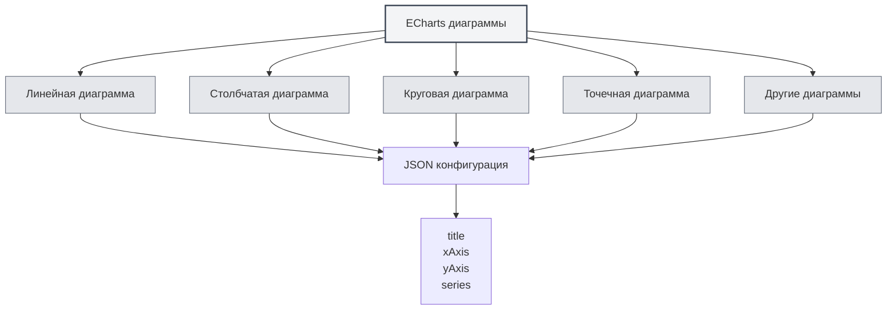

# Диаграммы ECharts

## Обзор

ECharts — это мощная библиотека для визуализации данных, поддерживающая множество типов диаграмм. MetaDoc поддерживает диаграммы ECharts, позволяя создавать различные визуализации данных в документах Markdown с помощью конфигурации ECharts.

<DataAnalysisWindow mode="demo" />

## Синтаксис ECharts

<ChartGenerationDisplay mode="demo" />

### Базовый синтаксис

ECharts использует формат конфигурации JSON:

````markdown
```echarts
{
  "title": {
    "text": "Пример диаграммы"
  },
  "xAxis": {
    "type": "category",
    "data": ["A", "B", "C"]
  },
  "yAxis": {
    "type": "value"
  },
  "series": [{
    "data": [10, 20, 30],
    "type": "bar"
  }]
}
```
````

### Формат конфигурации

Конфигурация ECharts должна быть валидным JSON:

- **Формат JSON**: используйте стандартный формат JSON
- **Английская пунктуация**: используйте английские запятые, двоеточия, кавычки
- **Полная конфигурация**: включайте необходимые параметры конфигурации



## Поддерживаемые типы диаграмм

<DataAnalysisDisplay mode="demo" />

### Линейная диаграмма

Создание линейной диаграммы:

````markdown
```echarts
{
  "xAxis": {
    "type": "category",
    "data": ["Mon", "Tue", "Wed"]
  },
  "yAxis": {
    "type": "value"
  },
  "series": [{
    "data": [120, 200, 150],
    "type": "line"
  }]
}
```
````

### Столбчатая диаграмма

<ChartGenerationDisplay mode="demo" />

Создание столбчатой диаграммы:

````markdown
```echarts
{
  "xAxis": {
    "type": "category",
    "data": ["A", "B", "C"]
  },
  "yAxis": {
    "type": "value"
  },
  "series": [{
    "data": [10, 20, 30],
    "type": "bar"
  }]
}
```
````

### Круговая диаграмма

<DataAnalysisDisplay mode="demo" />

Создание круговой диаграммы:

````markdown
```echarts
{
  "series": [{
    "type": "pie",
    "data": [
      {"value": 335, "name": "Категория A"},
      {"value": 310, "name": "Категория B"},
      {"value": 234, "name": "Категория C"}
    ]
  }]
}
```
````

### Точечная диаграмма

<ChartGenerationDisplay mode="demo" />

Создание точечной диаграммы:

````markdown
```echarts
{
  "xAxis": {
    "type": "value"
  },
  "yAxis": {
    "type": "value"
  },
  "series": [{
    "type": "scatter",
    "data": [[10, 20], [15, 25], [20, 30]]
  }]
}
```
````

### Радарная диаграмма

<OutlineTreeDisplay mode="demo" />

Создание радарной диаграммы:

````markdown
```echarts
{
  "radar": {
    "indicator": [
      {"name": "Показатель 1", "max": 100},
      {"name": "Показатель 2", "max": 100}
    ]
  },
  "series": [{
    "type": "radar",
    "data": [{
      "value": [80, 90]
    }]
  }]
}
```
````

### Тепловая карта

<DataAnalysisDisplay mode="demo" />

Создание тепловой карты:

````markdown
```echarts
{
  "xAxis": {
    "type": "category",
    "data": ["A", "B", "C"]
  },
  "yAxis": {
    "type": "category",
    "data": ["X", "Y", "Z"]
  },
  "series": [{
    "type": "heatmap",
    "data": [[0, 0, 10], [0, 1, 20], [1, 0, 30]]
  }]
}
```
````

## Конфигурация диаграмм

<OutlineTreeDisplay mode="demo" />

### Конфигурация заголовка

Настройка заголовка диаграммы:

```json
{
  "title": {
    "text": "Заголовок диаграммы",
    "subtext": "Подзаголовок"
  }
}
```

### Конфигурация осей

Настройка осей:

```json
{
  "xAxis": {
    "type": "category",
    "data": ["A", "B", "C"]
  },
  "yAxis": {
    "type": "value"
  }
}
```

### Конфигурация серий

Настройка серий данных:

```json
{
  "series": [
    {
      "name": "Название серии",
      "type": "bar",
      "data": [10, 20, 30]
    }
  ]
}
```

### Конфигурация легенды

Настройка легенды:

```json
{
  "legend": {
    "data": ["Серия 1", "Серия 2"]
  }
}
```

### Конфигурация всплывающей подсказки

Настройка всплывающей подсказки:

```json
{
  "tooltip": {
    "trigger": "axis"
  }
}
```

## Расширенные возможности

<ChartGenerationDisplay mode="demo" />

### Диаграммы с несколькими сериями

Создание диаграммы с несколькими сериями:

````markdown
```echarts
{
  "xAxis": {
    "type": "category",
    "data": ["Mon", "Tue", "Wed"]
  },
  "yAxis": {
    "type": "value"
  },
  "series": [
    {
      "name": "Серия 1",
      "type": "bar",
      "data": [10, 20, 30]
    },
    {
      "name": "Серия 2",
      "type": "line",
      "data": [15, 25, 35]
    }
  ]
}
```
````

### Масштабирование данных

Добавление масштабирования данных:

```json
{
  "dataZoom": [
    {
      "type": "slider",
      "start": 0,
      "end": 100
    }
  ]
}
```

### Визуальное отображение

Добавление визуального отображения:

```json
{
  "visualMap": {
    "min": 0,
    "max": 100,
    "inRange": {
      "color": ["#50a3ba", "#eac736", "#d94e5d"]
    }
  }
}
```

## Способ рендеринга

### Рендеринг в основном процессе

ECharts использует рендеринг в основном процессе:

- **Рендеринг на стороне сервера**: диаграммы рендерятся в основном процессе
- **Формат SVG**: по умолчанию рендерится в формате SVG
- **Формат PNG**: может быть преобразован в формат PNG

### Производительность рендеринга

Особенности рендеринга ECharts:

- **Скорость рендеринга**: рендеринг в основном процессе выполняется быстро
- **Использование ресурсов**: рендеринг использует ресурсы основного процесса
- **Обработка ошибок**: ошибки рендеринга отображаются в консоли

## Важные замечания

### Замечания по синтаксису

1. **Формат JSON**: необходимо использовать валидный формат JSON
2. **Английская пунктуация**: используйте английские запятые, двоеточия, кавычки
3. **Полная конфигурация**: включайте необходимые параметры конфигурации
4. **Корректный синтаксис**: убедитесь, что синтаксис JSON корректен, иначе рендеринг не произойдет

### Замечания по рендерингу

1. **Проверка конфигурации**: формат конфигурации проверяется перед рендерингом
2. **Синтаксические ошибки**: при ошибках синтаксиса JSON диаграмма не отрендерится
3. **Сложные диаграммы**: слишком сложные диаграммы могут повлиять на производительность рендеринга
4. **Совместимость экспорта**: при экспорте убедитесь, что диаграмма корректно отображается в целевом формате

## Рекомендации

1. **Стандарты конфигурации**: следуйте официальным стандартам конфигурации ECharts
2. **Формат JSON**: убедитесь в корректности формата JSON
3. **Читаемый код**: сохраняйте код конфигурации чистым и читаемым
4. **Тестирование рендеринга**: после редактирования проверяйте результат рендеринга диаграммы
5. **Справочная документация**: обращайтесь к официальной документации и примерам ECharts

## Связанная документация

- [[charts.introduction|Введение в функции диаграмм]]
- [[charts.mermaid|Диаграммы Mermaid]]
- [[charts.plantuml|Диаграммы PlantUML]]